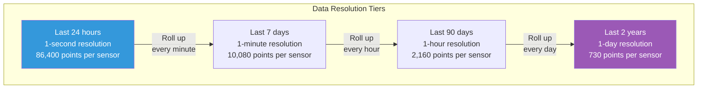
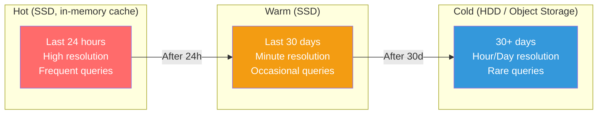

# Time-Series Patterns — Storing Data That Expires

---

## The Nature of Time-Series Data

Time-series data has unique characteristics:
- **Write-heavy**: Data arrives continuously at high velocity
- **Append-only**: You never update a past reading
- **Time-ordered**: Queries always involve time ranges
- **Decaying value**: Recent data is queried often; old data rarely
- **Naturally expires**: Last 30 days matter; data from 2 years ago usually doesn't

These properties create specific optimization opportunities that general-purpose databases miss.

---

## Pattern 1: TTL (Time-To-Live)

Automatically delete data after a specified duration. The database handles expiration.

### MongoDB TTL

```typescript
// Create TTL index — MongoDB deletes expired documents automatically
db.collection('metrics').createIndex(
  { timestamp: 1 },
  { expireAfterSeconds: 2592000 } // 30 days
);

// Every document with a 'timestamp' field older than 30 days
// is automatically deleted by a background thread (runs every 60 seconds)
```

**How it works**: A background thread wakes up every 60 seconds, scans the TTL index, and removes expired documents. Deletion is not instant — documents may persist up to ~60 seconds past their TTL.

### Cassandra TTL

```sql
-- Per-row TTL
INSERT INTO sensor_data (sensor_id, reading_date, reading_ts, value)
VALUES ('S1', '2024-01-15', '2024-01-15T10:30:00', 72.5)
USING TTL 2592000; -- 30 days

-- Table-level default TTL
CREATE TABLE metrics (
    service TEXT,
    metric_date DATE,
    metric_ts TIMESTAMP,
    value DOUBLE,
    PRIMARY KEY ((service, metric_date), metric_ts)
) WITH default_time_to_live = 2592000; -- 30 days
```

**Cassandra advantage**: With TWCS (Time-Window Compaction), expired data causes **entire SSTable files to be dropped** — no compaction needed. This is the most efficient deletion mechanism in any database.

### Redis TTL

```typescript
import { createClient } from 'redis';

const redis = createClient();

// Set key with expiration
await redis.set('session:user-123', JSON.stringify(sessionData), {
  EX: 3600, // 1 hour TTL
});

// Redis automatically removes the key after TTL
// Memory is reclaimed immediately (no background GC needed)
```

---

## Pattern 2: Roll-Ups (Downsampling)

Keep high-resolution data for recent periods, summarized data for older periods.



### The Roll-Up Job

```typescript
// Run every minute: aggregate last minute's seconds into 1-minute summary
async function rollUpToMinutes(db: Db): Promise<void> {
  const oneMinuteAgo = new Date(Date.now() - 60_000);
  const minuteStart = new Date(oneMinuteAgo);
  minuteStart.setSeconds(0, 0);

  await db.collection('raw_readings').aggregate([
    {
      $match: {
        timestamp: { $gte: minuteStart, $lt: new Date(minuteStart.getTime() + 60_000) }
      }
    },
    {
      $group: {
        _id: { sensorId: '$sensorId', minute: minuteStart },
        avg: { $avg: '$value' },
        min: { $min: '$value' },
        max: { $max: '$value' },
        count: { $sum: 1 },
      }
    },
    {
      $merge: {
        into: 'minute_summaries',
        on: '_id',
        whenMatched: 'replace',
        whenNotMatched: 'insert',
      }
    }
  ]).toArray();
}

// Run every hour: aggregate last hour's minutes into 1-hour summary
async function rollUpToHours(db: Db): Promise<void> {
  // Similar pattern, reading from minute_summaries → hour_summaries
  // Use $avg on avg, $min on min, $max on max
  // Note: avg of averages is NOT correct for weighted average.
  // Keep sum + count, compute avg = sum/count
}
```

### Go — Roll-Up Worker

```go
func RollUpToMinutes(ctx context.Context, db *mongo.Database) error {
	minuteStart := time.Now().Truncate(time.Minute).Add(-time.Minute)
	minuteEnd := minuteStart.Add(time.Minute)

	pipeline := mongo.Pipeline{
		{{Key: "$match", Value: bson.M{
			"timestamp": bson.M{"$gte": minuteStart, "$lt": minuteEnd},
		}}},
		{{Key: "$group", Value: bson.M{
			"_id":   bson.M{"sensorId": "$sensorId", "minute": minuteStart},
			"avg":   bson.M{"$avg": "$value"},
			"min":   bson.M{"$min": "$value"},
			"max":   bson.M{"$max": "$value"},
			"sum":   bson.M{"$sum": "$value"},
			"count": bson.M{"$sum": 1},
		}}},
		{{Key: "$merge", Value: bson.M{
			"into":            "minute_summaries",
			"on":              "_id",
			"whenMatched":     "replace",
			"whenNotMatched":  "insert",
		}}},
	}

	_, err := db.Collection("raw_readings").Aggregate(ctx, pipeline)
	return err
}
```

---

## Pattern 3: Hot/Cold/Archive Storage

Store data in different tiers based on age and access frequency.



### Implementation with MongoDB

```typescript
// Hot: Redis for last hour (fastest reads)
// Warm: MongoDB for last 30 days
// Cold: S3/GCS for older data

async function queryMetrics(
  sensorId: string,
  start: Date,
  end: Date
): Promise<MetricPoint[]> {
  const now = new Date();
  const oneHourAgo = new Date(now.getTime() - 3600_000);
  const thirtyDaysAgo = new Date(now.getTime() - 30 * 86400_000);

  const results: MetricPoint[] = [];

  // Hot tier: Redis (last hour)
  if (end > oneHourAgo) {
    const hotStart = start > oneHourAgo ? start : oneHourAgo;
    results.push(...await queryRedis(sensorId, hotStart, end));
  }

  // Warm tier: MongoDB (last 30 days)
  if (start < oneHourAgo && end > thirtyDaysAgo) {
    const warmStart = start > thirtyDaysAgo ? start : thirtyDaysAgo;
    const warmEnd = end < oneHourAgo ? end : oneHourAgo;
    results.push(...await queryMongo(sensorId, warmStart, warmEnd));
  }

  // Cold tier: S3 (older than 30 days)
  if (start < thirtyDaysAgo) {
    const coldEnd = end < thirtyDaysAgo ? end : thirtyDaysAgo;
    results.push(...await queryS3(sensorId, start, coldEnd));
  }

  return results.sort((a, b) => a.timestamp.getTime() - b.timestamp.getTime());
}
```

---

## Pattern 4: Computed Columns at Write Time

Pre-compute values that would otherwise require expensive queries.

```typescript
interface MetricDocument {
  sensorId: string;
  timestamp: Date;
  value: number;
  
  // Pre-computed for efficient querying
  hour: Date;          // Truncated to hour boundary
  date: string;        // "2024-01-15" for date-based partitioning
  dayOfWeek: number;   // 1-7 for "show weekday patterns"
  isAnomaly: boolean;  // Computed at write time (value > 3σ from recent average)
}

// At write time
function enrichMetric(sensorId: string, value: number, ts: Date): MetricDocument {
  return {
    sensorId,
    timestamp: ts,
    value,
    hour: new Date(ts.getFullYear(), ts.getMonth(), ts.getDate(), ts.getHours()),
    date: ts.toISOString().split('T')[0],
    dayOfWeek: ts.getDay() + 1,
    isAnomaly: false, // computed against recent running stats
  };
}
```

With pre-computed fields, queries like "show all anomalies today" become simple index lookups instead of full-collection aggregations.

---

## Specialized Time-Series Databases vs General NoSQL

| Feature | MongoDB (manual patterns) | Cassandra (TWCS) | InfluxDB (native) | TimescaleDB (native) |
|---------|--------------------------|-------------------|--------------------|---------------------|
| Automatic downsampling | ❌ Build yourself | ❌ Build yourself | ✅ Continuous queries | ✅ Continuous aggregates |
| TTL | ✅ TTL index | ✅ Per-row TTL + TWCS | ✅ Retention policies | ✅ Data retention |
| Compression | General purpose | Good | 10-20x (columnar) | 10-20x (columnar) |
| Time-bucketed storage | ❌ Manual | ✅ TWCS does this | ✅ Native | ✅ Native (hypertables) |
| Query language | MongoDB query | CQL | InfluxQL / Flux | SQL ✅ |
| Write throughput | Good | Excellent | Good | Good |
| Use general data too? | ✅ | ✅ | ❌ (time-series only) | ✅ (it's PostgreSQL) |

**When to use a specialized time-series DB**: If >80% of your data is time-series and you need native compression, downsampling, and retention. If time-series is only one part of your system, use MongoDB or Cassandra with manual patterns.

---

## Next

→ [05-materialized-views.md](./05-materialized-views.md) — Pre-computing query results for instant reads: materialized views, both database-supported and application-managed.
