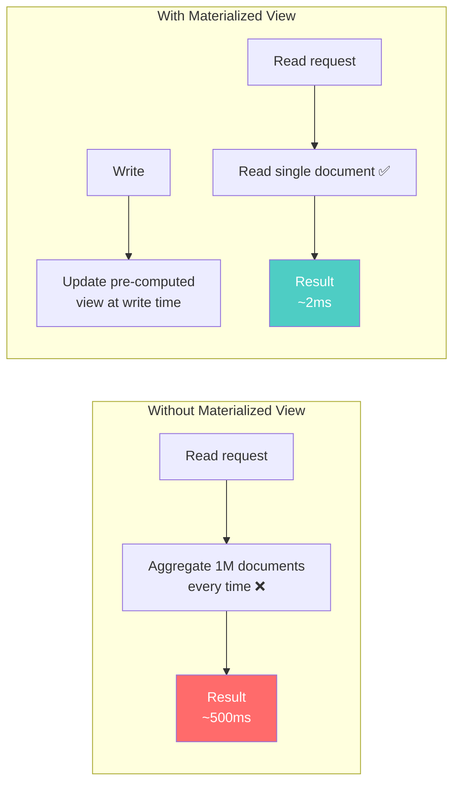
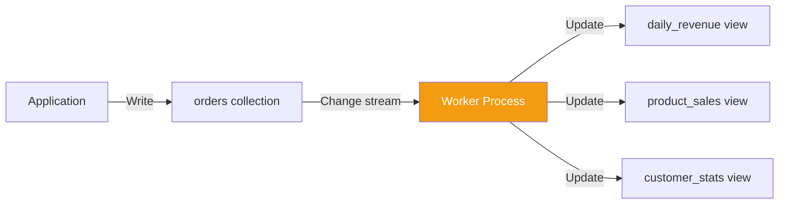
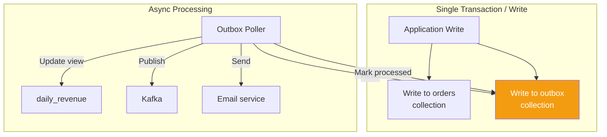

# Materialized Views — Pre-Computing Query Results

---

## The Concept

A materialized view is a **pre-computed query result stored as a table**. Instead of running an expensive aggregation on every read, you compute the result once (at write time or periodically) and read instantly.



---

## Pattern 1: Application-Managed Views

The most reliable approach. Your application maintains the view as part of the write path.

### Example: Leaderboard

Instead of querying all scores and sorting on every page load, maintain a pre-sorted leaderboard.

```typescript
// On every score update, update the leaderboard
async function recordScore(
  db: Db,
  userId: string,
  gameId: string,
  score: number
): Promise<void> {
  // 1. Save the individual score
  await db.collection('scores').insertOne({
    userId,
    gameId,
    score,
    timestamp: new Date(),
  });

  // 2. Update the per-game leaderboard (materialized view)
  await db.collection('leaderboards').updateOne(
    { gameId, userId },
    {
      $max: { highScore: score },  // Only update if new score is higher
      $set: { 
        lastPlayed: new Date(),
        playerName: await getPlayerName(db, userId),
      },
      $setOnInsert: { gameId, userId },
    },
    { upsert: true }
  );

  // 3. Update daily stats (another materialized view)
  const today = new Date().toISOString().split('T')[0];
  await db.collection('daily_game_stats').updateOne(
    { gameId, date: today },
    {
      $inc: { gamesPlayed: 1, totalScore: score },
      $max: { highestScore: score },
      $min: { lowestScore: score },
    },
    { upsert: true }
  );
}

// Reading the leaderboard: instant
async function getLeaderboard(db: Db, gameId: string): Promise<any[]> {
  return db.collection('leaderboards')
    .find({ gameId })
    .sort({ highScore: -1 })
    .limit(100)
    .toArray();
  // No aggregation. Just a sorted read.
}
```

### Go — Materialized E-Commerce Dashboard

```go
// Every order write updates multiple materialized views
func ProcessOrder(ctx context.Context, db *mongo.Database, order Order) error {
	// 1. Save order
	_, err := db.Collection("orders").InsertOne(ctx, order)
	if err != nil {
		return err
	}

	today := time.Now().Format("2006-01-02")

	// 2. Update daily revenue view
	_, err = db.Collection("daily_revenue").UpdateOne(ctx,
		bson.M{"date": today, "region": order.Region},
		bson.M{
			"$inc": bson.M{
				"totalRevenue": order.Total,
				"orderCount":   1,
			},
		},
		options.Update().SetUpsert(true),
	)
	if err != nil {
		return err
	}

	// 3. Update per-product sales count
	for _, item := range order.Items {
		_, err = db.Collection("product_sales").UpdateOne(ctx,
			bson.M{"productId": item.ProductID, "date": today},
			bson.M{
				"$inc": bson.M{
					"unitsSold":  item.Quantity,
					"revenue":    item.UnitPrice * float64(item.Quantity),
				},
				"$set": bson.M{
					"productName": item.ProductName,
				},
			},
			options.Update().SetUpsert(true),
		)
		if err != nil {
			return err
		}
	}

	return nil
}

// Dashboard read: instant
func GetDailyRevenue(ctx context.Context, db *mongo.Database, date string) (DailyRevenue, error) {
	var result DailyRevenue
	err := db.Collection("daily_revenue").FindOne(ctx,
		bson.M{"date": date},
	).Decode(&result)
	return result, err
}
```

---

## Pattern 2: Change Streams (Event-Driven Views)

Instead of updating views in the write path, react to data changes asynchronously.



### MongoDB Change Streams

```typescript
async function startViewUpdater(db: Db): Promise<void> {
  const changeStream = db.collection('orders').watch(
    [{ $match: { operationType: 'insert' } }],
    { fullDocument: 'updateLookup' }
  );

  changeStream.on('change', async (change) => {
    if (change.operationType !== 'insert' || !change.fullDocument) return;
    
    const order = change.fullDocument;
    const today = new Date(order.orderDate).toISOString().split('T')[0];

    // Update materialized views asynchronously
    await Promise.all([
      db.collection('daily_revenue').updateOne(
        { date: today },
        { $inc: { total: order.total, count: 1 } },
        { upsert: true }
      ),
      db.collection('customer_lifetime_value').updateOne(
        { customerId: order.customerId },
        { $inc: { totalSpent: order.total, orderCount: 1 } },
        { upsert: true }
      ),
    ]);
  });
}
```

**Advantages over inline updates**:
- Write path stays fast (just one collection insert)
- Views can be rebuilt by replaying the change stream
- New views can be added without changing the write path
- If a view update fails, the change stream can retry

**Disadvantages**:
- Views are eventually consistent (seconds of delay)
- Requires a running worker process
- Needs resume token management for crash recovery

---

## Pattern 3: The Outbox Pattern

For systems that need to update views AND send messages to external systems (Kafka, email) as part of one operation.



```typescript
// Write order + outbox event atomically
async function placeOrder(client: MongoClient, order: Order): Promise<void> {
  const session = client.startSession();
  try {
    await session.withTransaction(async () => {
      const db = client.db('myapp');
      
      // Write order
      await db.collection('orders').insertOne(order, { session });
      
      // Write outbox event (same transaction)
      await db.collection('outbox').insertOne({
        eventType: 'ORDER_PLACED',
        payload: order,
        processedAt: null,
        createdAt: new Date(),
      }, { session });
    });
  } finally {
    await session.endSession();
  }
}

// Separate process: poll outbox and process events
async function processOutbox(db: Db): Promise<void> {
  const events = await db.collection('outbox')
    .find({ processedAt: null })
    .sort({ createdAt: 1 })
    .limit(100)
    .toArray();

  for (const event of events) {
    if (event.eventType === 'ORDER_PLACED') {
      // Update materialized views
      await updateDailyRevenue(db, event.payload);
      await updateProductSales(db, event.payload);
      
      // Mark as processed
      await db.collection('outbox').updateOne(
        { _id: event._id },
        { $set: { processedAt: new Date() } }
      );
    }
  }
}
```

The outbox pattern guarantees that either **both** the order and the event are written, or **neither** is. The async processor handles view updates reliably.

---

## Cassandra Materialized Views (Database-Managed)

Cassandra has built-in materialized views, but they're problematic:

```sql
-- Base table
CREATE TABLE orders (
    order_id UUID,
    customer_id UUID,
    order_date DATE,
    total DECIMAL,
    PRIMARY KEY ((customer_id), order_date, order_id)
);

-- Database-managed materialized view
CREATE MATERIALIZED VIEW orders_by_date AS
    SELECT * FROM orders
    WHERE order_date IS NOT NULL AND customer_id IS NOT NULL AND order_id IS NOT NULL
    PRIMARY KEY ((order_date), customer_id, order_id);
```

**Why application-managed views are preferred in Cassandra**:
- MV performance overhead: every write to the base table triggers a write to the MV
- Consistency: MV may lag behind the base table
- Reliability: MV has known bugs in Cassandra 3.x/4.x
- Flexibility: application code can compute complex derived values

**Recommendation**: Manage your own denormalized tables. Write to both tables in your application code.

---

## When to Use Each Approach

| Approach | Consistency | Write Impact | Complexity | Best For |
|----------|------------|--------------|------------|----------|
| Inline update (Pattern 1) | Strong | Higher latency | Low | Simple views, critical data |
| Change streams (Pattern 2) | Eventual | None | Medium | Multiple views, tolerable lag |
| Outbox pattern (Pattern 3) | Guaranteed eventual | Minimal | Higher | External integrations + views |
| DB materialized views | Implementation-dependent | Auto overhead | Low | Simple key reorganization (if stable) |

---

## Next

→ [06-outbox-and-change-streams.md](./06-outbox-and-change-streams.md) — Deep dive into the outbox pattern and change streams as the backbone for event-driven NoSQL architectures.
