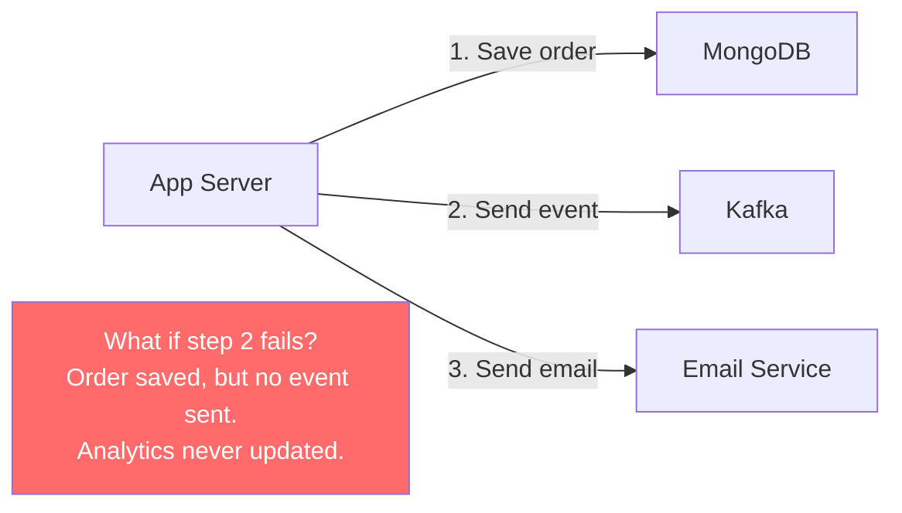
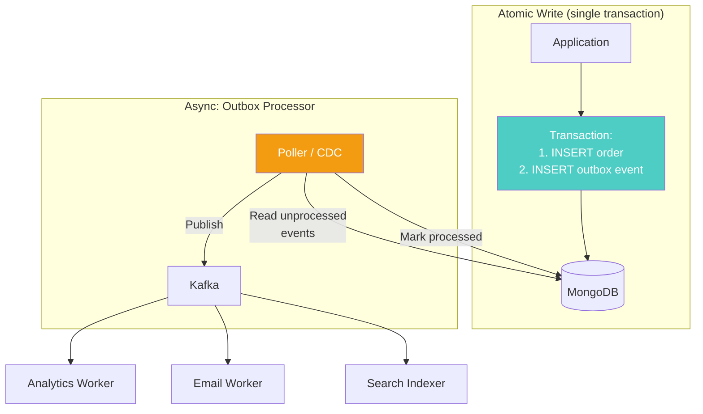
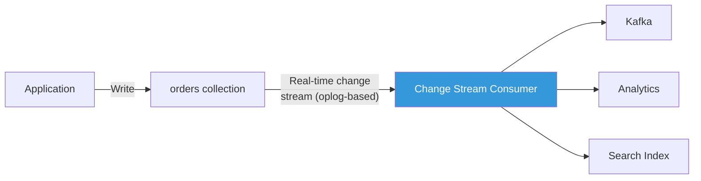
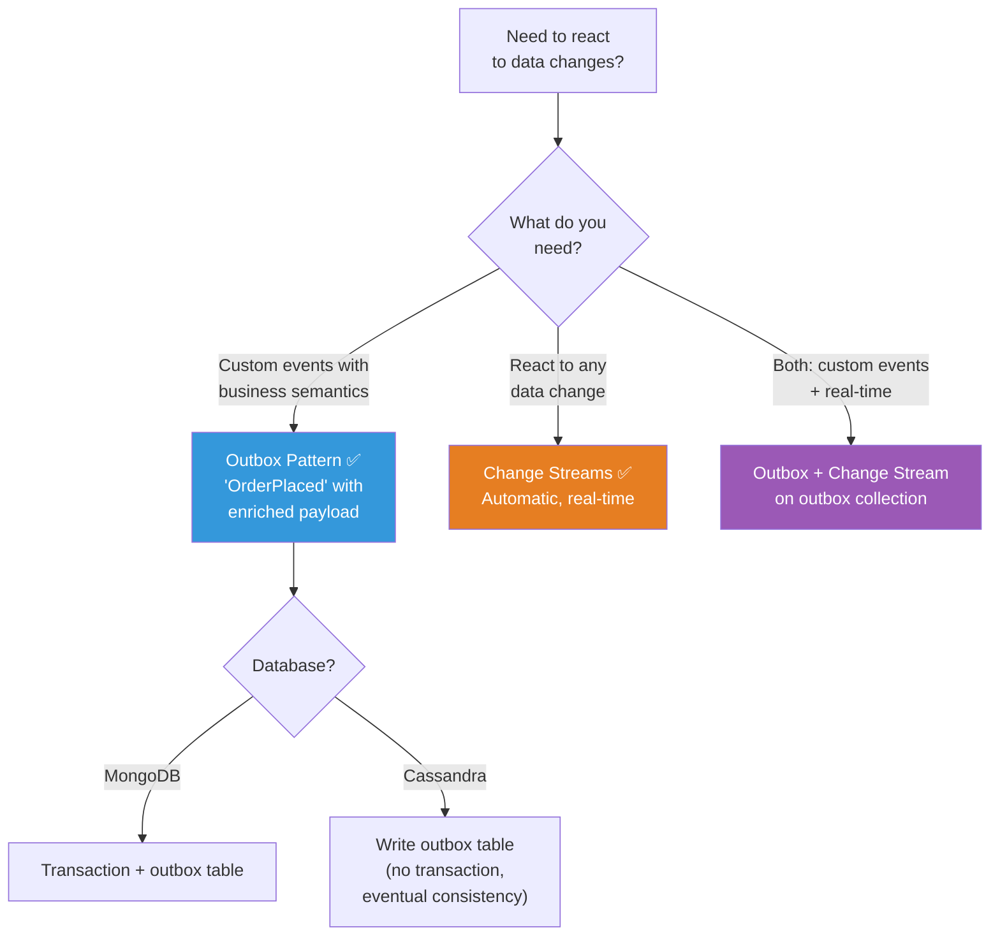

# Outbox and Change Streams — Event-Driven NoSQL

---

## The Problem: Dual Writes

Your application needs to save an order AND send a notification AND update analytics. Three systems must stay in sync.



You can't do a distributed transaction across MongoDB + Kafka + Email. If any step fails, the systems diverge. **Dual writes are inherently unreliable.**

---

## Solution 1: The Outbox Pattern

Write the event **into the database alongside the data**, in the same transaction. A separate process reads the outbox and publishes events.



### MongoDB Implementation

```typescript
import { MongoClient, ClientSession } from 'mongodb';

interface OutboxEvent {
  _id?: string;
  eventType: string;
  aggregateType: string;
  aggregateId: string;
  payload: Record<string, unknown>;
  createdAt: Date;
  processedAt: Date | null;
}

async function placeOrder(client: MongoClient, order: Order): Promise<void> {
  const session = client.startSession();
  
  try {
    await session.withTransaction(async () => {
      const db = client.db('myapp');
      
      // Both writes in the same transaction — atomic
      await db.collection('orders').insertOne(order, { session });
      
      await db.collection<OutboxEvent>('outbox').insertOne({
        eventType: 'ORDER_PLACED',
        aggregateType: 'Order',
        aggregateId: order._id,
        payload: {
          orderId: order._id,
          customerId: order.customerId,
          total: order.total,
          items: order.items,
        },
        createdAt: new Date(),
        processedAt: null,
      }, { session });
    });
  } finally {
    await session.endSession();
  }
}
```

### The Outbox Processor

```typescript
class OutboxProcessor {
  private running = false;

  constructor(
    private db: Db,
    private publisher: KafkaProducer,
    private pollIntervalMs = 1000,
  ) {}

  async start(): Promise<void> {
    this.running = true;
    while (this.running) {
      await this.processOutbox();
      await new Promise(resolve => setTimeout(resolve, this.pollIntervalMs));
    }
  }

  private async processOutbox(): Promise<void> {
    // Read unprocessed events in order
    const events = await this.db.collection<OutboxEvent>('outbox')
      .find({ processedAt: null })
      .sort({ createdAt: 1 })
      .limit(100)
      .toArray();

    for (const event of events) {
      try {
        // Publish to Kafka
        await this.publisher.send({
          topic: `${event.aggregateType}.${event.eventType}`,
          messages: [{
            key: event.aggregateId,
            value: JSON.stringify(event.payload),
          }],
        });

        // Mark as processed
        await this.db.collection('outbox').updateOne(
          { _id: event._id },
          { $set: { processedAt: new Date() } }
        );
      } catch (error) {
        // Event stays unprocessed — will be retried on next poll
        console.error(`Failed to process outbox event ${event._id}:`, error);
        break; // Stop processing to maintain order
      }
    }
  }

  stop(): void {
    this.running = false;
  }
}
```

### Go — Outbox Processor

```go
package outbox

import (
	"context"
	"encoding/json"
	"log"
	"time"

	"github.com/segmentio/kafka-go"
	"go.mongodb.org/mongo-driver/bson"
	"go.mongodb.org/mongo-driver/mongo"
	"go.mongodb.org/mongo-driver/mongo/options"
)

type Processor struct {
	db     *mongo.Database
	writer *kafka.Writer
}

func (p *Processor) Run(ctx context.Context) error {
	ticker := time.NewTicker(time.Second)
	defer ticker.Stop()

	for {
		select {
		case <-ctx.Done():
			return ctx.Err()
		case <-ticker.C:
			if err := p.processBatch(ctx); err != nil {
				log.Printf("outbox processing error: %v", err)
			}
		}
	}
}

func (p *Processor) processBatch(ctx context.Context) error {
	cursor, err := p.db.Collection("outbox").Find(ctx,
		bson.M{"processedAt": nil},
		options.Find().SetSort(bson.D{{Key: "createdAt", Value: 1}}).SetLimit(100),
	)
	if err != nil {
		return err
	}
	defer cursor.Close(ctx)

	for cursor.Next(ctx) {
		var event OutboxEvent
		if err := cursor.Decode(&event); err != nil {
			return err
		}

		payload, _ := json.Marshal(event.Payload)
		topic := event.AggregateType + "." + event.EventType

		// Publish to Kafka
		if err := p.writer.WriteMessages(ctx, kafka.Message{
			Topic: topic,
			Key:   []byte(event.AggregateID),
			Value: payload,
		}); err != nil {
			return err // Stop batch — retry on next tick
		}

		// Mark processed
		now := time.Now()
		p.db.Collection("outbox").UpdateOne(ctx,
			bson.M{"_id": event.ID},
			bson.M{"$set": bson.M{"processedAt": now}},
		)
	}

	return nil
}
```

---

## Solution 2: MongoDB Change Streams

Instead of polling the outbox, use MongoDB's change stream — a real-time event feed of collection changes.



```typescript
async function streamOrderChanges(db: Db): Promise<void> {
  const pipeline = [
    { $match: { 
      operationType: { $in: ['insert', 'update'] },
      'ns.coll': 'orders' 
    }}
  ];

  const changeStream = db.collection('orders').watch(pipeline, {
    fullDocument: 'updateLookup', // Include the full document on updates
  });

  // Resume after restart using a stored resume token
  // This guarantees at-least-once processing
  changeStream.on('change', async (change) => {
    const resumeToken = change._id; // Save this for crash recovery

    switch (change.operationType) {
      case 'insert':
        await handleNewOrder(change.fullDocument);
        break;
      case 'update':
        await handleOrderUpdate(change.fullDocument);
        break;
    }

    // Persist resume token
    await db.collection('change_stream_positions').updateOne(
      { stream: 'orders' },
      { $set: { resumeToken, updatedAt: new Date() } },
      { upsert: true }
    );
  });
}

// Restart from last known position after crash
async function getResumeToken(db: Db): Promise<any> {
  const pos = await db.collection('change_stream_positions')
    .findOne({ stream: 'orders' });
  return pos?.resumeToken;
}
```

### Change Streams vs Outbox — Comparison

| Feature | Outbox Pattern | Change Streams |
|---------|---------------|----------------|
| **Atomicity** | Guaranteed (same transaction) | Guaranteed (oplog-based) |
| **Ordering** | Application-controlled | Oplog order |
| **Event schema** | Explicit (you define it) | Implicit (document changes) |
| **Resume on crash** | Outbox table is the queue | Resume token |
| **Custom events** | ✅ Any event type | ❌ Only insert/update/delete |
| **Works without transactions** | ❌ (needs transaction) | ✅ (oplog is automatic) |
| **Performance** | Polling adds latency | Real-time (~ms) |
| **Cassandra support** | ✅ (application-managed) | ❌ (use CDC instead) |

---

## Cassandra CDC (Change Data Capture)

Cassandra doesn't have change streams, but it has CDC — a mechanism to capture writes:

```sql
-- Enable CDC on a table
CREATE TABLE orders (
    order_id UUID,
    customer_id UUID,
    total DECIMAL,
    PRIMARY KEY (order_id)
) WITH cdc = true;
```

CDC writes commit log segments to a CDC directory. An external process (like Debezium or a custom consumer) reads these segments and publishes events.

**Limitations**:
- CDC is not a real-time stream; it's file-based
- You must manage the CDC directory to avoid filling disk
- Most teams use Debezium for Cassandra → Kafka CDC

---

## Idempotency — The Critical Detail

Both the outbox processor and change stream consumer may deliver the same event twice (at-least-once delivery). Your consumers **must be idempotent**.

```typescript
// ❌ Not idempotent — sending email twice is bad
async function handleOrderPlaced(event: OrderEvent): Promise<void> {
  await sendConfirmationEmail(event.customerId, event.orderId);
}

// ✅ Idempotent — check before processing
async function handleOrderPlaced(db: Db, event: OrderEvent): Promise<void> {
  // Check if this event was already processed
  const existing = await db.collection('processed_events')
    .findOne({ eventId: event._id });
  
  if (existing) return; // Already processed — skip

  await sendConfirmationEmail(event.customerId, event.orderId);

  // Record that we processed this event
  await db.collection('processed_events').insertOne({
    eventId: event._id,
    processedAt: new Date(),
  });
}
```

---

## Architecture Decision



---

## Next Phase

→ [../06-performance-and-scale/01-hot-partitions.md](../06-performance-and-scale/01-hot-partitions.md) — The performance phase: what goes wrong when your data model meets real traffic — hot partitions, write amplification, and everything that doesn't show up until production.
