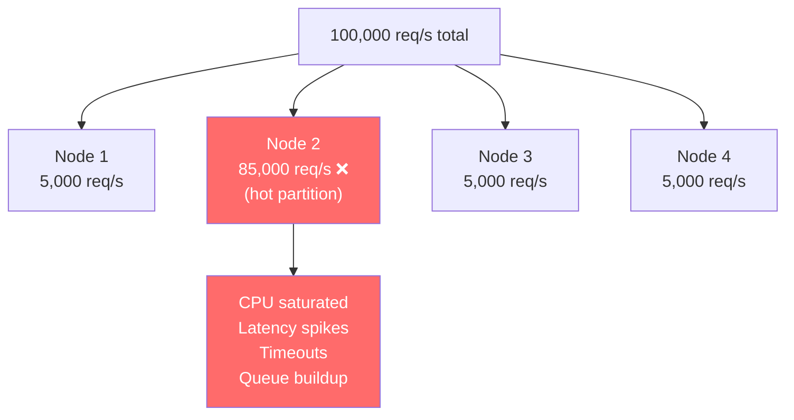
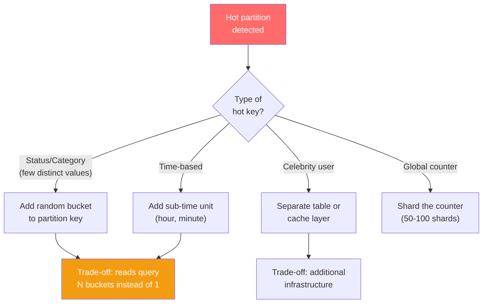

# Hot Partitions — The Silent Performance Killer

---

## What a Hot Partition Is

A hot partition is a single partition that receives disproportionate traffic compared to others. While most partitions handle 100 requests/second, one handles 100,000.



You added 4 nodes thinking you'd get 4x throughput. Instead you got 1x throughput because all traffic goes to one node. **Horizontal scaling failed because your data model funneled traffic.**

---

## Common Causes

### Cause 1: Partition Key = Status

```sql
-- ❌ Cassandra: partition by order status
CREATE TABLE orders_by_status (
    status TEXT,
    order_id UUID,
    PRIMARY KEY ((status), order_id)
);

-- 90% of orders are "completed"
-- That one partition holds millions of rows and receives most reads
```

### Cause 2: Time-Based Keys Without Bucketing

```typescript
// ❌ MongoDB: all today's logs go to one shard
// Shard key: { date: 1 }
db.logs.insertOne({
  date: "2024-01-15",  // All writes today hit the same shard
  message: "...",
  level: "error",
});
```

### Cause 3: Celebrity / Power User

```sql
-- Cassandra: partition by user
CREATE TABLE posts_by_user (
    user_id UUID,
    post_ts TIMESTAMP,
    PRIMARY KEY ((user_id), post_ts)
);

-- Taylor Swift's partition: 50M posts, millions of reads/day
-- Random user's partition: 10 posts, 2 reads/day
```

### Cause 4: Global Counters

```typescript
// ❌ Every pageview increments the same document
await db.collection('site_stats').updateOne(
  { _id: 'global' },
  { $inc: { pageViews: 1 } }
);
// 10,000 concurrent increments all contend on the same document
```

---

## Detecting Hot Partitions

### MongoDB

```javascript
// Check collection stats for chunk distribution
db.orders.getShardDistribution();

// Monitor slow queries — hot partition causes high latency
db.adminCommand({ currentOp: { secs: 5 } });

// Profile slow operations
db.setProfilingLevel(1, { slowms: 100 });
```

### Cassandra

```bash
# Check partition sizes
nodetool tablehistograms <keyspace> <table>

# Check per-node load
nodetool status

# Find hot partitions (Cassandra 4.0+)
nodetool toppartitions <keyspace> <table> 1000
```

---

## Solutions

### Solution 1: Add Randomness to Partition Key

Distribute a hot key across multiple sub-partitions:

```sql
-- Instead of one partition for status='completed'
-- Split into N sub-partitions
CREATE TABLE orders_by_status (
    status TEXT,
    bucket INT,    -- Random 0-9
    order_id UUID,
    PRIMARY KEY ((status, bucket), order_id)
);

-- Write: randomly assign bucket
INSERT INTO orders_by_status (status, bucket, order_id)
VALUES ('completed', 7, ?);  -- bucket = random(0,9)

-- Read: query all buckets in parallel
-- Must query 10 partitions and merge:
-- bucket 0, 1, 2, ..., 9
```

```typescript
const NUM_BUCKETS = 10;

async function writeOrderStatus(db: Db, status: string, orderId: string): Promise<void> {
  const bucket = Math.floor(Math.random() * NUM_BUCKETS);
  await db.collection('orders_by_status').insertOne({
    status,
    bucket,
    orderId,
    timestamp: new Date(),
  });
}

async function getOrdersByStatus(db: Db, status: string): Promise<Order[]> {
  // Query all buckets in parallel
  const queries = Array.from({ length: NUM_BUCKETS }, (_, i) =>
    db.collection('orders_by_status')
      .find({ status, bucket: i })
      .limit(100)
      .toArray()
  );
  const results = await Promise.all(queries);
  return results.flat().sort((a, b) => b.timestamp - a.timestamp);
}
```

### Solution 2: Time-Based Compound Partition Keys

```sql
-- Instead of partitioning by date alone, add hour
CREATE TABLE metrics (
    service TEXT,
    metric_date DATE,
    hour INT,              -- 0-23
    metric_ts TIMESTAMP,
    value DOUBLE,
    PRIMARY KEY ((service, metric_date, hour), metric_ts)
);
-- 24 partitions per day instead of 1
```

### Solution 3: Distributed Counters

```typescript
// Instead of one global counter document, use N sharded counters
const COUNTER_SHARDS = 50;

async function incrementPageViews(db: Db): Promise<void> {
  const shard = Math.floor(Math.random() * COUNTER_SHARDS);
  await db.collection('page_view_counters').updateOne(
    { _id: `shard_${shard}` },
    { $inc: { count: 1 } },
    { upsert: true }
  );
}

async function getPageViews(db: Db): Promise<number> {
  const shards = await db.collection('page_view_counters').find({}).toArray();
  return shards.reduce((sum, s) => sum + s.count, 0);
}
```

### Solution 4: Redis for Hot Data

Move the hottest data to Redis, which handles high-throughput single-key access better:

```typescript
// Rate limiting: Redis handles 100K+ ops/sec on a single key
async function checkRateLimit(redis: Redis, userId: string): Promise<boolean> {
  const key = `ratelimit:${userId}:${Math.floor(Date.now() / 60000)}`;
  const count = await redis.incr(key);
  if (count === 1) {
    await redis.expire(key, 60);
  }
  return count <= 100; // 100 requests per minute
}
```

---

## The Decision Framework



---

## Next

→ [02-write-amplification.md](./02-write-amplification.md) — When one logical write becomes many physical writes: the hidden cost of denormalization, indexes, and replication.
