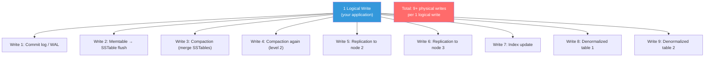
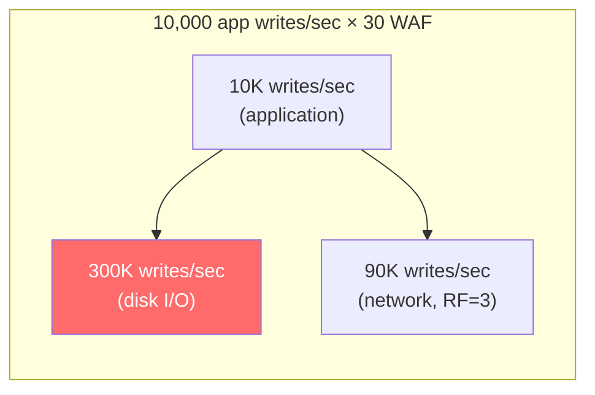

# Write Amplification — The Hidden Cost of Every Write

---

## What Write Amplification Is

You call `insertOne()` — one logical write. But the database actually writes to disk **multiple times**:



Write amplification factor (WAF) = physical writes / logical writes. A WAF of 10 means each logical write results in 10 physical disk writes.

---

## Sources of Write Amplification

### 1. Storage Engine (Compaction)

In LSM-tree databases (Cassandra, RocksDB, LevelDB), data is written to memtable → flushed to SSTable → merged via compaction.

| Compaction Strategy | Typical WAF | Why |
|-------------------|-------------|-----|
| Size-Tiered (STCS) | 2-5x | Data-rewritten through tier merges |
| Leveled (LCS) | 10-30x | Data moves through multiple levels |
| FIFO / TWCS | 1-2x | Minimal rewriting (time-window based) |

MongoDB's WiredTiger engine uses B-trees, not LSM-trees. WAF is typically 2-4x (page splits, checkpointing).

### 2. Replication

With RF=3, every write must reach 3 nodes: WAF = 3x (just from replication).

### 3. Denormalization

Table-per-query pattern in Cassandra:

```
1 application write →
  Table 1: orders_by_customer (1 write)
  Table 2: orders_by_date (1 write)
  Table 3: orders_by_status (1 write)
= 3x WAF from denormalization alone
```

### 4. Indexes

Every index on a collection adds a write. MongoDB with 5 indexes means each insert updates 5 index structures.

```typescript
// Each of these indexes adds write overhead
db.collection('orders').createIndex({ customerId: 1 });        // +1 write
db.collection('orders').createIndex({ status: 1, date: -1 });  // +1 write
db.collection('orders').createIndex({ product: 1 });           // +1 write
db.collection('orders').createIndex({ total: 1 });             // +1 write
db.collection('orders').createIndex({ region: 1, date: -1 });  // +1 write
// 1 insert = 6 writes (data + 5 indexes)
```

### 5. Combined Effect

```
Cassandra, LCS, RF=3, 3 denormalized tables, 2 secondary indexes per table:

Per logical write:
  × 3 (denormalized tables)
  × 3 (replication)
  × 10-30 (LCS compaction per table)
  + secondary index writes
  
= 90-270x theoretical WAF

In practice: ~30-50x after optimizations
```

---

## The Cost

Every physical write:
- Consumes **disk I/O** (SSDs have write endurance limits — typically 1-3 DWPD)
- Consumes **CPU** (serialization, compression, checksumming)
- Consumes **network bandwidth** (replication)
- Generates **heat** (literally — data centers worry about this at scale)



---

## Reducing Write Amplification

### Strategy 1: Choose Compaction Wisely

If you're write-heavy, STCS (2-5x) beats LCS (10-30x):

```sql
-- Switch to STCS for write-heavy tables
ALTER TABLE events WITH compaction = {
    'class': 'SizeTieredCompactionStrategy'
};
```

### Strategy 2: Minimize Indexes

Every index is a trade-off: faster reads, slower writes.

```typescript
// ❌ Indexing everything "just in case"
db.orders.createIndex({ field1: 1 });
db.orders.createIndex({ field2: 1 });
db.orders.createIndex({ field3: 1 });
db.orders.createIndex({ field4: 1 });
db.orders.createIndex({ field5: 1 });

// ✅ Compound index covers multiple query patterns
db.orders.createIndex({ status: 1, date: -1, customerId: 1 });
// This one index supports:
// - Find by status
// - Find by status + date range
// - Find by status + date + customer
```

Audit your indexes with `$indexStats`:
```javascript
db.orders.aggregate([{ $indexStats: {} }]);
// Any index with 0 accesses in the last month → drop it
```

### Strategy 3: Batch Writes

Instead of 1,000 individual writes, batch them:

```go
// ❌ 1,000 individual writes = 1,000 × WAF
for _, event := range events {
    col.InsertOne(ctx, event)
}

// ✅ Bulk write: amortized overhead
models := make([]mongo.WriteModel, len(events))
for i, event := range events {
    models[i] = mongo.NewInsertOneModel().SetDocument(event)
}
col.BulkWrite(ctx, models, options.BulkWrite().SetOrdered(false))
```

### Strategy 4: Limit Denormalization

Three denormalized tables × RF=3 = 9 copies. Can you reduce to 2 tables?

Ask for each denormalized table:
- Is this query actually used in production?
- Could it be served from the primary table with a secondary index?
- Could a cache layer eliminate the need for this table?

---

## Monitoring Write Amplification

### MongoDB

```javascript
// Check write amplification indicators
db.serverStatus().wiredTiger.concurrentTransactions;
db.serverStatus().opcounters;

// Disk I/O monitoring
db.serverStatus().wiredTiger.connection;
```

### Cassandra

```bash
# Check compaction activity
nodetool compactionstats

# Check write latency per table
nodetool tablestats <keyspace>.<table>

# SSTable count (high = high WAF candidate)
nodetool cfstats <keyspace>.<table> | grep "SSTable count"
```

---

## Next

→ [03-index-cost-and-tradeoffs.md](./03-index-cost-and-tradeoffs.md) — The real cost of indexes: why more indexes can make your database slower overall.
