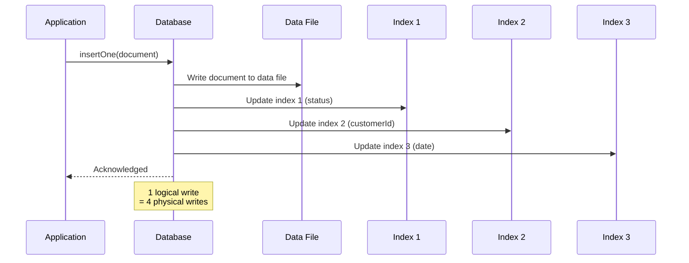
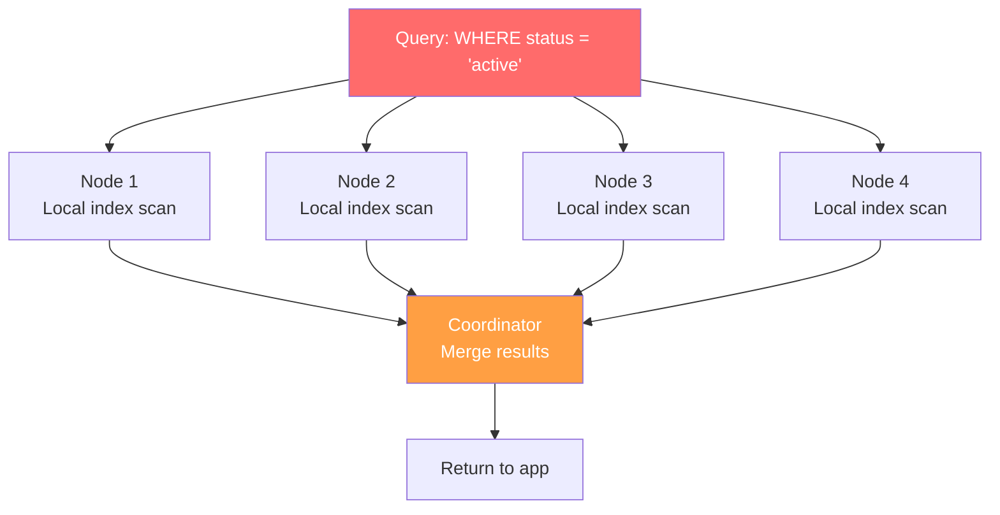
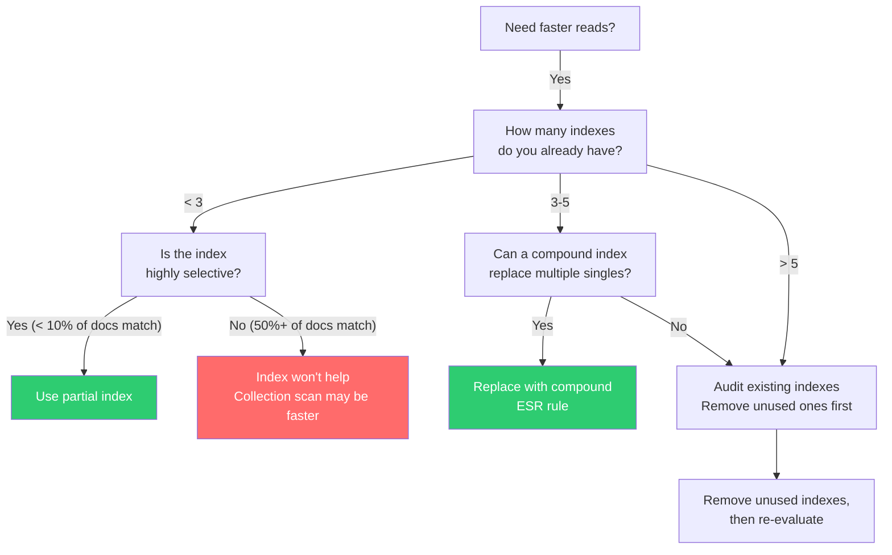

# Index Cost and Tradeoffs — Every Index Is a Write Tax

---

## The Illusion

SQL taught you: "Query slow? Add an index." It usually worked. Storage was cheap, writes were modest, and the query planner was smart enough to pick the right index.

In NoSQL at scale, every index is a **permanent tax on every write**. And the tax compounds.

---

## What Happens When You Add an Index



Each index is a separate data structure that must be:
- **Updated** on every insert
- **Updated** on every update (if the indexed field changed)
- **Updated** on every delete
- **Stored** in memory (ideally) or disk
- **Compacted** (LSM-tree indexes) or **rebalanced** (B-tree indexes)

---

## Cost Breakdown By Database

### MongoDB (B-tree indexes via WiredTiger)

| Operation | Without indexes | With 5 indexes |
|-----------|----------------|----------------|
| Insert | 1 write | 6 writes |
| Update (1 indexed field) | 1 write | 2 writes (data + 1 index) |
| Update (all indexed fields) | 1 write | 6 writes |
| Delete | 1 write | 6 writes |
| Storage | Data only | Data + 5 index structures |
| Memory pressure | Data cache | Data cache + 5 index caches |

### Cassandra (LSM-tree secondary indexes — SASI, SAI)

Secondary indexes in Cassandra are **local indexes** — stored separately on each node. Problems:

1. **Scatter-gather queries**: A query on a secondary index must ask **every node** because the index is local
2. **Write path**: Each secondary index adds SSTable maintenance per node
3. **Compaction**: Indexes compact separately from data



**This is why Cassandra documentation warns you against secondary indexes on high-cardinality columns.** A secondary index on `user_id` in a 50-node cluster means every query hits 50 nodes.

---

## The Memory Problem

Indexes must ideally fit in RAM. When they don't, every indexed lookup becomes a disk seek.

```
Working set calculation:

Collection: 100M documents, 1KB each = 100GB data
Index on _id:          ~2GB
Index on customerId:   ~3GB
Index on status+date:  ~4GB
Index on product:      ~3GB
Index on tags:         ~5GB (multikey — larger)
                       ------
Total index size:      ~17GB

Your server has 32GB RAM.
WiredTiger cache (50%): 16GB.
Indexes alone = 17GB > 16GB cache.

Result: Index thrashing. Every query evicts another index page.
```

```typescript
// Check if your indexes fit in memory
const stats = db.orders.stats();
console.log('Data size:', stats.size);
console.log('Index size:', stats.totalIndexSize);
console.log('Index sizes:', stats.indexSizes);

// If totalIndexSize > available WiredTiger cache → problem
```

---

## Index Types and Their Costs

### Single-field vs Compound

```typescript
// ❌ Two single-field indexes
db.orders.createIndex({ status: 1 });      // Covers: find by status
db.orders.createIndex({ date: -1 });       // Covers: find by date

// These CANNOT efficiently serve: find({ status: 'active', date: { $gt: ... } })
// MongoDB uses index intersection (slow) or picks one index + scans

// ✅ One compound index
db.orders.createIndex({ status: 1, date: -1 });  // Covers both queries
// 1 index instead of 2 = half the write tax, better read performance
```

**ESR Rule (Equality, Sort, Range):**
```typescript
// Query: status = 'active', sorted by date, total > 100
db.orders.createIndex({ status: 1, date: -1, total: 1 });
//                       ↑ Equality   ↑ Sort    ↑ Range
// This order lets MongoDB use the index optimally
```

### Multikey Indexes (Arrays)

```typescript
// Document: { tags: ["electronics", "sale", "featured"] }
db.products.createIndex({ tags: 1 });

// This creates 3 index entries per document (one per array element)
// 1M documents × avg 5 tags = 5M index entries
// WAF from this one index: 5x per insert
```

### Partial Indexes — The Solution You're Ignoring

```typescript
// ❌ Full index on status
db.orders.createIndex({ status: 1 });
// Indexes ALL documents, but you only query status = 'pending'

// ✅ Partial index: only index what you query
db.orders.createIndex(
    { status: 1, date: -1 },
    { partialFilterExpression: { status: 'pending' } }
);
// Index covers 5% of documents instead of 100%
// 95% smaller, 95% less write overhead
```

### TTL Indexes

```typescript
// TTL index serves double duty: index + automatic deletion
db.sessions.createIndex(
    { createdAt: 1 },
    { expireAfterSeconds: 86400 }  // 24 hours
);
// Cost: 1 index write overhead + background deletion thread
```

### Sparse Indexes

```typescript
// Most documents don't have 'promoCode'
// ❌ Regular index: creates entries for documents without promoCode
db.orders.createIndex({ promoCode: 1 });

// ✅ Sparse index: only indexes documents that have the field
db.orders.createIndex({ promoCode: 1 }, { sparse: true });
// Much smaller index, less write overhead
```

---

## Go: Programmatic Index Management

```go
package main

import (
	"context"
	"fmt"
	"log"

	"go.mongodb.org/mongo-driver/bson"
	"go.mongodb.org/mongo-driver/mongo"
	"go.mongodb.org/mongo-driver/mongo/options"
)

// AuditIndexes checks for unused or problematic indexes
func AuditIndexes(ctx context.Context, db *mongo.Database) error {
	collections, err := db.ListCollectionNames(ctx, bson.D{})
	if err != nil {
		return err
	}

	for _, collName := range collections {
		col := db.Collection(collName)

		// Get index stats
		cursor, err := col.Aggregate(ctx, mongo.Pipeline{
			{{Key: "$indexStats", Value: bson.D{}}},
		})
		if err != nil {
			log.Printf("Skipping %s: %v", collName, err)
			continue
		}

		var stats []bson.M
		if err := cursor.All(ctx, &stats); err != nil {
			return err
		}

		for _, stat := range stats {
			name := stat["name"].(string)
			accesses := stat["accesses"].(bson.M)
			ops := accesses["ops"]
			since := accesses["since"]

			fmt.Printf("Collection: %s, Index: %s, Uses: %v, Since: %v\n",
				collName, name, ops, since)

			// Flag indexes with 0 operations
			if ops.(int64) == 0 && name != "_id_" {
				fmt.Printf("  ⚠️  UNUSED INDEX — candidate for removal\n")
			}
		}
	}
	return nil
}
```

---

## The Cassandra Index Alternative: Denormalize

Instead of secondary indexes, Cassandra recommends **another table**:

```
-- Instead of indexing orders by status:
-- ❌ CREATE INDEX ON orders (status);    -- scatter-gather on every query

-- ✅ Create a dedicated table
CREATE TABLE orders_by_status (
    status TEXT,
    order_date TIMESTAMP,
    order_id UUID,
    customer_id UUID,
    total DECIMAL,
    PRIMARY KEY ((status), order_date, order_id)
) WITH CLUSTERING ORDER BY (order_date DESC);
```

Trade-off:
- Secondary index: slower reads, no extra write overhead to your table (but index maintenance)
- Denormalized table: fast reads, **you must maintain both tables on every write**

This is the Cassandra way: you pay at write time so reads are always fast.

---

## Decision Framework



### Guidelines

| Scenario | Recommendation |
|----------|---------------|
| Write-heavy, read-light | Minimize indexes (0-2) |
| Read-heavy, write-light | More indexes acceptable (3-5) |
| Mixed workload | Compound indexes, partial where possible |
| Cassandra | Prefer denormalized tables over secondary indexes |
| Array fields | Multikey indexes are expensive — consider bucketing |
| Rarely queried field | Don't index it (use partial if sometimes needed) |

---

## Anti-Patterns

### 1. "Index All The Things"
```
// Created 12 indexes "just in case" during development
// Production: 3 are used, 9 are pure write tax
```

### 2. Indexing Low-Cardinality Fields
```
// Indexing { active: true/false } — only 2 values
// The index points to 50% of documents
// A collection scan is faster than an index scan for >30% selectivity
```

### 3. Forgetting Multikey Cost
```
// { tags: ["a", "b", "c", "d", "e"] } with multikey index
// 5 index entries per document
// 100M documents = 500M index entries = massive index
```

### 4. Index Intersection Fantasy
```
// "MongoDB will combine my two single-field indexes"
// It can, via index intersection, but it's almost always slower
// than a proper compound index
```

---

## Key Takeaway

Every index is a **write-time tax** that buys **read-time speed**. The question isn't "should I add an index?" — it's "is this read pattern important enough to tax every single write?"

In SQL, the answer was almost always yes. In NoSQL at scale, the answer requires actual measurement.

---

## Next

→ [04-disk-memory-tradeoffs.md](./04-disk-memory-tradeoffs.md) — Working set size, cache pressure, and why your database's performance cliff is determined by RAM.
