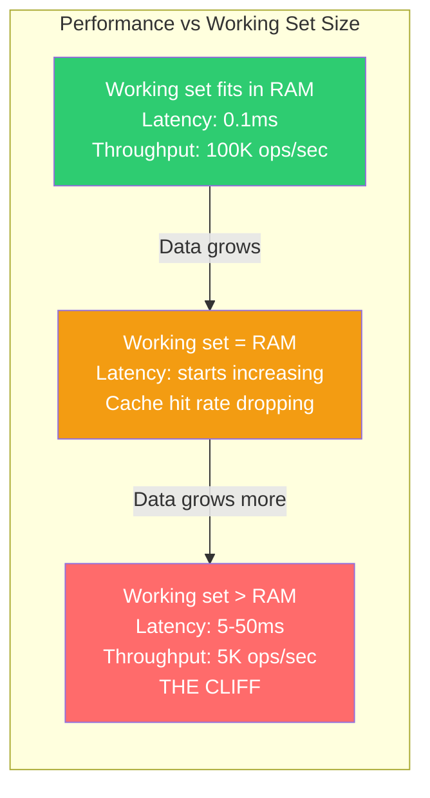
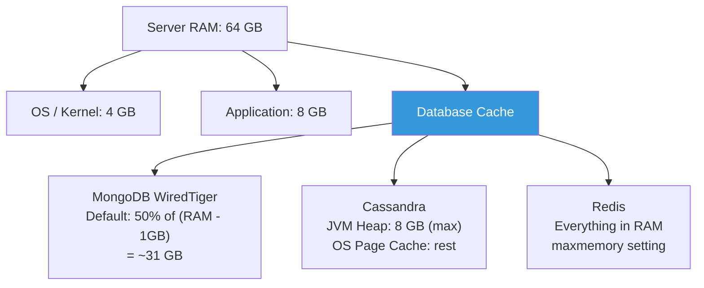
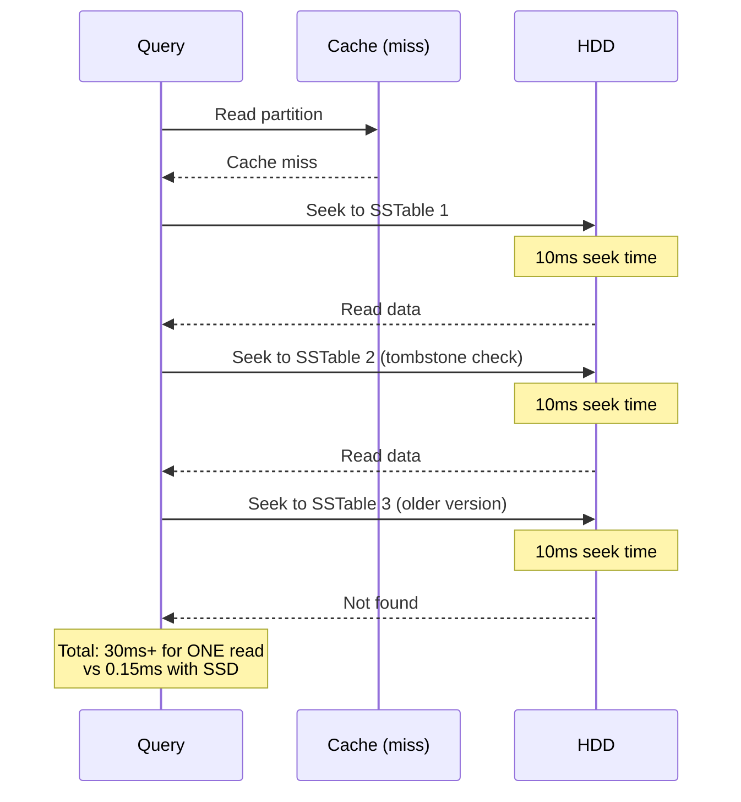
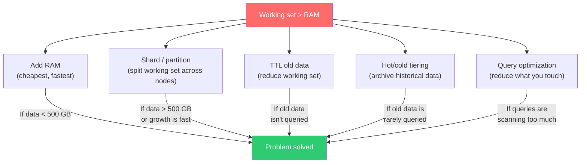

# Disk, Memory, and the Performance Cliff

---

## The Cliff

Every database has a performance cliff: the point where your **working set** exceeds available RAM. Below the cliff, everything is fast — data is in memory. Above the cliff, everything is slow — every operation requires disk I/O.



SQL databases hit this cliff too. But NoSQL databases are often chosen *because* data is big — which means you're closer to the cliff from day one.

---

## Working Set: What It Actually Means

The working set is the data your application **actively touches**. Not total data size — active data.

```
Total data:        500 GB
Indexes:           80 GB
Active data:       40 GB  (last 30 days of a 3-year dataset)
Active indexes:    15 GB  (index entries for recent data)
─────────────────────────
Working set:       ~55 GB

Server RAM:        64 GB
DB cache (50%):    32 GB

55 GB working set > 32 GB cache → CLIFF
```

### How Databases Use Memory



---

## Database-Specific Memory Models

### MongoDB (WiredTiger)

WiredTiger uses an internal cache (default: 50% of RAM - 1GB) plus the OS filesystem cache.

```javascript
// Check cache utilization
const status = db.serverStatus().wiredTiger.cache;
console.log('Cache size:', status['maximum bytes configured']);
console.log('Currently in cache:', status['bytes currently in the cache']);
console.log('Pages read into cache:', status['pages read into cache']);
console.log('Pages evicted:', status['unmodified pages evicted']);

// Cache hit ratio (should be > 95%)
const hits = status['pages requested from the cache'];
const misses = status['pages read into cache'];
const hitRatio = hits / (hits + misses);
console.log('Cache hit ratio:', (hitRatio * 100).toFixed(2) + '%');
```

**When the cache is full**, WiredTiger evicts pages (LRU). If your queries keep requesting evicted pages, every query becomes a disk read: **the cliff**.

### Cassandra

Cassandra's memory model is more complex:

```
JVM Heap (max ~8 GB recommended):
  - Memtables (write buffer)
  - Key cache (partition key → SSTable offset)
  - Row cache (optional, full rows)
  - Bloom filters

OS Page Cache (remaining RAM):
  - SSTable data pages
  - Index files
  - Compression offset maps
```

The key cache is critical: it maps partition keys to their SSTable file positions. A key cache miss means reading the partition index from disk.

```bash
# Check key cache hit rate (should be near 100%)
nodetool info | grep "Key Cache"
# Key Cache       : entries 5943210, size 425.3 MB, capacity 512 MB, 1283847 hits, 1285102 requests, 0.999 recent hit rate

# Check row cache (if enabled)
nodetool info | grep "Row Cache"
```

### Redis

Redis keeps everything in memory by default. There's no cliff — there's a **wall**.

```
maxmemory 8gb
maxmemory-policy allkeys-lru

# If data exceeds maxmemory, Redis evicts keys based on policy
# allkeys-lru:    Evict least recently used from ALL keys
# volatile-lru:   Evict LRU from keys with TTL only
# allkeys-random: Random eviction
# noeviction:     Return errors on writes (default!)
```

---

## SSD vs HDD: It Matters More Than You Think

When the working set exceeds RAM, disk performance becomes everything.

| Characteristic | HDD | SSD (SATA) | SSD (NVMe) |
|---------------|-----|------------|------------|
| Random read latency | 5-15 ms | 0.1-0.2 ms | 0.02-0.05 ms |
| Random IOPS | 100-200 | 10K-50K | 100K-500K |
| Sequential MB/s | 100-200 | 500-600 | 2,000-7,000 |
| Write endurance | Unlimited (mechanical) | 1-3 DWPD | 1-3 DWPD |
| Cost per TB | $20-30 | $80-100 | $100-200 |
| **Impact on NoSQL** | **Compaction kills you** | **Workable** | **Best option** |

**Why NoSQL on HDD is painful:**



Compaction is even worse on HDD: it reads and rewrites entire SSTables sequentially — for hours.

---

## Compression: Trading CPU for Disk

All NoSQL databases support compression. The tradeoff:

| Algorithm | Ratio | CPU Cost | Best For |
|-----------|-------|----------|----------|
| Snappy | 1.5-2x | Very Low | Default (Cassandra, MongoDB) |
| LZ4 | 2-2.5x | Low | Good default alternative |
| Zlib/Deflate | 3-4x | Medium | Cold data, archival |
| Zstd | 3-4.5x | Medium-Low | Best ratio/speed tradeoff |

```javascript
// MongoDB: check compression
db.orders.stats().wiredTiger.creationString;
// Look for block_compressor=snappy

// MongoDB: configure per-collection
db.createCollection("archive", {
    storageEngine: {
        wiredTiger: {
            configString: "block_compressor=zstd"
        }
    }
});
```

```sql
-- Cassandra: configure per-table
ALTER TABLE events WITH compression = {
    'sstable_compression': 'LZ4Compressor',
    'chunk_length_in_kb': 64
};
```

---

## Practical Memory Sizing

### Step 1: Measure Your Working Set

```typescript
import { MongoClient } from 'mongodb';

async function measureWorkingSet(uri: string, dbName: string) {
    const client = new MongoClient(uri);
    await client.connect();
    const db = client.db(dbName);

    const stats = await db.stats();
    console.log(`Database: ${dbName}`);
    console.log(`Data size: ${(stats.dataSize / 1e9).toFixed(2)} GB`);
    console.log(`Index size: ${(stats.indexSize / 1e9).toFixed(2)} GB`);
    console.log(`Storage size: ${(stats.storageSize / 1e9).toFixed(2)} GB`);

    // Check WiredTiger cache
    const serverStatus = await db.admin().serverStatus();
    const cache = serverStatus.wiredTiger.cache;
    const cacheMax = cache['maximum bytes configured'];
    const cacheUsed = cache['bytes currently in the cache'];
    const evicted = cache['unmodified pages evicted'];
    const readIn = cache['pages read into cache'];

    console.log(`\nCache max: ${(cacheMax / 1e9).toFixed(2)} GB`);
    console.log(`Cache used: ${(cacheUsed / 1e9).toFixed(2)} GB`);
    console.log(`Eviction rate: ${evicted} pages`);

    const hitRate = 1 - (readIn / (readIn + evicted || 1));
    console.log(`\nEstimated cache hit rate: ${(hitRate * 100).toFixed(1)}%`);

    if (hitRate < 0.95) {
        console.log('⚠️  Working set likely exceeds cache');
        console.log('   Consider: more RAM, data tiering, or sharding');
    }

    await client.close();
}
```

### Step 2: Size Your Server

```
Rule of thumb:

MongoDB:
  RAM ≥ (working set indexes + hot data) / 0.5
  (WiredTiger gets 50% of RAM)
  
  Example: 30 GB working set → 64 GB RAM minimum

Cassandra:
  RAM = 8 GB heap + enough for OS page cache
  OS page cache should hold: bloom filters + key cache + hot SSTables
  
  Example: 32 GB RAM (8 heap + 24 page cache) per node

Redis:
  RAM ≥ dataset size × 1.5
  (Overhead for data structures, fragmentation, fork for persistence)
  
  Example: 10 GB dataset → 16 GB RAM
```

---

## When You Hit the Cliff: Options



### Go: Hot/Cold Data Tiering

```go
package main

import (
	"context"
	"log"
	"time"

	"go.mongodb.org/mongo-driver/bson"
	"go.mongodb.org/mongo-driver/mongo"
	"go.mongodb.org/mongo-driver/mongo/options"
)

// MoveToArchive moves old orders to a cold-tier collection
func MoveToArchive(ctx context.Context, db *mongo.Database, olderThan time.Duration) error {
	cutoff := time.Now().Add(-olderThan)

	hotCol := db.Collection("orders")          // SSD, indexed, in-memory
	coldCol := db.Collection("orders_archive") // Cheaper storage, minimal indexes

	// Find old orders
	filter := bson.M{"createdAt": bson.M{"$lt": cutoff}}
	cursor, err := hotCol.Find(ctx, filter, options.Find().SetBatchSize(1000))
	if err != nil {
		return err
	}
	defer cursor.Close(ctx)

	var batch []interface{}
	var ids []interface{}

	for cursor.Next(ctx) {
		var doc bson.M
		if err := cursor.Decode(&doc); err != nil {
			return err
		}
		batch = append(batch, doc)
		ids = append(ids, doc["_id"])

		if len(batch) >= 1000 {
			// Insert batch into archive
			if _, err := coldCol.InsertMany(ctx, batch); err != nil {
				return err
			}
			// Delete from hot collection
			if _, err := hotCol.DeleteMany(ctx, bson.M{"_id": bson.M{"$in": ids}}); err != nil {
				return err
			}
			log.Printf("Archived %d documents", len(batch))
			batch = batch[:0]
			ids = ids[:0]
		}
	}

	// Final batch
	if len(batch) > 0 {
		if _, err := coldCol.InsertMany(ctx, batch); err != nil {
			return err
		}
		if _, err := hotCol.DeleteMany(ctx, bson.M{"_id": bson.M{"$in": ids}}); err != nil {
			return err
		}
		log.Printf("Archived %d documents (final batch)", len(batch))
	}

	return nil
}
```

---

## Quick Comparison: Memory Behavior

| Aspect | MongoDB | Cassandra | Redis |
|--------|---------|-----------|-------|
| Primary cache | WiredTiger internal cache | OS page cache + JVM heap | All data in RAM |
| Default allocation | 50% of RAM - 1GB | 8 GB JVM + rest to OS | maxmemory setting |
| Cache miss cost | Page fault from disk | SSTable read from disk | N/A (eviction or error) |
| Cliff behavior | Gradual degradation | Gradual (more GC pauses) | Hard wall |
| Compression | Snappy (default) | LZ4 (default) | None (RAM only) |
| When over capacity | Eviction + slower reads | More disk I/O + GC | Eviction or OOM |

---

## The Bottom Line

The performance cliff is not a failure of your database — it's physics. RAM is ~1000x faster than disk. When you cross from one to the other, performance drops accordingly.

The only defense: **know your working set size, and keep it in RAM.**

---

## Next

→ [05-why-benchmarks-lie.md](./05-why-benchmarks-lie.md) — Why TPC-C numbers and vendor benchmarks won't predict your production performance.
