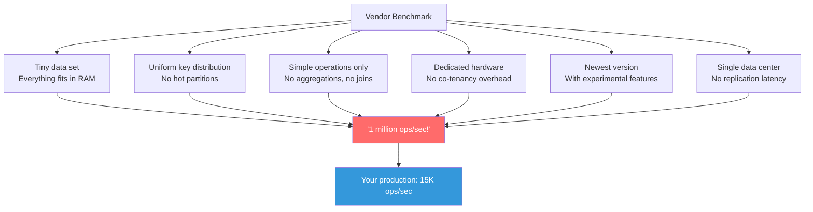
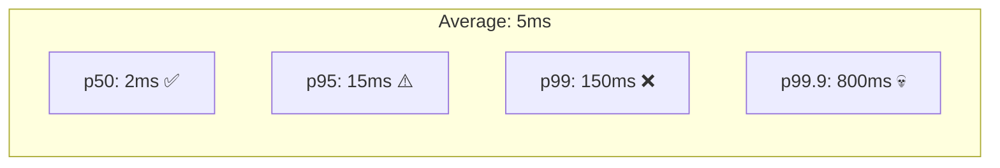

# Why Benchmarks Lie — And What to Measure Instead

---

## The Problem

Every NoSQL database has a blog post claiming "1 million ops/sec." Every vendor has a benchmark showing their database is the fastest. And none of it predicts your production performance.

Here's why.

---

## How Vendor Benchmarks Cheat



### Lie #1: Working Set Fits in RAM

Most benchmarks use datasets that fit entirely in the database cache. Zero disk I/O. In production, you probably have disk I/O on 5-30% of operations.

### Lie #2: Uniform Distribution

Benchmarks use random key generation, distributing load evenly. Your production has hot partitions, celebrity users, and temporal access patterns (everyone hits the latest data).

### Lie #3: Simple Operations

Getting a document by `_id` is fast in every database. Your $lookup aggregation pipeline with 5 stages? Benchmark didn't test that.

### Lie #4: No Network Reality

Benchmark client is on the same machine or same rack. Your application servers are 2ms away. At 10K ops/sec, that's 10K × 2ms = 20 seconds of network latency per second.

### Lie #5: Consistency Level = ONE

Cassandra at `CL=ONE` is 3x faster than `CL=QUORUM`. Guess which one the benchmark uses. Guess which one you need in production.

### Lie #6: No Compaction During Benchmark

Benchmarks often run for 10 minutes. Compaction hasn't kicked in yet. In production, compaction runs continuously and steals 10-30% of I/O.

---

## YCSB: The "Standard" Benchmark (And Its Limits)

Yahoo! Cloud Serving Benchmark (YCSB) is the closest thing to a standard. It defines workload patterns:

| Workload | Mix | Simulates |
|----------|-----|-----------|
| A | 50% read, 50% update | Session store |
| B | 95% read, 5% update | Photo tagging |
| C | 100% read | User profile cache |
| D | 95% read, 5% insert (recent) | User status timeline |
| E | 95% scan, 5% insert | Threaded conversations |
| F | 50% read, 50% read-modify-write | User database |

**Better than vendor benchmarks, but still lies because:**

1. Uniform key distribution (configurable, but default is uniform)
2. Fixed document size (1KB default)
3. Single collection/table
4. No indexes (only primary key)
5. No application-level logic (no validation, no business rules)
6. Doesn't test failure modes (node down, network partition)

---

## What Actually Matters

### Latency Distribution, Not Averages



Average is meaningless. A database with 2ms average and 800ms p99.9 will give 1 in 1,000 users an unacceptable experience. At 10K requests/sec, that's 10 bad requests every second.

```typescript
// Track latency percentiles, not averages
import { MongoClient } from 'mongodb';

interface LatencyStats {
    count: number;
    latencies: number[];
}

function percentile(sorted: number[], p: number): number {
    const idx = Math.ceil((p / 100) * sorted.length) - 1;
    return sorted[Math.max(0, idx)];
}

async function measureRealLatency(
    client: MongoClient,
    dbName: string,
    iterations: number
): Promise<void> {
    const db = client.db(dbName);
    const col = db.collection('orders');
    const latencies: number[] = [];

    for (let i = 0; i < iterations; i++) {
        const start = performance.now();

        // Test YOUR actual query, not a synthetic one
        await col.find({
            status: 'active',
            region: 'us-east-1',
            createdAt: { $gte: new Date(Date.now() - 86400000) }
        })
        .sort({ createdAt: -1 })
        .limit(20)
        .toArray();

        latencies.push(performance.now() - start);
    }

    latencies.sort((a, b) => a - b);

    console.log(`Results (${iterations} iterations):`);
    console.log(`  p50:   ${percentile(latencies, 50).toFixed(2)}ms`);
    console.log(`  p90:   ${percentile(latencies, 90).toFixed(2)}ms`);
    console.log(`  p95:   ${percentile(latencies, 95).toFixed(2)}ms`);
    console.log(`  p99:   ${percentile(latencies, 99).toFixed(2)}ms`);
    console.log(`  p99.9: ${percentile(latencies, 99.9).toFixed(2)}ms`);
    console.log(`  max:   ${latencies[latencies.length - 1].toFixed(2)}ms`);
}
```

### Throughput Under Realistic Conditions

The only useful throughput number is one tested with:
- Your actual data model
- Your actual query patterns
- Your actual consistency requirements
- Your actual concurrent connection count
- Your actual network topology
- Running for hours, not minutes (to include GC pauses and compaction)

### Degradation Under Load

What happens when you go from 5K to 50K ops/sec?

```
Good database behavior:
  5K ops/sec  → p99: 10ms
  10K ops/sec → p99: 15ms
  20K ops/sec → p99: 25ms
  40K ops/sec → p99: 50ms
  50K ops/sec → p99: 80ms  (graceful)

Bad database behavior:
  5K ops/sec  → p99: 10ms
  10K ops/sec → p99: 12ms
  20K ops/sec → p99: 15ms
  40K ops/sec → p99: 200ms    (cliff!)
  50K ops/sec → p99: 2000ms   (cascade failure)
```

---

## How to Benchmark Honestly

### Step 1: Use Your Actual Schema and Queries

```go
package main

import (
	"context"
	"fmt"
	"math/rand"
	"sort"
	"sync"
	"time"

	"go.mongodb.org/mongo-driver/bson"
	"go.mongodb.org/mongo-driver/mongo"
	"go.mongodb.org/mongo-driver/mongo/options"
)

type BenchmarkResult struct {
	Operation  string
	Latencies  []time.Duration
	Errors     int
	TotalOps   int
}

func (r *BenchmarkResult) Report() {
	sort.Slice(r.Latencies, func(i, j int) bool {
		return r.Latencies[i] < r.Latencies[j]
	})

	p := func(pct float64) time.Duration {
		idx := int(pct/100*float64(len(r.Latencies))) - 1
		if idx < 0 { idx = 0 }
		return r.Latencies[idx]
	}

	fmt.Printf("\n=== %s ===\n", r.Operation)
	fmt.Printf("Total ops:  %d\n", r.TotalOps)
	fmt.Printf("Errors:     %d\n", r.Errors)
	fmt.Printf("p50:        %v\n", p(50))
	fmt.Printf("p95:        %v\n", p(95))
	fmt.Printf("p99:        %v\n", p(99))
	fmt.Printf("p99.9:      %v\n", p(99.9))
	fmt.Printf("Max:        %v\n", r.Latencies[len(r.Latencies)-1])
}

// BenchmarkRealQueries tests actual production queries
func BenchmarkRealQueries(
	ctx context.Context,
	col *mongo.Collection,
	concurrency int,
	duration time.Duration,
) *BenchmarkResult {
	result := &BenchmarkResult{Operation: "Mixed read/write"}

	var mu sync.Mutex
	var wg sync.WaitGroup
	deadline := time.Now().Add(duration)

	regions := []string{"us-east-1", "us-west-2", "eu-west-1"}
	statuses := []string{"active", "pending", "completed"}

	for i := 0; i < concurrency; i++ {
		wg.Add(1)
		go func() {
			defer wg.Done()
			for time.Now().Before(deadline) {
				start := time.Now()
				var err error

				// 70% reads, 20% writes, 10% updates (realistic mix)
				r := rand.Float64()
				switch {
				case r < 0.70:
					// Read: actual query pattern
					_, err = col.Find(ctx,
						bson.M{
							"status": statuses[rand.Intn(3)],
							"region": regions[rand.Intn(3)],
						},
						options.Find().SetLimit(20).SetSort(bson.D{{Key: "createdAt", Value: -1}}),
					)
				case r < 0.90:
					// Write: actual document shape
					_, err = col.InsertOne(ctx, bson.M{
						"customerId": fmt.Sprintf("cust_%d", rand.Intn(100000)),
						"status":     "pending",
						"region":     regions[rand.Intn(3)],
						"items":      []bson.M{{"sku": "ABC", "qty": rand.Intn(10)}},
						"total":      rand.Float64() * 500,
						"createdAt":  time.Now(),
					})
				default:
					// Update: status change
					_, err = col.UpdateOne(ctx,
						bson.M{"status": "pending"},
						bson.M{"$set": bson.M{"status": "active", "updatedAt": time.Now()}},
					)
				}

				lat := time.Since(start)
				mu.Lock()
				result.Latencies = append(result.Latencies, lat)
				result.TotalOps++
				if err != nil { result.Errors++ }
				mu.Unlock()
			}
		}()
	}

	wg.Wait()
	return result
}
```

### Step 2: Test Failure Modes

What happens when:
- 1 node goes down? (Kill a replica)
- Network is slow? (`tc netem add delay 50ms`)
- Disk is slow? (Use `cgroups` to throttle I/O)
- Compaction runs during peak load?
- A large batch job runs alongside production queries?

### Step 3: Test at 2x Expected Load

If you expect 10K ops/sec in production, benchmark at 20K. If it works, you have headroom. If it doesn't, you know your ceiling.

### Step 4: Run for Hours, Not Minutes

```
Minutes 1-5:   Everything is cached, looks great
Minutes 5-15:  Compaction starts, latency spikes
Minutes 15-60: Cache is warm but full, evictions begin
Hours 1-4:     GC pauses become visible, SSTable count grows
Hours 4+:      This is your actual steady-state performance
```

---

## Benchmark Red Flags

| Claim | Reality |
|-------|---------|
| "1M ops/sec on single node" | Probably key-value reads with everything in RAM |
| "Sub-millisecond latency" | Average, not p99. And probably same-rack client |
| "Linear scalability" | True for writes, rarely true for reads with cross-shard queries |
| "Tested with 1TB dataset" | On 2TB of RAM. Zero disk I/O |
| "Compared to [competitor]" | Using default configuration for competitor, tuned config for theirs |
| "YCSB workload C results" | 100% reads, simplest possible test |

---

## What to Actually Report

When someone asks "how fast is our database?", answer with:

```
Database: MongoDB 7.0, 3-node replica set (m5.2xlarge)
Dataset: 150M documents, 200GB data, 35GB indexes
Working set: ~50GB (last 30 days)
Consistency: majority read, majority write

Query mix (production replay):
  - List orders by customer:  p50=3ms,  p99=25ms,  p99.9=120ms
  - Create order:             p50=8ms,  p99=45ms,  p99.9=200ms
  - Update order status:      p50=5ms,  p99=30ms,  p99.9=150ms
  - Aggregate daily totals:   p50=50ms, p99=300ms, p99.9=800ms

Throughput ceiling: ~18K mixed ops/sec before p99 > 100ms
Current production load: 8K ops/sec (44% capacity)

Tested duration: 8 hours continuous load
Node failure test: p99 increased 3x during failover (30 seconds)
```

That's a useful benchmark. "1 million ops/sec" is marketing.

---

## Next

→ [../07-when-not-to-use-nosql/01-accidental-nosql.md](../07-when-not-to-use-nosql/01-accidental-nosql.md) — When teams pick NoSQL for the wrong reasons — and the pain that follows.
