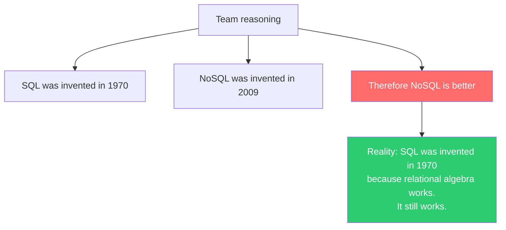
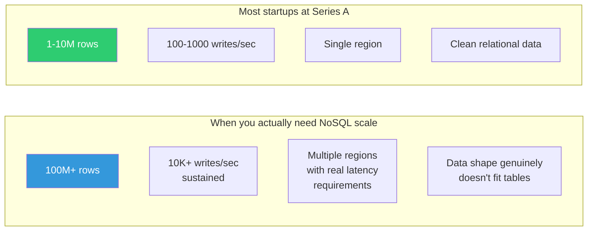

# Accidental NoSQL — When Teams Pick It for the Wrong Reasons

---

## The Pattern

A team picks NoSQL not because they analyzed their access patterns and consistency requirements, but because:

1. "SQL is old, NoSQL is modern"
2. "MongoDB is easier — no schema migrations"
3. "We might scale someday"
4. "Our data is JSON, so document database"
5. "The trendy companies use it"

Then, 18 months later, they're building a relational database on top of MongoDB.

---

## Reason #1: "SQL Is Old"



PostgreSQL in 2024 supports:
- JSON columns (JSONB) with indexing
- Full-text search
- Geospatial queries (PostGIS)
- Time-series (TimescaleDB extension)
- Graph queries (recursive CTEs, Apache AGE)
- Horizontal read scaling (read replicas)
- Partitioning

If your data fits on one machine (or a few), PostgreSQL probably handles your use case **and** gives you ACID transactions, joins, and schema enforcement for free.

---

## Reason #2: "No Schema Migrations"

The appeal:
```javascript
// MongoDB: just shove anything in
db.users.insertOne({ name: "Alice", age: 30 });
db.users.insertOne({ name: "Bob", email: "bob@test.com", preferences: { theme: "dark" } });
// No migration needed! Freedom!
```

The reality 6 months later:
```javascript
// Query: find users with email
db.users.find({ email: { $exists: true } });
// Only 60% of documents have email field
// Which documents have preferences? Who knows
// Is age a number or a string? Depends on when it was inserted

// Now you're writing this:
db.users.find({
    email: { $exists: true, $type: "string", $ne: "" },
    age: { $exists: true, $gte: 0 }
});
// You just reinvented schema validation. Badly.
```

**Schemaless doesn't mean no schema. It means every query must handle every possible shape.**

---

## Reason #3: "We Might Scale Someday"

The fantasy:
```
"We're building the next Twitter. We need to handle billions of rows."
```

The reality:
```
Month 1:    1,000 users, 50K documents
Month 6:    5,000 users, 500K documents
Month 12:   10,000 users, 2M documents
Month 24:   25,000 users, 8M documents (still on one server)

PostgreSQL can handle 8M rows without breaking a sweat.
A single laptop can handle 8M rows.
```

**Premature scaling optimization** costs you:
- Schema flexibility (you denormalized for performance you don't need)
- Query power (no joins, no aggregations, no ad-hoc queries)
- Consistency guarantees (eventual consistency on data that's not even distributed)
- Developer productivity (fighting the database instead of building features)



---

## Reason #4: "Our Data Is JSON"

```typescript
// "Our API returns JSON, so we should store it in a document database"

// Your API:
interface Order {
    id: string;
    customerId: string;      // ← foreign key
    items: OrderItem[];       // ← nested, but also needs independent queries
    shippingAddress: Address; // ← shared with customer
    payment: Payment;         // ← references payment service
    status: string;
    createdAt: Date;
}

// This is relational data in JSON clothing.
// Orders reference customers. Items need inventory checks.
// Addresses are shared. Payments cross-reference orders.
```

Just because your API speaks JSON doesn't mean your storage should be a document store. PostgreSQL's JSONB column type gives you the best of both worlds:

```sql
-- Relational structure with JSON flexibility
CREATE TABLE orders (
    id UUID PRIMARY KEY,
    customer_id UUID REFERENCES customers(id),  -- enforced relationship
    status VARCHAR(20) NOT NULL,
    metadata JSONB,                              -- flexible JSON field
    created_at TIMESTAMP DEFAULT NOW()
);

-- Index INTO the JSON
CREATE INDEX idx_orders_metadata ON orders USING GIN (metadata);

-- Query the JSON
SELECT * FROM orders 
WHERE metadata->>'priority' = 'high' 
  AND customer_id = '...';
```

---

## Reason #5: The Trendy Companies Use It

"Netflix uses Cassandra, so we should too."

Netflix has:
- Hundreds of millions of users
- Petabytes of data
- Hundreds of engineers on database infrastructure alone
- Custom tooling built over a decade

You have:
- 10,000 users
- 5 GB of data
- 2 backend engineers
- A deadline in 3 months

What Netflix does is irrelevant to your decision.

---

## The Diagnostic Checklist

Ask these questions before choosing NoSQL:

| Question | If "Yes" → SQL | If "Yes" → NoSQL |
|----------|----------------|-------------------|
| Do you need transactions across multiple entities? | ✅ Use SQL | |
| Do you need ad-hoc queries for analytics? | ✅ Use SQL | |
| Is your data naturally relational (users → orders → items)? | ✅ Use SQL | |
| Will your data fit on one server for the foreseeable future? | ✅ Use SQL | |
| Do you need flexible querying in ways you can't predict? | ✅ Use SQL | |
| Do you need sub-ms latency at millions of ops/sec? | | ✅ Consider NoSQL |
| Is your data write-heavy (100:1 write:read ratio)? | | ✅ Consider NoSQL |
| Do you have a known, stable set of access patterns? | | ✅ Consider NoSQL |
| Do you need to scale writes across many nodes? | | ✅ Consider NoSQL |
| Is your data genuinely hierarchical/nested? | | ✅ Consider NoSQL |

---

## The Warning Signs You Picked Wrong

You're in trouble if you find yourself:

```
□ Writing application code to enforce referential integrity
□ Building a "consistency layer" on top of your database
□ Using $lookup in every aggregation pipeline
□ Maintaining 5+ denormalized tables for the same data
□ Writing migration scripts to fix schema inconsistencies
□ Building an "admin query tool" because you can't do ad-hoc queries
□ Saying "we need to add a message queue" to keep tables in sync
```

If you check 3 or more, you've built a worse version of PostgreSQL.

---

## It's Not Too Late

Migrating from NoSQL to SQL (or vice versa) is painful but possible. The cost of staying with the wrong choice for 3 more years is higher than the cost of migrating now.

Some teams run both: relational for transactional data, NoSQL for specific use cases (caching, event streams, time-series). This is fine — it's called **polyglot persistence**, and it's the mature approach.

---

## Next

→ [02-over-denormalization.md](./02-over-denormalization.md) — When denormalization goes too far and you're maintaining 8 copies of the same data.
