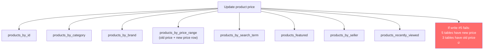
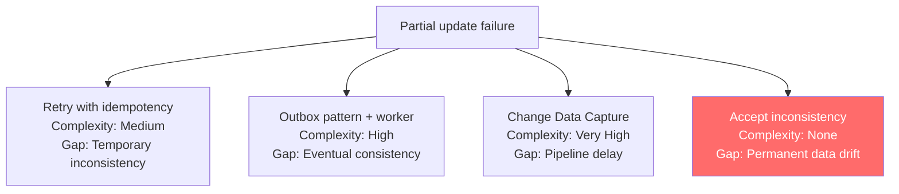
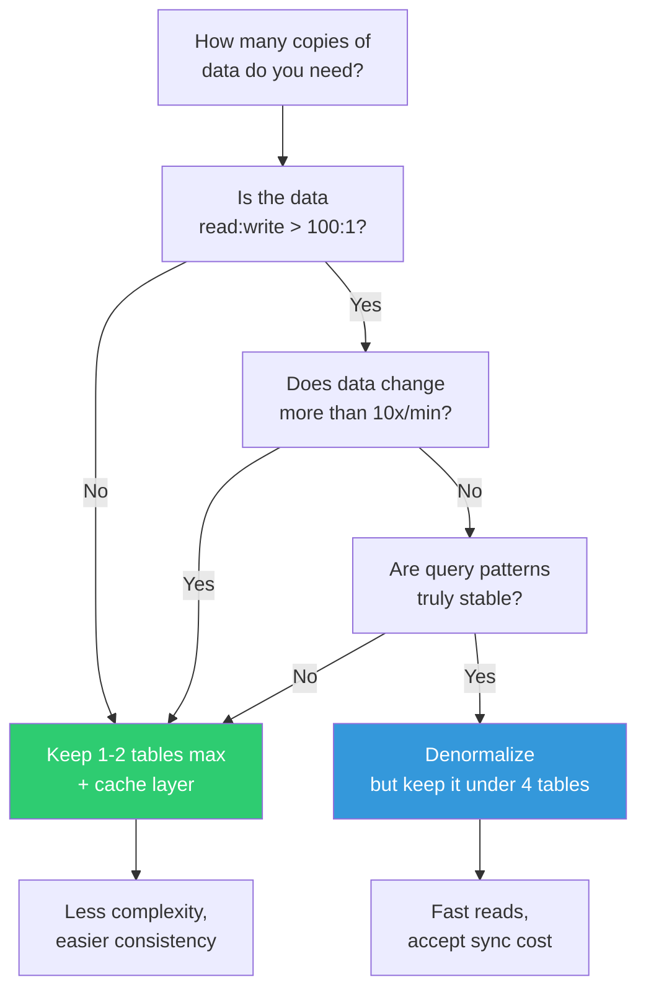

# Over-Denormalization — When Copies Kill You

---

## The Seduction

Cassandra taught you: "denormalize everything, table per query." MongoDB taught you: "embed for performance." Both are right — up to a point.

Past that point, you maintain 5-10 copies of the same data, spend more time synchronizing than building features, and debug inconsistencies that never happened in your SQL database.

---

## How It Starts (Innocently)

E-commerce product catalog. You create one table per query pattern:

```
Table 1: products_by_id           (lookup by ID)
Table 2: products_by_category     (browse by category)
Table 3: products_by_brand        (browse by brand)
Table 4: products_by_price_range  (filter by price)
Table 5: products_by_search_term  (search)
Table 6: products_featured        (homepage featured)
Table 7: products_by_seller       (seller dashboard)
Table 8: products_recently_viewed (recommendation engine)
```

One product update = 8 writes. One price change = 8 updates. One product deletion = 8 deletes.



---

## The Consistency Nightmare

Without transactions (Cassandra), partial failures mean **permanent inconsistencies**.

```typescript
// Updating price across 8 tables
async function updatePrice(productId: string, newPrice: number) {
    // No transaction wrapping these — each is independent
    await productsById.update(productId, { price: newPrice });           // ✅ succeeds
    await productsByCategory.update(productId, { price: newPrice });     // ✅ succeeds
    await productsByBrand.update(productId, { price: newPrice });        // ✅ succeeds
    await productsByPriceRange.moveProduct(productId, newPrice);         // ✅ succeeds
    await productsBySearchTerm.update(productId, { price: newPrice });   // ❌ FAILS (timeout)
    await productsFeatured.update(productId, { price: newPrice });       // never reached
    await productsBySeller.update(productId, { price: newPrice });       // never reached
    await productsRecentlyViewed.update(productId, { price: newPrice }); // never reached
    
    // Result: 4 tables say $29.99, 4 tables say $24.99
    // Customer sees different prices depending on which page they're on
}
```

### Mitigation Strategies (All Have Costs)



**Strategy 1: Retry with idempotency**
```typescript
async function updatePriceWithRetry(productId: string, newPrice: number) {
    const tables = [
        productsById, productsByCategory, productsByBrand,
        productsByPriceRange, productsBySearchTerm,
        productsFeatured, productsBySeller, productsRecentlyViewed,
    ];

    const updateId = crypto.randomUUID(); // idempotency key

    for (const table of tables) {
        let attempts = 0;
        while (attempts < 3) {
            try {
                await table.update(productId, { price: newPrice, updateId });
                break;
            } catch (err) {
                attempts++;
                if (attempts === 3) {
                    // Log for manual reconciliation
                    await alertOps(`Failed to update ${table.name} for ${productId}`);
                }
                await sleep(100 * Math.pow(2, attempts)); // exponential backoff
            }
        }
    }
}
```

**Strategy 2: Single source of truth + async propagation**
```typescript
// Write to ONE authoritative table, propagate asynchronously

async function updatePrice(productId: string, newPrice: number) {
    // 1. Update the source of truth
    await productsById.update(productId, { price: newPrice });

    // 2. Publish event for async propagation
    await messageQueue.publish('product.price.changed', {
        productId,
        newPrice,
        timestamp: Date.now(),
    });
}

// Worker processes events and updates all denormalized tables
async function handlePriceChange(event: PriceChangedEvent) {
    // Update each table independently with retries
    const tables = [
        productsByCategory, productsByBrand, productsByPriceRange,
        productsBySearchTerm, productsFeatured, productsBySeller,
    ];

    await Promise.allSettled(
        tables.map(table =>
            retryWithBackoff(() => table.update(event.productId, { price: event.newPrice }))
        )
    );
}
```

---

## The Real Costs

### Cost #1: Write Amplification (Revisited)

8 tables × RF=3 = 24 writes per logical update. At 1,000 product updates/sec, that's 24,000 writes/sec.

### Cost #2: Storage

8 copies of product data. If product data is 2KB per product with 10M products:
```
1 table:  20 GB
8 tables: 160 GB (× 3 replication = 480 GB)
```

### Cost #3: Developer Time

Every new feature that touches products must update 8 tables. Every bug fix must be applied 8 times. Every schema change must migrate 8 tables.

```
Sprint planning: "Add product 'weight' field"
  - Update products_by_id schema       (1 hour)
  - Update products_by_category schema (1 hour)
  - Update products_by_brand schema    (1 hour)
  × 8 tables
  - Update write path code             (2 hours)
  - Update migration script            (3 hours)
  - Test all 8 tables                  (4 hours)
  
  Total: 2 days for one field
  
  In SQL: ALTER TABLE products ADD COLUMN weight DECIMAL;
  Total: 5 minutes
```

### Cost #4: Debugging Inconsistencies

```go
// Reconciliation job: find inconsistencies across denormalized tables
func ReconcileProducts(ctx context.Context) error {
	// Source of truth
	sourceProducts := getAllProducts(ctx, "products_by_id")

	tables := []string{
		"products_by_category",
		"products_by_brand",
		"products_by_price_range",
		"products_by_search_term",
		"products_featured",
		"products_by_seller",
	}

	for _, tableName := range tables {
		denormProducts := getAllProducts(ctx, tableName)

		for id, source := range sourceProducts {
			denorm, exists := denormProducts[id]
			if !exists {
				log.Printf("MISSING: %s not in %s", id, tableName)
				continue
			}
			if source.Price != denorm.Price {
				log.Printf("PRICE MISMATCH: %s in %s — source=%.2f, denorm=%.2f",
					id, tableName, source.Price, denorm.Price)
			}
			if source.Name != denorm.Name {
				log.Printf("NAME MISMATCH: %s in %s", id, tableName)
			}
		}
	}
	return nil
}
```

You're now building database consistency tooling. This is what relational databases do for you automatically.

---

## When Denormalization Is Actually Right

It's justified when:

| Condition | Why |
|-----------|-----|
| Read:write ratio > 100:1 | Write cost amortized over many reads |
| Query patterns are stable | Adding new tables is rare |
| Data changes rarely | Synchronization cost is low |
| Staleness is acceptable | 30-second inconsistency window is OK |
| Scale demands it | Can't serve reads from a single table at required throughput |

It's not justified when:

| Condition | Why |
|-----------|-----|
| Data changes frequently | Synchronization cost is constant |
| Query patterns change often | Adding/removing tables every sprint |
| Consistency is critical | Price, inventory, financial data |
| Data set is small (< 100GB) | Single table with indexes works fine |
| Team is small | Operational burden outweighs performance gain |

---

## The Middle Ground

### Option A: Fewer Tables, Wider Rows

Instead of 8 tables, can you get by with 2-3 by combining query patterns?

```sql
-- Instead of products_by_category AND products_by_brand:
CREATE TABLE products_by_category_and_brand (
    category TEXT,
    brand TEXT,
    product_id UUID,
    name TEXT,
    price DECIMAL,
    PRIMARY KEY ((category), brand, product_id)
);
-- One table serves two query patterns
```

### Option B: Cache Instead of Denormalize

```typescript
// Instead of 8 denormalized tables:
// 1 source-of-truth table + Redis cache for hot paths

async function getProductsByCategory(category: string): Promise<Product[]> {
    const cacheKey = `products:category:${category}`;
    
    // Check cache first
    const cached = await redis.get(cacheKey);
    if (cached) return JSON.parse(cached);
    
    // Miss: query source of truth
    const products = await db.collection('products')
        .find({ category })
        .sort({ createdAt: -1 })
        .limit(50)
        .toArray();
    
    // Cache for 5 minutes
    await redis.setex(cacheKey, 300, JSON.stringify(products));
    return products;
}

// On product update: invalidate relevant cache keys
async function updateProduct(id: string, update: Partial<Product>) {
    const product = await db.collection('products').findOneAndUpdate(
        { _id: id },
        { $set: update },
        { returnDocument: 'after' }
    );
    
    // Invalidate affected caches
    await redis.del(`products:category:${product.category}`);
    await redis.del(`products:brand:${product.brand}`);
    await redis.del(`products:featured`);
    // Much simpler than maintaining 8 tables
}
```

### Option C: Materialized Views (Application-Level)

One source of truth + async-computed views that **you know might be stale**:

```
Source of truth: products (one table, one write)
View 1: products_by_category_view (rebuilt every 30 seconds)
View 2: products_featured_view (rebuilt every 5 minutes)
View 3: search index (Elasticsearch, rebuilt in real-time via change stream)

Trade-off: 
  - 30 seconds of staleness for category browsing (acceptable)
  - Real-time search (must be current)
  - One write path instead of 8
```

---

## Decision Flowchart



---

## Next

→ [03-query-regret.md](./03-query-regret.md) — When you realize you can't answer the question your CEO just asked.
