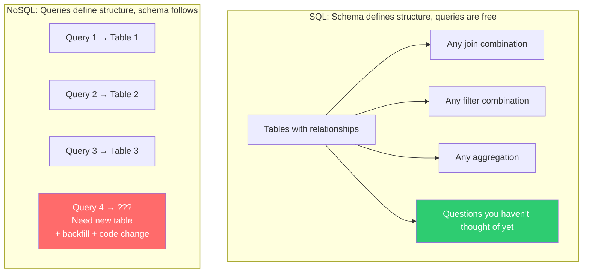
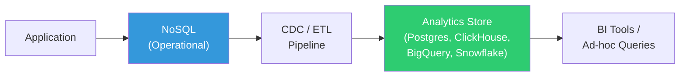
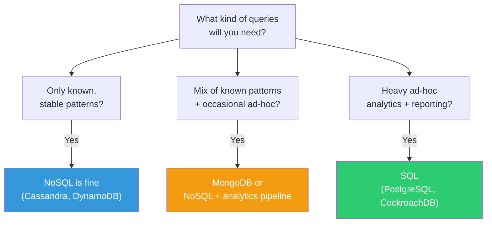

# Query Regret — When You Can't Answer the Question

---

## The Scenario

Your CEO walks in: "How many customers from California bought more than $500 worth of electronics in Q3, who also had a support ticket in the same period?"

In SQL:
```sql
SELECT COUNT(DISTINCT c.id)
FROM customers c
JOIN orders o ON o.customer_id = c.id
JOIN order_items oi ON oi.order_id = o.id
JOIN support_tickets t ON t.customer_id = c.id
WHERE c.state = 'CA'
  AND o.total > 500
  AND oi.category = 'electronics'
  AND o.created_at BETWEEN '2024-07-01' AND '2024-09-30'
  AND t.created_at BETWEEN '2024-07-01' AND '2024-09-30';

-- Time: 3 seconds. Done.
```

In your Cassandra/MongoDB setup:
```
"I... can't query that without a new table."
"Let me write a MapReduce job."
"I'll have the answer by Thursday."
```

This is **query regret**: the realization that you traded query flexibility for write performance, and now you can't answer questions you didn't anticipate.

---

## Why NoSQL Can't Answer Ad-Hoc Questions



### The Fundamental Tradeoff

| Dimension | SQL | NoSQL (Cassandra, Dynamo) |
|-----------|-----|--------------------------|
| Schema design based on | Data relationships | Known query patterns |
| New query on existing data | Usually free (add index at most) | May require new table + backfill |
| Join across entities | Built-in | Application-level or impossible |
| Aggregations | Built-in (GROUP BY, HAVING) | Limited or application-level |
| Ad-hoc analytics | Excellent | Poor to impossible |

---

## Real Scenarios of Query Regret

### Scenario 1: The Failed Dashboard

```
Requirements (month 1):
  - Show orders by customer ✅ (orders_by_customer table)
  - Show orders by date ✅ (orders_by_date table)

New requirements (month 8):
  - Show orders by product AND date range AND region
  - Show average order value by category per month
  - Show customer cohort retention by signup month

None of these map to existing tables.
```

### Scenario 2: The Compliance Audit

```
Auditor: "Show me all transactions over $10K in the last year,
          grouped by customer, with the associated IP addresses."

Your Cassandra tables:
  - transactions_by_customer (no IP address stored)
  - transactions_by_date (no customer grouping possible - partition key is date)
  - No way to filter by amount without full table scan

Options:
  A) Export to Spark, run the query there (2 days)
  B) Add a new table, backfill 500M rows (1 week)
  C) Tell the auditor you can't do it (bad)
```

### Scenario 3: The Business Pivot

```
Original product: Food delivery
  Tables optimized for: orders by restaurant, orders by driver, orders by customer

Pivot: Add grocery delivery with different data patterns
  Need: inventory queries, bundle searches, substitution lookups,
        route optimization joins, price comparison across stores

None of the existing tables support these patterns.
Must design and build 10+ new tables from scratch.
```

---

## MongoDB Is Better Here (But Not Perfect)

MongoDB has more query flexibility than Cassandra/DynamoDB:

```javascript
// MongoDB CAN do ad-hoc queries (with caveats)
db.orders.aggregate([
    { $match: {
        "customer.state": "CA",
        total: { $gt: 500 },
        createdAt: { $gte: ISODate("2024-07-01"), $lt: ISODate("2024-10-01") }
    }},
    { $lookup: {
        from: "supportTickets",
        localField: "customerId",
        foreignField: "customerId",
        pipeline: [
            { $match: {
                createdAt: { $gte: ISODate("2024-07-01"), $lt: ISODate("2024-10-01") }
            }}
        ],
        as: "tickets"
    }},
    { $match: { "tickets.0": { $exists: true } }},
    { $group: { _id: null, count: { $sum: 1 } }}
]);
```

**But it's still slower than SQL** for multi-collection joins because:
- `$lookup` is a nested loop join (no hash joins, no merge joins)
- Each lookup can only use one index
- Large intermediate result sets blow up memory
- No query optimizer choosing between join strategies

---

## Solutions (All Involve Accepting the Tradeoff)

### Solution 1: Analytics Pipeline

Keep NoSQL for operational data, export to an analytics store for ad-hoc queries:



```typescript
// Change stream → analytics pipeline
const changeStream = db.collection('orders').watch();

changeStream.on('change', async (change) => {
    if (change.operationType === 'insert' || change.operationType === 'update') {
        const doc = change.fullDocument;

        // Transform to analytics-friendly format
        await analyticsDB.query(`
            INSERT INTO orders_analytics (
                order_id, customer_id, customer_state, total,
                category, created_at
            ) VALUES ($1, $2, $3, $4, $5, $6)
            ON CONFLICT (order_id) DO UPDATE SET
                total = EXCLUDED.total,
                category = EXCLUDED.category
        `, [doc._id, doc.customerId, doc.customer?.state,
            doc.total, doc.items?.[0]?.category, doc.createdAt]);
    }
});
```

**Cost**: Additional infrastructure, data freshness delay (seconds to minutes), data duplication.

**Benefit**: Unlimited ad-hoc queries in the analytics store.

### Solution 2: Polyglot Persistence

Use NoSQL for what it's good at, SQL for everything else:

```
User sessions → Redis (key-value, TTL, sub-ms latency)
Product catalog → PostgreSQL (relational, ad-hoc queries, ACID)
Activity feed → Cassandra (write-heavy, time-series, denormalized)
Search → Elasticsearch (full-text, faceted search)
Analytics → ClickHouse (columnar, fast aggregations)
```

**Cost**: Operational complexity (5 databases to maintain), data synchronization between systems.

**Benefit**: Each database does what it's best at.

### Solution 3: Accept Limitations Early

Design your NoSQL tables with known limitations documented:

```typescript
// Document what your schema CAN'T answer
interface SchemaLimitations {
    table: string;
    supportedQueries: string[];
    impossibleWithoutNewTable: string[];
    possibleButSlow: string[];
}

const limitations: SchemaLimitations[] = [
    {
        table: 'orders_by_customer',
        supportedQueries: [
            'All orders for customer X',
            'Orders for customer X in date range',
        ],
        impossibleWithoutNewTable: [
            'All orders across customers filtered by product',
            'Orders grouped by region',
            'Cross-customer analytics',
        ],
        possibleButSlow: [
            'Full table scan for total revenue',
        ],
    },
];
```

This forces the conversation upfront: "If we pick Cassandra, we'll need a separate analytics system for questions like these."

---

## The Decision Matrix



---

## The Lesson

The most expensive query is the one you can't run. Before choosing a database, make a list of every question your business might ask — including the ones that seem unlikely today. If you can't answer them with your chosen database, make sure you have a plan for when they're asked.

Because they will be asked.

---

## Next

→ [04-rebuilding-sql-in-application-code.md](./04-rebuilding-sql-in-application-code.md) — When your application starts reimplementing joins, transactions, and foreign keys in code.
