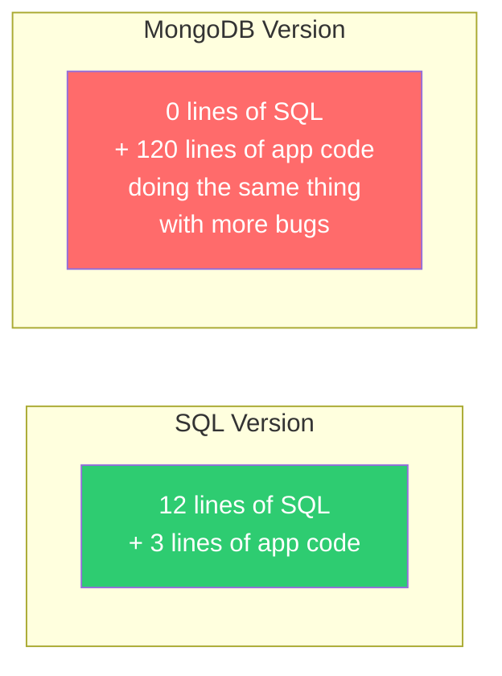
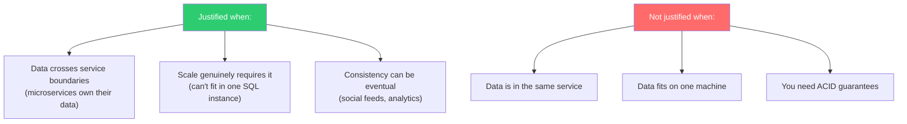

# Rebuilding SQL in Application Code — The Worst Outcome

---

## The Anti-Pattern

You chose NoSQL to avoid SQL's "complexity." Then, over 18 months, your application code grew to include:

- **Application-level joins** (multiple queries stitched together)
- **Manual referential integrity** (checking if referenced documents exist)
- **Application-level transactions** (saga pattern for multi-document updates)
- **Schema validation** (checking field types and required fields in code)
- **Uniqueness enforcement** (checking for duplicates before inserting)
- **Consistency reconciliation** (cron jobs finding and fixing data drift)

Congratulations: you've built a relational database. A worse one.

---

## Example: The Order System

### What The SQL Version Looks Like

```sql
CREATE TABLE customers (
    id UUID PRIMARY KEY,
    name VARCHAR(100) NOT NULL,
    email VARCHAR(255) UNIQUE NOT NULL,
    balance DECIMAL(10,2) DEFAULT 0 CHECK (balance >= 0)
);

CREATE TABLE orders (
    id UUID PRIMARY KEY,
    customer_id UUID NOT NULL REFERENCES customers(id),
    status VARCHAR(20) NOT NULL DEFAULT 'pending',
    total DECIMAL(10,2) NOT NULL CHECK (total > 0),
    created_at TIMESTAMP DEFAULT NOW()
);

-- Place an order: one transaction, database handles everything
BEGIN;
    UPDATE customers SET balance = balance - 99.99 WHERE id = $1 AND balance >= 99.99;
    INSERT INTO orders (id, customer_id, status, total) VALUES ($2, $1, 'confirmed', 99.99);
COMMIT;
-- If anything fails: automatic rollback. Data is always consistent.
```

### What The MongoDB Version Becomes

```typescript
// After 18 months of "we don't need SQL"

class OrderService {
    // Manual referential integrity check
    async createOrder(customerId: string, items: Item[]): Promise<Order> {
        // Step 1: Check customer exists (SQL does this with REFERENCES)
        const customer = await this.customerCol.findOne({ _id: customerId });
        if (!customer) {
            throw new Error('Customer not found');
        }

        // Step 2: Calculate total
        const total = items.reduce((sum, item) => sum + item.price * item.qty, 0);

        // Step 3: Check balance (SQL does this with CHECK constraint)
        if (customer.balance < total) {
            throw new Error('Insufficient balance');
        }

        // Step 4: Start a session for multi-document transaction
        // (Added in MongoDB 4.0, requires replica set)
        const session = this.client.startSession();
        try {
            session.startTransaction();

            // Step 5: Deduct balance with optimistic concurrency
            const updateResult = await this.customerCol.updateOne(
                { _id: customerId, balance: { $gte: total } },  // race condition guard
                { $inc: { balance: -total } },
                { session }
            );

            if (updateResult.modifiedCount === 0) {
                throw new Error('Balance changed concurrently');
            }

            // Step 6: Create order
            const order: Order = {
                _id: new ObjectId().toString(),
                customerId,
                items,
                total,
                status: 'confirmed',
                createdAt: new Date(),
            };
            await this.orderCol.insertOne(order, { session });

            // Step 7: Update denormalized customer order count
            await this.customerCol.updateOne(
                { _id: customerId },
                { $inc: { orderCount: 1 }, $set: { lastOrderDate: new Date() } },
                { session }
            );

            await session.commitTransaction();
            return order;
        } catch (err) {
            await session.abortTransaction();
            throw err;
        } finally {
            session.endSession();
        }
    }

    // Manual uniqueness enforcement (SQL does this with UNIQUE constraint)
    async createCustomer(email: string, name: string): Promise<Customer> {
        // Check for existing email
        const existing = await this.customerCol.findOne({ email });
        if (existing) {
            throw new Error('Email already exists');
        }
        // Race condition: another request could insert between findOne and insertOne
        // Need unique index to truly enforce this
        try {
            return await this.customerCol.insertOne({ email, name, balance: 0 });
        } catch (err: any) {
            if (err.code === 11000) {
                throw new Error('Email already exists');
            }
            throw err;
        }
    }

    // Manual schema validation (SQL does this with column types)
    private validateOrder(order: any): order is Order {
        if (typeof order.total !== 'number' || order.total <= 0) return false;
        if (!Array.isArray(order.items) || order.items.length === 0) return false;
        if (!order.customerId || typeof order.customerId !== 'string') return false;
        // 20 more lines of validation...
        return true;
    }

    // Manual join (SQL does this with JOIN)
    async getOrderWithCustomer(orderId: string): Promise<OrderWithCustomer> {
        const order = await this.orderCol.findOne({ _id: orderId });
        if (!order) throw new Error('Order not found');

        const customer = await this.customerCol.findOne({ _id: order.customerId });
        if (!customer) {
            // Orphaned order — customer was deleted without cleanup
            // This never happens with SQL foreign keys
            throw new Error('Customer not found for order');
        }

        return { ...order, customer };
    }

    // Manual cascading delete (SQL does this with ON DELETE CASCADE)
    async deleteCustomer(customerId: string): Promise<void> {
        const session = this.client.startSession();
        try {
            session.startTransaction();
            await this.orderCol.deleteMany({ customerId }, { session });
            await this.customerCol.deleteOne({ _id: customerId }, { session });
            // Also need to clean up:
            // - reviews by this customer
            // - cart items
            // - wishlist
            // - notification preferences
            // - address book entries
            // Miss one? Orphaned data forever.
            await session.commitTransaction();
        } catch (err) {
            await session.abortTransaction();
            throw err;
        } finally {
            session.endSession();
        }
    }
}
```

---

## Count the Lines



| Feature | SQL Implementation | NoSQL (Application) Implementation |
|---------|-------------------|-----------------------------------|
| Foreign key | `REFERENCES` keyword | Application-level check + orphan cleanup |
| Uniqueness | `UNIQUE` constraint | Unique index + application check + race handling |
| Check constraint | `CHECK (balance >= 0)` | Application-level validation |
| Transaction | `BEGIN; ... COMMIT;` | Session + startTransaction + error handling |
| Join | `JOIN orders ON ...` | Two queries + application merge |
| Cascade delete | `ON DELETE CASCADE` | Manual multi-collection delete in transaction |
| Schema validation | Column types | Runtime type checking in application |
| Default values | `DEFAULT NOW()` | Application-level defaults |

Every row is code **you** have to write, test, debug, and maintain.

---

## The Go Version Is Equally Painful

```go
// Manual referential integrity + transaction in Go
func (s *OrderService) CreateOrder(ctx context.Context, customerID string, items []Item) (*Order, error) {
	// Manual check: does customer exist?
	var customer Customer
	err := s.customerCol.FindOne(ctx, bson.M{"_id": customerID}).Decode(&customer)
	if err != nil {
		if err == mongo.ErrNoDocuments {
			return nil, fmt.Errorf("customer %s not found", customerID)
		}
		return nil, err
	}

	// Manual check: sufficient balance?
	total := calculateTotal(items)
	if customer.Balance < total {
		return nil, fmt.Errorf("insufficient balance: have %.2f, need %.2f", customer.Balance, total)
	}

	// Manual transaction
	session, err := s.client.StartSession()
	if err != nil {
		return nil, err
	}
	defer session.EndSession(ctx)

	var order *Order
	_, err = session.WithTransaction(ctx, func(sessCtx mongo.SessionContext) (interface{}, error) {
		// Optimistic concurrency control (manual)
		result, err := s.customerCol.UpdateOne(sessCtx,
			bson.M{"_id": customerID, "balance": bson.M{"$gte": total}},
			bson.M{"$inc": bson.M{"balance": -total}},
		)
		if err != nil {
			return nil, err
		}
		if result.ModifiedCount == 0 {
			return nil, fmt.Errorf("balance changed concurrently")
		}

		order = &Order{
			ID:         primitive.NewObjectID().Hex(),
			CustomerID: customerID,
			Items:      items,
			Total:      total,
			Status:     "confirmed",
			CreatedAt:  time.Now(),
		}

		_, err = s.orderCol.InsertOne(sessCtx, order)
		return nil, err
	})

	return order, err
}
```

---

## Warning Signs You're Rebuilding SQL

```
Score yourself (1 point each):

□ You have a "validateDocument" function for every collection
□ You wrote a "joinCollections" utility function
□ You have cron jobs that "reconcile" data between collections
□ Your error handling includes "orphaned document" cleanup
□ You use multi-document transactions for most write operations
□ You have application-level "cascade delete" logic
□ Your code checks for existence before every reference
□ You built a "migration" system for schema changes
□ You have a "uniqueness check" before inserts (beyond unique index)
□ You maintain a "relationships" config file mapping collection references

Score:
0-2: Normal NoSQL usage
3-5: Creeping relational patterns
6-8: You're building a database in your application
9-10: Just use PostgreSQL
```

---

## When It's Justified

Sometimes application-level data management is the right call:



In microservices, each service owns its data store. Cross-service "joins" happen at the application level regardless of database choice. That's fine — it's an architectural decision, not a database limitation.

But if your **single service** is doing application-level joins across its own collections, you've chosen the wrong database for that service.

---

## The Escape Hatch

If you recognize yourself in this chapter, options:

1. **Migrate to SQL**: Painful now, saves years of maintenance
2. **Use MongoDB transactions fully**: If you're already using sessions, lean into it (though performance suffers at scale)
3. **Adopt CockroachDB or YugabyteDB**: Distributed SQL — relational semantics at NoSQL scale
4. **Accept and document**: If migration isn't feasible, at least document every piece of "manual SQL" in your codebase so new developers understand why

---

## Next

→ [../08-choosing-the-right-database/01-access-patterns-first.md](../08-choosing-the-right-database/01-access-patterns-first.md) — How to actually choose a database: start with access patterns, not brand names.
