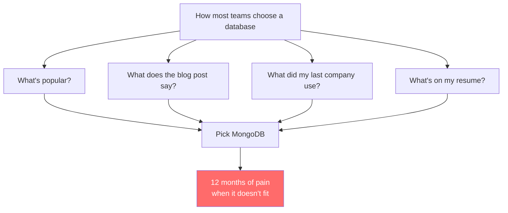
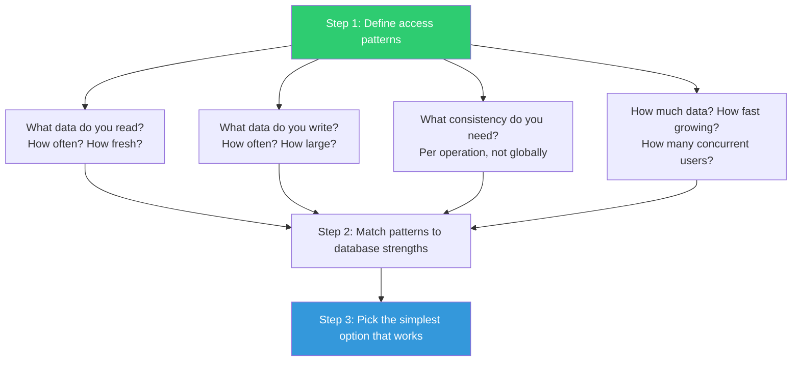
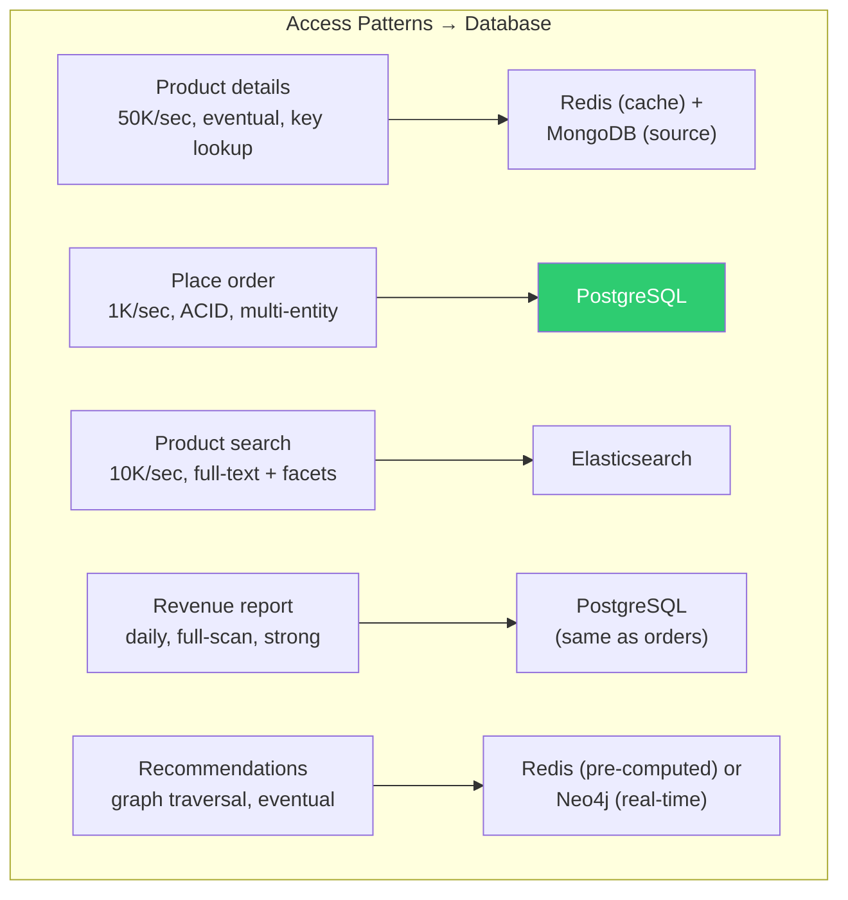

# Access Patterns First — How to Actually Choose a Database

---

## The Wrong Way



## The Right Way

Start with **what your application does**, not what database is trending.



---

## Step 1: Write Down Your Access Patterns

Before evaluating any database, fill out this table:

```typescript
interface AccessPattern {
    name: string;                        // "Get user profile"
    type: 'read' | 'write' | 'update' | 'delete' | 'aggregate';
    frequency: 'rare' | 'occasional' | 'frequent' | 'constant';  // per-second rate
    latencyRequirement: 'sub-ms' | 'low-ms' | 'seconds' | 'minutes';
    consistencyRequirement: 'eventual' | 'read-your-writes' | 'strong';
    dataShape: 'single-entity' | 'join-required' | 'aggregation' | 'graph-traversal';
    filters: string[];                   // What fields do you filter/sort by?
    resultSize: 'single' | 'small-list' | 'large-list' | 'full-scan';
}

// Example: E-commerce application
const patterns: AccessPattern[] = [
    {
        name: "Get product details",
        type: 'read',
        frequency: 'constant',            // 50K/sec
        latencyRequirement: 'low-ms',      // < 5ms
        consistencyRequirement: 'eventual', // stale by 30 seconds is OK
        dataShape: 'single-entity',
        filters: ['productId'],
        resultSize: 'single',
    },
    {
        name: "Place order",
        type: 'write',
        frequency: 'frequent',            // 1K/sec
        latencyRequirement: 'low-ms',      // < 50ms
        consistencyRequirement: 'strong',   // must not double-charge
        dataShape: 'join-required',         // customer + inventory + order
        filters: [],
        resultSize: 'single',
    },
    {
        name: "Search products",
        type: 'read',
        frequency: 'frequent',            // 10K/sec
        latencyRequirement: 'low-ms',      // < 100ms
        consistencyRequirement: 'eventual', // search index can lag
        dataShape: 'aggregation',           // full-text + facets
        filters: ['text', 'category', 'priceRange', 'rating'],
        resultSize: 'small-list',           // paginated top 20
    },
    {
        name: "Monthly revenue report",
        type: 'aggregate',
        frequency: 'rare',                // once/day
        latencyRequirement: 'minutes',     // batch job
        consistencyRequirement: 'strong',   // financial accuracy
        dataShape: 'aggregation',
        filters: ['dateRange', 'region'],
        resultSize: 'full-scan',
    },
    {
        name: "Recommendation: similar products",
        type: 'read',
        frequency: 'frequent',
        latencyRequirement: 'low-ms',
        consistencyRequirement: 'eventual',
        dataShape: 'graph-traversal',      // users who bought X also bought Y
        filters: ['productId', 'category'],
        resultSize: 'small-list',
    },
];
```

---

## Step 2: Map Patterns to Database Strengths

| Access Pattern | Best Fit | Why |
|---------------|----------|-----|
| Single-entity lookup by key | Any (Redis fastest) | Every database does this well |
| Single-entity with flexible schema | MongoDB, DynamoDB | Document model natural for varied shapes |
| Multi-entity transactions | PostgreSQL, CockroachDB | ACID transactions built-in |
| Write-heavy append (events, logs) | Cassandra, Kafka, InfluxDB | LSM-tree optimized for sequential writes |
| Time-series with TTL | InfluxDB, TimescaleDB, Cassandra (TWCS) | Built-in expiration, downsampling |
| Full-text search with facets | Elasticsearch, Typesense | Inverted indexes, relevance scoring |
| Graph traversal (N-hop) | Neo4j, Neptune | Index-free adjacency |
| Ad-hoc analytics + reporting | PostgreSQL, ClickHouse, BigQuery | SQL query flexibility, columnar scans |
| Session/cache (TTL, sub-ms) | Redis, Memcached | In-memory, eviction policies |
| Large binary/media storage | S3, GCS (not a database!) | Object storage, CDN integration |

---

## Step 3: The E-Commerce Example Resolved

Given our 5 access patterns:



Final architecture:
```
PostgreSQL:     Orders, customers, inventory, financial data (ACID)
MongoDB:        Product catalog (flexible schema, embedded variants)
Redis:          Product cache, session store, pre-computed recommendations
Elasticsearch:  Product search (fed by MongoDB change stream)
```

This is polyglot persistence. Four databases sounds complex, but each does what it's best at. The alternative — forcing everything into one database — leads to the problems in Phase 7.

---

## The "Just Use Postgres" Threshold

Before going polyglot, check if PostgreSQL handles everything:

```
Can a single PostgreSQL instance (or read replicas) handle:
  ✅ Product details (JSONB columns + GIN indexes)
  ✅ Place order (ACID transactions, native)
  ✅ Product search (pg_trgm + full-text search, OR Elasticsearch for better UX)
  ✅ Revenue report (SQL aggregations, native)
  ⚠️ Recommendations (recursive CTEs work for simple cases)
  
  Performance:
  ✅ 50K reads/sec with connection pooling (PgBouncer)
  ✅ 1K writes/sec (easily)
  ⚠️ Sub-ms latency requires caching layer
  
  Scale:
  ✅ Up to ~1TB before you need sharding
  ✅ Read replicas for read scaling
  ❌ Write scaling beyond single node (need Citus or CockroachDB)
```

**If your total data is under 1TB and writes are under 5K/sec: just use PostgreSQL.** Add Redis for caching. Add Elasticsearch only if you need advanced search.

---

## Decision Template

```go
// Use this to document your database choice

type DatabaseDecision struct {
	Service        string
	ChosenDB       string
	Reason         string
	AccessPatterns []string
	Alternatives   []Alternative
	Risks          []string
	ReviewDate     string // When to re-evaluate
}

type Alternative struct {
	Database   string
	WhyNot     string
}

// Example
var orderServiceDecision = DatabaseDecision{
	Service:  "Order Service",
	ChosenDB: "PostgreSQL 16",
	Reason:   "Multi-entity ACID transactions required. Data is relational. Volume < 5K writes/sec.",
	AccessPatterns: []string{
		"Create order (write, strong consistency, multi-table)",
		"Get order by ID (read, strong, single entity)",
		"List orders by customer (read, strong, filtered list)",
		"Update order status (write, strong, single entity)",
		"Monthly revenue aggregation (read, strong, full scan)",
	},
	Alternatives: []Alternative{
		{Database: "MongoDB", WhyNot: "Multi-document transactions needed frequently; would rebuild SQL in app code"},
		{Database: "DynamoDB", WhyNot: "Need ad-hoc queries for analytics; query flexibility too limited"},
		{Database: "Cassandra", WhyNot: "Strong consistency needed; data volume doesn't justify operational complexity"},
	},
	Risks: []string{
		"If write volume exceeds 10K/sec, need to evaluate CockroachDB or sharding",
		"If data exceeds 2TB, need partitioning strategy",
	},
	ReviewDate: "2025-06-01",
}
```

---

## Common Mistakes in Database Selection

| Mistake | Why It Happens | What to Do Instead |
|---------|---------------|-------------------|
| Picking DB before defining access patterns | Excitement about technology | Write access patterns first, then evaluate |
| One DB for everything | Simplicity appeal | Accept polyglot if patterns diverge significantly |
| Choosing for peak scale | "We'll have millions of users" | Choose for current scale + 10x headroom |
| Ignoring operational cost | Focus on features only | Factor in: who maintains it? Who debugs it at 3am? |
| Following the herd | "Everyone uses X" | Your access patterns are unique to your application |

---

## Next

→ [02-consistency-requirements-checklist.md](./02-consistency-requirements-checklist.md) — A systematic way to determine your actual consistency needs per operation.
