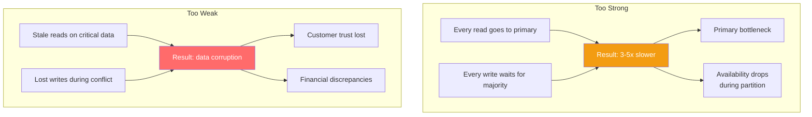

# Consistency Requirements Checklist — What Do You Actually Need?

---

## The Default Mistake

Most teams pick one consistency level for their entire database and never think about it again. This is wrong in both directions:

- **Too strong globally**: Everything uses ACID transactions → unnecessary latency, reduced availability
- **Too weak globally**: Everything is eventual → data corruption in critical paths

The right approach: **per-operation consistency requirements**.

---

## The Consistency Spectrum (Recap)


Each step up the spectrum costs:
- More latency (waiting for acknowledgments)
- Less availability (more nodes must respond)
- More coordination (consensus protocols)

---

## Per-Operation Consistency Analysis

For each operation in your system, ask three questions:

### Question 1: What happens if this data is stale by 5 seconds?

| Answer | Consistency Level |
|--------|------------------|
| Nobody notices | Eventual |
| Slightly annoying UX but no harm | Eventual + client retry |
| User sees incorrect state briefly | Read-your-writes |
| Business logic breaks | Strong (causal or sequential) |
| Money is lost or safety is compromised | Linearizable |

### Question 2: What happens if two concurrent writes conflict?

| Answer | Resolution Strategy |
|--------|-------------------|
| Last write wins (fine) | LWW → Eventual |
| Application can merge | CRDTs or custom merge → Eventual |
| One write must win deterministically | Strong consistency required |
| Both writes must be preserved | Version vectors + sibling resolution |
| Conflict must not happen | Linearizable |

### Question 3: What happens during a network partition?

| Answer | CAP Choice |
|--------|-----------|
| Serve stale data, stay available | AP (eventual) |
| Reject writes, maintain accuracy | CP (strong) |
| Different answers for different operations | Hybrid |

---

## Worked Example: Social Media Platform

```typescript
interface ConsistencyRequirement {
    operation: string;
    consistency: 'eventual' | 'read-your-writes' | 'causal' | 'strong' | 'linearizable';
    reasoning: string;
    stalenessTolerance: string;
    conflictStrategy: string;
}

const requirements: ConsistencyRequirement[] = [
    {
        operation: "View timeline/feed",
        consistency: 'eventual',
        reasoning: "Missing a post for 5 seconds is invisible. Users refresh constantly.",
        stalenessTolerance: "30 seconds",
        conflictStrategy: "N/A (read-only)",
    },
    {
        operation: "Post a new message",
        consistency: 'read-your-writes',
        reasoning: "After posting, the author must see their own post immediately. Others can wait.",
        stalenessTolerance: "0 for author, 10 seconds for others",
        conflictStrategy: "Append-only, no conflict possible",
    },
    {
        operation: "Like / react to a post",
        consistency: 'eventual',
        reasoning: "Like count being off by 1-2 for a few seconds doesn't matter.",
        stalenessTolerance: "60 seconds",
        conflictStrategy: "Distributed counter (CRDT)",
    },
    {
        operation: "Send direct message",
        consistency: 'causal',
        reasoning: "Messages must appear in order. Reply must appear after the message it replies to.",
        stalenessTolerance: "0 (ordering matters)",
        conflictStrategy: "Causal ordering via Lamport timestamps",
    },
    {
        operation: "Update profile (username)",
        consistency: 'strong',
        reasoning: "Username must be unique. Two users claiming same username = conflict.",
        stalenessTolerance: "0",
        conflictStrategy: "Linearizable uniqueness check",
    },
    {
        operation: "Process payment (premium subscription)",
        consistency: 'linearizable',
        reasoning: "Double-charge or missed charge = financial and trust damage.",
        stalenessTolerance: "0",
        conflictStrategy: "Must not happen — serialize all payment operations",
    },
    {
        operation: "View follower count",
        consistency: 'eventual',
        reasoning: "1,234,567 vs 1,234,569 — nobody cares.",
        stalenessTolerance: "5 minutes",
        conflictStrategy: "Distributed counter",
    },
    {
        operation: "Block a user",
        consistency: 'strong',
        reasoning: "Blocked user must be immediately unable to message you. Delay = harassment.",
        stalenessTolerance: "0",
        conflictStrategy: "Synchronous write + cache invalidation",
    },
];
```

---

## Mapping to Database Configuration

### MongoDB

```typescript
import { MongoClient, ReadPreference, WriteConcern, ReadConcern } from 'mongodb';

// Per-operation consistency in MongoDB
const client = new MongoClient(uri);
const db = client.db('socialMedia');

// Eventual: read from secondary, acknowledge write on primary only
async function viewTimeline(userId: string) {
    return db.collection('feeds')
        .find({ userId })
        .sort({ timestamp: -1 })
        .limit(50)
        .withReadPreference(ReadPreference.SECONDARY_PREFERRED)
        .withReadConcern({ level: 'local' })
        .toArray();
}

// Read-your-writes: read from primary after writing
async function createPost(userId: string, content: string) {
    await db.collection('posts').insertOne(
        { userId, content, timestamp: new Date() },
        { writeConcern: { w: 'majority' } }
    );
    // Immediately read from primary
    return db.collection('posts')
        .find({ userId })
        .sort({ timestamp: -1 })
        .limit(1)
        .withReadPreference(ReadPreference.PRIMARY)
        .withReadConcern({ level: 'majority' })
        .toArray();
}

// Linearizable: strongest guarantee (slow)
async function updateUsername(userId: string, newUsername: string) {
    const session = client.startSession();
    try {
        session.startTransaction({
            readConcern: { level: 'snapshot' },
            writeConcern: { w: 'majority' },
        });

        // Check uniqueness under transaction
        const existing = await db.collection('users')
            .findOne({ username: newUsername }, { session });
        if (existing) throw new Error('Username taken');

        await db.collection('users').updateOne(
            { _id: userId },
            { $set: { username: newUsername } },
            { session }
        );

        await session.commitTransaction();
    } finally {
        session.endSession();
    }
}
```

### Cassandra

```go
// Per-operation consistency in Cassandra (Go)
package main

import "github.com/gocql/gocql"

func viewTimeline(session *gocql.Session, userID string) ([]Post, error) {
	// Eventual: CL=ONE, read from nearest node
	query := session.Query(
		"SELECT * FROM feed WHERE user_id = ? ORDER BY timestamp DESC LIMIT 50",
		userID,
	).Consistency(gocql.One)

	// ...
	return posts, nil
}

func createPost(session *gocql.Session, userID, content string) error {
	// Read-your-writes: CL=QUORUM for both write and subsequent read
	return session.Query(
		"INSERT INTO posts (user_id, post_id, content, timestamp) VALUES (?, ?, ?, ?)",
		userID, gocql.TimeUUID(), content, time.Now(),
	).Consistency(gocql.Quorum).Exec()
}

func processPayment(session *gocql.Session, userID string, amount float64) error {
	// Linearizable: Use Paxos (SERIAL consistency) via LWT
	applied, err := session.Query(
		`UPDATE subscriptions SET status = 'active', paid_until = ?
		 WHERE user_id = ? IF status = 'pending'`,
		time.Now().AddDate(0, 1, 0), userID,
	).Consistency(gocql.Serial).ScanCAS()

	if !applied {
		return fmt.Errorf("payment already processed or status changed")
	}
	return err
}
```

---

## The Consistency Decision Table

Use this for every system you design:

| Operation | Staleness OK? | Conflict Strategy | CAP Choice | DB Config |
|-----------|--------------|------------------|------------|-----------|
| _example: View feed_ | _30 sec_ | _N/A_ | _AP_ | _CL=ONE / secondary read_ |
| | | | | |
| | | | | |
| | | | | |

Fill this out **before** choosing a database. If most operations need strong consistency and transactions, PostgreSQL is probably right. If most tolerate eventual consistency, NoSQL shines.

---

## Cost of Getting It Wrong



**Too strong is expensive. Too weak is dangerous. Per-operation is correct.**

---

## Quick Reference: Common Operations and Their Consistency Needs

| Domain | Operation | Typical Consistency |
|--------|-----------|-------------------|
| Auth | Login / verify password | Strong |
| Auth | Session check | Read-your-writes |
| E-commerce | Browse products | Eventual |
| E-commerce | Add to cart | Read-your-writes |
| E-commerce | Place order / payment | Linearizable |
| E-commerce | View order status | Read-your-writes |
| Social | View feed | Eventual |
| Social | Post content | Read-your-writes |
| Social | Like / react | Eventual |
| Social | Direct message | Causal |
| Social | Block user | Strong |
| Finance | Account balance | Linearizable |
| Finance | Transfer money | Linearizable |
| Finance | View transaction history | Strong |
| IoT | Ingest sensor reading | Eventual |
| IoT | Alert on threshold | Strong |
| Gaming | Leaderboard position | Eventual |
| Gaming | In-game purchase | Linearizable |

---

## Next

→ [03-decision-framework.md](./03-decision-framework.md) — The complete database decision framework: a systematic process from requirements to final choice.
