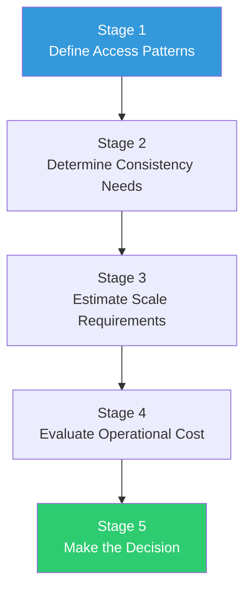
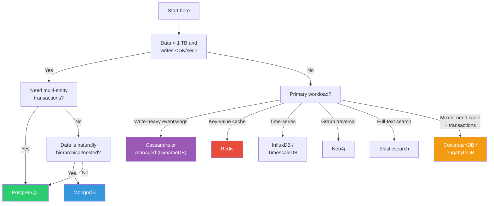
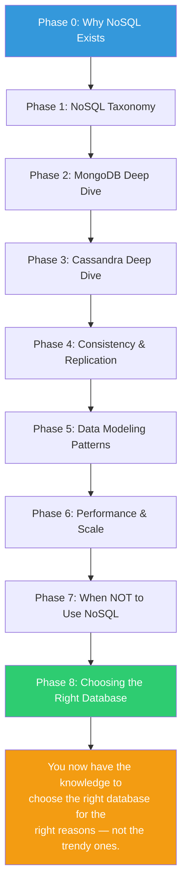

# The Decision Framework — Choosing Your Database Systematically

---

## Why You Need a Framework

Database selection is usually driven by opinion, trend, or familiarity. This chapter gives you a systematic, repeatable process that produces a defensible choice.

The framework has 5 stages:



---

## Stage 1: Access Patterns (Covered in [01](./01-access-patterns-first.md))

Output: A table of every read, write, and query your application performs, with frequency and latency requirements.

---

## Stage 2: Consistency Requirements (Covered in [02](./02-consistency-requirements-checklist.md))

Output: Per-operation consistency level (eventual → linearizable) and conflict resolution strategy.

---

## Stage 3: Scale Requirements

Be honest here. Overestimating leads to premature complexity. Underestimating leads to painful migration.

```typescript
interface ScaleRequirements {
    // Data volume
    currentDataSize: string;         // "5 GB"
    projectedDataSize12Months: string; // "50 GB"  
    projectedDataSize36Months: string; // "500 GB"
    growthPattern: 'linear' | 'exponential' | 'plateau';
    
    // Throughput
    readsPerSecond: { current: number; projected: number };     // { 500, 5000 }
    writesPerSecond: { current: number; projected: number };    // { 100, 1000 }
    readWriteRatio: string;          // "5:1"
    
    // Concurrency
    concurrentConnections: number;    // 200
    burstMultiplier: number;          // 3x during peak
    
    // Geography
    regions: string[];                // ["us-east-1"]
    latencyRequirement: string;       // "< 50ms from any region"
    
    // Availability
    uptimeRequirement: string;        // "99.9%"
    acceptableDowntimePerMonth: string; // "43 minutes"
    rpoRto: { rpo: string; rto: string }; // { "1 minute", "5 minutes" }
}
```

### Scale Thresholds

| Metric | Single PostgreSQL | PostgreSQL + Read Replicas | NoSQL (Distributed) |
|--------|-------------------|--------------------------|-------------------|
| Data size | < 1 TB | < 5 TB | Unlimited |
| Write throughput | < 10K/sec | < 10K/sec (single primary) | 100K+/sec |
| Read throughput | < 50K/sec | < 200K/sec | 1M+/sec |
| Regions | 1 (with failover) | 2-3 (read replicas) | Any number |
| Availability | 99.9% | 99.95% | 99.99% |

**If your 36-month projection fits in "Single PostgreSQL" — use PostgreSQL.** Seriously.

---

## Stage 4: Operational Cost

The most overlooked factor. A database that's technically perfect but impossible to operate is the wrong choice.

### The Real Cost Formula

```
Total Cost = Licensing + Infrastructure + Engineering Time + Risk

Where:
  Licensing:      Free (open source) to $$$$$ (enterprise)
  Infrastructure: Servers + storage + network + managed service fees
  Engineering:    Time to operate, debug, upgrade, scale
  Risk:           Cost of outages, data loss, migration if wrong choice
```

### Operational Complexity by Database

| Database | Learning Curve | Day 1 Difficulty | Day 365 Difficulty | Managed Service Available? |
|----------|---------------|------------------|-------------------|--------------------------|
| PostgreSQL | Low | Easy | Easy | Yes (RDS, Cloud SQL, Supabase) |
| MongoDB | Low | Easy | Medium | Yes (Atlas) |
| Redis | Low | Easy | Easy | Yes (ElastiCache, Upstash) |
| Cassandra | High | Hard | Very Hard | Yes (Astra, but still complex) |
| DynamoDB | Medium | Easy | Medium | Yes (it IS the managed service) |
| Elasticsearch | Medium | Medium | Hard | Yes (Elastic Cloud, OpenSearch) |
| CockroachDB | Low-Medium | Easy | Medium | Yes (CockroachDB Serverless) |
| Neo4j | Medium | Medium | Medium | Yes (AuraDB) |

### Team Capability

```
Questions to ask:
□ Has anyone on the team operated [database] in production?
□ Do you have on-call procedures for [database] specific failures?
□ Can you restore from backup in under 1 hour?
□ Can you diagnose and fix a performance degradation at 2am?
□ Do you know how to upgrade [database] with zero downtime?

If you answered "No" to 3+ of these: choose the managed service,
or choose a simpler database you CAN operate.
```

---

## Stage 5: The Decision Matrix

Score each candidate database on these dimensions (1-5):

```go
type DatabaseCandidate struct {
	Name             string
	AccessPatternFit int // 1-5: How well does it serve your access patterns?
	ConsistencyFit   int // 1-5: Does it offer the consistency levels you need?
	ScaleFit         int // 1-5: Can it handle your scale requirements?
	OperationalCost  int // 1-5: How hard is it to operate? (5 = easiest)
	TeamExperience   int // 1-5: Does your team know this database?
	EcosystemFit     int // 1-5: Drivers, tooling, community for your stack
}

func (c DatabaseCandidate) Score() float64 {
	// Weighted score — access patterns and operational cost matter most
	weights := map[string]float64{
		"accessPattern":   0.30,
		"consistency":     0.20,
		"scale":           0.15,
		"operationalCost": 0.20,
		"teamExperience":  0.10,
		"ecosystem":       0.05,
	}

	return float64(c.AccessPatternFit)*weights["accessPattern"] +
		float64(c.ConsistencyFit)*weights["consistency"] +
		float64(c.ScaleFit)*weights["scale"] +
		float64(c.OperationalCost)*weights["operationalCost"] +
		float64(c.TeamExperience)*weights["teamExperience"] +
		float64(c.EcosystemFit)*weights["ecosystem"]
}
```

### Example Evaluation: SaaS Application (B2B, Multi-Tenant)

```
Requirements:
  - Multi-tenant data (100 tenants, 10K-100K rows each)
  - Strong consistency for billing and user management
  - Flexible querying for analytics dashboards
  - Total data: ~50 GB now, ~500 GB in 2 years
  - Write volume: ~500/sec, Read volume: ~5,000/sec
  - Team: 4 backend engineers, all know PostgreSQL

| Candidate    | Access | Consistency | Scale | Ops  | Team | Eco | SCORE |
|-------------|--------|-------------|-------|------|------|-----|-------|
| PostgreSQL  | 5      | 5           | 4     | 5    | 5    | 5   | 4.85  |
| MongoDB     | 4      | 3           | 4     | 4    | 3    | 4   | 3.65  |
| CockroachDB | 5      | 5           | 5     | 3    | 2    | 3   | 4.00  |
| DynamoDB    | 2      | 3           | 5     | 4    | 2    | 3   | 3.00  |
| Cassandra   | 2      | 2           | 5     | 1    | 1    | 3   | 2.15  |

Winner: PostgreSQL (4.85)
Reason: Data fits on one server, team knows it, all access patterns supported,
        strong consistency native. CockroachDB is insurance for future scale
        but adds operational complexity the team doesn't need yet.
```

---

## Decision Flowchart: The Quick Version



---

## The Final Rules

### Rule 1: Start Simple
Pick the simplest database that meets your requirements. You can always add complexity later. You can never remove it.

### Rule 2: Optimize for the Common Case
Your top 3 access patterns by frequency should be excellent. Rare operations can be acceptable.

### Rule 3: Plan for Migration
No database choice is permanent. Design your application with a data access layer that can be swapped.

```typescript
// Abstract your data access
interface OrderRepository {
    create(order: Order): Promise<Order>;
    findById(id: string): Promise<Order | null>;
    findByCustomer(customerId: string, limit: number): Promise<Order[]>;
    updateStatus(id: string, status: OrderStatus): Promise<void>;
}

// Implementation is swappable
class MongoOrderRepository implements OrderRepository { /* ... */ }
class PostgresOrderRepository implements OrderRepository { /* ... */ }
class DynamoOrderRepository implements OrderRepository { /* ... */ }
```

### Rule 4: Revisit Annually
Your data grows. Your access patterns change. Your team changes. Re-evaluate your database choice once a year using this framework.

### Rule 5: Don't Fight the Database
If you find yourself writing application code to work around your database's limitations (rebuilding joins, enforcing consistency, managing transactions), you chose the wrong database. Switch, don't fight.

---

## The Complete Curriculum Map

You've covered the full NoSQL journey:



---

## What to Build Next

1. **Take a real project** and run it through the decision framework
2. **Build a small app** with MongoDB AND PostgreSQL, using the same schema — feel the difference
3. **Set up a Cassandra cluster** (Docker Compose, 3 nodes) and experience partition keys, consistency levels, and compaction firsthand
4. **Break things intentionally**: kill nodes, introduce network partitions, observe behavior
5. **Read the code** of your favorite database's driver — understand what `writeConcern: majority` actually does at the protocol level

The best database knowledge comes from building, breaking, and debugging. This curriculum gave you the map. Now go explore the territory.
