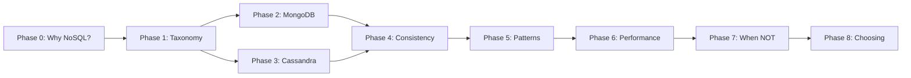

# Start Here — How to Use This Curriculum

---

## What This Is

This is a **deep, opinionated NoSQL curriculum** — not a product tutorial, not a syntax dump.

Every module is written as **narrative lecture notes**. You will:
- Understand the *tradeoffs* behind every NoSQL decision
- See *why* relational databases struggle at certain scales
- Learn to *model data* for how it will be read, not how it "looks"
- Know *when to walk away* from NoSQL entirely

---

## Prerequisites

You should already:
- Understand SQL deeply (JOINs, normalization, transactions, indexes, query plans)
- Have used MongoDB for basic CRUD (insert, find, update, delete)
- Be comfortable reading TypeScript and/or Go
- Understand basic distributed systems concepts (servers, replicas, latency)

You do NOT need to:
- Know Cassandra
- Have operated a database cluster in production
- Understand consensus algorithms
- Know the CAP theorem (we'll teach it properly)

---

## How to Navigate

### Go in order — the phases are sequential

Each phase represents a **shift in thinking**, not just new content.

- **Phase 0** resets your SQL instincts — you must do this first
- **Phase 1** builds your mental map of the NoSQL landscape
- **Phases 2–3** are deep dives (can be done in either order, but both are required)
- **Phase 4** is the uncomfortable middle — consistency and failure
- **Phases 5–6** are about patterns and production reality
- **Phase 7** is mandatory — it's the "when to say no" phase
- **Phase 8** ties it all together into decision-making

### Read the narratives

If a section starts with a story about a failing system — **read it**. The stories ARE the lesson. Skipping to the "answer" means you'll memorize without understanding.

### Question your SQL instincts

Throughout this curriculum, you'll find moments where your SQL training will scream "this is wrong!" — like denormalizing data, duplicating rows, or designing a table that only serves one query.

**That's the point.** NoSQL isn't wrong. It's making different tradeoffs. Your job is to understand *when* those tradeoffs are worth it.

---

## The One Rule

> **Every time you learn a NoSQL concept, ask yourself:**
> "What would I do in SQL? Why doesn't that work here? What am I giving up?"

If you can't answer all three, you haven't learned the concept yet.

---

## Time Estimate

| Phase | Focus | Hours |
|-------|-------|-------|
| 0 | Why NoSQL Exists | 4–5 |
| 1 | NoSQL Taxonomy | 4–5 |
| 2 | MongoDB Deep Dive | 12–15 |
| 3 | Cassandra Deep Dive | 10–12 |
| 4 | Consistency & Failure | 6–8 |
| 5 | Data Modeling Patterns | 6–8 |
| 6 | Performance & Scale | 5–6 |
| 7 | When NOT to Use NoSQL | 3–4 |
| 8 | Choosing the Right DB | 3–4 |
| **Total** | | **~55–65 hours** |

---

## What You'll Walk Away With

After completing this curriculum, you will:

1. **Stop treating NoSQL as "schema-less SQL"** — you'll understand it as a fundamentally different set of tradeoffs
2. **Model data for access patterns** — not for how entities relate
3. **Know when Cassandra is the wrong choice** — which is most of the time
4. **Understand consistency guarantees** — not as theory, but as operational reality
5. **Defend your database choice** — in design reviews and interviews
6. **Know when to use SQL** — and feel no shame about it

---

## A Warning

This curriculum will make you slightly paranoid about databases. That's healthy. The engineers who break production are the ones who trust their database without understanding what it promises.
