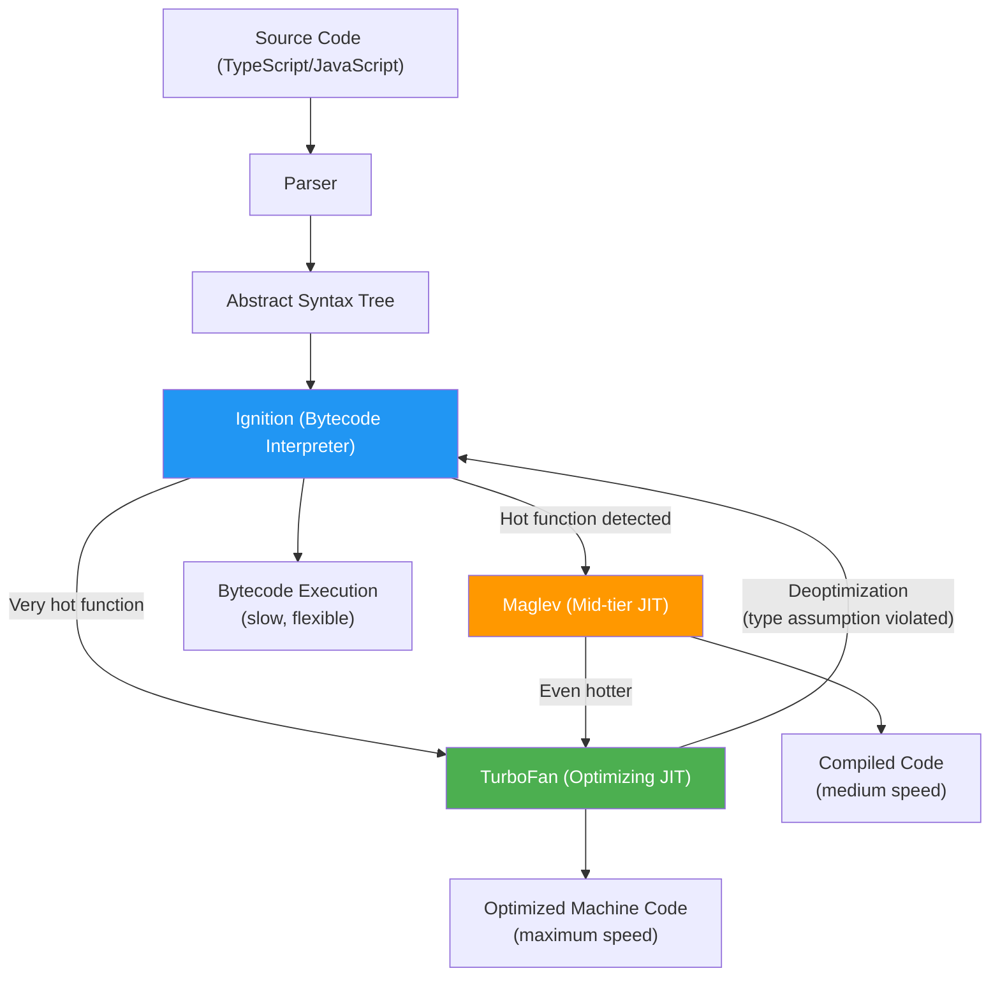
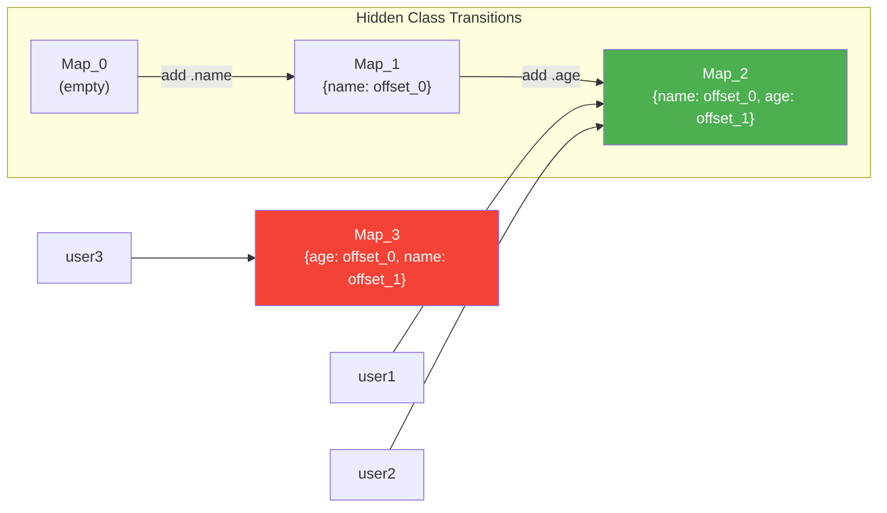
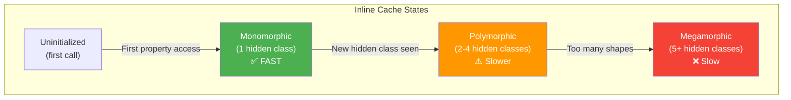

# Lesson 01 — V8 Engine Deep Dive

## Concept

V8 is Google's open-source JavaScript and WebAssembly engine, written in C++. It is the **heart** of Node.js — responsible for parsing your TypeScript/JavaScript, compiling it to machine code, executing it, and managing memory.

When you write `const x: number = 42;`, V8 is what turns that into actual CPU instructions on your processor. Understanding V8 is the difference between writing code that runs and writing code that runs **fast**.

## Why This Matters

Every performance characteristic of your Node.js application — from startup time to request latency to memory consumption — is fundamentally shaped by how V8 processes your code. When an interviewer asks "why is this function slow?", the answer often lies in V8's optimization pipeline.

---

## V8 Compilation Pipeline

V8 does **not** interpret JavaScript. It compiles it. Modern V8 uses a multi-tier compilation strategy:



### Tier 1 — Ignition (Bytecode Interpreter)

Ignition is a **register-based bytecode interpreter**. When your code first runs, V8:

1. **Parses** the source into an Abstract Syntax Tree (AST)
2. **Generates bytecode** — a compact, portable representation
3. **Interprets** the bytecode instruction by instruction

Bytecode execution is slow compared to native code, but it starts **instantly**. There's no compilation delay.

### Tier 2 — Maglev (Mid-tier JIT)

When V8 notices a function is called frequently ("warm"), it compiles it with Maglev:

- Faster than bytecode interpretation
- Less optimization overhead than TurboFan
- Good balance of compile time vs execution speed

### Tier 3 — TurboFan (Optimizing JIT Compiler)

When a function is "hot" (called many thousands of times), TurboFan kicks in:

- Full **speculative optimization** based on observed types
- Produces highly optimized machine code
- Can be **deoptimized** if type assumptions are violated

---

## Hidden Classes and Inline Caches

### Hidden Classes (Maps)

JavaScript objects are dictionaries — keys can be anything. This is terrible for performance. V8 solves this with **hidden classes** (internally called "Maps"):

```typescript
// V8 creates a hidden class for this shape
const user1 = { name: "Alice", age: 30 };
// user1's hidden class: Map{ name: offset_0, age: offset_1 }

// Same shape → same hidden class (FAST)
const user2 = { name: "Bob", age: 25 };

// Different property order → DIFFERENT hidden class (slower)
const user3 = { age: 25, name: "Charlie" };
```



**Production Impact**: Always initialize object properties in the same order. Inconsistent shapes cause V8 to create multiple hidden classes, defeating inline cache optimizations.

### Inline Caches (ICs)

When your code accesses `user.name`, V8 doesn't do a dictionary lookup every time. It uses **inline caches**:

```typescript
function getName(user: { name: string }): string {
  // First call: V8 does a full property lookup via hidden class
  // Subsequent calls: V8 caches the memory offset
  // → Direct memory read, no lookup needed
  return user.name;
}

// Monomorphic IC (ONE hidden class seen) — FASTEST
getName({ name: "Alice", age: 30 });
getName({ name: "Bob", age: 25 });

// Polymorphic IC (2-4 hidden classes) — slower
getName({ name: "Charlie", role: "admin" }); // different shape!

// Megamorphic IC (5+ hidden classes) — slowest, no caching
// V8 gives up and does dictionary lookup every time
```



---

## Deoptimization

TurboFan optimizes based on **assumptions** about your code. If those assumptions are violated at runtime, V8 **deoptimizes** — throwing away the compiled code and falling back to Ignition:

```typescript
// V8 optimizes this for number + number
function add(a: number, b: number): number {
  return a + b;
}

// Calling with consistent types → TurboFan optimizes
for (let i = 0; i < 100_000; i++) {
  add(i, i + 1); // Always numbers → optimized
}

// If you then called with strings (not possible with TS types, but
// imagine a JS caller or 'any' type):
// add("hello", "world") → DEOPTIMIZATION!
// TurboFan's optimized code is thrown away
// Falls back to Ignition bytecode
```

**This is why TypeScript helps performance** — consistent types mean fewer deoptimizations.

---

## Code Lab: Observing V8 Behavior

### Experiment 1: Tracing Optimizations

```typescript
// v8-trace-opt.ts
// Run with: node --trace-opt --trace-deopt v8-trace-opt.ts

function hotFunction(x: number): number {
  return x * x + x;
}

// Make it hot
for (let i = 0; i < 100_000; i++) {
  hotFunction(i);
}

console.log("Check terminal output for optimization traces");
```

```bash
node --trace-opt --trace-deopt v8-trace-opt.ts 2>&1 | grep -i "hotFunction"
```

You'll see output like:
```
[marking hotFunction for optimization to TurboFan]
[compiling method hotFunction using TurboFan]
[completed optimizing hotFunction]
```

### Experiment 2: Hidden Class Transitions

```typescript
// hidden-classes.ts
// Run with: node --allow-natives-syntax hidden-classes.ts

function createUser(name: string, age: number) {
  // Always same order → one hidden class
  return { name, age };
}

function createMessyUser(name: string, age: number, addRole: boolean) {
  const user: Record<string, unknown> = {};
  if (addRole) {
    user.role = "admin";  // Different hidden class path!
  }
  user.name = name;
  user.age = age;
  return user;
}

// Clean: all objects share one hidden class
const cleanUsers = Array.from({ length: 1000 }, (_, i) => 
  createUser(`User${i}`, 20 + (i % 50))
);

// Messy: objects have different hidden classes
const messyUsers = Array.from({ length: 1000 }, (_, i) =>
  createMessyUser(`User${i}`, 20 + (i % 50), i % 2 === 0)
);

// Benchmark property access
const t1 = performance.now();
let sum1 = 0;
for (let i = 0; i < 1_000_000; i++) {
  sum1 += (cleanUsers[i % 1000] as { age: number }).age;
}
const cleanTime = performance.now() - t1;

const t2 = performance.now();
let sum2 = 0;
for (let i = 0; i < 1_000_000; i++) {
  sum2 += messyUsers[i % 1000].age as number;
}
const messyTime = performance.now() - t2;

console.log(`Clean objects: ${cleanTime.toFixed(2)}ms`);
console.log(`Messy objects: ${messyTime.toFixed(2)}ms`);
console.log(`Messy is ${(messyTime / cleanTime).toFixed(1)}x slower`);
```

### Experiment 3: V8 Bytecode

```typescript
// bytecode.ts
// Run with: node --print-bytecode --print-bytecode-filter=greet bytecode.ts

function greet(name: string): string {
  return `Hello, ${name}!`;
}

greet("World");
```

```bash
node --print-bytecode --print-bytecode-filter=greet bytecode.ts
```

This shows you the actual Ignition bytecode V8 generates.

---

## Real-World Production Use Cases

### 1. Consistent Object Shapes in ORMs

When processing database results, ensure all objects have the same shape:

```typescript
// BAD: Different shapes depending on nullability
function mapRow(row: any) {
  const result: any = { id: row.id };
  if (row.email) result.email = row.email;  // Some have it, some don't
  if (row.name) result.name = row.name;
  return result;
}

// GOOD: Always same shape, use null for missing values
function mapRowFast(row: any) {
  return {
    id: row.id,
    email: row.email ?? null,
    name: row.name ?? null,
  };
}
```

### 2. Monomorphic Hot Paths

In request handlers, keep your hot path monomorphic:

```typescript
// API handler processing thousands of requests per second
interface RequestContext {
  userId: string;
  method: string;
  path: string;
  timestamp: number;
}

// Always create with the same shape
function createContext(req: IncomingMessage): RequestContext {
  return {
    userId: extractUserId(req),
    method: req.method!,
    path: req.url!,
    timestamp: Date.now(),
  };
}
```

---

## Interview Questions

### Q1: "How does V8 execute JavaScript?"

**Answer framework:**

V8 uses a multi-tier compilation pipeline:

1. **Parser** creates an AST from source code
2. **Ignition** compiles AST to bytecode and interprets it (fast startup)
3. **Maglev** JIT-compiles warm functions to native code (mid-tier)
4. **TurboFan** aggressively optimizes hot functions with speculative optimizations
5. If type assumptions are violated, **deoptimization** drops back to Ignition

Key insight: V8 never "interprets" in the traditional sense — even Ignition generates bytecode, not tree-walking.

### Q2: "What are hidden classes?"

**Answer framework:**

Hidden classes (V8 calls them "Maps") solve the problem of JavaScript's dynamic object model. Instead of treating objects as hash maps, V8 assigns each object a hidden class that describes its shape — which properties exist at which memory offsets. Objects with the same shape share the same hidden class, enabling:

- Fast property access via direct memory offset (not hash lookup)
- Inline caches that skip repeated property lookups
- Efficient memory layout similar to C structs

Penalty: Adding properties in different orders creates different hidden class chains, defeating optimizations.

### Q3: "What causes deoptimization?"

**Answer framework:**

Deoptimization happens when TurboFan's speculative assumptions are violated at runtime:

- A function optimized for `number` receives a `string`
- A property access encounters an unexpected hidden class
- An array access goes out of bounds or encounters a hole
- A function is called with different argument counts

TypeScript helps prevent deoptimization by enforcing type consistency, but it's not a guarantee since types are erased at runtime.

---

## Deep Dive Notes

### Source Code References

- V8 Ignition: `deps/v8/src/interpreter/`
- V8 TurboFan: `deps/v8/src/compiler/`
- V8 Hidden Classes: `deps/v8/src/objects/map.h`

### Further Reading

- [V8 Blog — Launching Ignition and TurboFan](https://v8.dev/blog/launching-ignition-and-turbofan)
- [V8 Blog — Understanding V8 Bytecode](https://medium.com/nicktf/understanding-v8-bytecode-5a8d0e82d7e1)
- [Vyacheslav Egorov — V8 Internals Talks](https://mrale.ph/)
- [V8 Design Docs](https://v8.dev/docs)

### Key V8 Flags for Exploration

```bash
--trace-opt              # Log optimization decisions
--trace-deopt            # Log deoptimizations
--print-bytecode         # Print Ignition bytecode
--print-opt-code         # Print TurboFan output
--trace-ic               # Trace inline cache state changes
--trace-maps             # Trace hidden class transitions
--allow-natives-syntax   # Enable %OptimizeFunctionOnNextCall() etc.
```
