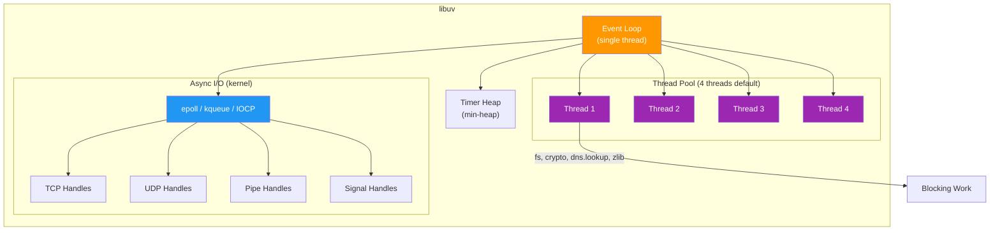
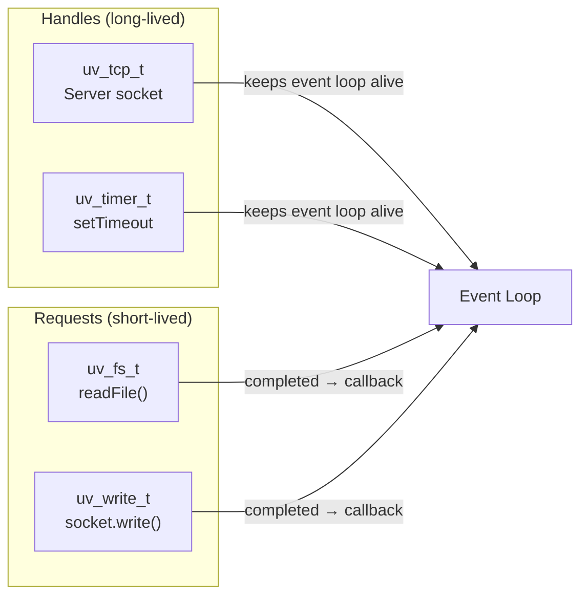
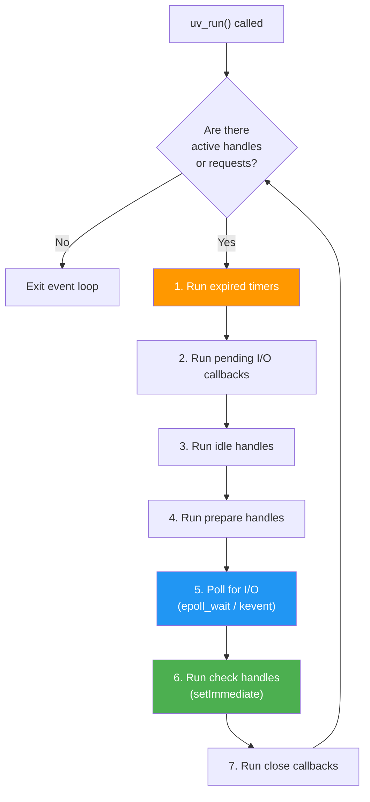
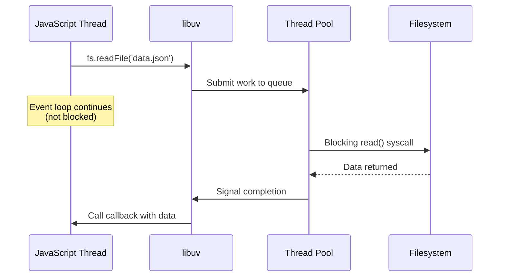

# Lesson 02 — libuv Architecture

## Concept

libuv is the **backbone of Node.js's asynchronous I/O model**. It is a C library that provides:

- A cross-platform **event loop**
- Asynchronous **file system** operations
- Asynchronous **TCP & UDP** sockets
- Asynchronous **DNS** resolution
- A **thread pool** for blocking operations
- **Child process** management
- **Signal** handling
- **Timer** management

When you call `fs.readFile()`, you are not calling the operating system directly. You are calling a JavaScript function that invokes a C++ binding that submits a request to libuv, which either uses its thread pool or the kernel's async facilities to perform the operation without blocking the event loop.

---

## Why libuv Exists

JavaScript is single-threaded. The operating system provides two ways to do I/O:

1. **Blocking I/O** — the calling thread stops until the operation completes
2. **Non-blocking I/O** — the calling thread continues, gets notified when the operation completes

Different operating systems have different non-blocking I/O mechanisms:

| OS | Mechanism | What It Does |
|---|---|---|
| Linux | `epoll` | Monitors file descriptors for I/O readiness |
| macOS | `kqueue` | Same idea, different API |
| Windows | `IOCP` | I/O Completion Ports |

libuv **abstracts all of them** behind a single API. Node.js code doesn't care which OS it's running on — libuv handles the platform differences.

---

## libuv Architecture



---

## Handles and Requests

libuv has two core abstractions:

### Handles

Long-lived objects that represent resources:

| Handle Type | Purpose |
|---|---|
| `uv_tcp_t` | TCP socket |
| `uv_udp_t` | UDP socket |
| `uv_timer_t` | Timer |
| `uv_signal_t` | Signal watcher |
| `uv_fs_event_t` | File system change watcher |
| `uv_idle_t` | Idle callback (runs every iteration) |
| `uv_prepare_t` | Runs before poll |
| `uv_check_t` | Runs after poll |

Handles keep the event loop alive. As long as there are active handles, Node.js won't exit.

### Requests

Short-lived operations submitted to libuv:

| Request Type | Purpose |
|---|---|
| `uv_fs_t` | File system operation |
| `uv_getaddrinfo_t` | DNS resolution |
| `uv_write_t` | Write to stream |
| `uv_connect_t` | Connection request |
| `uv_work_t` | Thread pool work |



---

## The Event Loop (libuv perspective)



### Poll Phase Detail

The poll phase is where Node.js spends most of its time. During this phase, libuv calls `epoll_wait()` (Linux) or `kevent()` (macOS) which:

1. Blocks the thread until I/O events arrive OR the next timer is due
2. Returns a list of file descriptors that are ready for I/O
3. libuv processes these events and calls the corresponding callbacks

The **timeout** for the poll phase is calculated as:

```
if (there are pending setImmediate callbacks) → timeout = 0 (don't block)
else if (there are pending timers) → timeout = time until next timer
else → timeout = infinity (block until I/O arrives)
```

---

## Thread Pool Internals

Not all I/O can be done asynchronously at the OS level. File system operations on most operating systems are **blocking** — there's no `epoll` for files (except with `io_uring` on modern Linux, which libuv is starting to support).

For these blocking operations, libuv uses a **thread pool**:



### Default Thread Pool Size

```typescript
// Default: 4 threads
// Maximum: 1024 threads
// Set BEFORE Node.js starts:
// UV_THREADPOOL_SIZE=8 node server.ts

import { cpus } from "node:os";

console.log(`CPU cores: ${cpus().length}`);
console.log(`UV_THREADPOOL_SIZE: ${process.env.UV_THREADPOOL_SIZE ?? "4 (default)"}`);
```

### What Uses the Thread Pool

| Operation | Thread Pool? | Why |
|---|---|---|
| `fs.readFile()` | Yes | OS file I/O is blocking |
| `fs.stat()` | Yes | Same reason |
| `crypto.pbkdf2()` | Yes | CPU-intensive |
| `crypto.randomBytes()` | Yes | Blocking entropy source |
| `dns.lookup()` | Yes | Uses `getaddrinfo()` (blocking) |
| `zlib.deflate()` | Yes | CPU-intensive |
| `dns.resolve()` | **No** | Uses c-ares (async DNS) |
| `net.connect()` | **No** | Uses epoll/kqueue |
| `http.request()` | **No** | Uses epoll/kqueue |

---

## Code Lab: Thread Pool Saturation

This experiment demonstrates what happens when you exhaust the thread pool:

```typescript
// thread-pool-saturation.ts
import { pbkdf2 } from "node:crypto";

const ITERATIONS = 100_000;

function runPbkdf2(id: number): Promise<number> {
  const start = performance.now();
  return new Promise((resolve, reject) => {
    pbkdf2("password", "salt", ITERATIONS, 64, "sha512", (err, _key) => {
      if (err) return reject(err);
      const duration = performance.now() - start;
      console.log(`Task ${id}: ${duration.toFixed(0)}ms`);
      resolve(duration);
    });
  });
}

async function main() {
  console.log(`\nThread pool size: ${process.env.UV_THREADPOOL_SIZE ?? "4 (default)"}`);
  console.log(`Running 8 pbkdf2 operations...\n`);

  const start = performance.now();
  
  // Launch 8 operations (but only 4 threads by default)
  const promises = Array.from({ length: 8 }, (_, i) => runPbkdf2(i + 1));
  await Promise.all(promises);
  
  const total = performance.now() - start;
  console.log(`\nTotal time: ${total.toFixed(0)}ms`);
  console.log(`\nNotice: Tasks 1-4 finish ~simultaneously, then tasks 5-8.`);
  console.log(`This proves there are only 4 thread pool threads.\n`);
}

main();
```

Run it:

```bash
# Default (4 threads) — tasks batch in groups of 4
node thread-pool-saturation.ts

# 8 threads — all tasks run simultaneously
UV_THREADPOOL_SIZE=8 node thread-pool-saturation.ts
```

### Expected Output (4 threads):

```
Thread pool size: 4 (default)
Running 8 pbkdf2 operations...

Task 2: 85ms
Task 1: 86ms
Task 4: 87ms
Task 3: 88ms
Task 6: 170ms    ← these had to WAIT for a thread
Task 5: 171ms
Task 8: 172ms
Task 7: 173ms

Total time: 174ms
```

### Expected Output (8 threads):

```
Thread pool size: 8
Running 8 pbkdf2 operations...

Task 1: 88ms
Task 3: 89ms
Task 2: 89ms
Task 5: 90ms
Task 4: 90ms
Task 7: 91ms
Task 6: 91ms
Task 8: 92ms

Total time: 93ms    ← ~2x faster!
```

---

## Code Lab: Event Loop Alive Check

```typescript
// event-loop-alive.ts
// Demonstrates what keeps the event loop running

import { createServer } from "node:net";

// A timer handle keeps the loop alive
const timer = setTimeout(() => {
  console.log("Timer fired");
}, 2000);

console.log("Timer handle keeps event loop alive");
console.log(`Active handles: ${(process as any)._getActiveHandles().length}`);
console.log(`Active requests: ${(process as any)._getActiveRequests().length}`);

// Unreffing the timer lets the event loop exit
// Uncomment to see the process exit immediately:
// timer.unref();

// A TCP server handle also keeps the loop alive
const server = createServer();
server.listen(0, () => {
  const addr = server.address();
  console.log(`\nServer listening on port ${(addr as any).port}`);
  console.log(`Active handles: ${(process as any)._getActiveHandles().length}`);
  
  // Close after 1 second
  setTimeout(() => {
    server.close();
    console.log("\nServer closed — if no other handles, event loop will exit");
  }, 1000);
});
```

---

## Real-World Production Use Cases

### 1. Thread Pool Sizing for Heavy Crypto

If your API does password hashing on every request, your throughput is gated by the thread pool:

```typescript
// In your deployment script or Dockerfile:
// ENV UV_THREADPOOL_SIZE=16

// Rule of thumb for CPU-heavy thread pool work:
// UV_THREADPOOL_SIZE = number of CPU cores
// For mixed I/O + CPU: UV_THREADPOOL_SIZE = CPU cores + extra for I/O
```

### 2. DNS Resolution Bottleneck

`dns.lookup()` uses the thread pool. If your app makes many HTTP requests to different hosts:

```typescript
// BAD: dns.lookup() saturates thread pool
import { request } from "node:http";

// GOOD: Use dns.resolve() which uses c-ares (async, no thread pool)
import { Resolver } from "node:dns/promises";
const resolver = new Resolver();
const addresses = await resolver.resolve4("api.example.com");
```

### 3. Handle Leaks in Long-Running Services

Active handles prevent Node.js from exiting:

```typescript
// Debugging handle leaks
console.log("Active handles:");
for (const handle of (process as any)._getActiveHandles()) {
  console.log(` - ${handle.constructor.name}`);
}

console.log("\nActive requests:");
for (const req of (process as any)._getActiveRequests()) {
  console.log(` - ${req.constructor.name}`);
}
```

---

## Interview Questions

### Q1: "What is libuv and why does Node.js need it?"

**Answer framework:**

libuv is a cross-platform asynchronous I/O library written in C. Node.js needs it because:

1. JavaScript is single-threaded and cannot block on I/O
2. Different operating systems have different async I/O mechanisms (epoll on Linux, kqueue on macOS, IOCP on Windows)
3. libuv abstracts these differences and provides a unified event loop, thread pool for blocking operations, and handle/request model for managing async resources

Without libuv, Node.js would need platform-specific code for every I/O operation.

### Q2: "Which operations use the libuv thread pool?"

**Answer framework:**

Operations that **cannot** be done asynchronously at the OS level use the thread pool:

- **File system**: `fs.readFile`, `fs.stat`, etc. (most OSes don't support async file I/O)
- **Crypto**: `pbkdf2`, `randomBytes`, etc. (CPU-intensive)
- **DNS lookup**: `dns.lookup()` uses `getaddrinfo()` which is blocking
- **Compression**: `zlib.deflate`, `zlib.gzip`, etc.

Network I/O (`net`, `http`, `https`) does **not** use the thread pool — it uses the kernel's event notification system (epoll/kqueue).

### Q3: "What happens if the thread pool is saturated?"

**Answer framework:**

If all thread pool threads are busy, new operations are **queued** and wait until a thread becomes available. This creates **head-of-line blocking** for thread-pool operations:

- A burst of file reads can delay crypto operations
- Heavy bcrypt hashing can delay DNS lookups
- Default pool size is only 4 threads

Mitigation: increase `UV_THREADPOOL_SIZE` (up to 1024), or use non-thread-pool alternatives where available (e.g., `dns.resolve()` instead of `dns.lookup()`).

---

## Deep Dive Notes

### Source Code References

- libuv source: `deps/uv/src/`
- Event loop: `deps/uv/src/unix/core.c` → `uv_run()`
- Thread pool: `deps/uv/src/threadpool.c`
- epoll integration: `deps/uv/src/unix/linux.c`

### Further Reading

- [libuv Official Docs](http://docs.libuv.org/)
- [libuv Design Overview](http://docs.libuv.org/en/v1.x/design.html)
- [An Introduction to libuv](https://nikhilm.github.io/uvbook/)
- Node.js source: `src/env.cc` — how Node initializes libuv
