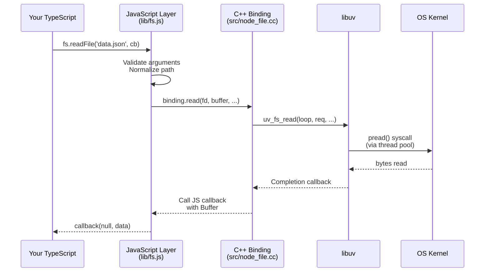
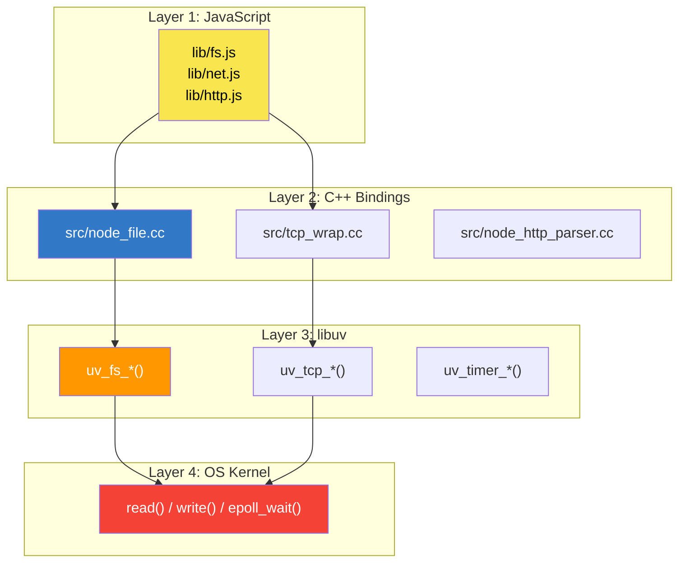
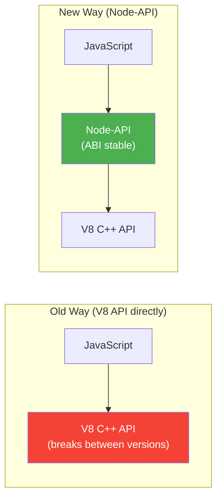
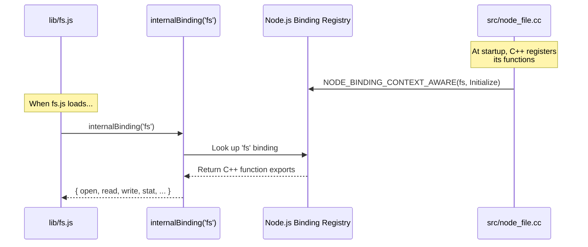

# Lesson 03 — The Binding Layer (JS ↔ C++)

## Concept

The binding layer is the **bridge** between your JavaScript code and the C/C++ world. When you call `fs.readFile()`, that call doesn't stay in JavaScript — it crosses into C++ code that calls libuv, which calls the operating system. Understanding this bridge is critical for understanding Node.js performance and behavior.

---

## The Journey of a Function Call



---

## Three Layers of Node.js Code

### Layer 1: JavaScript (`lib/`)

This is what you interact with directly. Node.js's standard library is written in JavaScript (now with increasing TypeScript internally):

```typescript
// Simplified version of what lib/fs.js looks like internally:
// (This is the JS layer you call)

import { binding } from "internal/fs/binding";

export function readFile(
  path: string,
  callback: (err: Error | null, data: Buffer) => void
): void {
  // Validate arguments (JS layer does this)
  if (typeof path !== "string") {
    throw new TypeError("path must be a string");
  }

  // Create a request object
  const req = new FSReqCallback();
  req.oncomplete = callback;

  // Call into C++ binding
  binding.open(path, flags, mode, req);
}
```

### Layer 2: C++ Bindings (`src/`)

The C++ layer implements the actual functionality using V8's C++ API to interact with JavaScript objects:

```cpp
// Simplified version of src/node_file.cc
// (You won't write this, but understanding it demystifies Node.js)

void Open(const FunctionCallbackInfo<Value>& args) {
  Environment* env = Environment::GetCurrent(args);
  
  // Extract JS arguments
  BufferValue path(env->isolate(), args[0]);  // string → C string
  int flags = args[1].As<Int32>()->Value();    // JS number → C int
  int mode = args[2].As<Int32>()->Value();
  
  // Create libuv request
  FSReqBase* req_wrap = GetReqWrap(args, 3);
  
  // Submit to libuv (async)
  int err = uv_fs_open(env->event_loop(), 
                        req_wrap->req(),
                        *path, flags, mode,
                        AfterOpenCallback);
}
```

### Layer 3: libuv (`deps/uv/`)

libuv receives the request and either:
- Submits it to the **thread pool** (for blocking ops like filesystem)
- Registers it with the **kernel** (for network I/O via epoll/kqueue)



---

## N-API (Node-API) — The Stable Binding Interface

Node.js provides **N-API** (renamed to **Node-API**) as a stable C API for writing native addons. Unlike the raw V8 C++ API, Node-API promises ABI stability across Node.js versions.



### Why This Matters

When you install a package with a native addon (like `bcrypt`, `sharp`, `better-sqlite3`), it compiles C/C++ code that uses either:

- The raw V8 API (must recompile for each Node.js version)
- Node-API (binary compatible across versions — no recompile needed)

```typescript
// Checking if a native addon is available
import { createRequire } from "node:module";
const require = createRequire(import.meta.url);

try {
  const sharp = require("sharp"); // Native addon using N-API
  console.log("sharp loaded (native C++ image processing)");
} catch (err) {
  console.log("sharp not available — needs native compilation");
}
```

---

## Internal Bindings: `internalBinding()`

Node.js has a private binding mechanism called `internalBinding()` that connects JS core modules to their C++ implementations:

```typescript
// This is how Node.js internally connects JS to C++
// (You can't call this in your own code)

// Inside lib/fs.js:
const binding = internalBinding('fs');
// 'fs' maps to src/node_file.cc

// Inside lib/net.js:
const { TCP } = internalBinding('tcp_wrap');
// 'tcp_wrap' maps to src/tcp_wrap.cc

// Inside lib/crypto.js:
const { PBKDF2Job } = internalBinding('crypto');
// 'crypto' maps to src/crypto/crypto_pbkdf2.cc
```

### How `internalBinding` Works



---

## Code Lab: Exploring the Binding Layer

### Experiment 1: List All Internal Bindings

```typescript
// list-bindings.ts
// Exploring what bindings exist in Node.js

// process.binding() is deprecated but still works for exploration
const bindingNames = [
  "fs", "buffer", "tcp_wrap", "udp_wrap", "pipe_wrap",
  "tty_wrap", "timer_wrap", "http_parser", "os", "crypto",
  "zlib", "constants", "signal_wrap", "spawn_sync",
  "stream_wrap", "cares_wrap", "fs_event_wrap",
];

for (const name of bindingNames) {
  try {
    const binding = (process as any).binding(name);
    const keys = Object.keys(binding);
    console.log(`${name}: ${keys.slice(0, 5).join(", ")}${keys.length > 5 ? ` ... (${keys.length} total)` : ""}`);
  } catch (e: any) {
    console.log(`${name}: not available (${e.message})`);
  }
}
```

### Experiment 2: Trace a syscall

On Linux, you can trace what actually happens at the OS level:

```bash
# Write a simple file-read script
cat > trace-test.ts << 'EOF'
import { readFileSync } from "node:fs";
const data = readFileSync("/etc/hostname", "utf8");
console.log(data.trim());
EOF

# Trace all system calls Node makes
strace -e trace=open,openat,read,close -f node trace-test.ts 2>&1 | tail -20
```

You'll see the actual `openat()` and `read()` syscalls that libuv makes.

### Experiment 3: V8 Heap and C++ Memory

```typescript
// memory-layers.ts
// Understanding where memory lives

const v8Heap = process.memoryUsage();

console.log("Memory Layout:");
console.log(`  RSS (total process):     ${(v8Heap.rss / 1024 / 1024).toFixed(1)} MB`);
console.log(`  Heap Total (V8):         ${(v8Heap.heapTotal / 1024 / 1024).toFixed(1)} MB`);
console.log(`  Heap Used (V8):          ${(v8Heap.heapUsed / 1024 / 1024).toFixed(1)} MB`);
console.log(`  External (C++ objects):  ${(v8Heap.external / 1024 / 1024).toFixed(1)} MB`);
console.log(`  Array Buffers:           ${(v8Heap.arrayBuffers / 1024 / 1024).toFixed(1)} MB`);

console.log("\nNote:");
console.log("  RSS includes V8 heap + C++ libuv objects + thread stacks");
console.log("  'External' = C++ objects allocated outside V8 heap but tracked by V8");
console.log("  Buffer data lives in 'external' memory, not V8 heap");

// Demonstrate: Buffers use external memory
const bigBuffer = Buffer.alloc(50 * 1024 * 1024); // 50 MB
const afterBuffer = process.memoryUsage();

console.log(`\nAfter allocating 50MB Buffer:`);
console.log(`  Heap Used change:    ${((afterBuffer.heapUsed - v8Heap.heapUsed) / 1024 / 1024).toFixed(1)} MB`);
console.log(`  External change:     ${((afterBuffer.external - v8Heap.external) / 1024 / 1024).toFixed(1)} MB`);
console.log(`  → Buffer data is in External memory, NOT the V8 heap`);
```

---

## Real-World Production Use Cases

### 1. Native Addon Performance

Native addons bypass the binding layer overhead for compute-heavy work:

```typescript
// Using sharp (native image processing via C++ binding)
// 10-100x faster than pure JS image libraries
import sharp from "sharp";

const result = await sharp("input.jpg")
  .resize(800, 600)
  .webp({ quality: 80 })
  .toBuffer();
// The actual resizing happens in C++, not JavaScript
```

### 2. Understanding Buffer Memory

Buffers are allocated outside the V8 heap, which is why they don't count against `--max-old-space-size`:

```typescript
// This will NOT trigger V8 OOM even with --max-old-space-size=256
// Because Buffer data lives in external C++ memory
const buffers: Buffer[] = [];
for (let i = 0; i < 100; i++) {
  buffers.push(Buffer.alloc(10 * 1024 * 1024)); // 10 MB each = 1 GB total
  console.log(`Allocated ${(i + 1) * 10} MB of Buffer memory`);
}
// But RSS will grow — you'll still run out of system memory eventually
```

---

## Interview Questions

### Q1: "How does JavaScript code call C++ in Node.js?"

**Answer framework:**

Node.js has a three-layer architecture:

1. **JavaScript layer** (`lib/`): Contains the public API (fs, net, http). Validates arguments, normalizes input.
2. **C++ binding layer** (`src/`): Uses V8's C++ API to extract JS values, create C++ objects, and call libuv functions. Connected via `internalBinding()`.
3. **libuv** (`deps/uv/`): Provides the async I/O primitives that interact with the OS kernel.

When you call `fs.readFile()`, the JavaScript function calls `internalBinding('fs').read()`, which invokes a C++ function in `src/node_file.cc`, which calls `uv_fs_read()` in libuv, which submits the read to the thread pool, which calls the `read()` syscall.

### Q2: "What is N-API?"

**Answer framework:**

N-API (Node-API) is a C API layer that isolates native addons from V8 internals. Benefits:

- **ABI stability**: Addons compiled once work across Node.js versions without recompilation
- **Engine independence**: Could theoretically work with different JS engines
- **Reduced maintenance**: Addon authors don't need to track V8 API changes

### Q3: "Where does Buffer data live in memory?"

**Answer framework:**

Buffer data lives in **external memory** — C++ memory allocated outside the V8 heap but tracked by V8 for garbage collection purposes. This is why:

- Large Buffers don't trigger V8 heap OOM
- `process.memoryUsage().external` grows when you allocate Buffers
- RSS grows even when `heapUsed` stays flat
- The V8 garbage collector knows about the external memory and will prioritize collecting JS objects that reference large external allocations

---

## Deep Dive Notes

### Source Code References

- Internal bindings registry: `src/node_binding.cc`
- fs bindings: `src/node_file.cc`
- TCP bindings: `src/tcp_wrap.cc`
- JS core modules: `lib/fs.js`, `lib/net.js`

### Further Reading

- [Node.js C++ Addons Documentation](https://nodejs.org/api/addons.html)
- [Node-API Documentation](https://nodejs.org/api/n-api.html)
- [Node.js Source Code Walkthrough](https://github.com/nicolestandifer3/node-source-walkthrough)
