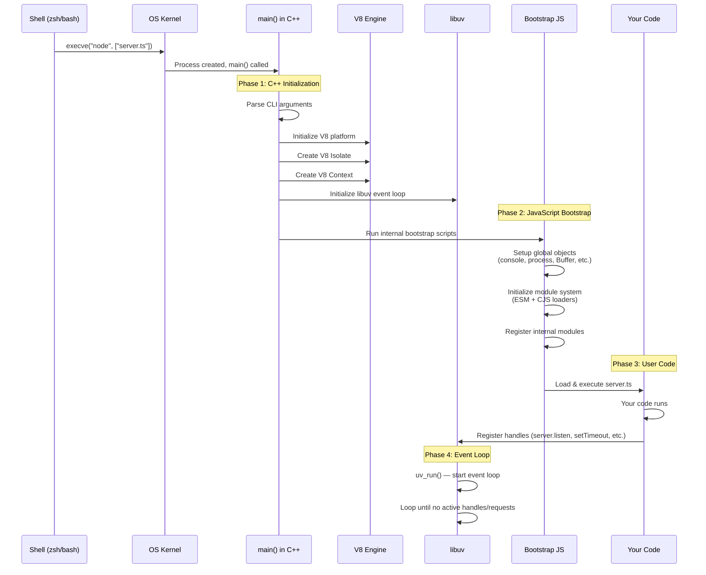
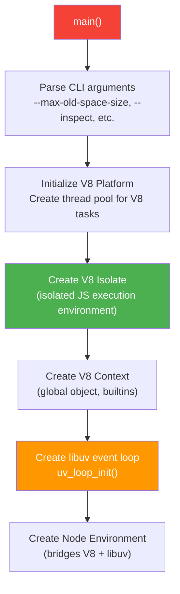
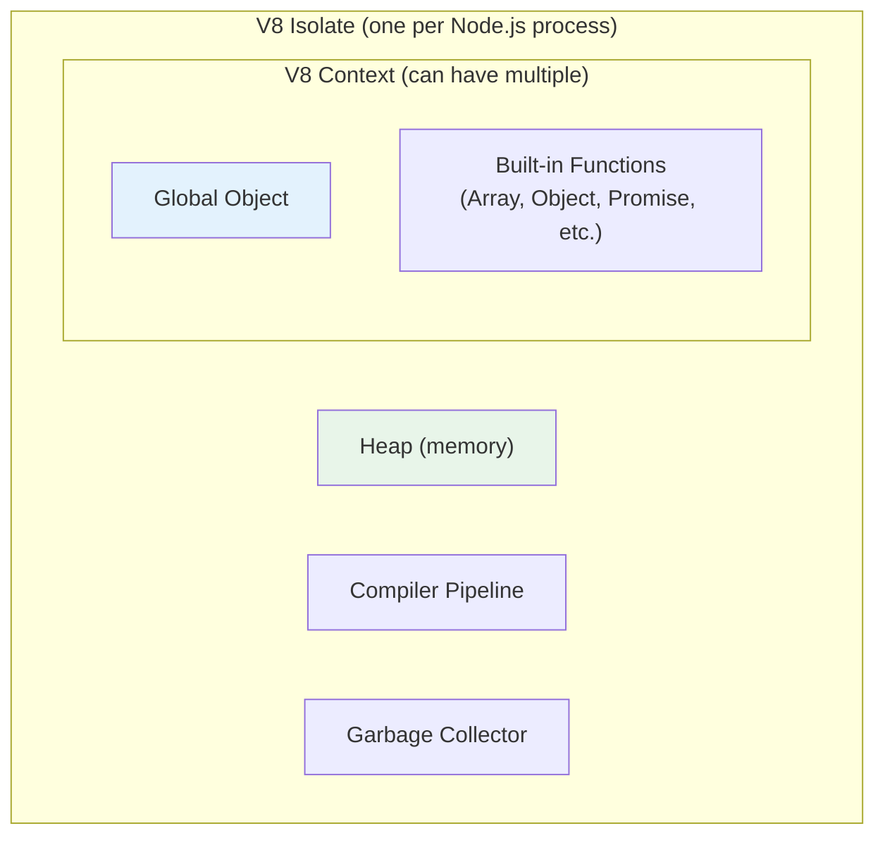
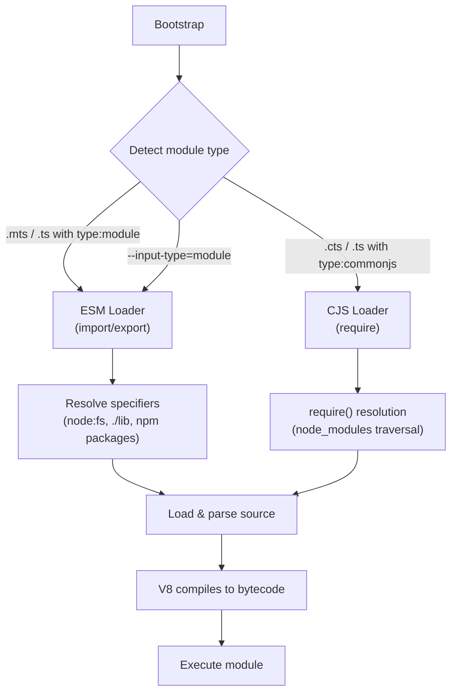
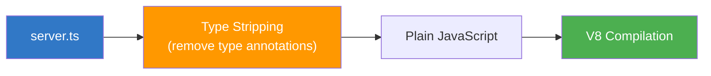

# Lesson 04 — Node.js Startup Lifecycle

## Concept

When you type `node server.ts` and press Enter, a complex sequence of events occurs before your first line of code runs. Understanding this sequence explains startup time, module loading behavior, and how Node.js bootstraps itself.

---

## The Complete Startup Sequence



---

## Phase 1: C++ Initialization

### Step 1: Process Creation

The OS kernel creates a new process:

```
fork() → execve("/usr/local/bin/node", ["node", "server.ts"])
```

This gives us:
- A virtual address space
- A file descriptor table (stdin=0, stdout=1, stderr=2)
- Environment variables (inherited from parent shell)

### Step 2: `main()` Entry Point

Node.js's `main()` function is in `src/node_main.cc`:



### V8 Isolate vs Context



- **Isolate**: An isolated instance of V8. Has its own heap, compiler, GC. One per Node.js process.
- **Context**: A sandboxed execution environment with its own global object. `vm.createContext()` creates additional contexts within the same isolate.

---

## Phase 2: JavaScript Bootstrap

After C++ initialization, Node.js runs its own internal JavaScript to set up the environment your code expects:

### Step 1: Setup Primordials

Node.js freezes references to built-in prototypes to prevent user code from breaking internal modules:

```typescript
// Conceptually, Node.js does this very early:
// (This is simplified — actual code is in lib/internal/per_context/primordials.js)

const ArrayPrototypeMap = Array.prototype.map;
const ObjectFreeze = Object.freeze;
// ... hundreds more

// Why? So that if user code does:
// Array.prototype.map = () => "hacked";
// Node.js internals still work correctly
```

### Step 2: Setup Global Objects

```typescript
// Node.js sets up globals that don't exist in vanilla V8:
// - console (V8 doesn't have this!)
// - process
// - Buffer
// - setTimeout, setInterval, setImmediate
// - queueMicrotask
// - structuredClone
// - fetch (added in Node 18+)
// - crypto.subtle (Web Crypto API)
```

### Step 3: Initialize Module System



### Step 4: TypeScript Handling (Node 25+)

In Node 25+, TypeScript is handled natively:



Node.js uses **type stripping** — it removes TypeScript type annotations but does NOT do type checking. It's fast because it's essentially a syntax transform, not a full compilation.

---

## Phase 3: User Code Execution

Your code is loaded and executed. But it's important to understand **when** things actually run:

```typescript
// startup-order.ts — Demonstrates execution order during startup

console.log("1: Top-level code runs synchronously during module load");

setTimeout(() => {
  console.log("5: Timer callback (executes in event loop)");
}, 0);

setImmediate(() => {
  console.log("6: Immediate callback (check phase)");
});

process.nextTick(() => {
  console.log("3: nextTick (before event loop starts)");
});

Promise.resolve().then(() => {
  console.log("4: Promise microtask (before event loop starts)");
});

console.log("2: More top-level code");

// Output:
// 1: Top-level code runs synchronously during module load
// 2: More top-level code
// 3: nextTick (before event loop starts)
// 4: Promise microtask (before event loop starts)
// 5: Timer callback (executes in event loop)
// 6: Immediate callback (check phase)
```

---

## Phase 4: Event Loop Starts

After your top-level code finishes executing, Node.js enters the event loop:

```typescript
// The event loop determines process lifetime
// Node.js exits when there are no more:
// - Active handles (servers, timers, etc.)
// - Active requests (pending I/O)
// - Pending callbacks

// This exits immediately:
console.log("done"); // No handles → process exits

// This stays alive:
import { createServer } from "node:http";
createServer((req, res) => res.end("ok")).listen(3000);
// Server handle keeps event loop alive
```

---

## Code Lab: Measuring Startup Time

### Experiment 1: Startup Timeline

```typescript
// startup-timeline.ts
const startupTime = performance.now();

// Record when different things happen
const timeline: Array<{ event: string; time: number }> = [];

function record(event: string) {
  timeline.push({ event, time: performance.now() - startupTime });
}

record("Script start");

// Dynamic import to measure module loading
record("Before dynamic import");
const fs = await import("node:fs");
record("After fs import");

const http = await import("node:http");
record("After http import");

const crypto = await import("node:crypto");
record("After crypto import");

record("Script end");

// Print timeline
console.log("\nStartup Timeline:");
console.log("─".repeat(50));
for (const { event, time } of timeline) {
  const bar = "█".repeat(Math.ceil(time / 0.5));
  console.log(`${time.toFixed(2).padStart(8)}ms  ${bar} ${event}`);
}
```

### Experiment 2: Module Load Count

```typescript
// module-count.ts
// Count how many modules Node.js loads internally

// For CJS require-based counting
import { createRequire } from "node:module";
const require = createRequire(import.meta.url);

console.log("Modules loaded at startup:");

// Check require.cache for CJS modules
const cjsCount = Object.keys(require.cache).length;
console.log(`  CJS modules in cache: ${cjsCount}`);

// Process info
console.log(`\nProcess info:`);
console.log(`  PID: ${process.pid}`);
console.log(`  Title: ${process.title}`);
console.log(`  Node version: ${process.version}`);
console.log(`  V8 version: ${process.versions.v8}`);
console.log(`  Startup args: ${process.execArgv.join(" ") || "(none)"}`);
console.log(`  Memory RSS: ${(process.memoryUsage.rss() / 1024 / 1024).toFixed(1)} MB`);
```

### Experiment 3: Process Events During Startup

```typescript
// process-events.ts
// Track process-level events

process.on("beforeExit", () => {
  console.log("EVENT: beforeExit (event loop is empty, can schedule more work)");
});

process.on("exit", (code) => {
  console.log(`EVENT: exit (code: ${code}) — FINAL, no async allowed`);
});

process.on("warning", (warning) => {
  console.log(`EVENT: warning — ${warning.message}`);
});

// Signal handling
process.on("SIGINT", () => {
  console.log("EVENT: SIGINT received (Ctrl+C)");
  process.exit(0);
});

process.on("SIGTERM", () => {
  console.log("EVENT: SIGTERM received (kill command)");
  process.exit(0);
});

console.log("Process started. Press Ctrl+C to test SIGINT.");
console.log(`PID: ${process.pid}`);
console.log(`PPID: ${process.ppid}`);

// Keep alive for 5 seconds to test signals
setTimeout(() => {
  console.log("Timer expired — process will exit");
}, 5000);
```

---

## Real-World Production Use Cases

### 1. Optimizing Cold Start (Serverless)

In serverless environments (AWS Lambda, Vercel), startup time directly impacts latency:

```typescript
// SLOW: Top-level await of heavy modules
import sharp from "sharp"; // Heavy native addon — loads at startup

// FASTER: Lazy loading
let _sharp: typeof import("sharp") | null = null;
async function getSharp() {
  if (!_sharp) {
    _sharp = await import("sharp");
  }
  return _sharp;
}

// Only loads sharp when first image request comes in
```

### 2. Graceful Shutdown

Understanding the startup lifecycle helps you implement proper shutdown:

```typescript
// graceful-shutdown.ts
import { createServer } from "node:http";

const server = createServer((req, res) => {
  res.end("ok");
});

server.listen(3000, () => {
  console.log("Server running on :3000");
});

// Track in-flight requests
let connections = 0;
server.on("connection", (socket) => {
  connections++;
  socket.on("close", () => connections--);
});

async function gracefulShutdown(signal: string) {
  console.log(`\n${signal} received. Starting graceful shutdown...`);
  
  // 1. Stop accepting new connections
  server.close(() => {
    console.log("Server closed — no new connections");
  });
  
  // 2. Wait for in-flight requests (with timeout)
  const deadline = Date.now() + 10_000; // 10 second deadline
  while (connections > 0 && Date.now() < deadline) {
    console.log(`Waiting for ${connections} connections to drain...`);
    await new Promise(r => setTimeout(r, 1000));
  }
  
  if (connections > 0) {
    console.log(`Force-closing ${connections} remaining connections`);
  }
  
  console.log("Shutdown complete");
  process.exit(0);
}

process.on("SIGTERM", () => gracefulShutdown("SIGTERM"));
process.on("SIGINT", () => gracefulShutdown("SIGINT"));
```

---

## Interview Questions

### Q1: "What happens when you run `node server.ts`?"

**Answer framework:**

1. **OS level**: The shell calls `execve()` to create a new process running the `node` binary
2. **C++ initialization**: `main()` parses CLI arguments, initializes the V8 platform, creates a V8 Isolate and Context, initializes the libuv event loop
3. **JavaScript bootstrap**: Node.js runs internal bootstrap scripts that set up globals (console, process, Buffer, setTimeout), initialize the module system (ESM/CJS loaders), and register internal bindings
4. **TypeScript handling**: Node 25+ strips type annotations from `.ts` files (no type checking, just syntax transform)
5. **User code execution**: Your `server.ts` is loaded and executed synchronously. Top-level code runs immediately. Callbacks are registered but don't execute yet.
6. **Event loop**: After top-level code completes, Node enters `uv_run()` — the event loop. It processes timers, I/O callbacks, and check callbacks. The process runs until no active handles or requests remain.

### Q2: "How does Node.js handle TypeScript in v25+?"

**Answer framework:**

Node 25+ supports TypeScript natively through **type stripping** — it removes type annotations at load time but does NOT perform type checking. This is fast because:

- No full TypeScript compiler runs
- No `.js` output files are generated
- The transform is essentially syntactic (remove `: type`, `interface`, `type` declarations)
- V8 receives plain JavaScript after stripping

Limitations: Enum transforms and some TypeScript-specific emit features may not be supported. Type checking still requires running `tsc` separately.

### Q3: "When does `process.nextTick()` run during startup?"

**Answer framework:**

`process.nextTick()` callbacks run after the current synchronous execution completes but before the event loop starts processing timers or I/O. During startup specifically:

1. All top-level synchronous code executes first
2. `process.nextTick()` callbacks run (entire queue drained)
3. Promise microtasks run (entire queue drained)
4. Event loop begins (timers, poll, check phases)

This means `nextTick` scheduled during module loading will run before any `setTimeout(..., 0)` or `setImmediate()`.

---

## Deep Dive Notes

### Source Code References

- Entry point: `src/node_main.cc` → `main()`
- Node startup: `src/node.cc` → `NodeMainInstance::Run()`
- Bootstrap: `lib/internal/bootstrap/node.js`
- Module loading: `lib/internal/modules/esm/loader.js`
- TypeScript stripping: `lib/internal/modules/helpers.js`

### Further Reading

- [Node.js Bootstrap Process (Node source)](https://github.com/nodejs/node/blob/main/lib/internal/bootstrap/node.js)
- [Understanding Node.js Module System](https://nodejs.org/api/esm.html)
- [TypeScript in Node.js](https://nodejs.org/api/typescript.html)
