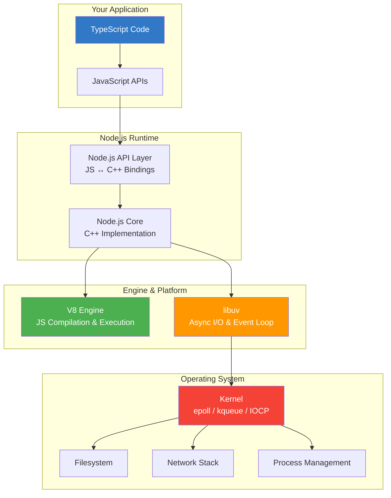

# Module 01 — Node.js Runtime Architecture

## Overview

This module tears apart the Node.js runtime to show you every layer — from the JavaScript you write down to the kernel syscalls that actually execute your code. By the end, you will be able to explain exactly what happens when you type `node server.ts` and press Enter.

## What You'll Learn

- The three pillars of Node.js: V8, libuv, and the Node.js C++ bindings
- How JavaScript communicates with the operating system through C++ bindings
- The complete Node.js startup sequence — every step from process creation to your first line of code
- How the module system loads and evaluates your code
- How Bun's architecture differs at the foundational level

## Architecture Overview

## Lessons

| # | Lesson | Topics |
|---|--------|--------|
| 1 | [V8 Engine Deep Dive](./01-v8-engine.md) | JIT compilation, hidden classes, inline caches, optimization pipeline |
| 2 | [libuv Architecture](./02-libuv-architecture.md) | Event loop core, handles, requests, thread pool design |
| 3 | [The Binding Layer](./03-binding-layer.md) | JS ↔ C++ communication, N-API, internal bindings |
| 4 | [Node.js Startup Lifecycle](./04-startup-lifecycle.md) | What happens from `node server.ts` to your first line of code |

## Prerequisites

- Comfortable writing TypeScript
- Basic understanding of what a process is
- Willingness to read C++ (you won't write it, but seeing how Node is implemented helps)

## Key Takeaway

> Node.js is not JavaScript. It is a **C++ application** that embeds V8 to run JavaScript, uses libuv for async I/O, and provides a binding layer that lets your JS code talk to the operating system.
