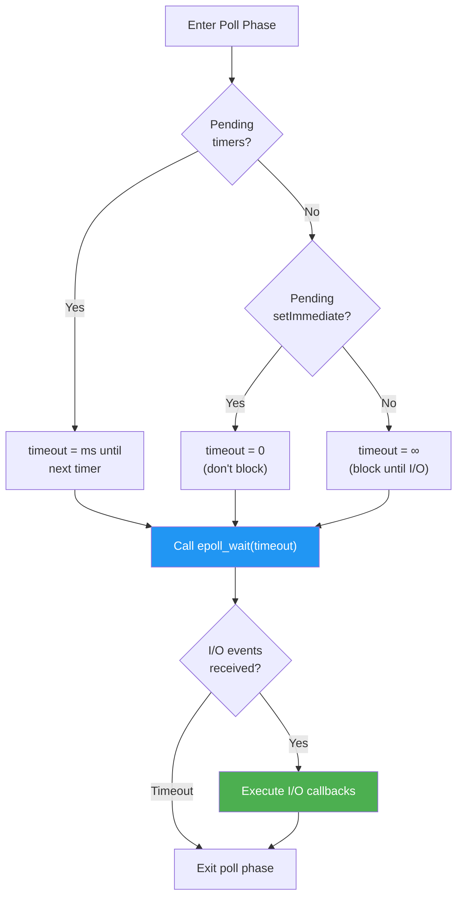
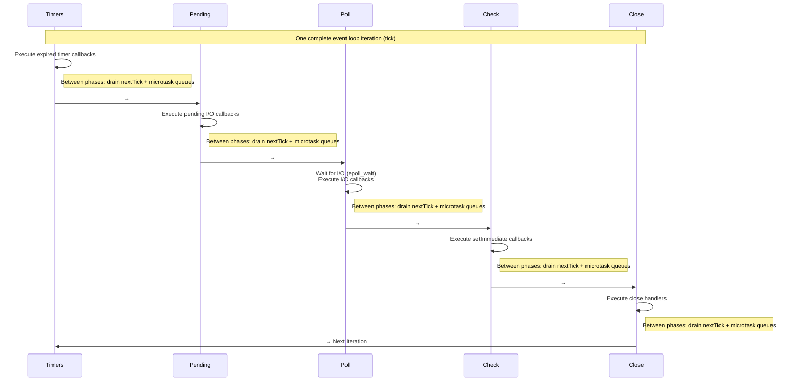

# Lesson 01 — Event Loop Phases

## Concept

The Node.js event loop is **not** a simple while loop checking for callbacks. It is a structured sequence of **phases**, each responsible for a specific category of callbacks. Understanding these phases is the key to predicting when your code runs.

---

## The Six Phases

### Phase 1: Timers

**What runs**: Callbacks from `setTimeout()` and `setInterval()` whose threshold has elapsed.

**Implementation detail**: libuv maintains a **min-heap** of timers sorted by expiration time. At the start of the timers phase, it checks the heap and executes all expired timers.

**Important**: Timer thresholds are **minimum delays**, not guaranteed exact times. A timer set for 100ms will fire at `100ms + event loop latency`.

```typescript
// timer-precision.ts
const start = performance.now();

setTimeout(() => {
  const actual = performance.now() - start;
  console.log(`setTimeout(100) fired after: ${actual.toFixed(2)}ms`);
  // Typically 100-105ms, never less than 100ms
}, 100);

// Block the event loop to demonstrate delay
setTimeout(() => {
  const actual = performance.now() - start;
  console.log(`setTimeout(50) fired after: ${actual.toFixed(2)}ms`);
}, 50);

// This synchronous work DELAYS all timers
const blockUntil = Date.now() + 200;
while (Date.now() < blockUntil) {
  // Blocks for 200ms — both timers will fire AFTER this
}

console.log(`Blocking done at: ${(performance.now() - start).toFixed(2)}ms`);
// Output:
// Blocking done at: ~200ms
// setTimeout(50) fired after: ~200ms  (was supposed to be 50ms!)
// setTimeout(100) fired after: ~200ms (was supposed to be 100ms!)
```

### Phase 2: Pending Callbacks

**What runs**: Callbacks for certain system operations deferred from the previous loop iteration. Specifically:

- TCP error callbacks (e.g., `ECONNREFUSED`)
- Some libuv internal callbacks

Most developers never directly interact with this phase. It exists for libuv's internal bookkeeping.

### Phase 3: Idle / Prepare

**What runs**: Internal libuv operations only. Not accessible from JavaScript.

Used by Node.js internals for housekeeping tasks before the poll phase.

### Phase 4: Poll

**What runs**: I/O callbacks — the bulk of your application's work:

- Incoming TCP data
- File read completions
- DNS resolution completions
- HTTP request/response events

**How it works:**



**Key insight**: The poll phase is adaptively timed. It will **block** (not busy-wait) waiting for I/O, but only up to the point where it needs to service timers or immediates.

### Phase 5: Check

**What runs**: `setImmediate()` callbacks.

`setImmediate()` was designed specifically to execute callbacks after the poll phase completes. This is useful when you want to execute code after I/O but before timers:

```typescript
import { readFile } from "node:fs";

readFile("/etc/hosts", () => {
  // We're in the poll phase callback
  
  setTimeout(() => {
    console.log("timeout"); // Runs in NEXT iteration's timer phase
  }, 0);
  
  setImmediate(() => {
    console.log("immediate"); // Runs in THIS iteration's check phase
  });
  
  // Inside an I/O callback, setImmediate ALWAYS fires before setTimeout
  // Output: immediate, timeout
});
```

### Phase 6: Close Callbacks

**What runs**: Close event handlers:

- `socket.on('close', ...)`
- `server.on('close', ...)`
- `process.on('exit', ...)`

---

## Phase Execution Model



---

## Code Lab: Phase Identification

### Experiment 1: Identify Which Phase Runs Your Callback

```typescript
// phase-id.ts
import { readFile } from "node:fs";
import { createServer, request } from "node:http";

// Timer phase
setTimeout(() => console.log("[TIMERS]     setTimeout callback"), 0);
setInterval(() => {
  console.log("[TIMERS]     setInterval callback");
  // Clear after first fire to avoid infinite loop
  clearInterval(intervalId);
}, 0);
const intervalId = 0; // Will be replaced by actual ID

// Check phase
setImmediate(() => console.log("[CHECK]      setImmediate callback"));

// Poll phase (I/O callback)
readFile("/etc/hostname", () => {
  console.log("[POLL]       fs.readFile callback");
  
  // Now demonstrate ordering WITHIN an I/O callback
  setTimeout(() => console.log("[TIMERS]     setTimeout inside I/O"), 0);
  setImmediate(() => console.log("[CHECK]      setImmediate inside I/O"));
  // setImmediate will ALWAYS fire before setTimeout here
});

// Close phase
const server = createServer();
server.listen(0, () => {
  console.log("[POLL]       server listening callback");
  server.close(() => {
    console.log("[CLOSE]      server close callback");
  });
});
```

### Experiment 2: Timer Heap Ordering

```typescript
// timer-heap.ts
// Timers are stored in a min-heap sorted by expiration time

console.log("Scheduling timers in reverse order...");

setTimeout(() => console.log("Timer 500ms"), 500);
setTimeout(() => console.log("Timer 100ms"), 100);
setTimeout(() => console.log("Timer 300ms"), 300);
setTimeout(() => console.log("Timer 200ms"), 200);
setTimeout(() => console.log("Timer 400ms"), 400);

// Output will be in order: 100, 200, 300, 400, 500
// because libuv's timer min-heap sorts by expiration
```

---

## Interview Questions

### Q1: "What are the phases of the Node.js event loop?"

**Answer framework:**

The event loop has six phases, executed in order:

1. **Timers** — `setTimeout`/`setInterval` callbacks whose delay has elapsed
2. **Pending callbacks** — Deferred I/O callbacks (TCP errors, etc.)
3. **Idle/Prepare** — Internal libuv use only
4. **Poll** — Retrieve new I/O events, execute I/O callbacks (this is where the loop spends most time)
5. **Check** — `setImmediate()` callbacks
6. **Close callbacks** — `socket.on('close')` handlers

Between **every** phase, the nextTick queue and microtask queue are fully drained.

### Q2: "What happens during the poll phase?"

**Answer framework:**

The poll phase does two things:

1. **Calculates how long to block**: If there are pending `setImmediate` callbacks, it doesn't block. If there are pending timers, it blocks until the next timer. Otherwise, it blocks indefinitely waiting for I/O.
2. **Processes I/O events**: Calls `epoll_wait()` (Linux) or `kevent()` (macOS) to get ready file descriptors, then executes their callbacks.

The poll phase is where Node.js spends most of its time in a typical I/O-bound application.

### Q3: "Inside an I/O callback, which fires first: setTimeout(fn, 0) or setImmediate(fn)?"

**Answer**: `setImmediate` **always** fires first when scheduled inside an I/O callback. This is because the I/O callback runs in the poll phase, and the check phase (setImmediate) comes immediately after poll, while timers won't execute until the next iteration's timer phase.

---

## Deep Dive Notes

### Source Code References

- Event loop implementation: `deps/uv/src/unix/core.c` → `uv__run_timers()`, `uv__io_poll()`
- Timer heap: `deps/uv/src/timer.c`
- setImmediate: `lib/timers.js`, bound to libuv check handles

### Key Implementation Detail

The event loop isn't literally written as six sequential function calls. In libuv's `uv_run()`:

```c
// Simplified uv_run() — deps/uv/src/unix/core.c
while (uv__loop_alive(loop)) {
    uv__update_time(loop);        // Get current time
    uv__run_timers(loop);         // Phase 1: Timers
    uv__run_pending(loop);        // Phase 2: Pending callbacks
    uv__run_idle(loop);           // Phase 3: Idle
    uv__run_prepare(loop);        // Phase 3: Prepare
    uv__io_poll(loop, timeout);   // Phase 4: Poll
    uv__run_check(loop);          // Phase 5: Check (setImmediate)
    uv__run_closing_handles(loop); // Phase 6: Close
}
```

Node.js injects its nextTick and microtask processing between these calls at the C++ layer.
