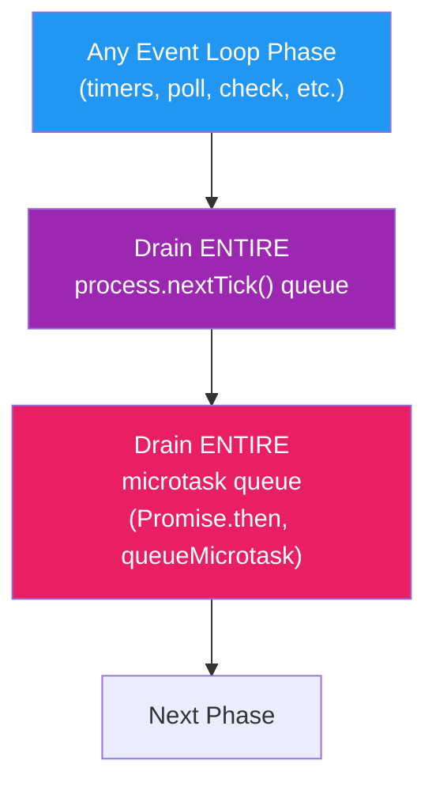
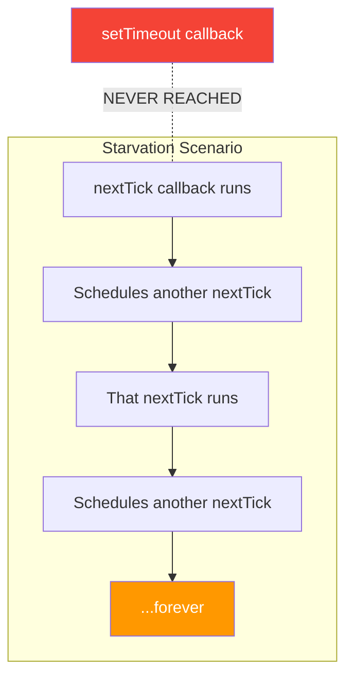
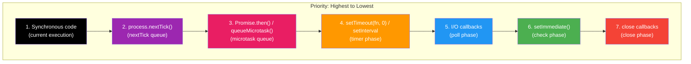

# Lesson 02 — Microtasks and nextTick

## Concept

Besides the six event loop phases, Node.js has two additional queues that fire **between** every phase:

1. **`process.nextTick()` queue** — Node.js specific, highest priority
2. **Microtask queue** — `Promise.then()`, `queueMicrotask()`

These queues are **not** phases of the event loop. They run at the **transition points** between phases.

---

## Queue Priority



**Critical rule**: Both queues are drained **completely** before moving to the next phase. If a `nextTick` callback schedules another `nextTick`, that also runs before any microtask or the next phase.

---

## process.nextTick()

### What It Does

`process.nextTick()` schedules a callback to run **before** the event loop continues to the next phase. It's the highest-priority scheduling mechanism in Node.js.

### Implementation

Internally, `process.nextTick()` adds callbacks to a simple array. Between every event loop phase, Node.js drains this array completely:

```typescript
// nextTick drains completely before moving on
process.nextTick(() => {
  console.log("nextTick 1");
  
  // This ALSO runs before any timer or I/O
  process.nextTick(() => {
    console.log("nextTick 2 (nested)");
    
    process.nextTick(() => {
      console.log("nextTick 3 (double nested)");
    });
  });
});

setTimeout(() => {
  console.log("setTimeout — runs AFTER all nextTicks");
}, 0);

// Output:
// nextTick 1
// nextTick 2 (nested)
// nextTick 3 (double nested)
// setTimeout — runs AFTER all nextTicks
```

### The Starvation Problem

Because `nextTick` drains completely (including recursively added callbacks), you can **starve** the event loop:

```typescript
// ⚠️ DANGER: This starves the event loop forever
// The setTimeout callback NEVER fires
function recurse() {
  process.nextTick(recurse); // Infinite recursion in nextTick queue
}
recurse();

setTimeout(() => {
  console.log("This never prints!");
}, 0);
```



---

## Microtask Queue (Promises)

### What It Does

Promise `.then()`, `.catch()`, `.finally()` callbacks and `queueMicrotask()` callbacks are added to the microtask queue. This queue runs **after** the nextTick queue but **before** the next event loop phase.

```typescript
// Microtasks run after nextTick but before the next phase
process.nextTick(() => console.log("1: nextTick"));
Promise.resolve().then(() => console.log("2: Promise microtask"));
queueMicrotask(() => console.log("3: queueMicrotask"));

setTimeout(() => console.log("4: setTimeout"), 0);

// Output:
// 1: nextTick
// 2: Promise microtask
// 3: queueMicrotask
// 4: setTimeout
```

### Microtasks Also Drain Completely

Like nextTick, microtasks drain completely including recursively added microtasks:

```typescript
Promise.resolve().then(function recurse() {
  console.log("microtask");
  // This creates an infinite microtask loop
  // Promise.resolve().then(recurse); // ⚠️ Would starve the event loop
});
```

---

## The Complete Priority Order



---

## nextTick vs Microtask: When to Use Each

| Feature | `process.nextTick()` | `Promise.then()` / `queueMicrotask()` |
|---|---|---|
| Priority | Higher (runs first) | Lower (runs after nextTick) |
| Recursion risk | Higher (easily starves loop) | Same risk but less common |
| Use case | Emit events after construction | Async continuations |
| Browser equivalent | None (Node.js specific) | `queueMicrotask()` |
| Recommended | For when you need synchronous-appearing async | For general async patterns |

### When to Use nextTick

The primary use case: ensuring an event is emitted **after** the caller has had a chance to attach listeners:

```typescript
import { EventEmitter } from "node:events";

class MyStream extends EventEmitter {
  constructor() {
    super();
    
    // BAD: This fires before caller can attach listeners
    // this.emit("data", "some data");
    
    // GOOD: Defer to nextTick so caller can attach listeners
    process.nextTick(() => {
      this.emit("data", "some data");
    });
  }
}

// Caller code:
const stream = new MyStream();
// Without nextTick, this listener would miss the event
stream.on("data", (data) => {
  console.log("Received:", data);
});
```

### When to Use queueMicrotask

For scheduling work that should happen soon but not synchronously, prefer `queueMicrotask` over `process.nextTick`:

```typescript
// Modern preference: queueMicrotask over process.nextTick
function processItem(item: unknown) {
  // Do synchronous validation
  if (!isValid(item)) throw new Error("Invalid");
  
  // Schedule async processing
  queueMicrotask(() => {
    // Process item
    // Runs after current synchronous code but before I/O
  });
}

function isValid(item: unknown): boolean {
  return item != null;
}
```

---

## Code Lab: Microtask Interleaving

### Experiment 1: nextTick vs Promise vs setTimeout

```typescript
// microtask-order.ts
console.log("=== Script Start ===");

setTimeout(() => {
  console.log("setTimeout 1");
  process.nextTick(() => console.log("  nextTick inside setTimeout"));
  Promise.resolve().then(() => console.log("  Promise inside setTimeout"));
}, 0);

setImmediate(() => {
  console.log("setImmediate 1");
  process.nextTick(() => console.log("  nextTick inside setImmediate"));
  Promise.resolve().then(() => console.log("  Promise inside setImmediate"));
});

process.nextTick(() => {
  console.log("nextTick 1");
  process.nextTick(() => console.log("  nextTick 2 (nested)"));
});

Promise.resolve().then(() => {
  console.log("Promise 1");
  process.nextTick(() => console.log("  nextTick inside Promise"));
});

queueMicrotask(() => {
  console.log("queueMicrotask 1");
});

console.log("=== Script End ===");

// Expected output:
// === Script Start ===
// === Script End ===
// nextTick 1
//   nextTick 2 (nested)
// Promise 1
// queueMicrotask 1
//   nextTick inside Promise
// setTimeout 1          (or setImmediate 1 — non-deterministic at top level!)
//   nextTick inside setTimeout
//   Promise inside setTimeout
// setImmediate 1        (or setTimeout 1)
//   nextTick inside setImmediate
//   Promise inside setImmediate
```

### Experiment 2: Starvation Detection

```typescript
// starvation-demo.ts
// Demonstrate how nextTick can starve the event loop

let nextTickCount = 0;
const MAX_TICKS = 1000;

// This will run 1000 nextTicks before the setTimeout fires
function nextTickFlood() {
  if (nextTickCount < MAX_TICKS) {
    nextTickCount++;
    process.nextTick(nextTickFlood);
  }
}

const start = performance.now();

setTimeout(() => {
  const delay = performance.now() - start;
  console.log(`setTimeout fired after ${delay.toFixed(2)}ms`);
  console.log(`nextTick ran ${nextTickCount} times before setTimeout`);
}, 0);

nextTickFlood();

// Output: setTimeout is delayed by all 1000 nextTick callbacks
```

### Experiment 3: async/await Under the Hood

```typescript
// async-await-microtasks.ts
// async/await is syntactic sugar over promises
// Each await creates a microtask

async function example() {
  console.log("async: before first await");
  
  await Promise.resolve(); // Creates a microtask
  console.log("async: after first await");
  
  await Promise.resolve(); // Creates another microtask
  console.log("async: after second await");
}

console.log("sync: start");
example();
console.log("sync: end");

// Output:
// sync: start
// async: before first await       ← synchronous until first await
// sync: end                       ← caller continues
// async: after first await        ← microtask 1
// async: after second await       ← microtask 2
```

---

## Real-World Production Use Cases

### 1. Avoiding nextTick in Hot Paths

```typescript
// BAD: nextTick in a request handler
import { createServer } from "node:http";

createServer((req, res) => {
  process.nextTick(() => {
    // This adds latency on every request
    // and can starve I/O under load
    res.end("ok");
  });
}).listen(3000);

// GOOD: Just respond directly
createServer((req, res) => {
  res.end("ok");
}).listen(3000);
```

### 2. Batching Microtasks for Performance

```typescript
// Batch database inserts using microtask scheduling
class InsertBatcher {
  private batch: unknown[] = [];
  private scheduled = false;

  add(item: unknown): void {
    this.batch.push(item);
    
    if (!this.scheduled) {
      this.scheduled = true;
      // Use queueMicrotask to batch items added synchronously
      queueMicrotask(() => {
        this.flush();
      });
    }
  }

  private flush(): void {
    const items = this.batch;
    this.batch = [];
    this.scheduled = false;
    console.log(`Flushing ${items.length} items to database`);
    // db.insertMany(items);
  }
}

const batcher = new InsertBatcher();
// These three adds happen synchronously
// but result in a single flush via microtask batching
batcher.add({ id: 1 });
batcher.add({ id: 2 });
batcher.add({ id: 3 });
// → "Flushing 3 items to database" (one batch, not three)
```

---

## Interview Questions

### Q1: "What is the difference between process.nextTick() and Promise.then()?"

**Answer framework:**

Both run between event loop phases, but:

- `process.nextTick()` has **higher priority** — it runs first
- `process.nextTick()` is **Node.js specific** — not available in browsers
- Both drain their queues completely (including recursively added callbacks)
- `process.nextTick()` can more easily starve the event loop because it always runs before microtasks

Practical implication: In Node.js, `process.nextTick(() => ...)` will always execute before `Promise.resolve().then(() => ...)`, even if the Promise was created first.

### Q2: "Can process.nextTick() starve the event loop?"

**Answer**: Yes. Because the nextTick queue is drained completely between every phase (including recursively added callbacks), a recursive `process.nextTick()` call creates an infinite queue that prevents the event loop from ever reaching the next phase. This means timers won't fire, I/O won't be processed, and setImmediate won't run.

### Q3: "What does await actually do to execution order?"

**Answer framework:**

`await` splits an async function into microtask-scheduled continuations:

1. Code before `await` runs synchronously
2. The `await` expression evaluates, and if it's a Promise, the function suspends
3. Control returns to the caller
4. When the awaited Promise resolves, the continuation is scheduled as a microtask
5. The continuation runs when the microtask queue is processed (between event loop phases)

Each `await` creates one microtask boundary. Multiple awaits create multiple microtask scheduling points.

---

## Deep Dive Notes

### nextTick Implementation

`process.nextTick()` is implemented in `lib/internal/process/task_queues.js`. It uses a simple queue that's drained by `processTicksAndRejections()` — a function called by C++ between event loop phases.

### Microtask Queue

V8 has its own microtask queue (for Promise resolution). Node.js hooks into V8's `MicrotasksPolicy` to drain this queue alongside the nextTick queue. The draining sequence is:

1. Drain entire nextTick queue
2. Drain entire V8 microtask queue
3. If either queue has new items (from callbacks that ran), repeat from step 1
4. Proceed to next event loop phase

### Source Code References

- nextTick: `lib/internal/process/task_queues.js`
- Microtask integration: `src/node_task_queue.cc`
- V8 microtask hook: `src/api/environment.cc`
