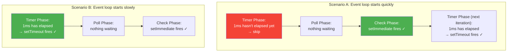
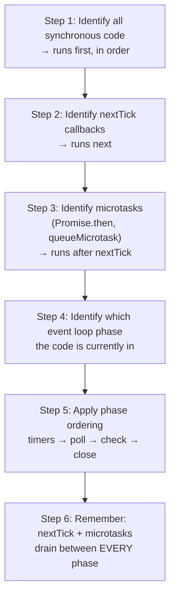

# Lesson 03 — Execution Order Experiments

## Concept

This lesson is entirely hands-on. You will run experiments, predict the output, and understand **why** the output occurs in that order. This is the single most common topic in Node.js technical interviews.

---

## The Master Experiment

```typescript
// master-experiment.ts
// Predict the output BEFORE running this

setTimeout(() => console.log("1: setTimeout"), 0);
setImmediate(() => console.log("2: setImmediate"));
Promise.resolve().then(() => console.log("3: Promise.then"));
process.nextTick(() => console.log("4: nextTick"));
queueMicrotask(() => console.log("5: queueMicrotask"));

console.log("6: synchronous");

// Before scrolling down, write your prediction.
// ...
// ...
// ...
// Answer:
// 6: synchronous        ← sync code runs first
// 4: nextTick           ← highest priority async
// 3: Promise.then       ← microtask queue (after nextTick)
// 5: queueMicrotask     ← also microtask queue (same priority as Promise.then)
// 1: setTimeout         ← timer phase  }  These two are NON-DETERMINISTIC
// 2: setImmediate       ← check phase  }  at the top level!
```

---

## The setTimeout vs setImmediate Trap

### At Top Level: Non-deterministic

```typescript
// top-level-nondeterministic.ts
// Run this multiple times — you'll get different orders

for (let i = 0; i < 10; i++) {
  setTimeout(() => process.stdout.write("T"), 0);
  setImmediate(() => process.stdout.write("I"));
}

setTimeout(() => console.log("\n--- done ---"), 100);

// Sometimes: TITITITI...
// Sometimes: ITITITIT...
// Sometimes: TTTTIIIII...
```

**Why?** At the top level, the timer phase runs first, but `setTimeout(fn, 0)` actually has a minimum delay of ~1ms. If the event loop enters the timer phase **before** 1ms has elapsed, the timer hasn't expired yet and is skipped. Then `setImmediate` runs in the check phase. If the loop enters the timer phase **after** 1ms, the timer fires first.



### Inside I/O Callback: Deterministic

```typescript
// io-deterministic.ts
import { readFile } from "node:fs";

readFile("/etc/hostname", () => {
  // Inside an I/O callback (poll phase), the order is ALWAYS:
  // 1. setImmediate (check phase is next)
  // 2. setTimeout (timer phase is in the next iteration)
  
  setTimeout(() => console.log("setTimeout"), 0);
  setImmediate(() => console.log("setImmediate"));
});

// ALWAYS outputs:
// setImmediate
// setTimeout
```

---

## Experiment Catalog

### Experiment 1: Nested Async Ordering

```typescript
// nested-async.ts
console.log("start");

setTimeout(() => {
  console.log("timeout 1");
  Promise.resolve().then(() => console.log("  promise inside timeout 1"));
}, 0);

setTimeout(() => {
  console.log("timeout 2");
  Promise.resolve().then(() => console.log("  promise inside timeout 2"));
}, 0);

Promise.resolve().then(() => {
  console.log("promise 1");
  setTimeout(() => console.log("  timeout inside promise"), 0);
});

console.log("end");

// Output:
// start
// end
// promise 1
// timeout 1
//   promise inside timeout 1
// timeout 2
//   promise inside timeout 2
//   timeout inside promise
```

**Explanation:**
1. Sync: "start", "end"
2. Microtask: "promise 1" (schedules a new timeout)
3. Timer phase: "timeout 1" → drain microtask: "promise inside timeout 1"
4. Still timer phase: "timeout 2" → drain microtask: "promise inside timeout 2"
5. Next timer phase: "timeout inside promise"

**Important detail**: In modern Node.js, timers added in the same `setTimeout(fn, 0)` call are batched. Microtasks drain between **each** timer callback.

### Experiment 2: Multiple nextTicks and Promises

```typescript
// nexttick-vs-promise.ts
process.nextTick(() => {
  console.log("nextTick 1");
});

process.nextTick(() => {
  console.log("nextTick 2");
});

Promise.resolve().then(() => {
  console.log("promise 1");
});

Promise.resolve().then(() => {
  console.log("promise 2");
});

process.nextTick(() => {
  console.log("nextTick 3");
});

// Output:
// nextTick 1
// nextTick 2
// nextTick 3
// promise 1
// promise 2

// ALL nextTicks run before ANY promise
// (nextTick queue is drained first, then microtask queue)
```

### Experiment 3: async/await Execution Points

```typescript
// async-await-order.ts
async function alpha() {
  console.log("alpha: start");
  await beta();
  console.log("alpha: after await beta");
  await gamma();
  console.log("alpha: after await gamma");
}

async function beta() {
  console.log("beta: start");
  await null;
  console.log("beta: after await null");
}

async function gamma() {
  console.log("gamma: start (synchronous)");
  // No await — runs synchronously
}

console.log("1: before alpha");
alpha();
console.log("2: after alpha call");

// Output:
// 1: before alpha
// alpha: start
// beta: start
// 2: after alpha call        ← sync code after the call
// beta: after await null     ← beta's continuation (microtask)
// alpha: after await beta    ← alpha's continuation (microtask)
// gamma: start (synchronous) ← gamma runs synchronously inside alpha
// alpha: after await gamma   ← alpha's second continuation
```

### Experiment 4: The Timer Coalescing Trap

```typescript
// timer-coalescing.ts
// setTimeout(fn, 0) and setTimeout(fn, 1) can fire in the same tick

const start = performance.now();

setTimeout(() => {
  console.log(`Timer 0ms: fired at ${(performance.now() - start).toFixed(2)}ms`);
}, 0);

setTimeout(() => {
  console.log(`Timer 1ms: fired at ${(performance.now() - start).toFixed(2)}ms`);
}, 1);

setTimeout(() => {
  console.log(`Timer 5ms: fired at ${(performance.now() - start).toFixed(2)}ms`);
}, 5);

setTimeout(() => {
  console.log(`Timer 10ms: fired at ${(performance.now() - start).toFixed(2)}ms`);
}, 10);

// Note: setTimeout(fn, 0) is actually setTimeout(fn, 1) internally
// So the first two may fire at the exact same time
```

### Experiment 5: Mixed I/O with All Queue Types

```typescript
// full-mix.ts
import { readFile } from "node:fs";

readFile(__filename, () => {
  console.log("[I/O] readFile callback");

  setTimeout(() => {
    console.log("[TIMER] inside I/O");
  }, 0);

  setImmediate(() => {
    console.log("[CHECK] inside I/O");
    
    process.nextTick(() => {
      console.log("[NEXTTICK] inside setImmediate inside I/O");
    });
    
    Promise.resolve().then(() => {
      console.log("[PROMISE] inside setImmediate inside I/O");
    });
  });

  process.nextTick(() => {
    console.log("[NEXTTICK] inside I/O");
  });

  Promise.resolve().then(() => {
    console.log("[PROMISE] inside I/O");
  });
});

// Output:
// [I/O] readFile callback
// [NEXTTICK] inside I/O
// [PROMISE] inside I/O
// [CHECK] inside I/O
// [NEXTTICK] inside setImmediate inside I/O
// [PROMISE] inside setImmediate inside I/O
// [TIMER] inside I/O
```

---

## Interview Question Template

When explaining execution order in an interview, use this framework:



---

## Interview Questions

### Q1: Predict the output

```typescript
console.log("A");
setTimeout(() => console.log("B"), 0);
Promise.resolve().then(() => console.log("C"));
process.nextTick(() => console.log("D"));
setImmediate(() => console.log("E"));
console.log("F");
```

**Answer**: `A, F, D, C, B, E` (B and E may swap at top level)

### Q2: "Why might setTimeout and setImmediate swap order at the top level?"

**Answer**: At the top level, the event loop hasn't entered any I/O callback. `setTimeout(fn, 0)` has a minimum 1ms delay. If the event loop's timer phase runs before 1ms elapses, the timer is skipped and `setImmediate` runs first (check phase). If timer checking happens after 1ms, `setTimeout` fires first. This race condition doesn't exist inside I/O callbacks because the phase ordering is fixed.

### Q3: Given this code, will the API response ever be delayed?

```typescript
app.get("/api", (req, res) => {
  processData(); // CPU-intensive function, 50ms
  res.json({ ok: true });
});

function processData() {
  // Heavy computation here
  for (let i = 0; i < 10_000_000; i++) { /* math */ }
}
```

**Answer**: Yes. Since `processData()` is synchronous and takes 50ms, it blocks the event loop. During those 50ms, ALL other requests wait — no I/O callbacks, no timers, no new connections are processed. This is the #1 cause of latency spikes in Node.js. Solution: offload to a worker thread or break into chunks with `setImmediate`.
