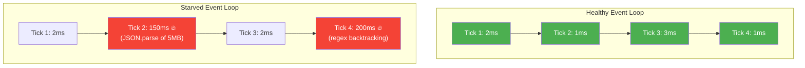

# Lesson 04 — Event Loop Timing and Starvation

## Concept

A healthy Node.js application completes each event loop iteration in **under 10ms**. When an iteration takes longer, you have **event loop lag** — every pending callback, every waiting request, every timer is delayed. This lesson teaches you to measure, monitor, and fix event loop performance.

---

## Measuring Event Loop Delay

### Method 1: monitorEventLoopDelay (Official API)

```typescript
// monitor-event-loop.ts
import { monitorEventLoopDelay } from "node:perf_hooks";

const histogram = monitorEventLoopDelay({ resolution: 10 });
histogram.enable();

// Simulate some work
function doWork() {
  // Simulate varying amounts of CPU work
  const blockTime = Math.random() * 5; // 0-5ms
  const end = performance.now() + blockTime;
  while (performance.now() < end) {}
}

// Process "requests"
const interval = setInterval(() => {
  doWork();
}, 1);

// Report every 2 seconds
const reporter = setInterval(() => {
  console.log(`Event Loop Delay (ms):`);
  console.log(`  Min:    ${(histogram.min / 1e6).toFixed(2)}`);
  console.log(`  Max:    ${(histogram.max / 1e6).toFixed(2)}`);
  console.log(`  Mean:   ${(histogram.mean / 1e6).toFixed(2)}`);
  console.log(`  P50:    ${(histogram.percentile(50) / 1e6).toFixed(2)}`);
  console.log(`  P99:    ${(histogram.percentile(99) / 1e6).toFixed(2)}`);
  console.log(`  StdDev: ${(histogram.stddev / 1e6).toFixed(2)}`);
  console.log("---");
}, 2000);

// Stop after 10 seconds
setTimeout(() => {
  clearInterval(interval);
  clearInterval(reporter);
  histogram.disable();
  
  console.log("\nFinal Report:");
  console.log(`  Total samples: ${histogram.exceeds}`);
  console.log(`  P99.9: ${(histogram.percentile(99.9) / 1e6).toFixed(2)}ms`);
}, 10_000);
```

### Method 2: Manual Tick Duration Measurement

```typescript
// tick-duration.ts
// Measure how long each event loop iteration takes

function measureTickDuration(callback: (durationMs: number) => void) {
  let lastTick = performance.now();
  
  function tick() {
    const now = performance.now();
    const duration = now - lastTick;
    lastTick = now;
    callback(duration);
    setImmediate(tick); // Schedule next measurement
  }
  
  setImmediate(tick);
}

const durations: number[] = [];

measureTickDuration((duration) => {
  durations.push(duration);
});

// Simulate varying load
let counter = 0;
const work = setInterval(() => {
  counter++;
  // Every 5th tick, do something expensive
  if (counter % 5 === 0) {
    const arr = new Array(100_000).fill(0).map((_, i) => Math.sqrt(i));
  }
}, 1);

// Report after 5 seconds
setTimeout(() => {
  clearInterval(work);
  
  durations.sort((a, b) => a - b);
  console.log(`Event Loop Tick Duration (${durations.length} samples):`);
  console.log(`  Min:  ${durations[0].toFixed(3)}ms`);
  console.log(`  Med:  ${durations[Math.floor(durations.length / 2)].toFixed(3)}ms`);
  console.log(`  P95:  ${durations[Math.floor(durations.length * 0.95)].toFixed(3)}ms`);
  console.log(`  P99:  ${durations[Math.floor(durations.length * 0.99)].toFixed(3)}ms`);
  console.log(`  Max:  ${durations[durations.length - 1].toFixed(3)}ms`);
  
  const stalled = durations.filter(d => d > 10).length;
  console.log(`\n  Ticks > 10ms: ${stalled} (${(stalled / durations.length * 100).toFixed(1)}%)`);
  
  process.exit(0);
}, 5000);
```

---

## Event Loop Starvation



### Common Causes of Starvation

```typescript
// starvation-examples.ts

// 1. Large JSON parsing (synchronous)
// BAD: Blocks event loop for 50-500ms
const bigData = JSON.parse(hugeJsonString); // ❌

// GOOD: Stream-parse or offload to worker
import { Worker } from "node:worker_threads";

// 2. Regex backtracking
// BAD: Catastrophic backtracking
const evilRegex = /^(a+)+$/;
evilRegex.test("aaaaaaaaaaaaaaaaaaaaaaaab"); // ❌ Takes SECONDS

// GOOD: Use safe regex or set timeout

// 3. Synchronous crypto
// BAD: Blocks event loop
import { pbkdf2Sync } from "node:crypto";
const key = pbkdf2Sync("password", "salt", 100000, 64, "sha512"); // ❌

// GOOD: Use async version
import { pbkdf2 } from "node:crypto";
pbkdf2("password", "salt", 100000, 64, "sha512", (err, key) => {}); // ✓

// 4. Synchronous file I/O
// BAD: Blocks event loop
import { readFileSync } from "node:fs";
const data = readFileSync("large-file.csv"); // ❌ in request handlers

// GOOD: Use async or streams
import { createReadStream } from "node:fs";
const stream = createReadStream("large-file.csv"); // ✓

// 5. Large array operations
// BAD: Processing millions of items synchronously
const result = hugeArray.map(item => expensiveTransform(item)); // ❌

// GOOD: Break into chunks
async function processInChunks<T, R>(
  items: T[],
  fn: (item: T) => R,
  chunkSize = 1000
): Promise<R[]> {
  const results: R[] = [];
  for (let i = 0; i < items.length; i += chunkSize) {
    const chunk = items.slice(i, i + chunkSize);
    results.push(...chunk.map(fn));
    // Yield to event loop between chunks
    await new Promise<void>(resolve => setImmediate(resolve));
  }
  return results;
}
```

---

## The setImmediate Yield Pattern

When you must do CPU work on the main thread, break it into chunks:

```typescript
// yield-pattern.ts

function processLargeDataset(data: number[]): Promise<number[]> {
  return new Promise((resolve) => {
    const results: number[] = [];
    let index = 0;
    const CHUNK_SIZE = 10_000;

    function processChunk() {
      const end = Math.min(index + CHUNK_SIZE, data.length);
      
      for (; index < end; index++) {
        // Expensive computation
        results.push(Math.sqrt(data[index]) * Math.log(data[index] + 1));
      }

      if (index < data.length) {
        // Yield to event loop, then continue
        setImmediate(processChunk);
      } else {
        resolve(results);
      }
    }

    processChunk();
  });
}

// Usage:
const data = Array.from({ length: 1_000_000 }, (_, i) => i + 1);

console.log("Starting processing...");
const start = performance.now();

// This won't block the event loop
const results = await processLargeDataset(data);

console.log(`Processed ${results.length} items in ${(performance.now() - start).toFixed(0)}ms`);
console.log("Event loop remained responsive throughout");
```

---

## Code Lab: Building an Event Loop Monitor

```typescript
// event-loop-monitor.ts
// Production-grade event loop monitoring

import { monitorEventLoopDelay } from "node:perf_hooks";
import { EventEmitter } from "node:events";

interface LoopMetrics {
  min: number;
  max: number;
  mean: number;
  p50: number;
  p95: number;
  p99: number;
  stddev: number;
  timestamp: number;
}

class EventLoopMonitor extends EventEmitter {
  private histogram;
  private intervalId: ReturnType<typeof setInterval> | null = null;
  private thresholdMs: number;

  constructor(options: { reportIntervalMs?: number; thresholdMs?: number } = {}) {
    super();
    this.histogram = monitorEventLoopDelay({ resolution: 10 });
    this.thresholdMs = options.thresholdMs ?? 50;
    
    const intervalMs = options.reportIntervalMs ?? 5000;
    this.histogram.enable();
    
    this.intervalId = setInterval(() => {
      const metrics = this.getMetrics();
      this.emit("metrics", metrics);
      
      if (metrics.p99 > this.thresholdMs) {
        this.emit("warning", {
          message: `Event loop P99 latency is ${metrics.p99.toFixed(1)}ms (threshold: ${this.thresholdMs}ms)`,
          metrics,
        });
      }
      
      this.histogram.reset();
    }, intervalMs);
    
    // Don't keep process alive just for monitoring
    this.intervalId.unref();
  }

  getMetrics(): LoopMetrics {
    return {
      min: this.histogram.min / 1e6,
      max: this.histogram.max / 1e6,
      mean: this.histogram.mean / 1e6,
      p50: this.histogram.percentile(50) / 1e6,
      p95: this.histogram.percentile(95) / 1e6,
      p99: this.histogram.percentile(99) / 1e6,
      stddev: this.histogram.stddev / 1e6,
      timestamp: Date.now(),
    };
  }

  stop(): void {
    if (this.intervalId) {
      clearInterval(this.intervalId);
      this.intervalId = null;
    }
    this.histogram.disable();
  }
}

// Usage:
const monitor = new EventLoopMonitor({
  reportIntervalMs: 2000,
  thresholdMs: 20,
});

monitor.on("metrics", (metrics: LoopMetrics) => {
  console.log(`[${new Date(metrics.timestamp).toISOString()}] Event Loop: ` +
    `mean=${metrics.mean.toFixed(2)}ms p50=${metrics.p50.toFixed(2)}ms ` +
    `p99=${metrics.p99.toFixed(2)}ms max=${metrics.max.toFixed(2)}ms`);
});

monitor.on("warning", ({ message }: { message: string }) => {
  console.warn(`⚠️  ${message}`);
});

// Simulate some load
setInterval(() => {
  // Occasional heavy work
  if (Math.random() < 0.1) {
    const end = performance.now() + 30; // 30ms block
    while (performance.now() < end) {}
  }
}, 10);

setTimeout(() => {
  monitor.stop();
  process.exit(0);
}, 15_000);
```

---

## Interview Questions

### Q1: "How do you detect event loop starvation?"

**Answer framework:**

Multiple approaches, from simple to production-grade:

1. **`monitorEventLoopDelay()`** — Official Node.js API. Provides a histogram of event loop delays with percentile measurements. Check P99 latency.

2. **Manual tick measurement** — Use `setImmediate()` to measure time between iterations. If consecutive iterations take > 10ms, the loop is being blocked.

3. **`clinic.js`** — Open source profiling tool that automatically detects event loop delays and generates analysis reports.

4. **Production metrics** — Export event loop P50/P95/P99 to your monitoring system (Prometheus, Datadog). Alert on P99 > threshold.

### Q2: "What causes event loop blocking and how do you fix it?"

**Answer**: The event loop blocks when synchronous code takes too long. Common causes:

1. **JSON parse/stringify** of large payloads → use streaming parsers or workers
2. **Regex backtracking** → use safe regex patterns, set timeouts
3. **Synchronous crypto** → use async `pbkdf2()` instead of `pbkdf2Sync()`
4. **Large array operations** → break into chunks with `setImmediate()` between chunks
5. **Synchronous file I/O** → use async `fs` or streams

Fix patterns: Worker threads, chunk processing with yielding, stream processing, external microservices for heavy computation.

---

## Deep Dive Notes

### Source Code

- `monitorEventLoopDelay`: `lib/internal/perf/event_loop_delay.js`
- Event loop integration: `src/node_perf.cc`
- libuv timer implementation: `deps/uv/src/timer.c`

### Rules of Thumb

| Metric | Healthy | Warning | Critical |
|---|---|---|---|
| Event loop P50 | < 5ms | 5-20ms | > 20ms |
| Event loop P99 | < 20ms | 20-100ms | > 100ms |
| Event loop Max | < 50ms | 50-500ms | > 500ms |
| Tick duration | < 10ms | 10-50ms | > 50ms |
