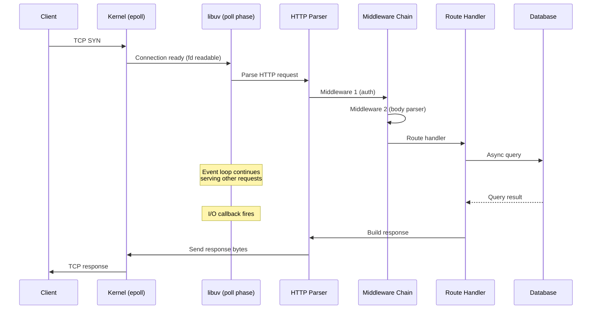
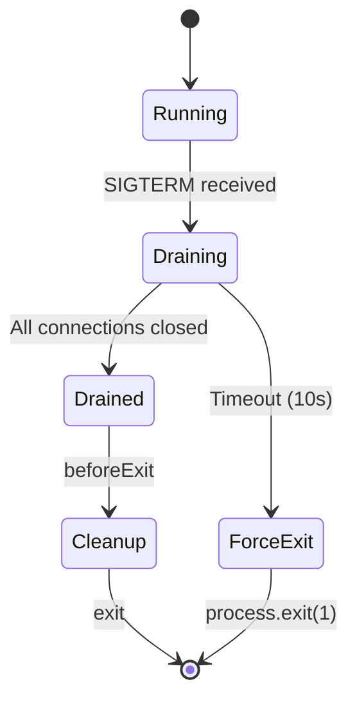

# Lesson 05 — Event Loop in Practice

## Concept

This lesson connects event loop theory to real production patterns. You'll learn how frameworks interact with the event loop, common anti-patterns in production code, and strategies for keeping the loop healthy under load.

---

## How HTTP Frameworks Use the Event Loop



### Every Middleware Runs on the Main Thread

```typescript
// middleware-impact.ts
import { createServer } from "node:http";

function authMiddleware(req: any): boolean {
  // This runs synchronously on the event loop
  // If this takes 5ms, EVERY request pays 5ms
  const token = req.headers.authorization;
  return validateToken(token); // Sync!
}

function bodyParser(req: any): Promise<string> {
  // This is ASYNC — good! It doesn't block
  return new Promise((resolve) => {
    let body = "";
    req.on("data", (chunk: Buffer) => { body += chunk; });
    req.on("end", () => resolve(body));
  });
}

function validateToken(token: string | undefined): boolean {
  // Simulate validation
  return token === "Bearer valid";
}

const server = createServer(async (req, res) => {
  // Sync work — blocks event loop
  if (!authMiddleware(req)) {
    res.writeHead(401);
    res.end("Unauthorized");
    return;
  }

  // Async work — doesn't block event loop
  const body = await bodyParser(req);

  res.writeHead(200, { "Content-Type": "application/json" });
  res.end(JSON.stringify({ received: body.length }));
});

server.listen(3000);
```

---

## Production Anti-Patterns

### Anti-Pattern 1: Sync Operations in Request Handlers

```typescript
// ❌ BAD: Sync file read blocks ALL concurrent requests
import { readFileSync } from "node:fs";

app.get("/config", (req, res) => {
  const config = readFileSync("config.json", "utf8"); // BLOCKS!
  res.json(JSON.parse(config));
});

// ✅ GOOD: Async file read
import { readFile } from "node:fs/promises";

app.get("/config", async (req, res) => {
  const config = await readFile("config.json", "utf8");
  res.json(JSON.parse(config));
});

// ✅ BETTER: Cache on startup, file watches
let cachedConfig: Record<string, unknown>;
const config = JSON.parse(readFileSync("config.json", "utf8")); // OK at startup
cachedConfig = config;

app.get("/config", (req, res) => {
  res.json(cachedConfig); // No I/O at all
});
```

### Anti-Pattern 2: Uncontrolled Concurrency

```typescript
// ❌ BAD: Processing 10,000 items in parallel — overwhelms DB connections
async function processAll(items: string[]) {
  await Promise.all(items.map(item => processItem(item)));
}

// ✅ GOOD: Controlled concurrency
async function processAllWithLimit(items: string[], limit = 10) {
  const results: unknown[] = [];
  const executing = new Set<Promise<unknown>>();

  for (const item of items) {
    const promise = processItem(item).then(result => {
      executing.delete(promise);
      results.push(result);
    });
    executing.add(promise);

    if (executing.size >= limit) {
      await Promise.race(executing);
    }
  }

  await Promise.all(executing);
  return results;
}

async function processItem(item: string): Promise<unknown> {
  // Simulate DB call
  return new Promise(resolve => setTimeout(resolve, 100));
}
```

### Anti-Pattern 3: Memory Accumulation in Closures

```typescript
// ❌ BAD: Growing array in closure — event loop gets slower over time
const requestLog: object[] = []; // Grows forever!

app.use((req, res, next) => {
  requestLog.push({
    url: req.url,
    timestamp: Date.now(),
    headers: req.headers, // Large objects!
  });
  next();
});

// ✅ GOOD: Bounded buffer or external storage
class RingBuffer<T> {
  private buffer: (T | undefined)[];
  private index = 0;

  constructor(private capacity: number) {
    this.buffer = new Array(capacity);
  }

  push(item: T) {
    this.buffer[this.index % this.capacity] = item;
    this.index++;
  }

  getRecent(n: number): T[] {
    const items: T[] = [];
    const start = Math.max(0, this.index - n);
    for (let i = start; i < this.index; i++) {
      const item = this.buffer[i % this.capacity];
      if (item) items.push(item);
    }
    return items;
  }
}

const requestLog2 = new RingBuffer<{ url: string; timestamp: number }>(1000);
```

---

## Event Loop and Graceful Shutdown



```typescript
// graceful-shutdown-pattern.ts
import { createServer, IncomingMessage, ServerResponse } from "node:http";

const server = createServer((req: IncomingMessage, res: ServerResponse) => {
  // Simulate slow request
  setTimeout(() => {
    res.writeHead(200);
    res.end("ok");
  }, Math.random() * 2000);
});

// Track connections for graceful drain
let isShuttingDown = false;
const connections = new Set<import("node:net").Socket>();

server.on("connection", (socket) => {
  connections.add(socket);
  socket.on("close", () => connections.delete(socket));
});

server.listen(3000, () => {
  console.log("Server listening on :3000");
});

async function shutdown(signal: string) {
  if (isShuttingDown) return;
  isShuttingDown = true;
  
  console.log(`\n${signal} received. Shutting down gracefully...`);

  // 1. Stop accepting new connections
  server.close(() => {
    console.log("Server closed (no new connections)");
  });

  // 2. Set connection: close header for keep-alive connections
  // (New requests on existing connections will see this)

  // 3. Wait for existing connections to drain
  const drainTimeout = setTimeout(() => {
    console.log(`Forcing shutdown. ${connections.size} connections remaining.`);
    for (const socket of connections) {
      socket.destroy();
    }
  }, 10_000);

  // Check periodically if all connections are drained
  while (connections.size > 0) {
    console.log(`Waiting for ${connections.size} connections...`);
    await new Promise(resolve => setTimeout(resolve, 1000));
  }

  clearTimeout(drainTimeout);
  console.log("All connections drained. Exiting.");
  process.exit(0);
}

process.on("SIGTERM", () => shutdown("SIGTERM"));
process.on("SIGINT", () => shutdown("SIGINT"));
```

---

## Event Loop Utilization (ELU)

Node.js provides **Event Loop Utilization** — the ratio of time the event loop spends doing work vs idle:

```typescript
// elu-monitor.ts
import { performance } from "node:perf_hooks";

function getELU() {
  const elu = performance.eventLoopUtilization();
  return elu;
}

// Take two measurements to get utilization between them
const start = performance.eventLoopUtilization();

// Do some work
setTimeout(() => {
  const end = performance.eventLoopUtilization(start);
  
  console.log(`Event Loop Utilization:`);
  console.log(`  Active: ${(end.active / 1e6).toFixed(2)}ms`);
  console.log(`  Idle:   ${(end.idle / 1e6).toFixed(2)}ms`);
  console.log(`  Utilization: ${(end.utilization * 100).toFixed(1)}%`);
  
  // Utilization = active / (active + idle)
  // < 50% = healthy, lots of headroom
  // 50-80% = busy but OK
  // > 80% = approaching saturation
  // > 95% = event loop is overwhelmed
}, 5000);

// Generate some work
setInterval(() => {
  const end = performance.now() + 2; // 2ms of CPU work
  while (performance.now() < end) {}
}, 10);
```

---

## Interview Questions

### Q1: "How would you design a Node.js service to handle both CPU-heavy and I/O-heavy workloads?"

**Answer framework:**

1. **I/O-heavy work** stays on the main thread (event loop handles this efficiently)
2. **CPU-heavy work** offloaded to **worker threads** (via `worker_threads` module or a worker pool)
3. Use **controlled concurrency** for I/O operations (don't fire 10K DB queries at once)
4. **Monitor** event loop delay and utilization — alert if P99 > 20ms or utilization > 80%
5. For extreme cases, use **microservice architecture** — separate CPU-intensive work into its own service

### Q2: "What is Event Loop Utilization?"

**Answer**: ELU measures the ratio of time the event loop spends actively processing callbacks vs sitting idle waiting for I/O. A utilization of 0.3 (30%) means the loop is idle 70% of the time — lots of headroom. A utilization above 0.8 (80%) indicates the server is becoming CPU-bound and needs optimization or scaling. It's accessed via `performance.eventLoopUtilization()`.

### Q3: "How do you implement graceful shutdown?"

**Answer framework:**

1. Listen for `SIGTERM` and `SIGINT` signals
2. Stop accepting new connections (`server.close()`)
3. Track in-flight connections and wait for them to complete
4. Set a hard timeout (e.g., 10 seconds) — destroy remaining connections after timeout
5. Run cleanup code (close DB connections, flush logs)
6. Call `process.exit()` with appropriate code

Key insight: `server.close()` stops the server from accepting new connections but lets existing connections finish. The event loop stays alive while connections drain.

---

## Deep Dive Notes

### Production Monitoring Metrics

Export these to your monitoring system:

```typescript
// Metrics to export every 10 seconds:
interface NodeMetrics {
  eventLoopP50Ms: number;
  eventLoopP99Ms: number;
  eventLoopMaxMs: number;
  eventLoopUtilization: number;
  heapUsedMB: number;
  heapTotalMB: number;
  externalMB: number;
  activeHandles: number;
  activeRequests: number;
  rssMB: number;
}
```

### Further Reading

- [Node.js Event Loop Documentation](https://nodejs.org/en/learn/asynchronous-work/event-loop-timers-and-nexttick)
- [Don't Block the Event Loop Guide](https://nodejs.org/en/learn/asynchronous-work/dont-block-the-event-loop)
- [clinic.js — Node.js Performance Profiling](https://clinicjs.org/)
