# Module 02 — Event Loop Deep Dive

## Overview

The event loop is the core scheduling mechanism of Node.js. It is the reason Node.js can handle thousands of concurrent connections on a single thread. This module deconstructs the event loop phase by phase, explains every queue, and teaches you to predict execution order with certainty.

## What You'll Learn

- Every phase of the event loop and what callbacks run in each
- The microtask queue, nextTick queue, and how they interleave with phases
- How to predict execution order of any combination of async operations
- Why `setTimeout(fn, 0)` vs `setImmediate(fn)` has a non-deterministic order (and when it doesn't)
- How the event loop decides when to block and when to proceed
- Real-world implications: event loop starvation, latency spikes, tick duration

## Lessons

| # | Lesson | Topics |
|---|--------|--------|
| 1 | [Event Loop Phases](./01-event-loop-phases.md) | Timers, poll, check, close — the complete phase diagram |
| 2 | [Microtasks and nextTick](./02-microtasks-nexttick.md) | Promise jobs, queueMicrotask, process.nextTick |
| 3 | [Execution Order Experiments](./03-execution-order.md) | Predicting async output, interview traps, edge cases |
| 4 | [Event Loop Timing and Starvation](./04-event-loop-timing.md) | Measuring tick duration, detecting starvation, monitorEventLoopDelay |
| 5 | [Event Loop in Practice](./05-event-loop-practice.md) | Production patterns, anti-patterns, middleware implications |

## The Complete Event Loop Diagram

```mermaid
graph TD
    START["Event Loop Iteration Begins"] --> TIMERS

    subgraph "Phase 1: Timers"
        TIMERS["Execute setTimeout/setInterval<br/>callbacks whose time has elapsed"]
    end

    TIMERS --> NT1["Drain nextTick queue"]
    NT1 --> MT1["Drain microtask queue"]
    MT1 --> PENDING

    subgraph "Phase 2: Pending Callbacks"
        PENDING["Execute deferred I/O callbacks<br/>(e.g., TCP errors)"]
    end

    PENDING --> NT2["Drain nextTick queue"]
    NT2 --> MT2["Drain microtask queue"]
    MT2 --> IDLE

    subgraph "Phase 3: Idle/Prepare"
        IDLE["Internal use only"]
    end

    IDLE --> POLL

    subgraph "Phase 4: Poll"
        POLL["Poll for I/O events<br/>Execute I/O callbacks<br/>(file read, network data, etc.)"]
    end

    POLL --> NT3["Drain nextTick queue"]
    NT3 --> MT3["Drain microtask queue"]
    MT3 --> CHECK

    subgraph "Phase 5: Check"
        CHECK["Execute setImmediate()<br/>callbacks"]
    end

    CHECK --> NT4["Drain nextTick queue"]
    NT4 --> MT4["Drain microtask queue"]
    MT4 --> CLOSE

    subgraph "Phase 6: Close Callbacks"
        CLOSE["Execute close handlers<br/>(socket.on('close'), etc.)"]
    end

    CLOSE --> NT5["Drain nextTick queue"]
    NT5 --> MT5["Drain microtask queue"]
    MT5 --> NEXT{"More work?"}
    NEXT --> |"Yes"| TIMERS
    NEXT --> |"No"| EXIT["Process exits"]

    style TIMERS fill:#ff9800,color:#fff
    style POLL fill:#2196f3,color:#fff
    style CHECK fill:#4caf50,color:#fff
    style CLOSE fill:#f44336,color:#fff
    style NT1 fill:#9c27b0,color:#fff
    style MT1 fill:#e91e63,color:#fff
    style NT2 fill:#9c27b0,color:#fff
    style MT2 fill:#e91e63,color:#fff
    style NT3 fill:#9c27b0,color:#fff
    style MT3 fill:#e91e63,color:#fff
    style NT4 fill:#9c27b0,color:#fff
    style MT4 fill:#e91e63,color:#fff
    style NT5 fill:#9c27b0,color:#fff
    style MT5 fill:#e91e63,color:#fff
```

**Critical insight**: The nextTick and microtask queues are drained **between every phase**, not in a phase of their own.
