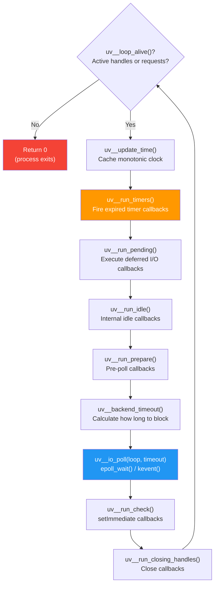
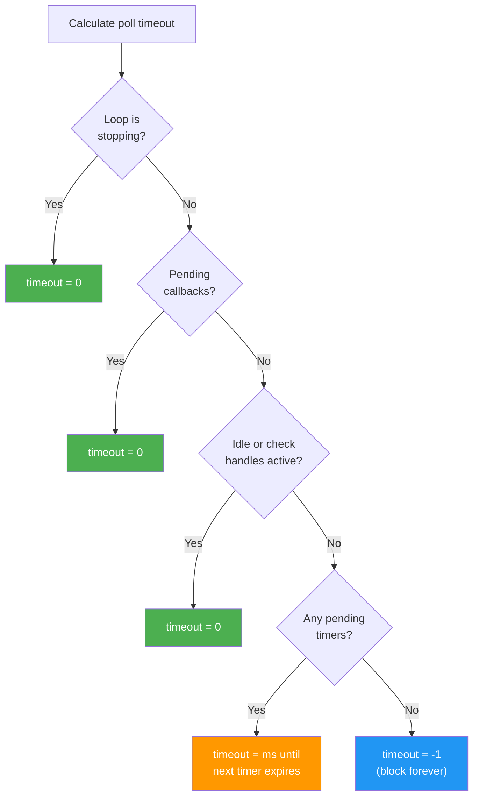

# Lesson 01 — libuv Event Loop Implementation

## Concept

This lesson examines what `uv_run()` actually does — the C function that IS the event loop. Every event loop concept from Module 02 maps directly to a function call in this code.

---

## uv_run() — The Heart of Node.js

```c
// Simplified from deps/uv/src/unix/core.c
int uv_run(uv_loop_t* loop, uv_run_mode mode) {
    while (uv__loop_alive(loop)) {
        uv__update_time(loop);          // Cache current time
        uv__run_timers(loop);           // Phase 1: Timers
        ran_pending = uv__run_pending(loop); // Phase 2: Pending I/O
        uv__run_idle(loop);             // Phase 3: Idle
        uv__run_prepare(loop);          // Phase 3: Prepare
        
        // Calculate poll timeout
        timeout = uv__backend_timeout(loop);
        
        uv__io_poll(loop, timeout);     // Phase 4: Poll (blocks here)
        uv__run_check(loop);            // Phase 5: Check (setImmediate)
        uv__run_closing_handles(loop);  // Phase 6: Close
        
        if (mode == UV_RUN_ONCE) break;
    }
    return uv__loop_alive(loop);
}
```



---

## Loop Alive Semantics

The event loop continues while there are **active handles** or **active requests**:

```typescript
// loop-alive-demo.ts

// ACTIVE HANDLES (keep the loop alive):
import { createServer } from "node:net";
import { setTimeout as sleep } from "node:timers/promises";

// 1. Timer handle
const timer = setTimeout(() => console.log("timer"), 5000);
console.log(`Active handles: ${(process as any)._getActiveHandles().length}`);

// 2. TCP server handle
const server = createServer();
server.listen(0);
console.log(`Active handles after server: ${(process as any)._getActiveHandles().length}`);

// UNREF: Remove handle from "keeping loop alive" calculation
timer.unref(); // Timer won't prevent exit
console.log("Timer unref'd — it won't prevent process exit on its own");

// Close the server — removes that handle
server.close();
console.log("Server closed");

await sleep(100);

// Now the only active thing is the unref'd timer
// Process will exit because unref'd handles don't count
console.log(`Active handles: ${(process as any)._getActiveHandles().length}`);
console.log("Process should exit soon (no ref'd handles)");
```

---

## Time Management

libuv caches the current time at the start of each iteration to avoid repeated system calls:

```typescript
// time-caching.ts
// Demonstrates that libuv caches time per iteration

const times: number[] = [];

// All these run in the SAME event loop iteration
// They all see the SAME cached time from hrtime
process.nextTick(() => {
  times.push(performance.now());
  // Small sync work
  for (let i = 0; i < 1_000_000; i++) {}
  process.nextTick(() => {
    times.push(performance.now());
    for (let i = 0; i < 1_000_000; i++) {}
    process.nextTick(() => {
      times.push(performance.now());
      console.log("Time differences between nextTick callbacks:");
      for (let i = 1; i < times.length; i++) {
        console.log(`  ${(times[i] - times[i-1]).toFixed(3)}ms`);
      }
      console.log("Note: performance.now() uses system clock, not libuv cached time");
      console.log("libuv's internal time only updates at loop iteration start");
    });
  });
});
```

---

## Poll Timeout Calculation

The poll timeout determines how long `epoll_wait()` blocks:



```typescript
// poll-timeout-demo.ts
// Demonstrate how different pending work affects poll blocking

// Scenario 1: Nothing pending — poll blocks indefinitely
// (uncomment to see process hang)
// console.log("Process will block in poll forever...");
// → Actually, process exits because there are no active handles

// Scenario 2: Timer pending — poll blocks until timer
console.log("Setting 2s timer...");
const start = performance.now();
setTimeout(() => {
  console.log(`Timer fired after ${(performance.now() - start).toFixed(0)}ms`);
  console.log("Poll phase blocked for ~2000ms waiting for this timer");
}, 2000);

// Scenario 3: setImmediate pending — poll returns immediately
setImmediate(() => {
  console.log("Immediate fired — poll did NOT block");
  console.log("(setImmediate causes poll timeout = 0)");
});
```

---

## Interview Questions

### Q1: "What does uv__loop_alive() check?"

**Answer**: It returns true if there are any active (ref'd) handles OR active requests in the loop. Handles are long-lived resources (timers, TCP servers, signals). Requests are short-lived operations (fs.read, dns.lookup). When both counts are zero, the loop exits and the Node.js process terminates.

### Q2: "Why does libuv cache the current time?"

**Answer**: Getting the current time requires a system call (clock_gettime). In a busy event loop processing thousands of callbacks per iteration, calling it for every timer check would be expensive. libuv calls `uv__update_time()` once at the start of each iteration and uses that cached value throughout. This means all timer comparisons in one iteration use the same time reference — timer accuracy is bounded by loop iteration duration, not system clock precision.

---

## Deep Dive Notes

### Source Code References

- `uv_run()`: `deps/uv/src/unix/core.c`
- Timer implementation: `deps/uv/src/timer.c` (uses a min-heap/binary heap)
- Loop alive check: `deps/uv/src/uv-common.c` → `uv__loop_alive()`
- Poll timeout: `deps/uv/src/unix/core.c` → `uv_backend_timeout()`
