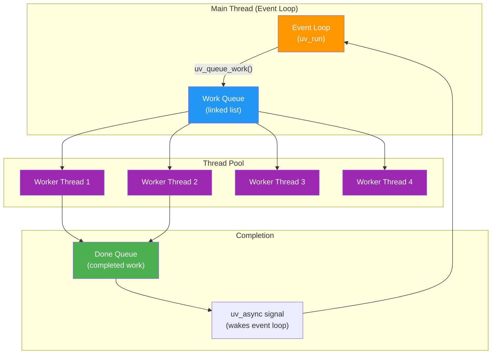
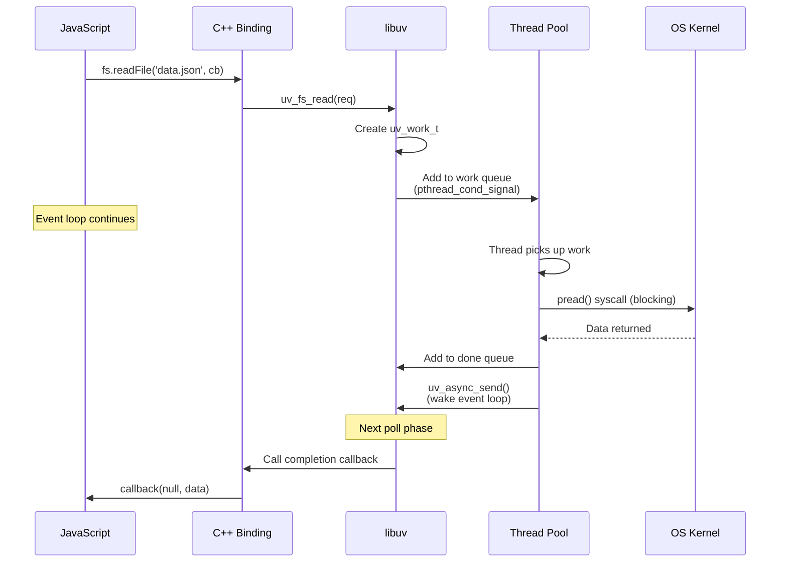

# Lesson 02 — Thread Pool Deep Dive

## Concept

libuv's thread pool is a fixed-size pool of worker threads that execute blocking operations so the main event loop thread isn't blocked. Understanding its internals explains why `fs.readFile()` and `crypto.pbkdf2()` compete for the same resources.

---

## Architecture



---

## How Work Submission Works



---

## Thread Pool Internals

### The Work Queue

```c
// Simplified from deps/uv/src/threadpool.c

static uv_mutex_t mutex;       // Protects the queue
static uv_cond_t cond;         // Signals threads
static QUEUE wq;               // Work queue (doubly-linked list)
static unsigned int nthreads;   // Number of threads (default 4)

void uv_queue_work(uv_loop_t* loop, uv_work_t* req,
                    uv_work_cb work_cb, uv_after_work_cb after_work_cb) {
    // 1. Lock the mutex
    uv_mutex_lock(&mutex);
    
    // 2. Add work to queue
    QUEUE_INSERT_TAIL(&wq, &req->wq);
    
    // 3. Signal one waiting thread
    uv_cond_signal(&cond);
    
    // 4. Unlock
    uv_mutex_unlock(&mutex);
}

// Each worker thread runs this loop:
void worker(void* arg) {
    for (;;) {
        uv_mutex_lock(&mutex);
        
        // Wait for work
        while (QUEUE_EMPTY(&wq)) {
            uv_cond_wait(&cond, &mutex); // Sleep until signaled
        }
        
        // Dequeue work
        QUEUE* q = QUEUE_HEAD(&wq);
        QUEUE_REMOVE(q);
        uv_mutex_unlock(&mutex);
        
        // Execute the blocking operation
        req->work_cb(req);
        
        // Signal completion to event loop
        uv_async_send(&loop->wq_async);
    }
}
```

### Thread Pool Size

```typescript
// thread-pool-size.ts
import { cpus } from "node:os";

const poolSize = parseInt(process.env.UV_THREADPOOL_SIZE || "4");
const numCPUs = cpus().length;

console.log(`Thread pool size: ${poolSize}`);
console.log(`CPU cores: ${numCPUs}`);
console.log(`\nRecommendations:`);
console.log(`  CPU-heavy workload: UV_THREADPOOL_SIZE=${numCPUs}`);
console.log(`  I/O-heavy workload: UV_THREADPOOL_SIZE=${Math.min(numCPUs * 2, 128)}`);
console.log(`  Mixed workload: UV_THREADPOOL_SIZE=${Math.min(numCPUs + 4, 128)}`);
console.log(`\n⚠️  Must be set BEFORE Node.js starts (env var, not runtime)`);
console.log(`  Maximum: 1024 threads`);
```

---

## Code Lab: Thread Pool Experiments

### Experiment 1: Cross-Operation Blocking

```typescript
// cross-blocking.ts
// Demonstrates that fs, crypto, dns, and zlib share the SAME thread pool

import { pbkdf2 } from "node:crypto";
import { readFile } from "node:fs";
import { lookup } from "node:dns";

console.log(`Thread pool size: ${process.env.UV_THREADPOOL_SIZE ?? "4"}`);
console.log("\nStarting 4 crypto + 1 fs + 1 dns operations...\n");

const start = performance.now();

// Saturate with 4 crypto operations (uses all 4 threads)
for (let i = 0; i < 4; i++) {
  pbkdf2("password", "salt", 100_000, 64, "sha512", () => {
    console.log(`crypto ${i + 1}: ${(performance.now() - start).toFixed(0)}ms`);
  });
}

// These must WAIT for a thread
readFile("/etc/hostname", () => {
  console.log(`fs.readFile: ${(performance.now() - start).toFixed(0)}ms`);
  console.log(`  ↑ DELAYED by crypto! File read should be <1ms but waited for thread`);
});

lookup("google.com", () => {
  console.log(`dns.lookup: ${(performance.now() - start).toFixed(0)}ms`);
  console.log(`  ↑ DELAYED by crypto! DNS should be <10ms but waited for thread`);
});
```

Run with default pool and then expanded pool:

```bash
node cross-blocking.ts
UV_THREADPOOL_SIZE=8 node cross-blocking.ts
```

### Experiment 2: Measuring Queue Depth

```typescript
// queue-depth.ts
import { stat } from "node:fs";

const CONCURRENT_OPS = 100;
const start = performance.now();
let completed = 0;

const results: Array<{ id: number; duration: number }> = [];

for (let i = 0; i < CONCURRENT_OPS; i++) {
  const opStart = performance.now();
  
  stat("/etc/hostname", () => {
    completed++;
    results.push({
      id: i,
      duration: performance.now() - opStart,
    });
    
    if (completed === CONCURRENT_OPS) {
      results.sort((a, b) => a.duration - b.duration);
      
      const poolSize = parseInt(process.env.UV_THREADPOOL_SIZE || "4");
      console.log(`${CONCURRENT_OPS} fs.stat() operations with pool size ${poolSize}:`);
      console.log(`  Fastest:  ${results[0].duration.toFixed(1)}ms`);
      console.log(`  Median:   ${results[Math.floor(results.length / 2)].duration.toFixed(1)}ms`);
      console.log(`  Slowest:  ${results[results.length - 1].duration.toFixed(1)}ms`);
      console.log(`  Total:    ${(performance.now() - start).toFixed(1)}ms`);
      console.log(`\n  Expected batches: ${Math.ceil(CONCURRENT_OPS / poolSize)}`);
      console.log(`  You should see ${poolSize} operations complete at each step`);
    }
  });
}
```

### Experiment 3: io_uring (Linux 5.1+)

Modern Linux kernels support `io_uring` — truly async file I/O without the thread pool:

```typescript
// io-uring-check.ts
import { execSync } from "node:child_process";

try {
  const kernel = execSync("uname -r", { encoding: "utf8" }).trim();
  const [major, minor] = kernel.split(".").map(Number);
  
  console.log(`Kernel: ${kernel}`);
  console.log(`io_uring support: ${major > 5 || (major === 5 && minor >= 1) ? "YES" : "NO"}`);
  
  if (major > 5 || (major === 5 && minor >= 1)) {
    console.log(`\nio_uring enables truly async file I/O:`);
    console.log(`  - No thread pool needed for fs operations`);
    console.log(`  - Direct kernel async completion`);
    console.log(`  - libuv is adding io_uring support incrementally`);
    console.log(`  - Node.js may use io_uring for fs in future versions`);
  }
} catch {
  console.log("Could not determine kernel version (not Linux?)");
}
```

---

## Real-World Production Use Cases

### 1. DNS Resolution Bottleneck

```typescript
// dns-bottleneck.ts
import { lookup } from "node:dns";
import { Resolver } from "node:dns/promises";

// BAD: dns.lookup uses thread pool — blocks fs operations
// If you're making HTTP requests to many different hosts,
// each dns.lookup() consumes a thread pool slot

// GOOD: dns.resolve uses c-ares (async, no thread pool)
const resolver = new Resolver();

async function resolveHost(hostname: string): Promise<string[]> {
  try {
    return await resolver.resolve4(hostname);
  } catch {
    // Fallback to thread-pool lookup
    return new Promise((resolve, reject) => {
      lookup(hostname, 4, (err, address) => {
        if (err) reject(err);
        else resolve([address]);
      });
    });
  }
}
```

### 2. Sizing Thread Pool for Production

```typescript
// production-pool-sizing.ts
import { cpus } from "node:os";

interface WorkloadProfile {
  heavyCrypto: boolean;    // bcrypt, pbkdf2 per request
  manyFileOps: boolean;    // Lots of fs reads
  externalAPIs: boolean;   // HTTP to other services (dns.lookup)
  compression: boolean;    // zlib on responses
}

function recommendPoolSize(profile: WorkloadProfile): number {
  const cores = cpus().length;
  let size = 4; // default

  if (profile.heavyCrypto) size = Math.max(size, cores);
  if (profile.manyFileOps) size += 4;
  if (profile.externalAPIs) size += 4; // for dns.lookup
  if (profile.compression) size += 2;

  return Math.min(size, 128); // Don't go crazy
}

const myProfile: WorkloadProfile = {
  heavyCrypto: true,   // bcrypt on every login
  manyFileOps: false,
  externalAPIs: true,  // Calls to payment API, email service
  compression: true,   // gzip responses
};

const recommended = recommendPoolSize(myProfile);
console.log(`Recommended UV_THREADPOOL_SIZE=${recommended}`);
console.log(`Set in Dockerfile: ENV UV_THREADPOOL_SIZE=${recommended}`);
```

---

## Interview Questions

### Q1: "How does the libuv thread pool work?"

**Answer**: libuv maintains a fixed pool of OS threads (default 4, configurable via `UV_THREADPOOL_SIZE`). When a blocking operation like `fs.readFile()` is called, it's added to a work queue. Worker threads pull from this queue, execute the blocking syscall, and post results to a completion queue. The main event loop thread is signaled via `uv_async_send()` and processes completions in the next poll phase.

### Q2: "Why do fs operations, crypto, and DNS share the same thread pool?"

**Answer**: libuv has a single general-purpose thread pool because all these operations share the same fundamental problem — they involve blocking syscalls that can't be done asynchronously on most platforms. The pool is shared because having separate pools would waste resources when one type of operation is idle. The downside is cross-contamination: heavy crypto work can delay simple file reads.

### Q3: "What is io_uring and how does it affect Node.js?"

**Answer**: `io_uring` is a Linux kernel feature (5.1+) that provides truly asynchronous file I/O, eliminating the need for a thread pool for filesystem operations. It works by sharing ring buffers between user space and kernel space. libuv is gradually adding `io_uring` support. When fully integrated, `fs` operations won't compete with `crypto` for thread pool slots on io_uring-capable kernels.
