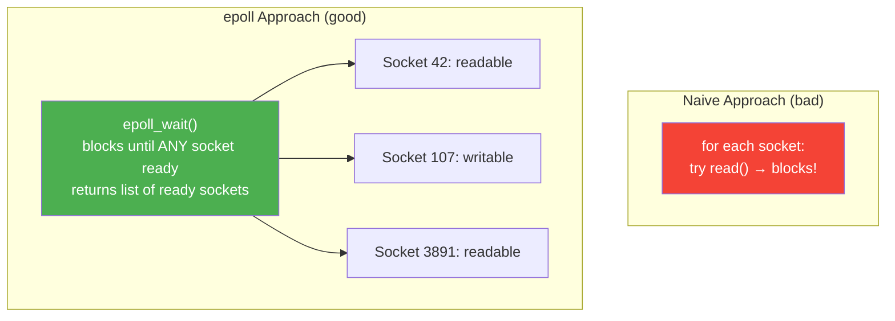
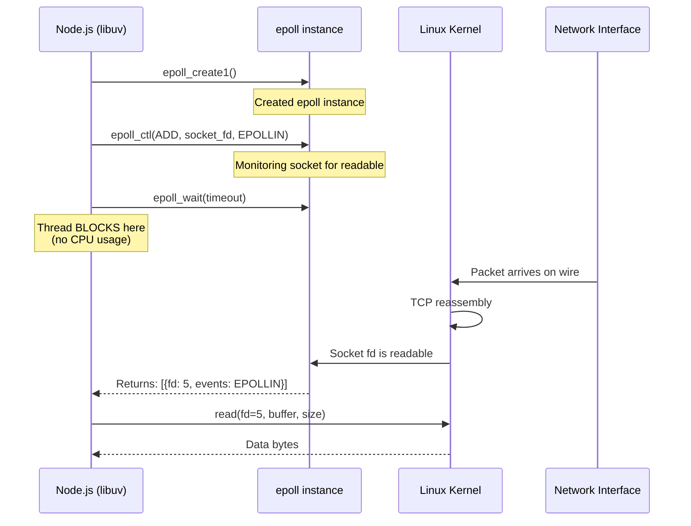
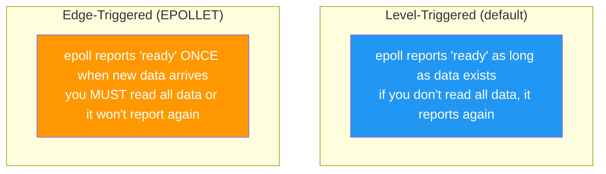
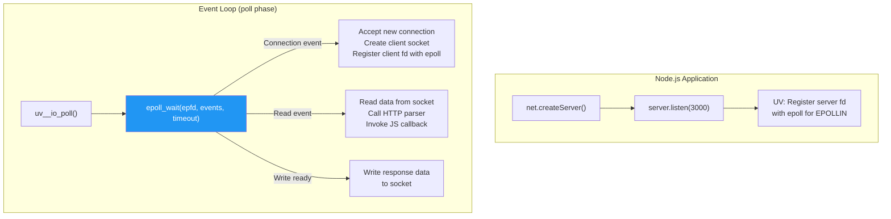
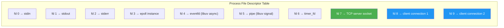

# Lesson 03 — Kernel Async I/O

## Concept

Network I/O in Node.js doesn't use the thread pool — it uses the kernel's own async notification system. This lesson explains how `epoll` (Linux), `kqueue` (macOS), and `IOCP` (Windows) work, and how libuv uses them.

---

## The Problem

You have 10,000 TCP connections. You need to know when any of them has data to read. You can't call `read()` on each one — that blocks. You need the OS to **tell you** which sockets are ready.



---

## epoll (Linux)

### How It Works



### Three epoll Operations

```typescript
// Conceptual — these are C syscalls, not JS APIs
// But understanding them explains libuv behavior

// 1. epoll_create1() — Create an epoll instance
//    Called once when libuv initializes

// 2. epoll_ctl(epfd, EPOLL_CTL_ADD, fd, events)
//    Register a file descriptor for monitoring
//    Called when you do: server.listen(), net.connect(), etc.

// 3. epoll_wait(epfd, events, maxevents, timeout)
//    BLOCK until registered fds have events (or timeout)
//    Called once per event loop iteration (the poll phase)
```

### Edge-Triggered vs Level-Triggered



libuv uses **level-triggered** epoll by default for simplicity and safety. Edge-triggered is more performant but harder to use correctly.

---

## kqueue (macOS/BSD)

kqueue is macOS's equivalent of epoll. Same concept, different API:

```typescript
// Conceptual equivalent:
// kqueue()         ≈ epoll_create1()
// kevent(register) ≈ epoll_ctl()
// kevent(wait)     ≈ epoll_wait()
```

Key difference: kqueue uses a single `kevent()` call for both registration and waiting. It also supports more event types (file changes, process events, signals).

---

## How libuv Uses epoll/kqueue



---

## Code Lab: Seeing Kernel I/O in Action

### Experiment 1: strace a TCP Server

```typescript
// tcp-server.ts
import { createServer } from "node:net";

const server = createServer((socket) => {
  socket.write("Hello!\n");
  socket.end();
});

server.listen(4000, () => {
  console.log("Server listening on :4000");
});
```

```bash
# Run with strace to see syscalls
strace -e trace=epoll_create1,epoll_ctl,epoll_wait,accept4,read,write \
  -f node tcp-server.ts 2>&1 | head -50

# In another terminal:
echo "hi" | nc localhost 4000
```

You'll see:
```
epoll_create1(EPOLL_CLOEXEC)        = 5    ← libuv creates epoll
epoll_ctl(5, EPOLL_CTL_ADD, 7, ...)         ← register server socket
epoll_wait(5, [...], 1024, -1)              ← block waiting for connections
accept4(7, ...) = 8                         ← new connection!
epoll_ctl(5, EPOLL_CTL_ADD, 8, ...)         ← register client socket
write(8, "Hello!\n", 7)                     ← send response
```

### Experiment 2: Connection Capacity

```typescript
// connection-capacity.ts
import { createServer, Socket } from "node:net";

let connectionCount = 0;
const connections = new Set<Socket>();

const server = createServer((socket) => {
  connectionCount++;
  connections.add(socket);
  
  socket.on("close", () => {
    connections.delete(socket);
  });
  
  socket.on("data", (data) => {
    socket.write(`Echo: ${data}`);
  });
});

server.listen(4001, () => {
  console.log("Server on :4001");
  console.log("Each connection is just an fd in epoll — minimal memory");
});

// Report every 2 seconds
setInterval(() => {
  const mem = process.memoryUsage();
  console.log(
    `Connections: ${connections.size} | ` +
    `RSS: ${(mem.rss / 1024 / 1024).toFixed(1)}MB | ` +
    `Heap: ${(mem.heapUsed / 1024 / 1024).toFixed(1)}MB`
  );
}, 2000);
```

Test with thousands of connections:
```bash
# Use autocannon or a simple connection flood
for i in $(seq 1 1000); do nc -q 0 localhost 4001 &; done
```

---

## File Descriptors

Every I/O resource in Unix is a **file descriptor** — an integer that references a kernel object:

```typescript
// fd-exploration.ts
import { openSync, closeSync, readFileSync } from "node:fs";
import { createServer } from "node:net";

// stdin=0, stdout=1, stderr=2
// Node.js uses fds 3+ for internal resources

// Open a file — get a file descriptor
const fd = openSync("/etc/hostname", "r");
console.log(`File descriptor for /etc/hostname: ${fd}`);
closeSync(fd);

// Check process file descriptors on Linux
try {
  const fds = readFileSync("/proc/self/fd", "utf8");
  console.log("\nOpen file descriptors for this process:");
  
  const { readdirSync, readlinkSync } = await import("node:fs");
  const fdDir = "/proc/self/fd";
  const fdList = readdirSync(fdDir);
  
  for (const fd of fdList.slice(0, 20)) {
    try {
      const target = readlinkSync(`${fdDir}/${fd}`);
      console.log(`  fd ${fd} → ${target}`);
    } catch {
      console.log(`  fd ${fd} → (cannot read)`);
    }
  }
} catch {
  console.log("(fd exploration requires Linux /proc filesystem)");
}
```



---

## Interview Questions

### Q1: "How does Node.js handle thousands of concurrent connections on one thread?"

**Answer**: Node.js uses the kernel's I/O multiplexing mechanism — `epoll` on Linux, `kqueue` on macOS. Instead of dedicating a thread per connection, libuv registers all socket file descriptors with a single epoll instance. The `epoll_wait()` syscall blocks efficiently until any registered fd has data. The kernel does the work of monitoring all connections, and the single Node.js thread only wakes up when there's actual work to do. This is why Node.js uses very little memory per connection compared to thread-per-connection servers.

### Q2: "What is the difference between blocking and non-blocking I/O?"

**Answer**: 
- **Blocking I/O**: The `read()` syscall blocks the calling thread until data is available. The thread cannot do anything else.
- **Non-blocking I/O**: The `read()` call returns immediately with `EAGAIN` if no data is available. The program must check again later.
- **I/O multiplexing** (what Node uses): `epoll_wait()` blocks until ANY of the monitored descriptors are ready, then returns which ones are ready. The thread blocks, but on ALL connections simultaneously, not just one.

### Q3: "Why doesn't network I/O use the thread pool?"

**Answer**: Network I/O doesn't need the thread pool because the kernel provides async notification via epoll/kqueue. The OS kernel already knows when a socket has data and can notify the application without blocking. File system I/O, on the other hand, doesn't have this kernel-level async support on most platforms (except io_uring on newer Linux), so it requires the thread pool to avoid blocking the event loop.
