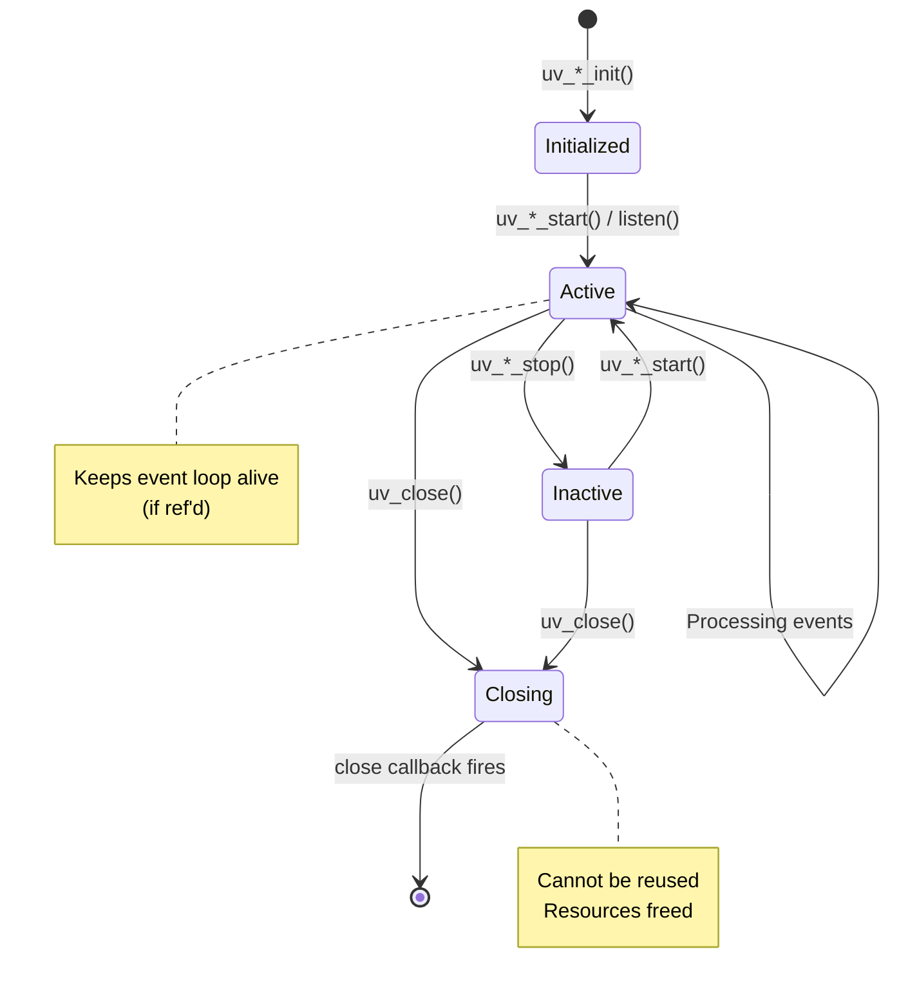
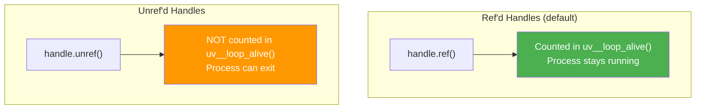

# Lesson 04 — libuv Handles and Watchers

## Concept

Handles are libuv's abstraction for long-lived resources. Every `setInterval`, every TCP server, every file watcher is a handle. Understanding handles explains why your Node.js process stays alive (or doesn't) and how `ref()`/`unref()` control process lifetime.

---

## Handle Lifecycle



---

## Handle Types in Practice

```typescript
// handle-types.ts
import { createServer } from "node:net";
import { watch } from "node:fs";

// List all active handles
function logHandles() {
  const handles = (process as any)._getActiveHandles();
  console.log(`\nActive handles (${handles.length}):`);
  for (const h of handles) {
    const type = h.constructor.name;
    const ref = typeof h.hasRef === "function" ? h.hasRef() : "unknown";
    console.log(`  ${type} (ref'd: ${ref})`);
  }
}

// Timer handle
const timer = setInterval(() => {}, 10_000);
console.log("After setInterval:");
logHandles();

// TCP server handle
const server = createServer();
server.listen(0, () => {
  console.log("\nAfter server.listen:");
  logHandles();
  
  // Unref the timer — it no longer keeps the loop alive
  timer.unref();
  console.log("\nAfter timer.unref():");
  logHandles();
  
  // Close the server
  server.close(() => {
    console.log("\nAfter server.close:");
    logHandles();
    clearInterval(timer);
  });
});
```

---

## ref() and unref()



```typescript
// ref-unref.ts
// Demonstrate ref/unref effect on process lifetime

// Scenario 1: Timer keeps process alive (default)
// Uncomment to test:
// setTimeout(() => console.log("timer"), 5000); // Process waits 5s

// Scenario 2: Unref'd timer — process exits immediately
const timer = setTimeout(() => {
  console.log("This might not print if nothing else keeps the loop alive");
}, 5000);
timer.unref();

console.log("Main code done. Process will exit because timer is unref'd.");

// Scenario 3: Common pattern — monitoring timer that shouldn't prevent exit
import { monitorEventLoopDelay } from "node:perf_hooks";

const monitor = monitorEventLoopDelay();
monitor.enable();
// monitor is unref'd by default — won't keep process alive
// This is the correct design for monitoring/diagnostic tools
```

### Production Use Case: Health Check Server

```typescript
// health-check.ts
import { createServer } from "node:http";

// Main server — keeps process alive (ref'd)
const mainServer = createServer((req, res) => {
  res.end("OK");
});
mainServer.listen(3000);

// Health check server — should NOT keep process alive on its own
const healthServer = createServer((req, res) => {
  res.writeHead(200);
  res.end("healthy");
});
healthServer.listen(9090, () => {
  // Unref so health check doesn't prevent shutdown
  healthServer.unref();
  console.log("Health check on :9090 (unref'd)");
});
```

---

## Interview Questions

### Q1: "What does `.unref()` do on a timer or server?"

**Answer**: `.unref()` tells the event loop not to count this handle when determining if the loop should keep running. A ref'd handle keeps the process alive; an unref'd handle doesn't. If all remaining handles are unref'd, the process exits. Common use: monitoring intervals, optional health check servers, or diagnostic timers that shouldn't prevent graceful shutdown.

### Q2: "How do you debug why a Node.js process won't exit?"

**Answer**: Use `process._getActiveHandles()` and `process._getActiveRequests()` (internal APIs) to list what's keeping the loop alive. Common culprits: unclosed database connections, forgotten `setInterval`, active TCP servers, event listeners on long-lived objects. The `why-is-node-running` npm package automates this detection.
