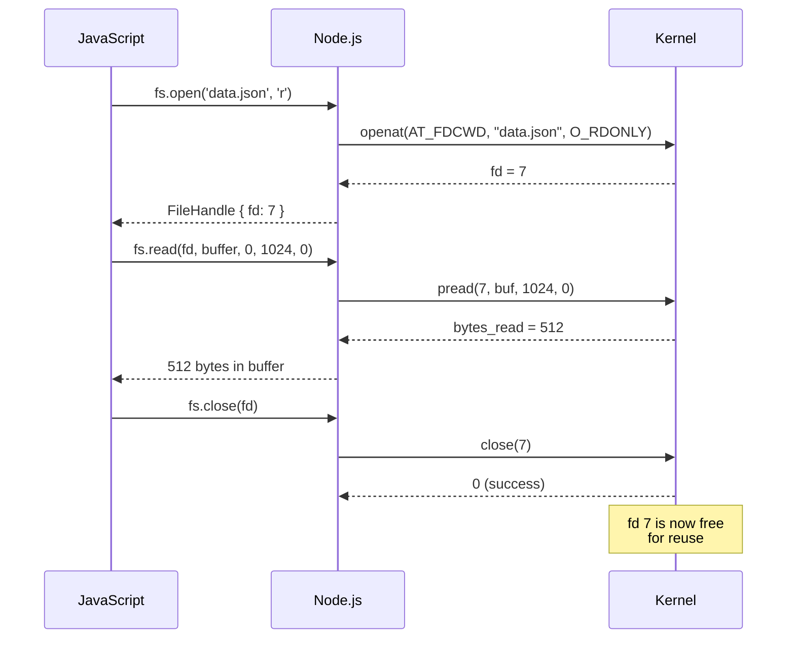

# Lesson 01 — File Descriptors and Syscalls

## Concept

In Unix, everything is a file — regular files, directories, sockets, pipes, devices. Every open resource gets a **file descriptor** (fd) — a non-negative integer that acts as a handle to the kernel object.

---

## File Descriptor Lifecycle



---

## Low-Level File Operations

```typescript
// fd-operations.ts
import { open, read, write, close, stat } from "node:fs/promises";
import { Buffer } from "node:buffer";

async function lowLevelFileOps() {
  // Open — get a file descriptor
  const fh = await open("/etc/hostname", "r");
  console.log(`File descriptor: ${fh.fd}`);

  // Stat — get file metadata (without reading content)
  const stats = await fh.stat();
  console.log(`File size: ${stats.size} bytes`);
  console.log(`Inode: ${stats.ino}`);
  console.log(`Block size: ${stats.blksize}`);
  console.log(`Blocks allocated: ${stats.blocks}`);

  // Read into a buffer
  const buffer = Buffer.alloc(stats.size);
  const { bytesRead } = await fh.read(buffer, 0, stats.size, 0);
  console.log(`Read ${bytesRead} bytes: "${buffer.toString("utf8").trim()}"`);

  // Close — release the file descriptor
  await fh.close();
  console.log("File descriptor released");
}

lowLevelFileOps();
```

---

## How fs.readFile Actually Works

```typescript
// readfile-internals.ts
// Trace what fs.readFile does internally

import { open } from "node:fs/promises";

async function readFileLikeNode(path: string): Promise<Buffer> {
  const fh = await open(path, "r");
  
  try {
    const stats = await fh.stat();
    
    if (stats.size === 0) {
      // Unknown size (e.g., /proc files) — read in chunks
      const chunks: Buffer[] = [];
      const chunkSize = 16384; // 16KB
      let offset = 0;
      
      while (true) {
        const buf = Buffer.alloc(chunkSize);
        const { bytesRead } = await fh.read(buf, 0, chunkSize, offset);
        if (bytesRead === 0) break;
        chunks.push(buf.subarray(0, bytesRead));
        offset += bytesRead;
      }
      
      return Buffer.concat(chunks);
    } else {
      // Known size — allocate exact buffer
      const buffer = Buffer.alloc(stats.size);
      let offset = 0;
      
      while (offset < stats.size) {
        const { bytesRead } = await fh.read(
          buffer, offset, stats.size - offset, offset
        );
        if (bytesRead === 0) break; // EOF
        offset += bytesRead;
      }
      
      return buffer;
    }
  } finally {
    await fh.close();
  }
}

const content = await readFileLikeNode("/etc/hostname");
console.log(`Content: ${content.toString("utf8").trim()}`);
```

---

## fd Leak Detection

```typescript
// fd-leak.ts
import { open } from "node:fs/promises";
import { readdirSync } from "node:fs";

function countOpenFds(): number {
  try {
    return readdirSync("/proc/self/fd").length;
  } catch {
    return -1; // Not on Linux
  }
}

async function leakyFunction() {
  // ❌ BAD: Opens file but never closes it
  const fh = await open("/etc/hostname", "r");
  const buf = Buffer.alloc(1024);
  await fh.read(buf, 0, 1024, 0);
  // Missing: await fh.close();
  // fd is leaked! Kernel resource not freed.
}

async function safeFunction() {
  // ✅ GOOD: Using try/finally
  const fh = await open("/etc/hostname", "r");
  try {
    const buf = Buffer.alloc(1024);
    await fh.read(buf, 0, 1024, 0);
  } finally {
    await fh.close();
  }
}

async function main() {
  console.log(`Open fds before: ${countOpenFds()}`);
  
  // Leak 100 file descriptors
  for (let i = 0; i < 100; i++) {
    await leakyFunction();
  }
  
  console.log(`Open fds after leaks: ${countOpenFds()}`);
  console.log("⚠️  Each leaked fd consumes kernel memory");
  console.log("⚠️  Eventually you'll hit ulimit -n and get EMFILE errors");
  
  // Check system limits
  const { execSync } = await import("node:child_process");
  try {
    const limit = execSync("ulimit -n", { encoding: "utf8" }).trim();
    console.log(`\nFile descriptor limit: ${limit}`);
  } catch {}
}

main();
```

---

## Interview Questions

### Q1: "What is a file descriptor?"

**Answer**: A file descriptor is a non-negative integer that the kernel assigns when you open a file, socket, pipe, or any I/O resource. It's an index into the process's file descriptor table, which maps to kernel data structures describing the resource. Standard fds are: 0 (stdin), 1 (stdout), 2 (stderr). New opens get the lowest available fd number.

### Q2: "What happens if you don't close file descriptors?"

**Answer**: Leaked file descriptors consume kernel memory and count against the per-process limit (typically 1024 via `ulimit -n`). When the limit is reached, `open()` fails with `EMFILE` ("too many open files"), which crashes any code trying to read files, open sockets, or accept connections. In production, fd leaks are one of the most common causes of "works for a while, then crashes" behavior.

### Q3: "What is the difference between fs.readFile and fs.createReadStream?"

**Answer**: `fs.readFile()` reads the entire file into a single Buffer in memory — simple but dangerous for large files (100MB file = 100MB of RAM). `fs.createReadStream()` reads in chunks (default 64KB), emitting them as events. Only one chunk needs to be in memory at a time, making it suitable for files of any size. Under the hood, both use the same libuv thread pool and `pread()` syscall, but streams control how much data is read at once.
