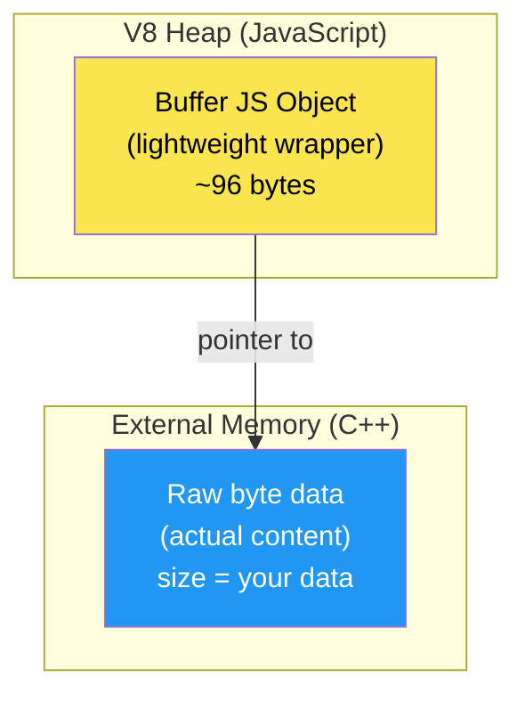
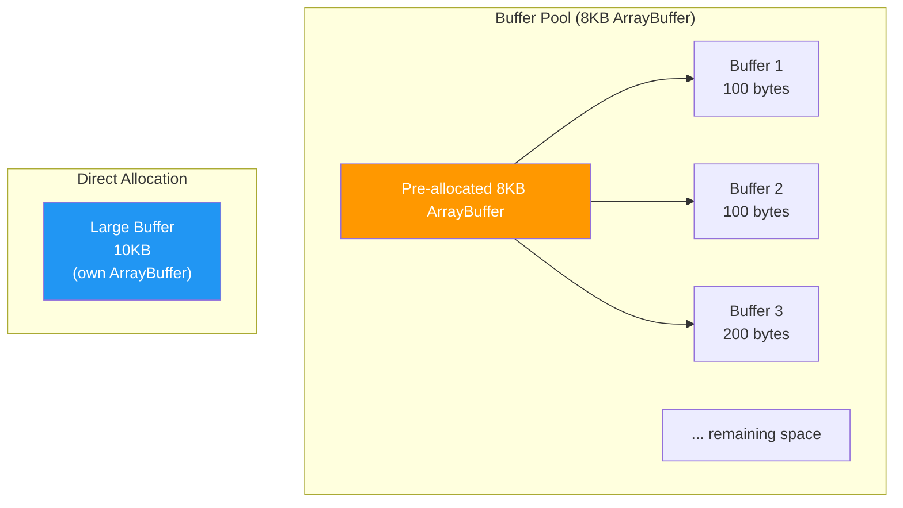

# Lesson 02 — Buffers: The Memory Bridge

## Concept

Buffers are Node.js's mechanism for working with raw binary data. They live **outside** the V8 heap in C++ memory, which has profound implications for memory management and performance.

---

## Buffer Memory Layout



---

## Buffer Allocation Strategies

```typescript
// buffer-allocation.ts

// 1. Buffer.alloc(size) — Initialized to zeros (SAFE, slightly slower)
const safe = Buffer.alloc(1024); // 1KB of zeros
console.log(`alloc: first byte = ${safe[0]}`); // Always 0

// 2. Buffer.allocUnsafe(size) — NOT zeroed (FAST, may contain old data)
const unsafe = Buffer.allocUnsafe(1024);
console.log(`allocUnsafe: first byte = ${unsafe[0]}`); // Could be anything!
// ⚠️ May contain data from previous allocations — SECURITY RISK if exposed

// 3. Buffer.from() — Create from existing data
const fromString = Buffer.from("Hello, World!", "utf8");
const fromArray = Buffer.from([0x48, 0x65, 0x6c, 0x6c, 0x6f]);
const fromBuffer = Buffer.from(fromString); // Copy

// 4. Buffer pool — allocUnsafe uses a pre-allocated pool for small buffers
const small1 = Buffer.allocUnsafe(100); // From pool (< 4KB)
const small2 = Buffer.allocUnsafe(100); // From same pool
const large = Buffer.allocUnsafe(10_000); // Direct allocation (>= 4KB)

console.log(`\nSmall buffer 1 offset: ${small1.byteOffset}`);
console.log(`Small buffer 2 offset: ${small2.byteOffset}`);
console.log(`Large buffer offset: ${large.byteOffset}`);
console.log("Small buffers share the same underlying ArrayBuffer (pool)");
```



---

## Zero-Copy Techniques

```typescript
// zero-copy.ts
// Avoid copying data when possible

// COPY — creates new memory
const original = Buffer.from("Hello, World!");
const copy = Buffer.from(original); // Full copy
copy[0] = 0x4A; // 'J' — doesn't affect original

// ZERO-COPY — shares memory via subarray/slice
const shared = original.subarray(0, 5); // No copy!
shared[0] = 0x4A; // Changes BOTH shared AND original!
console.log(original.toString()); // "Jello, World!" — original was modified!

// Zero-copy with ArrayBuffer
const ab = new ArrayBuffer(1024);
const view1 = Buffer.from(ab, 0, 512);   // First 512 bytes
const view2 = Buffer.from(ab, 512, 512); // Second 512 bytes
// Both views share the same underlying memory — no copy
```

---

## Buffer Performance

```typescript
// buffer-perf.ts

const SIZE = 10 * 1024 * 1024; // 10MB
const ITERATIONS = 100;

// Benchmark: alloc vs allocUnsafe
console.log(`Allocating ${SIZE / 1024 / 1024}MB buffers ${ITERATIONS} times:\n`);

let start = performance.now();
for (let i = 0; i < ITERATIONS; i++) {
  Buffer.alloc(SIZE);
}
console.log(`Buffer.alloc:       ${(performance.now() - start).toFixed(0)}ms`);

start = performance.now();
for (let i = 0; i < ITERATIONS; i++) {
  Buffer.allocUnsafe(SIZE);
}
console.log(`Buffer.allocUnsafe: ${(performance.now() - start).toFixed(0)}ms`);

// Benchmark: String encoding
const testString = "Hello World! ".repeat(100_000);

start = performance.now();
for (let i = 0; i < 100; i++) {
  Buffer.from(testString, "utf8");
}
console.log(`\nString → Buffer (utf8): ${(performance.now() - start).toFixed(0)}ms`);

start = performance.now();
const buf = Buffer.from(testString, "utf8");
for (let i = 0; i < 100; i++) {
  buf.toString("utf8");
}
console.log(`Buffer → String (utf8): ${(performance.now() - start).toFixed(0)}ms`);
```

---

## Interview Questions

### Q1: "Where does Buffer data live in memory?"

**Answer**: Buffer data lives in **external C++ memory**, outside the V8 heap. The JavaScript Buffer object on the V8 heap is a lightweight wrapper (~96 bytes) that contains a pointer to the external data. This means large Buffers don't contribute to V8 heap pressure or count against `--max-old-space-size`. However, they do increase RSS and are tracked by V8 for GC purposes via `process.memoryUsage().external`.

### Q2: "What is the difference between Buffer.alloc() and Buffer.allocUnsafe()?"

**Answer**: `Buffer.alloc(n)` allocates `n` bytes and fills them with zeros. `Buffer.allocUnsafe(n)` allocates without zeroing — the memory may contain data from previous allocations. `allocUnsafe` is faster (no memset call) but is a security risk if the buffer content is ever exposed to users without being fully written to first. Small `allocUnsafe` calls (< 4KB) use a pre-allocated pool for even better performance.

### Q3: "What is zero-copy and when would you use it?"

**Answer**: Zero-copy means creating a view into existing memory without duplicating the data. `Buffer.subarray()` creates a new Buffer object that shares the same underlying `ArrayBuffer` — modifying either buffer affects both. Use it when processing parts of a large buffer (e.g., parsing protocol headers from a received packet) to avoid allocation overhead. Be careful: the original large buffer can't be garbage collected while any view still references it.
