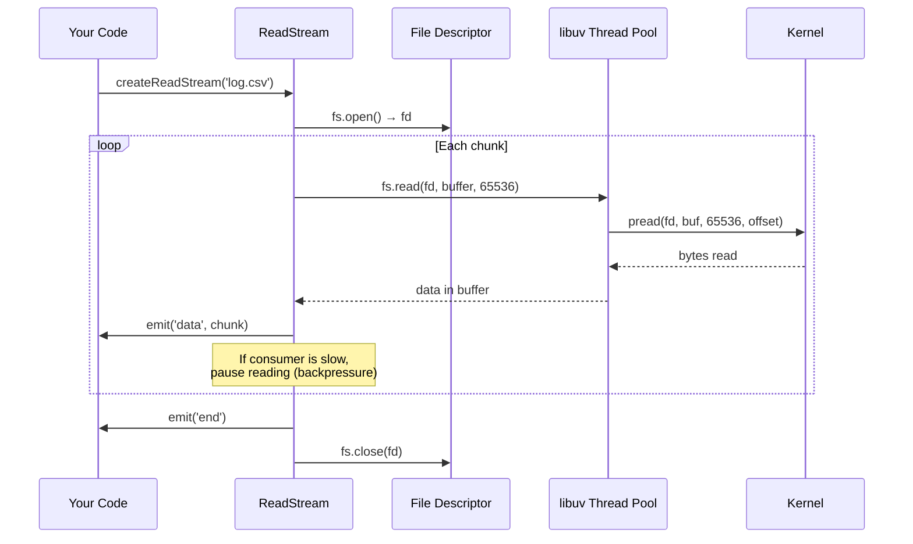

# Lesson 03 — Streams for File I/O

## Concept

Streams are Node.js's answer to processing data that doesn't fit in memory — or that you don't want to wait for entirely before processing. Instead of loading a 10GB file into RAM, you process it 64KB at a time.

---

## ReadStream Internals



```typescript
// readstream-demo.ts
import { createReadStream, writeFileSync } from "node:fs";

// Create a test file
writeFileSync("/tmp/test-data.txt", "Line\n".repeat(100_000));

// Stream it
const stream = createReadStream("/tmp/test-data.txt", {
  highWaterMark: 16 * 1024, // 16KB chunks (default is 64KB)
  encoding: "utf8",
});

let chunks = 0;
let totalBytes = 0;

stream.on("data", (chunk: string) => {
  chunks++;
  totalBytes += Buffer.byteLength(chunk);
});

stream.on("end", () => {
  console.log(`Chunks received: ${chunks}`);
  console.log(`Total bytes: ${totalBytes}`);
  console.log(`Average chunk size: ${(totalBytes / chunks / 1024).toFixed(1)}KB`);
  console.log(`Memory used: ${(process.memoryUsage().heapUsed / 1024 / 1024).toFixed(1)}MB`);
});
```

---

## Memory Comparison: readFile vs ReadStream

```typescript
// memory-comparison.ts
import { readFile } from "node:fs/promises";
import { createReadStream, writeFileSync } from "node:fs";

// Create a 100MB test file
const filePath = "/tmp/large-file.bin";
console.log("Creating 100MB test file...");
writeFileSync(filePath, Buffer.alloc(100 * 1024 * 1024));

// Method 1: readFile (loads EVERYTHING into memory)
async function withReadFile() {
  const before = process.memoryUsage().rss;
  const data = await readFile(filePath);
  const after = process.memoryUsage().rss;
  
  console.log(`\nreadFile:`);
  console.log(`  Memory increase: ${((after - before) / 1024 / 1024).toFixed(1)}MB`);
  console.log(`  Buffer size: ${(data.length / 1024 / 1024).toFixed(1)}MB`);
  // Entire file in memory at once!
}

// Method 2: ReadStream (processes in chunks)
async function withStream(): Promise<void> {
  return new Promise((resolve) => {
    const before = process.memoryUsage().rss;
    let bytesProcessed = 0;
    let maxRss = before;
    
    const stream = createReadStream(filePath, {
      highWaterMark: 64 * 1024, // 64KB chunks
    });
    
    stream.on("data", (chunk: Buffer) => {
      bytesProcessed += chunk.length;
      const currentRss = process.memoryUsage().rss;
      if (currentRss > maxRss) maxRss = currentRss;
    });
    
    stream.on("end", () => {
      console.log(`\nReadStream:`);
      console.log(`  Max memory increase: ${((maxRss - before) / 1024 / 1024).toFixed(1)}MB`);
      console.log(`  Bytes processed: ${(bytesProcessed / 1024 / 1024).toFixed(1)}MB`);
      // Only ~64KB in memory at any time!
      resolve();
    });
  });
}

await withReadFile();

// Force GC if available
if (global.gc) global.gc();

await withStream();
```

---

## Building a Log Processor with Streams

```typescript
// log-processor.ts
import { createReadStream, createWriteStream } from "node:fs";
import { createInterface } from "node:readline";
import { pipeline } from "node:stream/promises";
import { Transform } from "node:stream";

// Process a large log file line by line
// Memory stays constant regardless of file size

async function processLogFile(
  inputPath: string,
  outputPath: string,
  filterFn: (line: string) => boolean
): Promise<{ totalLines: number; matchedLines: number }> {
  let totalLines = 0;
  let matchedLines = 0;

  const filter = new Transform({
    transform(chunk: Buffer, encoding, callback) {
      const line = chunk.toString();
      totalLines++;
      
      if (filterFn(line)) {
        matchedLines++;
        this.push(line + "\n");
      }
      
      callback();
    },
  });

  const input = createReadStream(inputPath);
  const rl = createInterface({ input, crlfDelay: Infinity });
  const output = createWriteStream(outputPath);

  for await (const line of rl) {
    totalLines++;
    if (filterFn(line)) {
      matchedLines++;
      output.write(line + "\n");
    }
  }

  output.end();

  return { totalLines, matchedLines };
}

// Generate a test log
import { writeFileSync } from "node:fs";
const logLines = Array.from({ length: 100_000 }, (_, i) => {
  const level = ["INFO", "WARN", "ERROR"][i % 3];
  return `${new Date().toISOString()} [${level}] Request ${i} processed`;
}).join("\n");

writeFileSync("/tmp/app.log", logLines);

const result = await processLogFile(
  "/tmp/app.log",
  "/tmp/errors.log",
  (line) => line.includes("[ERROR]")
);

console.log(`Processed ${result.totalLines} lines, found ${result.matchedLines} errors`);
```

---

## Implementing tail -f

```typescript
// tail-f.ts
import { watch, createReadStream, statSync, openSync, readSync, closeSync } from "node:fs";

function tailFile(filePath: string, lines = 10) {
  // Read last N lines
  let fileSize = statSync(filePath).size;
  const fd = openSync(filePath, "r");
  
  // Read the last 4KB to find recent lines
  const readSize = Math.min(fileSize, 4096);
  const buf = Buffer.alloc(readSize);
  readSync(fd, buf, 0, readSize, fileSize - readSize);
  closeSync(fd);
  
  const content = buf.toString("utf8");
  const lastLines = content.split("\n").slice(-lines - 1);
  console.log(lastLines.join("\n"));
  
  // Watch for changes
  console.log(`\n--- watching ${filePath} ---`);
  
  let lastSize = fileSize;
  
  watch(filePath, (eventType) => {
    if (eventType !== "change") return;
    
    const newSize = statSync(filePath).size;
    if (newSize <= lastSize) {
      lastSize = newSize; // File was truncated
      return;
    }
    
    // Read only the NEW data
    const diffSize = newSize - lastSize;
    const fd = openSync(filePath, "r");
    const buf = Buffer.alloc(diffSize);
    readSync(fd, buf, 0, diffSize, lastSize);
    closeSync(fd);
    
    process.stdout.write(buf.toString("utf8"));
    lastSize = newSize;
  });
}

const targetFile = process.argv[2] ?? "/tmp/app.log";
tailFile(targetFile);

// Test: In another terminal, run:
// echo "new log line" >> /tmp/app.log
```

---

## Interview Questions

### Q1: "When should you use ReadStream instead of readFile?"

**Answer**: Use ReadStream when:
- File size is large or unknown (could exceed available memory)
- You need to process data line-by-line or chunk-by-chunk
- You want to start processing before the entire file is read
- You're piping data to another destination (network, another file)

Use readFile when:
- File is small (< few MB)
- You need the entire content to process it (e.g., JSON.parse)
- Simplicity is preferred and memory isn't a concern

### Q2: "How does createReadStream determine chunk size?"

**Answer**: The `highWaterMark` option (default 64KB for file streams) determines how many bytes are read per `pread()` syscall. After reading a chunk, the stream emits a `'data'` event. If the consumer is slower than the producer, backpressure pauses reading. The internal buffer accumulates up to `highWaterMark` bytes before pausing reads from the filesystem.
