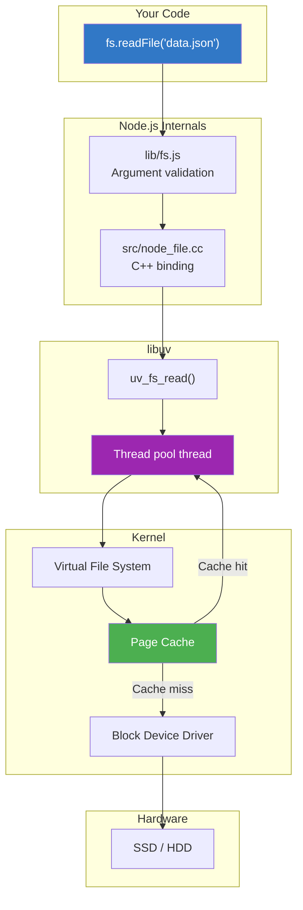

# Module 04 — Filesystem Internals

## Overview

When you call `fs.readFile()`, a complex chain of events unfolds: JavaScript → C++ binding → libuv thread pool → kernel syscall → disk controller → and back. This module traces that entire path and teaches you how to work with the filesystem efficiently.

## Lessons

| # | Lesson | Topics |
|---|--------|--------|
| 1 | [File Descriptors and Syscalls](./01-file-descriptors.md) | open/read/write/close, fd management, /proc/self/fd |
| 2 | [Buffers: The Memory Bridge](./02-buffers.md) | Buffer internals, allocation strategies, ArrayBuffer, zero-copy |
| 3 | [Streams for File I/O](./03-file-streams.md) | ReadStream, WriteStream, memory-efficient processing |
| 4 | [Labs: Build Real File Tools](./04-labs.md) | Implement tail -f, log processor, custom file stream |

## Key Architecture

