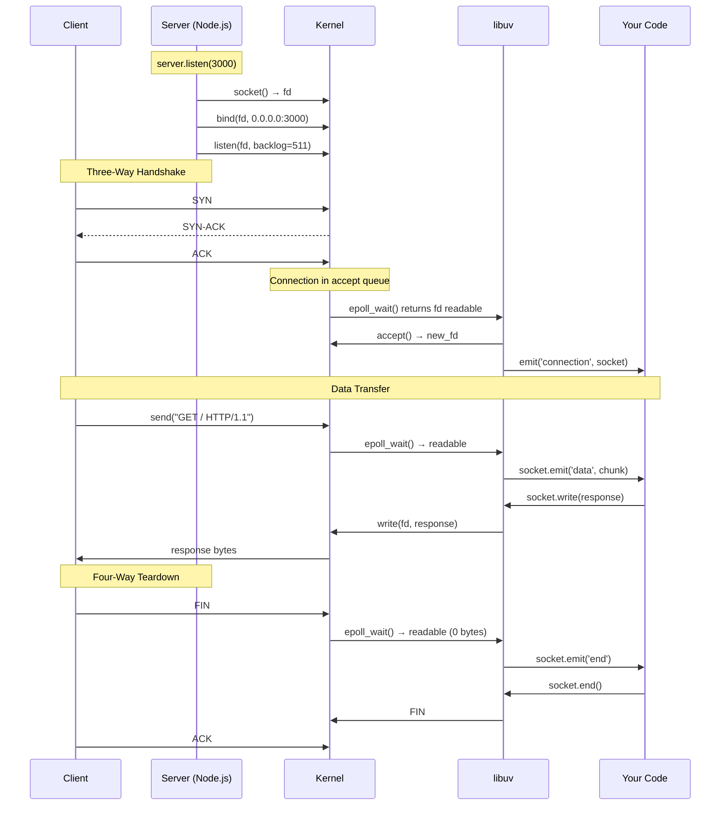
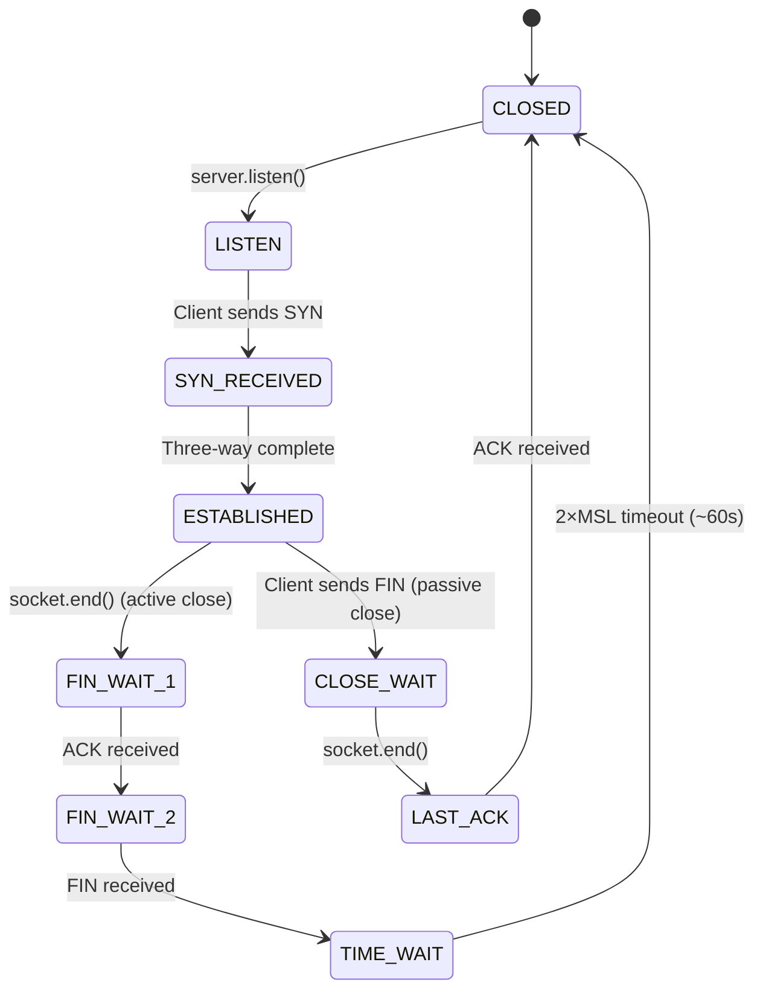

# Lesson 01 — TCP Lifecycle

## Concept

Every HTTP request, WebSocket connection, and database query starts with TCP. Understanding the TCP lifecycle explains why connections take time to establish, why keep-alive matters, and what happens during graceful shutdown.

---

## The Three-Way Handshake



---

## TCP States from Node's Perspective



---

## Server Lifecycle in Code

```typescript
// tcp-lifecycle.ts
import { createServer, Socket } from "node:net";

const server = createServer();

// 1. Kernel: socket() + bind() + listen()
server.listen(3000, "0.0.0.0", () => {
  const addr = server.address();
  console.log(`Listening on ${JSON.stringify(addr)}`);
  // At this point:
  // - kernel has a socket fd
  // - bound to 0.0.0.0:3000
  // - listen backlog = 511 (Node default)
  // - epoll is watching this fd for incoming connections
});

// 2. For each connection: accept() → new fd → wrap in Socket
server.on("connection", (socket: Socket) => {
  console.log(`New connection from ${socket.remoteAddress}:${socket.remotePort}`);
  
  // socket._handle is a TCP C++ wrapper around a libuv uv_tcp_t
  // which wraps a kernel file descriptor
  
  // 3. Data arrives: epoll → libuv → JS
  socket.on("data", (data: Buffer) => {
    console.log(`Received ${data.length} bytes`);
    
    // Echo it back
    socket.write(data);
  });
  
  // 4. Client closes: FIN → 'end' event
  socket.on("end", () => {
    console.log("Client disconnected (FIN received)");
    socket.end(); // Send our FIN
  });
  
  // 5. Both sides closed: 'close' event
  socket.on("close", (hadError: boolean) => {
    console.log(`Socket closed ${hadError ? "with error" : "cleanly"}`);
  });
  
  socket.on("error", (err: Error) => {
    console.error(`Socket error: ${err.message}`);
  });
});

// Graceful shutdown
process.on("SIGTERM", () => {
  console.log("Shutting down...");
  
  // Stop accepting new connections
  server.close(() => {
    console.log("Server closed — no more new connections");
    process.exit(0);
  });
  
  // Force exit after 10s if connections don't drain
  setTimeout(() => {
    console.error("Forced shutdown after timeout");
    process.exit(1);
  }, 10_000).unref(); // .unref() so this doesn't keep event loop alive
});
```

---

## The Backlog Queue

When clients connect faster than your code can accept, the kernel queues connections in the **backlog**. Node.js defaults to 511.

```typescript
// backlog-experiment.ts
import { createServer } from "node:net";
import { connect } from "node:net";

// Server with a tiny backlog
const server = createServer((socket) => {
  // Simulate slow processing — don't read for 1 second
  setTimeout(() => {
    socket.write("OK\n");
    socket.end();
  }, 1000);
});

// Default backlog is 511. Try overriding:
server.listen({ port: 3001, backlog: 5 }, () => {
  console.log("Server listening with backlog=5");
  
  // Flood with connections
  let connected = 0;
  let refused = 0;
  
  for (let i = 0; i < 20; i++) {
    const client = connect(3001, "127.0.0.1");
    
    client.on("connect", () => {
      connected++;
    });
    
    client.on("error", (err: Error) => {
      if (err.message.includes("ECONNREFUSED") || err.message.includes("ECONNRESET")) {
        refused++;
      }
    });
  }
  
  setTimeout(() => {
    console.log(`Connected: ${connected}, Refused: ${refused}`);
    server.close();
  }, 3000);
});
```

---

## TIME_WAIT and Port Exhaustion

After closing a connection, the socket enters TIME_WAIT for ~60 seconds. This can exhaust ports on busy servers.

```typescript
// time-wait-demo.ts
import { createServer, connect } from "node:net";
import { execSync } from "node:child_process";

const server = createServer((socket) => {
  socket.end("bye\n"); // Server closes immediately (active close)
});

server.listen(3002, () => {
  // Create and close many connections
  let completed = 0;
  const total = 100;
  
  for (let i = 0; i < total; i++) {
    const client = connect(3002, () => {
      client.on("data", () => {});
      client.on("end", () => {
        completed++;
        if (completed === total) {
          // Check TIME_WAIT sockets
          try {
            const result = execSync(
              "ss -tan state time-wait | grep 3002 | wc -l",
              { encoding: "utf8" }
            );
            console.log(`TIME_WAIT sockets on port 3002: ${result.trim()}`);
          } catch {
            console.log("Could not check TIME_WAIT (try: ss -tan state time-wait)");
          }
          server.close();
        }
      });
    });
  }
});

// Solutions for TIME_WAIT exhaustion:
// 1. SO_REUSEADDR (Node sets this by default)
// 2. Let CLIENT close first (server sends FIN last)
// 3. Use keep-alive to reuse connections
// 4. Tune kernel: net.ipv4.tcp_tw_reuse = 1
```

---

## Observing with strace

```bash
# See exactly what syscalls Node makes for TCP
strace -e trace=socket,bind,listen,accept4,epoll_wait,read,write \
  node --experimental-strip-types tcp-lifecycle.ts

# You'll see:
# socket(AF_INET, SOCK_STREAM, 0) = 12
# bind(12, {sa_family=AF_INET, sin_port=htons(3000)}, 16) = 0  
# listen(12, 511) = 0
# epoll_wait(5, [...], 1024, -1) = 1  ← blocks until connection
# accept4(12, ...) = 13               ← new fd for connection
# read(13, "GET / HTTP/1.1\r\n...", 65536) = 89
# write(13, "HTTP/1.1 200 OK\r\n...", 45) = 45
```

---

## Interview Questions

### Q1: "What happens when a client connects to a Node.js server?"

**Answer**: The kernel completes the TCP three-way handshake (SYN → SYN-ACK → ACK) and places the connection in the accept queue. During the event loop's poll phase, `epoll_wait()` returns indicating the server socket is readable. libuv calls `accept()` to get a new file descriptor, wraps it in a `uv_tcp_t` handle, and Node's C++ layer creates a `TCPWrap` object. This triggers the JavaScript `'connection'` event with a `net.Socket` instance wrapping the new fd.

### Q2: "Why does Node default to a backlog of 511?"

**Answer**: The listen backlog is the kernel's queue of completed TCP connections waiting to be `accept()`ed. Linux has historically used 128 as its default (`SOMAXCONN`), but modern Linux allows higher values. Node uses 511 because the kernel internally rounds up to the next power of 2, so 511 → 512 slots. A too-small backlog causes connection drops under load; a too-large backlog wastes memory.

### Q3: "What is TIME_WAIT and why does it matter?"

**Answer**: After the side that initiates the close (sends FIN first) completes the four-way teardown, the socket enters TIME_WAIT for 2×MSL (~60s on Linux). This prevents old packets from a previous connection being confused with a new one using the same port pair. On busy servers, thousands of TIME_WAIT sockets can exhaust ephemeral ports (default range: 32768-60999). Mitigation: use keep-alive connections, let the client initiate the close, or tune `tcp_tw_reuse`.
