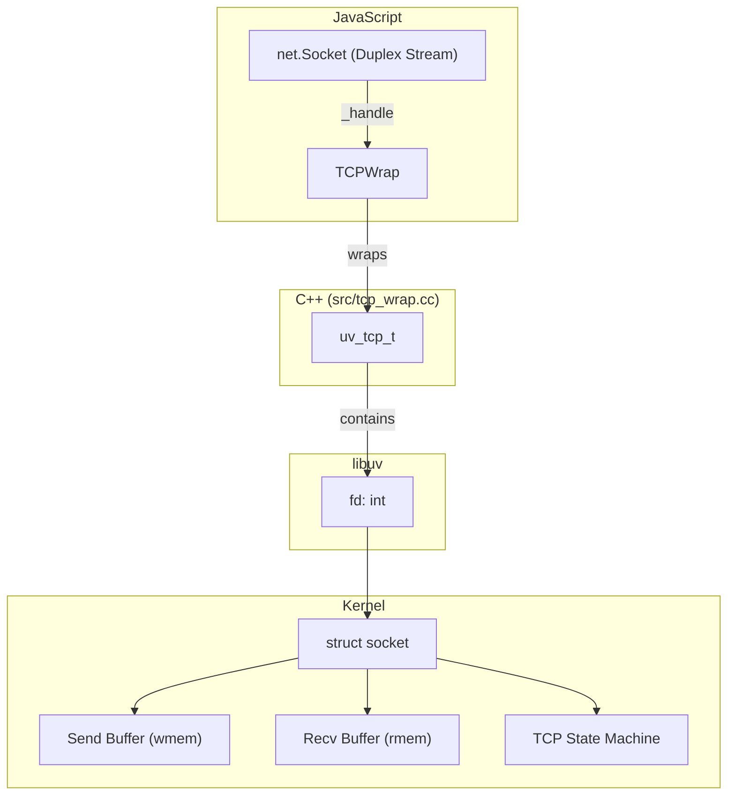
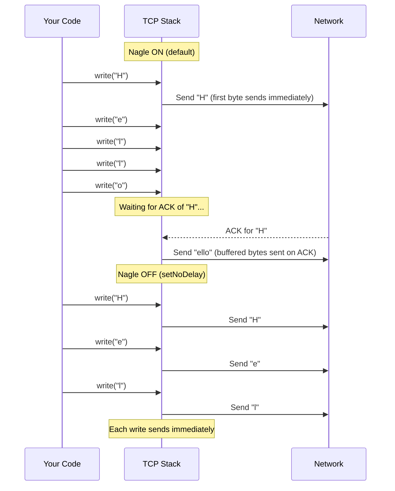

# Lesson 02 — Socket Internals

## Concept

A Node.js `net.Socket` is a thin JavaScript wrapper around a C++ `TCPWrap`, which wraps a libuv `uv_tcp_t`, which wraps a kernel file descriptor. Understanding the layers explains socket options, Nagle's algorithm, keep-alive, and why certain configurations matter for performance.

---

## Socket Object Anatomy



---

## Socket Options That Matter

```typescript
// socket-options.ts
import { createServer, createConnection, Socket } from "node:net";

const server = createServer((socket: Socket) => {
  // --- TCP_NODELAY (Nagle's Algorithm) ---
  // By default, TCP buffers small writes and sends them together
  // This adds up to 200ms latency for small packets
  // ALWAYS disable for interactive/real-time apps
  socket.setNoDelay(true);
  
  // --- Keep-Alive ---
  // Sends TCP keep-alive probes to detect dead connections
  // Without this, a client that crashes leaves a "ghost" connection
  socket.setKeepAlive(true, 30_000); // Probe every 30 seconds
  
  // --- Timeout ---
  // Fires 'timeout' event if no data received within N ms
  // Does NOT close the socket — you must do that yourself
  socket.setTimeout(60_000); // 60 second idle timeout
  
  socket.on("timeout", () => {
    console.log("Socket idle for 60s, closing");
    socket.end();
  });

  socket.on("data", (data: Buffer) => {
    // Small writes demonstrate Nagle's effect
    socket.write("chunk1");
    socket.write("chunk2");
    socket.write("chunk3");
    // With Nagle ON: these might be batched into one TCP segment
    // With Nagle OFF (setNoDelay): each is sent immediately
  });
  
  socket.on("end", () => socket.end());
});

server.listen(3000);
```

---

## Nagle's Algorithm Deep Dive



```typescript
// nagle-demo.ts
import { createServer, connect } from "node:net";

// Server that measures timing of received data
const server = createServer((socket) => {
  let lastTime = performance.now();
  let messageCount = 0;
  
  socket.on("data", (data: Buffer) => {
    const now = performance.now();
    const delta = now - lastTime;
    messageCount++;
    console.log(
      `Msg ${messageCount}: ${data.length} bytes, ` +
      `${delta.toFixed(1)}ms since last, ` +
      `content: ${data.toString().slice(0, 40)}`
    );
    lastTime = now;
  });
  
  socket.on("end", () => {
    console.log(`Total messages: ${messageCount}`);
    socket.end();
    server.close();
  });
});

server.listen(3003, () => {
  const client = connect(3003, () => {
    // Test 1: With Nagle (default) — writes may be coalesced
    console.log("--- With Nagle (default) ---");
    client.setNoDelay(false);
    
    // These 5 writes may arrive as 1-2 messages
    client.write("msg1|");
    client.write("msg2|");
    client.write("msg3|");
    client.write("msg4|");
    client.write("msg5|");
    
    setTimeout(() => {
      console.log("\n--- Without Nagle (setNoDelay) ---");
      client.setNoDelay(true);
      
      // These 5 writes should arrive as 5 separate messages
      // (though the kernel may still coalesce at the receiver)
      client.write("msg6|");
      client.write("msg7|");
      client.write("msg8|");
      client.write("msg9|");
      client.write("msg10|");
      
      setTimeout(() => client.end(), 200);
    }, 500);
  });
});
```

---

## Socket Buffer Sizes

The kernel maintains send and receive buffers per socket. These determine how much data can be in-flight.

```typescript
// socket-buffers.ts
import { createServer, Socket } from "node:net";
import { execSync } from "node:child_process";

// Check kernel defaults
function getKernelBufferSettings() {
  try {
    const rmem = execSync("cat /proc/sys/net/core/rmem_default", { encoding: "utf8" }).trim();
    const wmem = execSync("cat /proc/sys/net/core/wmem_default", { encoding: "utf8" }).trim();
    const rmemMax = execSync("cat /proc/sys/net/core/rmem_max", { encoding: "utf8" }).trim();
    const wmemMax = execSync("cat /proc/sys/net/core/wmem_max", { encoding: "utf8" }).trim();
    
    console.log("Kernel TCP buffer defaults:");
    console.log(`  Receive buffer: ${(parseInt(rmem) / 1024).toFixed(0)}KB (max: ${(parseInt(rmemMax) / 1024).toFixed(0)}KB)`);
    console.log(`  Send buffer:    ${(parseInt(wmem) / 1024).toFixed(0)}KB (max: ${(parseInt(wmemMax) / 1024).toFixed(0)}KB)`);
  } catch {
    console.log("Could not read kernel buffer settings (Linux only)");
  }
}

getKernelBufferSettings();

// Inspect socket internal state
const server = createServer((socket: Socket) => {
  console.log("\nSocket properties:");
  console.log(`  Remote: ${socket.remoteAddress}:${socket.remotePort}`);
  console.log(`  Local:  ${socket.localAddress}:${socket.localPort}`);
  console.log(`  Buffer size (readable): ${socket.readableHighWaterMark} bytes`);
  console.log(`  Buffer size (writable): ${socket.writableHighWaterMark} bytes`);
  console.log(`  Bytes read:    ${socket.bytesRead}`);
  console.log(`  Bytes written: ${socket.bytesWritten}`);
  
  socket.on("data", (data) => {
    socket.write(data); // echo
  });
  
  socket.on("end", () => {
    console.log(`\nFinal stats:`);
    console.log(`  Bytes read:    ${socket.bytesRead}`);
    console.log(`  Bytes written: ${socket.bytesWritten}`);
    socket.end();
    server.close();
  });
});

server.listen(3004);
```

---

## Connection Tracking

```typescript
// connection-tracker.ts
import { createServer, Socket } from "node:net";

class ConnectionTracker {
  private connections = new Map<number, {
    socket: Socket;
    connectedAt: number;
    bytesIn: number;
    bytesOut: number;
    remoteAddress: string;
  }>();
  private nextId = 0;

  add(socket: Socket): number {
    const id = this.nextId++;
    
    const info = {
      socket,
      connectedAt: Date.now(),
      bytesIn: 0,
      bytesOut: 0,
      remoteAddress: `${socket.remoteAddress}:${socket.remotePort}`,
    };
    
    this.connections.set(id, info);
    
    const origWrite = socket.write.bind(socket);
    socket.write = (data: any, ...args: any[]) => {
      info.bytesOut += Buffer.byteLength(data);
      return origWrite(data, ...args);
    };
    
    socket.on("data", (chunk: Buffer) => {
      info.bytesIn += chunk.length;
    });
    
    socket.on("close", () => {
      const duration = Date.now() - info.connectedAt;
      console.log(
        `Connection ${id} closed: ${info.remoteAddress}, ` +
        `duration=${duration}ms, in=${info.bytesIn}, out=${info.bytesOut}`
      );
      this.connections.delete(id);
    });
    
    return id;
  }

  getStats() {
    return {
      active: this.connections.size,
      connections: Array.from(this.connections.entries()).map(([id, info]) => ({
        id,
        remote: info.remoteAddress,
        age: Date.now() - info.connectedAt,
        bytesIn: info.bytesIn,
        bytesOut: info.bytesOut,
      })),
    };
  }

  closeAll(): void {
    for (const [, info] of this.connections) {
      info.socket.destroy();
    }
  }
}

const tracker = new ConnectionTracker();
const server = createServer((socket: Socket) => {
  const id = tracker.add(socket);
  console.log(`Connection ${id} from ${socket.remoteAddress}:${socket.remotePort}`);
  
  socket.on("data", (data) => socket.write(data)); // echo
  socket.on("end", () => socket.end());
});

// Expose stats endpoint
setInterval(() => {
  const stats = tracker.getStats();
  if (stats.active > 0) {
    console.log(`Active connections: ${stats.active}`);
  }
}, 5000).unref();

server.listen(3005, () => console.log("Echo server on 3005"));

process.on("SIGTERM", () => {
  server.close();
  tracker.closeAll();
});
```

---

## Interview Questions

### Q1: "What does setNoDelay do and when should you use it?"

**Answer**: `setNoDelay(true)` disables Nagle's algorithm (`TCP_NODELAY` socket option). Nagle buffers small outgoing writes until the previous packet is ACKed, which adds up to 200ms latency. This is useful for interactive applications (chat, gaming, API responses) where latency matters more than bandwidth efficiency. It should be enabled for HTTP servers, WebSocket servers, and any real-time protocol.

### Q2: "How do you properly detect and handle dead connections?"

**Answer**: Three mechanisms:
1. **TCP Keep-Alive** (`socket.setKeepAlive(true, 30000)`): Kernel sends keep-alive probes at the configured interval. If the peer doesn't respond, the socket is closed with an error.
2. **Application-level timeout** (`socket.setTimeout(60000)`): Fires a `'timeout'` event if no data is received. Must manually close the socket.
3. **Application-level heartbeat**: Send periodic ping/pong messages at the application protocol level. More reliable than TCP keep-alive because it tests the full application path.

### Q3: "What's the relationship between net.Socket and file descriptors?"

**Answer**: `net.Socket` → `TCPWrap` (C++) → `uv_tcp_t` (libuv) → file descriptor (integer). The fd is a kernel handle to the socket. Operations on the Socket (read, write, close) translate to syscalls on this fd (read, write, close). You can verify with `socket._handle.fd` (internal API) or by checking `/proc/self/fd/` on Linux.
