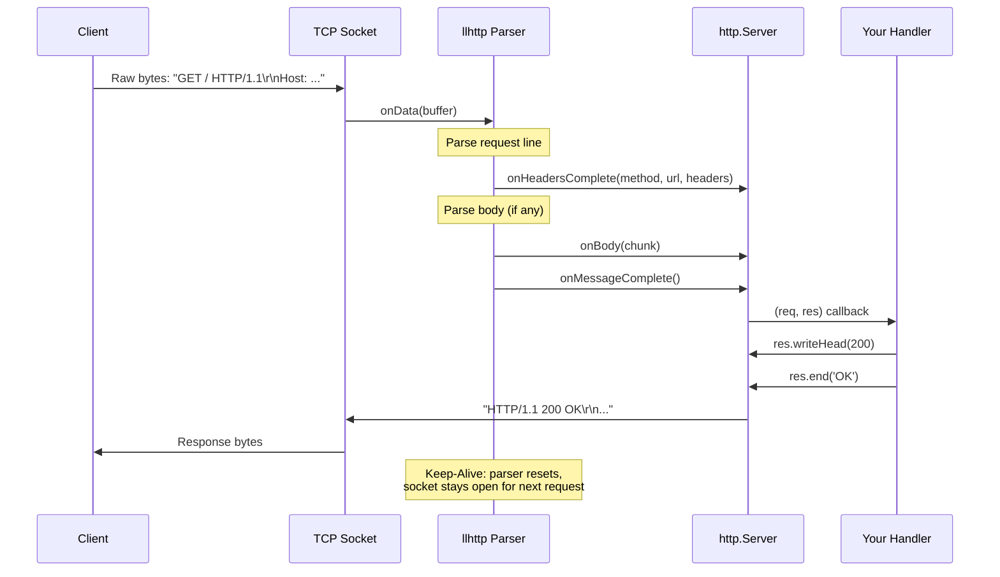
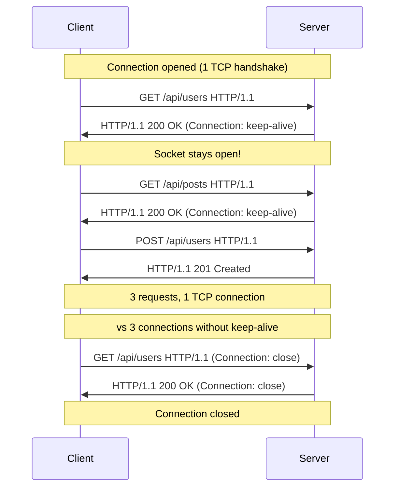
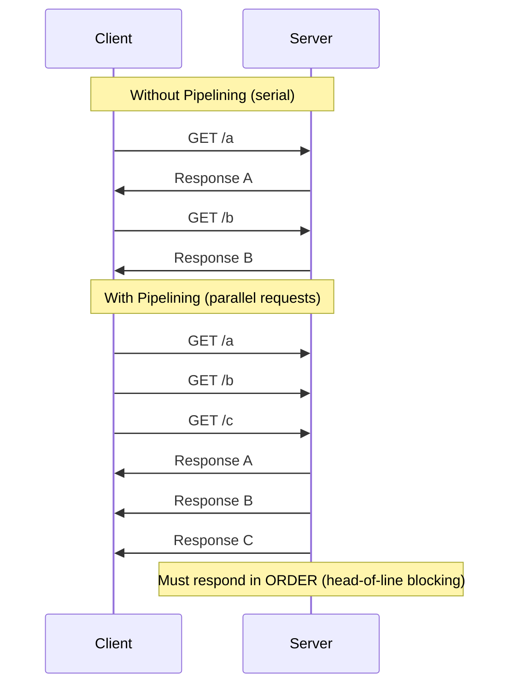

# Lesson 03 — HTTP Parsing

## Concept

Node.js handles HTTP by layering protocol parsing on top of raw TCP sockets. The HTTP parser (`llhttp`, written in C) is one of the most performance-critical pieces — it parses ~1.5 GB/s of HTTP data. Understanding how parsing works explains keep-alive behavior, chunked transfer encoding, and why malformed requests can crash servers.

---

## HTTP Request Lifecycle



---

## What llhttp Actually Parses

```
GET /api/users?page=2 HTTP/1.1\r\n     ← Request line (method, URL, version)
Host: example.com\r\n                    ← Header
Content-Type: application/json\r\n       ← Header
Connection: keep-alive\r\n               ← Controls connection reuse
Content-Length: 45\r\n                   ← Tells parser body length
\r\n                                     ← Empty line = headers done
{"name":"Alice","email":"a@example.com"} ← Body (exactly 45 bytes)
```

```typescript
// http-parsing-demo.ts
import { createServer, IncomingMessage, ServerResponse } from "node:http";

const server = createServer((req: IncomingMessage, res: ServerResponse) => {
  // These fields come from llhttp parsing:
  console.log("Parsed by llhttp:");
  console.log(`  Method:      ${req.method}`);
  console.log(`  URL:         ${req.url}`);
  console.log(`  HTTP Version:${req.httpVersion}`);
  console.log(`  Headers:     ${JSON.stringify(req.headers)}`);
  
  // req.headers is lowercased by Node.js (not by llhttp)
  // req.rawHeaders preserves original casing
  console.log(`  Raw Headers: ${JSON.stringify(req.rawHeaders)}`);
  
  // Body comes as stream events
  const chunks: Buffer[] = [];
  
  req.on("data", (chunk: Buffer) => {
    chunks.push(chunk);
    console.log(`  Body chunk: ${chunk.length} bytes`);
  });
  
  req.on("end", () => {
    const body = Buffer.concat(chunks).toString();
    console.log(`  Full body: ${body}`);
    
    res.writeHead(200, {
      "Content-Type": "application/json",
      "X-Request-Id": Math.random().toString(36).slice(2),
    });
    res.end(JSON.stringify({ received: body.length }));
  });
});

server.listen(3000, () => console.log("HTTP server on :3000"));
```

---

## Keep-Alive Internals



```typescript
// keep-alive-server.ts
import { createServer, IncomingMessage, ServerResponse } from "node:http";

const server = createServer((req: IncomingMessage, res: ServerResponse) => {
  // req.socket represents the underlying TCP connection
  // Multiple requests can arrive on the same socket
  
  // @ts-ignore — accessing internal counter
  const requestsOnSocket = req.socket._httpMessage?._headerSent
    ? "..."
    : "first";
    
  console.log(
    `Request: ${req.method} ${req.url}, ` +
    `Socket FD: ${(req.socket as any)._handle?.fd}, ` +
    `Keep-Alive: ${req.headers.connection !== "close"}`
  );
  
  res.writeHead(200, { "Content-Type": "text/plain" });
  res.end("OK\n");
});

// Keep-alive timeout: how long to keep idle sockets open
server.keepAliveTimeout = 5000; // 5 seconds (default)

// Headers timeout: max time to receive headers
server.headersTimeout = 60_000; // 60 seconds (default)

// Request timeout: max time for entire request
server.requestTimeout = 300_000; // 5 minutes (default in Node 18+)

// Max headers count (security: prevent header bombing)
server.maxHeadersCount = 2000; // default

console.log("Keep-alive settings:");
console.log(`  keepAliveTimeout: ${server.keepAliveTimeout}ms`);
console.log(`  headersTimeout:   ${server.headersTimeout}ms`);
console.log(`  requestTimeout:   ${server.requestTimeout}ms`);
console.log(`  maxHeadersCount:  ${server.maxHeadersCount}`);

server.listen(3000, () => console.log("Server on :3000"));
```

---

## Chunked Transfer Encoding

When the server doesn't know the response size upfront, HTTP uses chunked encoding:

```typescript
// chunked-response.ts
import { createServer, ServerResponse } from "node:http";

const server = createServer((req, res: ServerResponse) => {
  // When you call res.write() multiple times without Content-Length,
  // Node.js automatically uses chunked transfer encoding
  
  res.writeHead(200, { "Content-Type": "text/plain" });
  
  // Simulate streaming data
  let count = 0;
  const interval = setInterval(() => {
    count++;
    res.write(`Chunk ${count} at ${new Date().toISOString()}\n`);
    
    if (count >= 5) {
      clearInterval(interval);
      res.end("--- Done ---\n");
    }
  }, 200);
});

server.listen(3000, () => {
  console.log("Chunked response server on :3000");
  console.log("Test with: curl -N http://localhost:3000");
});

// The raw response looks like:
// HTTP/1.1 200 OK
// Transfer-Encoding: chunked
//
// 2a\r\n                          ← chunk size in hex (42 bytes)
// Chunk 1 at 2024-01-15T...\n\r\n ← chunk data
// 2a\r\n                          ← next chunk size
// Chunk 2 at 2024-01-15T...\n\r\n ← next chunk data
// ...
// 0\r\n                           ← zero-size chunk = end
// \r\n
```

---

## HTTP Pipelining



```typescript
// pipelining-test.ts
// Node.js supports pipelining but processes requests sequentially
// This is an inherent HTTP/1.1 limitation (solved by HTTP/2 multiplexing)

import { createServer } from "node:http";

const server = createServer((req, res) => {
  const delay = req.url === "/slow" ? 1000 : 0;
  
  setTimeout(() => {
    res.writeHead(200, { "Content-Type": "text/plain" });
    res.end(`Response for ${req.url} (delay: ${delay}ms)\n`);
  }, delay);
});

server.listen(3000);

// Test pipelining with raw TCP:
// echo -e "GET /fast HTTP/1.1\r\nHost: localhost\r\n\r\nGET /slow HTTP/1.1\r\nHost: localhost\r\n\r\nGET /fast HTTP/1.1\r\nHost: localhost\r\n\r\n" | nc localhost 3000
// The third response waits for the second (head-of-line blocking)
```

---

## Request Smuggling Prevention

```typescript
// http-security.ts
import { createServer } from "node:http";

const server = createServer((req, res) => {
  // llhttp is strict by default — rejects ambiguous requests
  // PREVIOUS parser (http_parser) was susceptible to request smuggling
  
  // Node.js 18+ uses llhttp which prevents:
  // 1. Duplicate Content-Length headers
  // 2. Content-Length + Transfer-Encoding together
  // 3. Invalid chunk sizes
  // 4. Spaces in methods/URLs
  
  res.writeHead(200);
  res.end("OK");
});

// You can control strictness:
// --insecure-http-parser  ← disables strict parsing (DANGEROUS)

server.listen(3000, () => {
  console.log("Strict HTTP parsing enabled (default)");
});
```

---

## Interview Questions

### Q1: "How does Node.js parse HTTP requests?"

**Answer**: Node.js uses `llhttp`, a C-based HTTP parser that operates as a state machine. Raw bytes arrive on the TCP socket and are fed to the parser, which calls callbacks: `onHeadersComplete` (method, URL, headers parsed), `onBody` (body chunk arrived), `onMessageComplete` (full request received). The parser is incremental — it can handle partial data across multiple TCP segments. It's also reusable: after a request completes, it resets for the next request on the same connection (keep-alive).

### Q2: "What's the difference between Content-Length and chunked transfer encoding?"

**Answer**: `Content-Length` tells the receiver exactly how many bytes to expect. This requires knowing the size upfront. `Transfer-Encoding: chunked` allows streaming — each chunk is prefixed with its hex size, and a zero-size chunk signals the end. Node.js automatically uses chunked encoding when you call `res.write()` without setting `Content-Length`. For performance, prefer `Content-Length` when possible (allows connection reuse without waiting for the close signal).

### Q3: "Why is keep-alive important for performance?"

**Answer**: Without keep-alive, every HTTP request requires a new TCP connection: DNS lookup → TCP handshake (1 RTT) → TLS handshake (1-2 RTT) → request/response → close. With keep-alive (HTTP/1.1 default), the connection is reused for multiple requests, eliminating the handshake overhead. This is critical for latency and resource usage — creating a TCP connection costs ~microseconds of kernel work, kernel memory for buffers, and a file descriptor.
