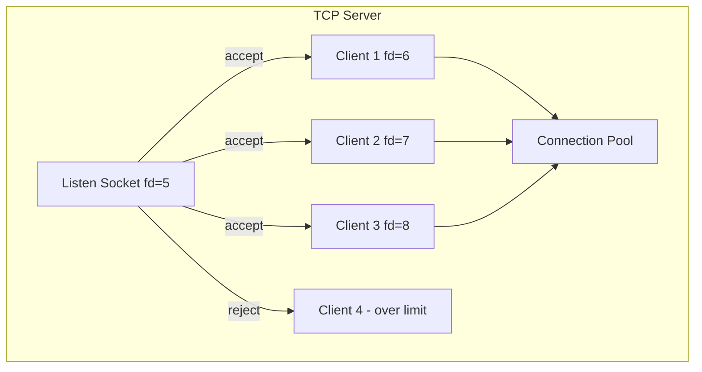
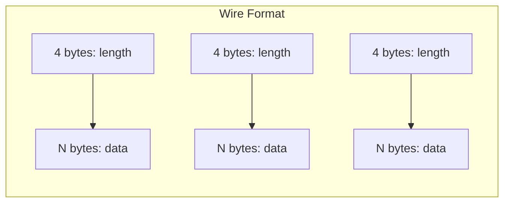

# Lesson 04 — Raw TCP Server

## Concept

Most Node.js developers only use `http.createServer()`. Building a raw TCP server teaches you what HTTP abstracts away: connection management, protocol framing, backpressure, and graceful shutdown. These patterns apply to any custom protocol (game servers, IoT, database connections).

---

## Echo Server with Connection Limits



```typescript
// raw-tcp-server.ts
import { createServer, Socket } from "node:net";

interface ServerConfig {
  port: number;
  host: string;
  maxConnections: number;
  idleTimeoutMs: number;
}

interface ConnectionInfo {
  id: number;
  socket: Socket;
  connectedAt: number;
  bytesIn: number;
  bytesOut: number;
}

class RawTCPServer {
  private server = createServer();
  private connections = new Map<number, ConnectionInfo>();
  private nextId = 0;
  private config: ServerConfig;
  private isShuttingDown = false;

  constructor(config: ServerConfig) {
    this.config = config;
    this.server.maxConnections = config.maxConnections;
    this.setupHandlers();
  }

  private setupHandlers() {
    this.server.on("connection", (socket: Socket) => {
      if (this.isShuttingDown) {
        socket.end("Server shutting down\n");
        return;
      }

      const id = this.nextId++;
      const info: ConnectionInfo = {
        id,
        socket,
        connectedAt: Date.now(),
        bytesIn: 0,
        bytesOut: 0,
      };

      this.connections.set(id, info);
      console.log(
        `[${id}] Connected from ${socket.remoteAddress}:${socket.remotePort} ` +
        `(${this.connections.size}/${this.config.maxConnections})`
      );

      // Configure socket
      socket.setNoDelay(true);
      socket.setKeepAlive(true, 30_000);
      socket.setTimeout(this.config.idleTimeoutMs);

      // Handle incoming data
      socket.on("data", (data: Buffer) => {
        info.bytesIn += data.length;
        this.handleData(info, data);
      });

      socket.on("timeout", () => {
        console.log(`[${id}] Idle timeout, disconnecting`);
        socket.end("Idle timeout\n");
      });

      socket.on("end", () => {
        console.log(`[${id}] Client disconnected`);
        socket.end();
      });

      socket.on("close", () => {
        const duration = Date.now() - info.connectedAt;
        console.log(
          `[${id}] Closed: duration=${duration}ms, ` +
          `in=${info.bytesIn}, out=${info.bytesOut}`
        );
        this.connections.delete(id);
      });

      socket.on("error", (err: Error) => {
        console.error(`[${id}] Error: ${err.message}`);
      });

      // Send welcome message
      this.send(info, `Welcome! You are connection #${id}\n`);
    });

    this.server.on("error", (err: Error) => {
      console.error(`Server error: ${err.message}`);
    });

    // Connection rejected because maxConnections reached
    this.server.on("drop", (data) => {
      console.warn(
        `Connection dropped (max ${this.config.maxConnections} reached): ` +
        `${data?.remoteAddress ?? "unknown"}`
      );
    });
  }

  private handleData(info: ConnectionInfo, data: Buffer) {
    const message = data.toString().trim();
    
    if (message === "STATS") {
      const stats = this.getStats();
      this.send(info, JSON.stringify(stats, null, 2) + "\n");
    } else if (message === "QUIT") {
      this.send(info, "Goodbye!\n");
      info.socket.end();
    } else {
      // Echo
      this.send(info, `Echo: ${message}\n`);
    }
  }

  private send(info: ConnectionInfo, data: string) {
    const buf = Buffer.from(data);
    info.bytesOut += buf.length;
    
    // Check backpressure: if write returns false, the buffer is full
    const canContinue = info.socket.write(buf);
    if (!canContinue) {
      console.log(`[${info.id}] Write buffer full, pausing reads`);
      info.socket.pause();
      info.socket.once("drain", () => {
        console.log(`[${info.id}] Write buffer drained, resuming reads`);
        info.socket.resume();
      });
    }
  }

  getStats() {
    return {
      activeConnections: this.connections.size,
      maxConnections: this.config.maxConnections,
      connections: Array.from(this.connections.values()).map((c) => ({
        id: c.id,
        age: Date.now() - c.connectedAt,
        bytesIn: c.bytesIn,
        bytesOut: c.bytesOut,
      })),
    };
  }

  async start(): Promise<void> {
    return new Promise((resolve) => {
      this.server.listen(this.config.port, this.config.host, () => {
        console.log(`TCP server on ${this.config.host}:${this.config.port}`);
        console.log(`Max connections: ${this.config.maxConnections}`);
        resolve();
      });
    });
  }

  async shutdown(timeoutMs = 5000): Promise<void> {
    this.isShuttingDown = true;
    console.log("Shutting down...");

    // Stop accepting new connections
    this.server.close();

    // Notify existing connections
    for (const [, info] of this.connections) {
      info.socket.end("Server shutting down\n");
    }

    // Wait for connections to drain or force
    return new Promise((resolve) => {
      const forceTimeout = setTimeout(() => {
        console.log("Force closing remaining connections");
        for (const [, info] of this.connections) {
          info.socket.destroy();
        }
        resolve();
      }, timeoutMs);

      const checkInterval = setInterval(() => {
        if (this.connections.size === 0) {
          clearTimeout(forceTimeout);
          clearInterval(checkInterval);
          console.log("All connections drained");
          resolve();
        }
      }, 100);
    });
  }
}

// Run
const server = new RawTCPServer({
  port: 4000,
  host: "0.0.0.0",
  maxConnections: 100,
  idleTimeoutMs: 60_000,
});

await server.start();

// Test: nc localhost 4000
// Type messages, type STATS or QUIT

process.on("SIGTERM", async () => {
  await server.shutdown(5000);
  process.exit(0);
});

process.on("SIGINT", async () => {
  await server.shutdown(5000);
  process.exit(0);
});
```

---

## Custom Protocol: Length-Prefixed Messages

TCP is a byte stream — there are no message boundaries. You must frame messages yourself. The most common approach is length-prefixed framing.



```typescript
// length-prefixed-protocol.ts
import { createServer, connect, Socket } from "node:net";

// --- Protocol Encoder/Decoder ---

class MessageFramer {
  private buffer = Buffer.alloc(0);
  private readonly onMessage: (msg: Buffer) => void;

  constructor(onMessage: (msg: Buffer) => void) {
    this.onMessage = onMessage;
  }

  // Call this with each chunk from socket.on('data')
  feed(chunk: Buffer): void {
    // Append new data to buffer
    this.buffer = Buffer.concat([this.buffer, chunk]);

    // Process all complete messages
    while (this.buffer.length >= 4) {
      const messageLength = this.buffer.readUInt32BE(0);

      // Do we have the full message?
      if (this.buffer.length < 4 + messageLength) {
        break; // Wait for more data
      }

      // Extract the message
      const message = this.buffer.subarray(4, 4 + messageLength);
      this.onMessage(message);

      // Remove processed bytes
      this.buffer = this.buffer.subarray(4 + messageLength);
    }
  }

  // Encode a message with length prefix
  static encode(data: string | Buffer): Buffer {
    const payload = typeof data === "string" ? Buffer.from(data) : data;
    const frame = Buffer.alloc(4 + payload.length);
    frame.writeUInt32BE(payload.length, 0);
    payload.copy(frame, 4);
    return frame;
  }
}

// --- Server ---
const server = createServer((socket: Socket) => {
  const framer = new MessageFramer((msg: Buffer) => {
    const text = msg.toString();
    console.log(`Server received: "${text}" (${msg.length} bytes)`);
    
    // Reply with the same protocol
    socket.write(MessageFramer.encode(`ACK: ${text}`));
  });

  socket.on("data", (chunk) => framer.feed(chunk));
  socket.on("end", () => socket.end());
});

server.listen(4001, () => {
  console.log("Protocol server on :4001");

  // --- Client ---
  const client = connect(4001, () => {
    const framer = new MessageFramer((msg: Buffer) => {
      console.log(`Client received: "${msg.toString()}"`);
    });

    client.on("data", (chunk) => framer.feed(chunk));

    // Send messages — they may be coalesced into one TCP segment
    // but our framer correctly separates them
    client.write(MessageFramer.encode("Hello"));
    client.write(MessageFramer.encode("World"));
    client.write(MessageFramer.encode("This is a longer message to test framing"));

    // Send multiple messages in one write (simulating TCP coalescing)
    const combined = Buffer.concat([
      MessageFramer.encode("Batch 1"),
      MessageFramer.encode("Batch 2"),
      MessageFramer.encode("Batch 3"),
    ]);
    client.write(combined);

    setTimeout(() => {
      client.end();
      server.close();
    }, 1000);
  });
});
```

---

## Interview Questions

### Q1: "TCP is a byte stream, not a message stream. How do you handle message boundaries?"

**Answer**: Three common framing approaches:
1. **Length-prefixed**: Prepend each message with its byte length (4-byte uint32). Most efficient — O(1) to find message boundaries.
2. **Delimiter-based**: Use a special byte sequence to separate messages (e.g., `\r\n` for HTTP headers). Must handle escaping if the delimiter can appear in data.
3. **Fixed-size**: All messages are the same length. Simple but inflexible.

Node.js HTTP uses delimiter (`\r\n\r\n` for headers) plus length (`Content-Length`) or chunked encoding for the body.

### Q2: "How do you implement backpressure on a TCP server?"

**Answer**: When `socket.write()` returns `false`, the kernel send buffer is full. You should pause reading from the socket (`socket.pause()`) until the `'drain'` event fires, indicating buffer space is available. Without backpressure handling, you'll buffer unlimited data in Node.js memory, leading to OOM crashes. The pattern: check write return → pause on false → resume on drain.
