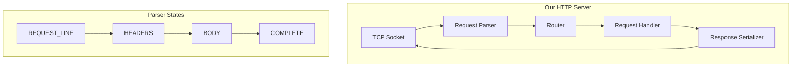

# Lesson 05 — Minimal HTTP Server

## Concept

Build an HTTP server on raw TCP to fully understand what `http.createServer()` does for you. This lab implements enough HTTP/1.1 to handle real browser requests.

---

## What HTTP Really Is

HTTP is just a text protocol layered on TCP:

```
REQUEST:
  GET /api/users HTTP/1.1\r\n
  Host: example.com\r\n
  Accept: application/json\r\n
  \r\n

RESPONSE:
  HTTP/1.1 200 OK\r\n
  Content-Type: application/json\r\n
  Content-Length: 27\r\n
  \r\n
  [{"id":1,"name":"Alice"}]
```

---

## Architecture



---

## Implementation

```typescript
// mini-http-server.ts
import { createServer, Socket } from "node:net";

// --- Types ---

interface HTTPRequest {
  method: string;
  path: string;
  query: Record<string, string>;
  httpVersion: string;
  headers: Record<string, string>;
  body: string;
  raw: string;
}

interface HTTPResponse {
  statusCode: number;
  statusText: string;
  headers: Record<string, string>;
  body: string;
}

type RouteHandler = (req: HTTPRequest) => HTTPResponse | Promise<HTTPResponse>;

// --- Request Parser ---

function parseRequest(raw: string): HTTPRequest | null {
  const headerEnd = raw.indexOf("\r\n\r\n");
  if (headerEnd === -1) return null; // Incomplete request

  const headerSection = raw.slice(0, headerEnd);
  const body = raw.slice(headerEnd + 4);
  const lines = headerSection.split("\r\n");

  // Parse request line: "GET /path?key=val HTTP/1.1"
  const requestLine = lines[0];
  const [method, fullPath, httpVersion] = requestLine.split(" ");

  // Parse URL and query string
  const [path, queryString] = fullPath.split("?");
  const query: Record<string, string> = {};
  if (queryString) {
    for (const pair of queryString.split("&")) {
      const [key, value] = pair.split("=");
      query[decodeURIComponent(key)] = decodeURIComponent(value ?? "");
    }
  }

  // Parse headers
  const headers: Record<string, string> = {};
  for (let i = 1; i < lines.length; i++) {
    const colonIdx = lines[i].indexOf(":");
    if (colonIdx === -1) continue;
    const key = lines[i].slice(0, colonIdx).trim().toLowerCase();
    const value = lines[i].slice(colonIdx + 1).trim();
    headers[key] = value;
  }

  return { method, path, query, httpVersion, headers, body, raw };
}

// --- Response Serializer ---

function serializeResponse(res: HTTPResponse): string {
  const body = res.body;
  const headers = { ...res.headers };

  // Set Content-Length if not set
  if (!headers["content-length"]) {
    headers["content-length"] = Buffer.byteLength(body).toString();
  }

  // Set Date header
  headers["date"] = new Date().toUTCString();

  // Set Server header
  headers["server"] = "MiniHTTP/1.0";

  // Build response string
  let response = `HTTP/1.1 ${res.statusCode} ${res.statusText}\r\n`;
  for (const [key, value] of Object.entries(headers)) {
    response += `${key}: ${value}\r\n`;
  }
  response += `\r\n`;
  response += body;

  return response;
}

// --- Router ---

class MiniHTTPServer {
  private routes = new Map<string, Map<string, RouteHandler>>();
  private server = createServer();

  constructor() {
    this.server.on("connection", (socket: Socket) => this.handleConnection(socket));
  }

  route(method: string, path: string, handler: RouteHandler) {
    if (!this.routes.has(method)) {
      this.routes.set(method, new Map());
    }
    this.routes.get(method)!.set(path, handler);
  }

  get(path: string, handler: RouteHandler) {
    this.route("GET", path, handler);
  }

  post(path: string, handler: RouteHandler) {
    this.route("POST", path, handler);
  }

  private handleConnection(socket: Socket) {
    let buffer = "";

    socket.setNoDelay(true);
    socket.setTimeout(30_000);

    socket.on("data", async (chunk: Buffer) => {
      buffer += chunk.toString();

      // Try to parse a complete request
      const req = parseRequest(buffer);
      if (!req) return; // Wait for more data

      // Check Content-Length for body
      const contentLength = parseInt(req.headers["content-length"] ?? "0", 10);
      if (req.body.length < contentLength) return; // Wait for body

      buffer = ""; // Reset for next request (keep-alive)

      // Route the request
      const response = await this.handleRequest(req);
      const serialized = serializeResponse(response);

      socket.write(serialized);

      // Handle Connection: close
      if (req.headers["connection"] === "close") {
        socket.end();
      }
    });

    socket.on("timeout", () => socket.end());
    socket.on("error", () => {});
  }

  private async handleRequest(req: HTTPRequest): Promise<HTTPResponse> {
    console.log(`${req.method} ${req.path}`);

    // Find matching route
    const methodRoutes = this.routes.get(req.method);
    const handler = methodRoutes?.get(req.path);

    if (!handler) {
      return {
        statusCode: 404,
        statusText: "Not Found",
        headers: { "content-type": "application/json" },
        body: JSON.stringify({ error: "Not Found", path: req.path }),
      };
    }

    try {
      return await handler(req);
    } catch (err: any) {
      return {
        statusCode: 500,
        statusText: "Internal Server Error",
        headers: { "content-type": "application/json" },
        body: JSON.stringify({ error: err.message }),
      };
    }
  }

  listen(port: number, callback?: () => void) {
    this.server.listen(port, callback);
  }

  close() {
    this.server.close();
  }
}

// --- Use It ---

const app = new MiniHTTPServer();

// Routes
app.get("/", (req) => ({
  statusCode: 200,
  statusText: "OK",
  headers: { "content-type": "text/html" },
  body: `
    <html>
      <body>
        <h1>Mini HTTP Server</h1>
        <p>Built on raw TCP sockets!</p>
        <p>Query params: ${JSON.stringify(req.query)}</p>
      </body>
    </html>
  `.trim(),
}));

app.get("/api/health", () => ({
  statusCode: 200,
  statusText: "OK",
  headers: { "content-type": "application/json" },
  body: JSON.stringify({
    status: "healthy",
    uptime: process.uptime(),
    memory: process.memoryUsage().heapUsed,
  }),
}));

app.get("/api/users", () => ({
  statusCode: 200,
  statusText: "OK",
  headers: { "content-type": "application/json" },
  body: JSON.stringify([
    { id: 1, name: "Alice" },
    { id: 2, name: "Bob" },
  ]),
}));

app.post("/api/echo", (req) => ({
  statusCode: 200,
  statusText: "OK",
  headers: { "content-type": "application/json" },
  body: JSON.stringify({
    received: req.body,
    headers: req.headers,
  }),
}));

app.listen(3000, () => {
  console.log("Mini HTTP server on http://localhost:3000");
  console.log("Try:");
  console.log("  curl http://localhost:3000/");
  console.log('  curl http://localhost:3000/api/health');
  console.log('  curl -X POST -d \'{"test":true}\' http://localhost:3000/api/echo');
});
```

---

## What This Teaches You

| Concept | Our Server | Real http.Server |
|---------|-----------|-----------------|
| Parsing | Manual string split | llhttp (C, ~100x faster) |
| Keep-alive | Basic buffer reset | Full state machine per socket |
| Pipelining | Not handled | Queued response ordering |
| Chunked encoding | Not handled | Automatic for streaming responses |
| Backpressure | Not handled | Full stream integration |
| Security | None | Header limits, timeout protection |

---

## Interview Questions

### Q1: "What does http.createServer() actually do?"

**Answer**: It creates a `net.Server` (TCP server), binds it to a port, and for each incoming connection, attaches an `llhttp` parser. When the parser emits a complete request (headers + body), it creates `IncomingMessage` and `ServerResponse` objects and calls your request handler. The key abstractions over raw TCP: HTTP protocol parsing, keep-alive connection management, chunked encoding support, and backpressure through the streams API.

### Q2: "How would you implement HTTP/2 server push on raw TCP?"

**Answer**: HTTP/2 uses binary framing instead of text. Each message is a frame with type (HEADERS, DATA, PUSH_PROMISE, etc.), stream ID, and flags. Multiplexing sends multiple streams over one TCP connection by interleaving frames with different stream IDs. Server push works by sending a PUSH_PROMISE frame with the promised request's headers, followed by the pushed response on a new stream. In practice, you'd use Node's built-in `http2` module which implements all of this on top of `nghttp2` (C library).
