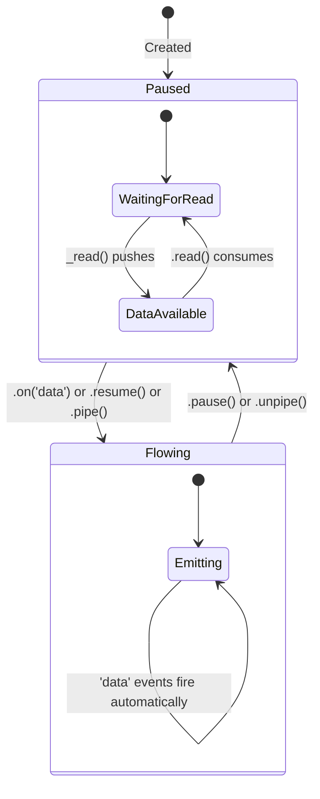
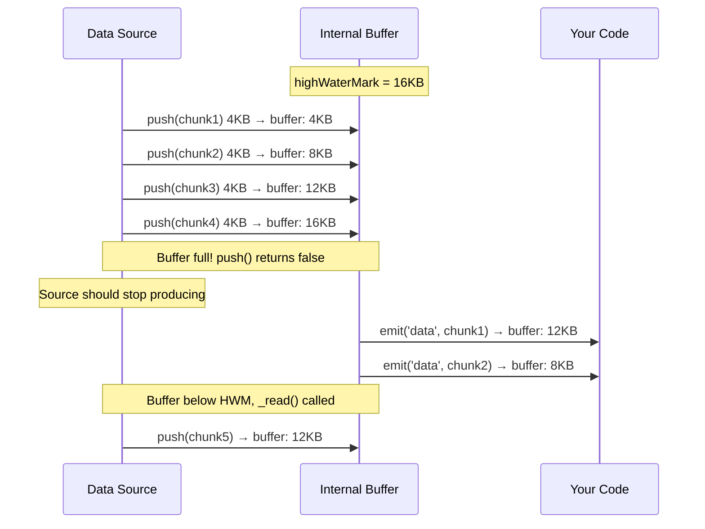

# Lesson 01 — Readable Streams

## Concept

A Readable stream represents a source of data. Internally, it maintains a buffer of chunks. Data is pushed into the buffer by the source and pulled out by the consumer. The interplay between push and pull is what makes streaming work.

---

## Two Modes



---

## Internal Buffer Mechanics



---

## Creating Custom Readable Streams

```typescript
// custom-readable.ts
import { Readable } from "node:stream";

// Method 1: Subclass
class CounterStream extends Readable {
  private current: number;
  private max: number;

  constructor(max: number) {
    super({ 
      highWaterMark: 16, // Small buffer to see backpressure
      objectMode: false, // Produces Buffers/strings
    });
    this.current = 0;
    this.max = max;
  }

  // _read is called when the buffer needs more data
  _read(size: number) {
    if (this.current >= this.max) {
      this.push(null); // Signal end of stream
      return;
    }
    
    // Simulate async data production
    setTimeout(() => {
      this.current++;
      const data = `Line ${this.current}\n`;
      const canPushMore = this.push(data);
      
      // If canPushMore is false, buffer is full — stop pushing
      // _read will be called again when buffer drains
      if (canPushMore && this.current < this.max) {
        this._read(size); // Push more synchronously
      }
    }, 10);
  }
}

// Method 2: Readable.from() — simplest
async function* generateNumbers(count: number) {
  for (let i = 0; i < count; i++) {
    yield `Number ${i}\n`;
  }
}

const streamFromGenerator = Readable.from(generateNumbers(100));

// Method 3: new Readable with read function
const streamFromOptions = new Readable({
  read() {
    this.push("hello\n");
    this.push(null); // End immediately after one chunk
  },
});

// Consume with async iteration (recommended)
const counter = new CounterStream(20);
let lineCount = 0;

for await (const chunk of counter) {
  lineCount++;
  // chunk is a Buffer in non-object-mode
  process.stdout.write(chunk);
}

console.log(`\nReceived ${lineCount} chunks`);
```

---

## Flowing vs Paused Mode Demo

```typescript
// flowing-vs-paused.ts
import { Readable } from "node:stream";

function createTestStream(): Readable {
  let i = 0;
  return new Readable({
    read() {
      if (i >= 5) { this.push(null); return; }
      this.push(`chunk-${i++}\n`);
    },
  });
}

// --- Flowing Mode ('data' event) ---
console.log("=== Flowing Mode ===");
const flowing = createTestStream();

flowing.on("data", (chunk: Buffer) => {
  console.log(`  Received: ${chunk.toString().trim()}`);
});

await new Promise<void>((resolve) => flowing.on("end", resolve));

// --- Paused Mode (manual .read()) ---
console.log("\n=== Paused Mode ===");
const paused = createTestStream();

// In paused mode, you must call .read() to get data
paused.on("readable", () => {
  let chunk: Buffer | null;
  while ((chunk = paused.read()) !== null) {
    console.log(`  Read: ${chunk.toString().trim()}`);
  }
});

await new Promise<void>((resolve) => paused.on("end", resolve));

// --- Async Iteration (best practice) ---
console.log("\n=== Async Iteration ===");
const asyncStream = createTestStream();

for await (const chunk of asyncStream) {
  console.log(`  Iterated: ${chunk.toString().trim()}`);
}
```

---

## Object Mode Streams

```typescript
// object-mode.ts
import { Readable, Transform, Writable } from "node:stream";
import { pipeline } from "node:stream/promises";

// Object mode: stream JavaScript objects instead of bytes
// highWaterMark counts OBJECTS, not bytes

interface LogEntry {
  timestamp: number;
  level: string;
  message: string;
}

// Source: generate log entries
const logSource = new Readable({
  objectMode: true,
  read() {
    for (let i = 0; i < 5; i++) {
      this.push({
        timestamp: Date.now(),
        level: ["INFO", "WARN", "ERROR"][i % 3],
        message: `Event ${i} occurred`,
      } satisfies LogEntry);
    }
    this.push(null);
  },
});

// Transform: filter errors
const errorFilter = new Transform({
  objectMode: true,
  transform(entry: LogEntry, encoding, callback) {
    if (entry.level === "ERROR") {
      this.push(entry);
    }
    callback();
  },
});

// Transform: format for output
const formatter = new Transform({
  objectMode: true,           // Input is objects
  writableObjectMode: true,   // Accept objects
  readableObjectMode: false,  // Output strings/buffers
  transform(entry: LogEntry, encoding, callback) {
    const line = `[${entry.level}] ${new Date(entry.timestamp).toISOString()} ${entry.message}\n`;
    callback(null, line);
  },
});

// Sink: stdout
await pipeline(logSource, errorFilter, formatter, process.stdout);
```

---

## Interview Questions

### Q1: "What's the difference between flowing and paused mode in Readable streams?"

**Answer**: In **paused mode** (default), data sits in the internal buffer until you call `read()`. The `'readable'` event signals data is available. In **flowing mode**, data is automatically emitted via `'data'` events as fast as possible. Flowing mode is activated by adding a `'data'` listener, calling `resume()`, or calling `pipe()`. In practice, use `for await...of` (async iteration), which internally uses paused mode with proper backpressure.

### Q2: "What happens when push() returns false?"

**Answer**: `push()` returns `false` when the internal buffer has reached `highWaterMark` bytes (or objects in object mode). This is a signal to the producer to stop producing data. When the consumer reads enough data that the buffer drops below the high water mark, `_read()` is called again, signaling the producer to resume. This is the backpressure mechanism inside Readable streams — it prevents unbounded memory growth when the consumer is slower than the producer.
