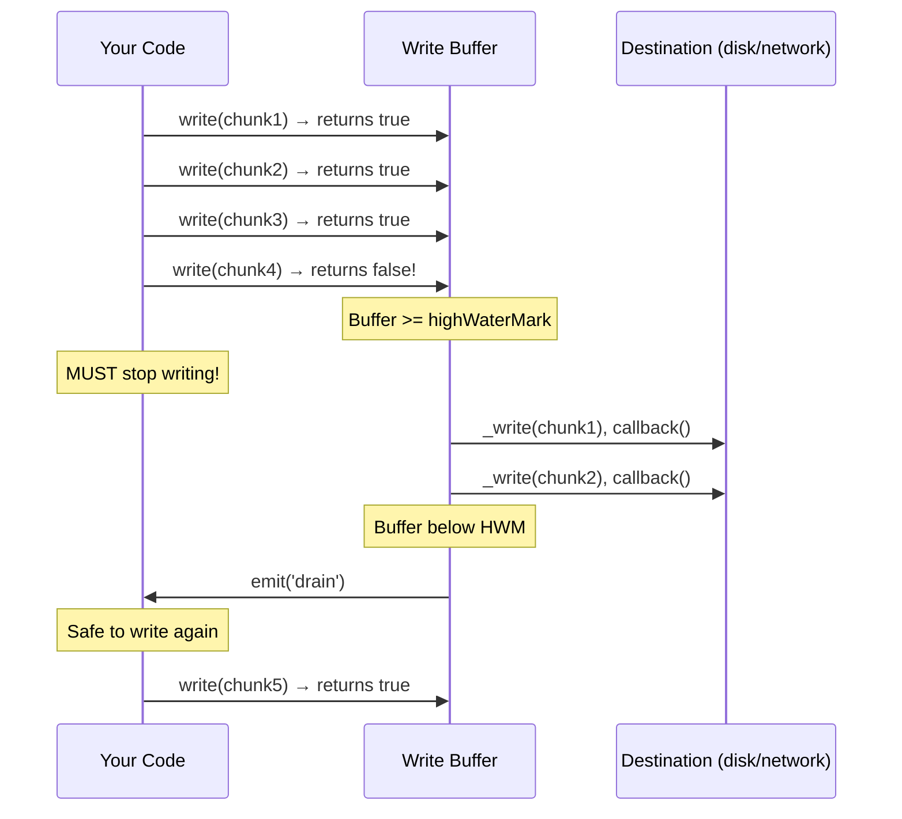

# Lesson 02 — Writable Streams

## Concept

A Writable stream is a destination for data. It has an internal buffer and a `_write()` method that processes data. The critical concept is **drain**: when `write()` returns `false`, you must wait for the `'drain'` event before writing more. Ignoring this causes unbounded memory growth.

---

## Write Buffer Lifecycle



---

## The drain Pattern

```typescript
// drain-pattern.ts
import { createWriteStream } from "node:fs";

// WRONG: Ignoring backpressure
function writeWithoutDrain(filePath: string, count: number) {
  const stream = createWriteStream(filePath);
  const before = process.memoryUsage().heapUsed;
  
  for (let i = 0; i < count; i++) {
    // If write() returns false, we keep writing anyway
    // Data accumulates in Node.js memory!
    stream.write(`Line ${i}: ${"x".repeat(1000)}\n`);
  }
  
  stream.end();
  const after = process.memoryUsage().heapUsed;
  console.log(`Without drain — Memory delta: ${((after - before) / 1024 / 1024).toFixed(1)}MB`);
}

// CORRECT: Respecting backpressure
async function writeWithDrain(filePath: string, count: number) {
  const stream = createWriteStream(filePath);
  const before = process.memoryUsage().heapUsed;
  
  for (let i = 0; i < count; i++) {
    const data = `Line ${i}: ${"x".repeat(1000)}\n`;
    const canContinue = stream.write(data);
    
    if (!canContinue) {
      // Wait for the buffer to drain before writing more
      await new Promise<void>((resolve) => stream.once("drain", resolve));
    }
  }
  
  // Signal end and wait for finish
  await new Promise<void>((resolve) => {
    stream.end(() => resolve());
  });
  
  const after = process.memoryUsage().heapUsed;
  console.log(`With drain — Memory delta: ${((after - before) / 1024 / 1024).toFixed(1)}MB`);
}

const count = 100_000;
console.log(`Writing ${count} lines...\n`);

writeWithoutDrain("/tmp/no-drain.txt", count);
await writeWithDrain("/tmp/with-drain.txt", count);
```

---

## Custom Writable Stream

```typescript
// custom-writable.ts
import { Writable } from "node:stream";

// A writable stream that batches writes and flushes periodically
class BatchWriter extends Writable {
  private batch: string[] = [];
  private batchSize: number;
  private flushCount = 0;

  constructor(batchSize = 10) {
    super({
      highWaterMark: 16 * 1024, // 16KB buffer
      decodeStrings: true,       // Convert strings to Buffers
    });
    this.batchSize = batchSize;
  }

  // Called for each write() call
  _write(chunk: Buffer, encoding: string, callback: (error?: Error | null) => void) {
    this.batch.push(chunk.toString());
    
    if (this.batch.length >= this.batchSize) {
      this.flush();
    }
    
    // callback() signals write is "done" — triggers next write or drain
    // If you call callback with an error, the stream emits 'error'
    callback();
  }

  // Called for writev() — multiple chunks at once (cork/uncork)
  _writev(
    chunks: Array<{ chunk: Buffer; encoding: string }>,
    callback: (error?: Error | null) => void
  ) {
    for (const { chunk } of chunks) {
      this.batch.push(chunk.toString());
    }
    this.flush();
    callback();
  }

  // Called when stream.end() is called
  _final(callback: (error?: Error | null) => void) {
    if (this.batch.length > 0) {
      this.flush();
    }
    console.log(`BatchWriter: ${this.flushCount} total flushes`);
    callback();
  }

  private flush() {
    this.flushCount++;
    console.log(`Flush #${this.flushCount}: ${this.batch.length} items`);
    // In production, this would write to a database, API, etc.
    this.batch = [];
  }
}

const writer = new BatchWriter(5);

for (let i = 0; i < 23; i++) {
  writer.write(`item-${i}\n`);
}
writer.end(); // Triggers _final for remaining items
```

---

## Cork and Uncork

Corking buffers all writes until uncork, then flushes them in a single `_writev()` call. This reduces syscalls.

```typescript
// cork-uncork.ts
import { Writable } from "node:stream";

class SyscallCounter extends Writable {
  public writeCount = 0;
  public writevCount = 0;

  _write(chunk: Buffer, encoding: string, callback: Function) {
    this.writeCount++;
    callback();
  }

  _writev(chunks: Array<{ chunk: Buffer; encoding: string }>, callback: Function) {
    this.writevCount++;
    console.log(`  _writev: ${chunks.length} chunks in one call`);
    callback();
  }
}

// Without cork: each write() triggers _write()
const withoutCork = new SyscallCounter();
withoutCork.write("a");
withoutCork.write("b");
withoutCork.write("c");
withoutCork.write("d");
withoutCork.end();

await new Promise<void>((r) => withoutCork.on("finish", r));
console.log(`Without cork: ${withoutCork.writeCount} _write calls, ${withoutCork.writevCount} _writev calls`);

// With cork: writes are buffered, then flushed as one _writev()
console.log("");
const withCork = new SyscallCounter();
withCork.cork();
withCork.write("a");
withCork.write("b");
withCork.write("c");
withCork.write("d");
withCork.uncork(); // Triggers single _writev with all 4 chunks
withCork.end();

await new Promise<void>((r) => withCork.on("finish", r));
console.log(`With cork: ${withCork.writeCount} _write calls, ${withCork.writevCount} _writev calls`);

// HTTP response uses cork internally:
// res.writeHead() corks, res.end() uncorks
// So headers + body go in one TCP segment
```

---

## Interview Questions

### Q1: "What happens when you ignore the return value of write()?"

**Answer**: `write()` returns `false` when the internal buffer exceeds `highWaterMark`. Ignoring this and continuing to write causes unbounded buffering in Node.js process memory. For each ignored backpressure signal, the data sits in the JavaScript heap until the destination (disk, network) catches up. On a fast producer with a slow consumer, this leads to out-of-memory crashes. Always check the return value and wait for `'drain'` when it returns `false`.

### Q2: "What's the difference between _write() and _writev()?"

**Answer**: `_write()` processes one chunk at a time — it's called for each `write()` call after the previous `_write` callback completes. `_writev()` receives an array of multiple pending chunks at once — it's called when the internal buffer has accumulated multiple chunks (e.g., after `cork()/uncork()`). `_writev()` allows batch operations that reduce syscalls: write all chunks in a single `writev()` system call, which is more efficient than multiple `write()` calls.

### Q3: "When should you use cork/uncork?"

**Answer**: Use `cork()/uncork()` when you need to make multiple `write()` calls that should be combined into a single I/O operation. Example: writing HTTP headers + body as one TCP segment. Node's `http.ServerResponse` does this internally — `writeHead()` corks, and `end()` uncorks. This reduces the number of TCP segments and syscalls, improving throughput. Use `process.nextTick()` for uncorking after synchronous writes to ensure all writes in the current tick are batched.
