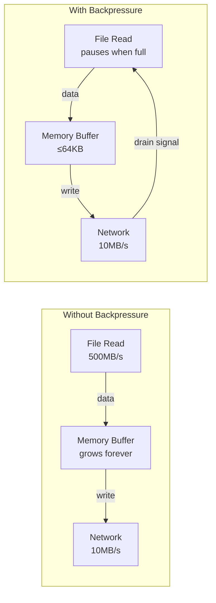
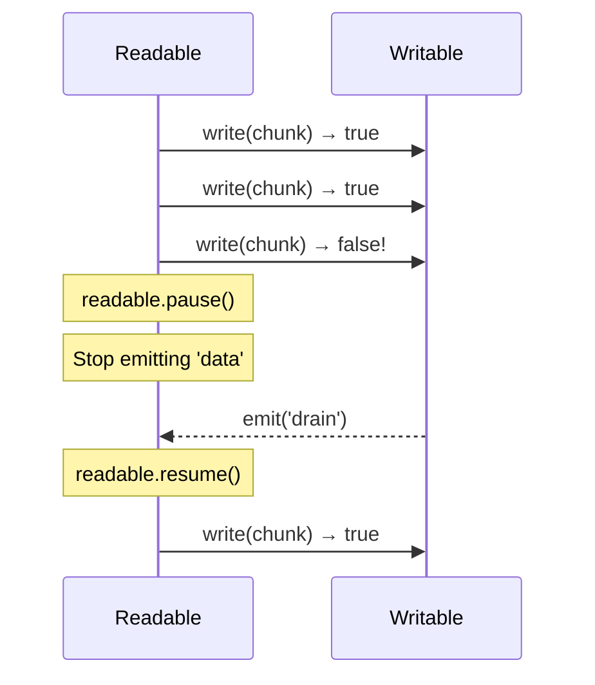

# Lesson 03 — Backpressure

## Concept

Backpressure is the mechanism that prevents a fast producer from overwhelming a slow consumer. Without it, data buffers in memory until the process crashes. It's the single most important concept in stream programming.

---

## The Problem



---

## pipe() — The Backpressure Wiring



`pipe()` automatically:
1. Listens for `'data'` on the readable
2. Calls `write()` on the writable
3. Checks the return value
4. Pauses readable if `write()` returns `false`
5. Resumes readable on `'drain'`

---

## Manual Backpressure

```typescript
// manual-backpressure.ts
import { createReadStream, createWriteStream } from "node:fs";
import { writeFileSync } from "node:fs";

// Create a 10MB test file
writeFileSync("/tmp/backpressure-test.bin", Buffer.alloc(10 * 1024 * 1024, 0x42));

const source = createReadStream("/tmp/backpressure-test.bin", {
  highWaterMark: 64 * 1024, // 64KB chunks
});

const dest = createWriteStream("/tmp/backpressure-output.bin", {
  highWaterMark: 16 * 1024, // Small buffer to trigger backpressure
});

let dataEvents = 0;
let drainEvents = 0;
let pauseCount = 0;

source.on("data", (chunk: Buffer) => {
  dataEvents++;
  const canContinue = dest.write(chunk);
  
  if (!canContinue) {
    // Destination buffer is full — pause the source
    pauseCount++;
    source.pause();
    
    // Resume when destination is ready
    dest.once("drain", () => {
      drainEvents++;
      source.resume();
    });
  }
});

source.on("end", () => {
  dest.end();
});

dest.on("finish", () => {
  console.log("Transfer complete:");
  console.log(`  Data events: ${dataEvents}`);
  console.log(`  Pause/drain cycles: ${pauseCount}`);
  console.log(`  Drain events: ${drainEvents}`);
  
  // Cleanup
  import("node:fs").then(({ unlinkSync }) => {
    unlinkSync("/tmp/backpressure-test.bin");
    unlinkSync("/tmp/backpressure-output.bin");
  });
});
```

---

## Why pipe() Is Dangerous

```typescript
// pipe-danger.ts
import { createReadStream, createWriteStream } from "node:fs";

// pipe() DOES NOT handle errors properly!
// If the writable errors, the readable is NOT cleaned up

// DANGEROUS:
const source = createReadStream("/tmp/some-file.txt");
const dest = createWriteStream("/tmp/output.txt");

source.pipe(dest);
// If dest errors → source keeps reading → fd leak!
// If source errors → dest stays open → fd leak!

// ALSO DANGEROUS: pipe doesn't forward 'error' events
source.on("error", (err) => console.error("Source error:", err.message));
dest.on("error", (err) => console.error("Dest error:", err.message));
// You must add error handlers to BOTH streams manually
```

---

## pipeline() — The Safe Way

```typescript
// pipeline-safe.ts
import { pipeline } from "node:stream/promises";
import { createReadStream, createWriteStream, writeFileSync } from "node:fs";
import { createGzip, createGunzip } from "node:zlib";
import { Transform } from "node:stream";

// Create test data
writeFileSync("/tmp/pipeline-test.txt", "Hello World!\n".repeat(100_000));

// pipeline() does everything right:
// 1. Wires backpressure between all streams
// 2. Cleans up ALL streams on error (closes fds)
// 3. Returns a promise
// 4. Cleans up on AbortController signal

// Example: Read → Transform → Compress → Write
const lineCounter = new Transform({
  transform(chunk: Buffer, encoding, callback) {
    const text = chunk.toString();
    const lines = text.split("\n").length - 1;
    // Pass data through, counting lines as side effect
    this.push(chunk);
    callback();
  },
});

try {
  await pipeline(
    createReadStream("/tmp/pipeline-test.txt"),
    lineCounter,
    createGzip(),
    createWriteStream("/tmp/pipeline-test.txt.gz"),
  );
  console.log("Pipeline complete — compressed successfully");
} catch (err: any) {
  console.error("Pipeline failed:", err.message);
  // ALL streams are properly cleaned up, even on error
}

// With AbortController (cancel mid-stream)
const controller = new AbortController();

// Cancel after 50ms
setTimeout(() => controller.abort(), 50);

try {
  await pipeline(
    createReadStream("/tmp/pipeline-test.txt"),
    createGzip(),
    createWriteStream("/tmp/aborted.gz"),
    { signal: controller.signal },
  );
} catch (err: any) {
  if (err.code === "ABORT_ERR") {
    console.log("Pipeline was cancelled");
  }
}
```

---

## Backpressure Through HTTP

```typescript
// http-backpressure.ts
import { createServer } from "node:http";
import { createReadStream, writeFileSync } from "node:fs";
import { pipeline } from "node:stream/promises";

// Create a large test file
writeFileSync("/tmp/large-download.bin", Buffer.alloc(50 * 1024 * 1024));

const server = createServer(async (req, res) => {
  if (req.url === "/download") {
    // CORRECT: pipeline handles backpressure
    // If the client reads slowly, the file read pauses
    res.writeHead(200, { "Content-Type": "application/octet-stream" });
    
    try {
      await pipeline(
        createReadStream("/tmp/large-download.bin"),
        res, // ServerResponse is a Writable stream
      );
    } catch {
      // Client disconnected mid-download — pipeline cleans up
    }
    return;
  }
  
  if (req.url === "/upload") {
    // req (IncomingMessage) is a Readable stream
    // Backpressure works here too: if we write to disk slowly,
    // Node tells the TCP stack to stop accepting data,
    // which causes the client's TCP send buffer to fill,
    // which causes the client's write() to return false
    
    try {
      await pipeline(
        req,
        createWriteStream("/tmp/uploaded-file.bin"),
      );
      res.writeHead(200);
      res.end("Upload complete\n");
    } catch {
      res.writeHead(500);
      res.end("Upload failed\n");
    }
    return;
  }
  
  res.writeHead(404);
  res.end("Not Found\n");
});

server.listen(3000, () => console.log("Server on :3000"));
```

---

## Measuring Backpressure

```typescript
// backpressure-monitor.ts
import { Transform } from "node:stream";

class BackpressureMonitor extends Transform {
  private name: string;
  public stats = {
    chunks: 0,
    bytes: 0,
    backpressureEvents: 0,
    maxBufferSize: 0,
  };

  constructor(name: string) {
    super();
    this.name = name;
  }

  _transform(chunk: Buffer, encoding: string, callback: Function) {
    this.stats.chunks++;
    this.stats.bytes += chunk.length;
    
    const bufferSize = this.writableLength;
    if (bufferSize > this.stats.maxBufferSize) {
      this.stats.maxBufferSize = bufferSize;
    }
    
    this.push(chunk);
    callback();
  }

  _flush(callback: Function) {
    console.log(`[${this.name}] Stats:`, this.stats);
    callback();
  }
}

// Usage: Insert between any two streams to monitor flow
import { pipeline } from "node:stream/promises";
import { createReadStream, createWriteStream, writeFileSync } from "node:fs";
import { createGzip } from "node:zlib";

writeFileSync("/tmp/monitor-test.txt", "data\n".repeat(200_000));

const monitor1 = new BackpressureMonitor("after-read");
const monitor2 = new BackpressureMonitor("after-gzip");

await pipeline(
  createReadStream("/tmp/monitor-test.txt"),
  monitor1,
  createGzip(),
  monitor2,
  createWriteStream("/tmp/monitor-test.gz"),
);

console.log("Done!");
```

---

## Interview Questions

### Q1: "What is backpressure and why does it matter?"

**Answer**: Backpressure is a flow control mechanism where a slow consumer signals a fast producer to slow down. Without it, data accumulates in memory buffers until the process runs out of memory. In Node.js, `write()` returns `false` when the buffer is full, and `'drain'` fires when it's safe to write again. This propagates through the chain: if a network socket is slow, the Transform pauses, which pauses the file read. The entire pipeline runs at the speed of the slowest component.

### Q2: "Why should you use pipeline() instead of pipe()?"

**Answer**: `pipe()` has critical problems:
1. **No error propagation**: If the destination errors, the source isn't cleaned up (fd leak)
2. **No destroy propagation**: If the source errors, the destination isn't closed
3. **No promise support**: Can't use async/await

`pipeline()` from `stream/promises` fixes all of these: it destroys all streams on error, returns a promise, supports `AbortController` for cancellation, and handles backpressure correctly.

### Q3: "How does backpressure work over HTTP?"

**Answer**: It's TCP flow control. When a Node.js HTTP response writes faster than the client reads, `res.write()` returns `false` (Node's write buffer is full). The kernel's TCP send buffer fills up, causing the TCP window to close. The client's TCP stack advertises a zero window, causing Node's kernel to stop sending. This propagates: `write()` → false → pause source → wait for drain. The file read pauses until the client catches up.
