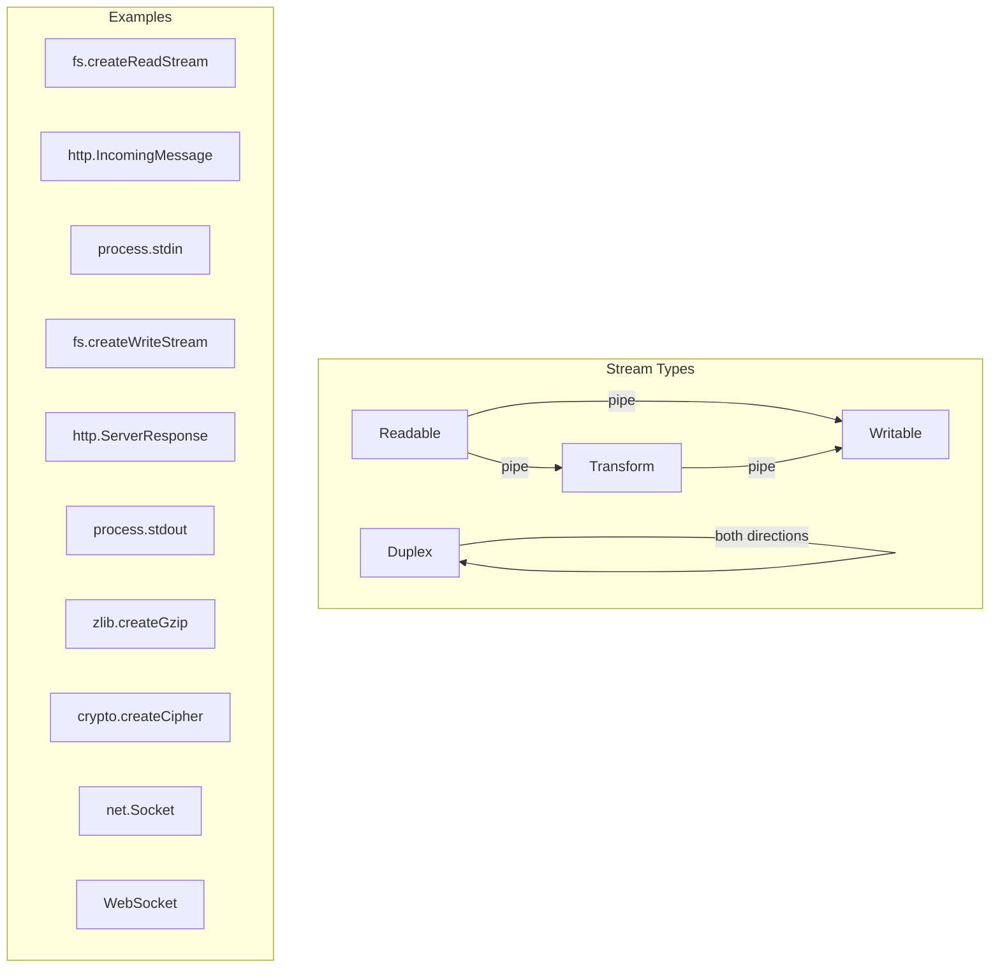

# Module 06 — Streams & Backpressure

## Overview

Streams are Node.js's most powerful abstraction for handling data that's too large to fit in memory, or data that arrives over time. They enable processing gigabytes of data with constant memory usage. But streams are also the hardest Node.js concept to master — backpressure bugs cause memory leaks, data loss, and silent failures.

---

## Stream Taxonomy

---

## Lessons

| # | Lesson | What You'll Learn |
|---|--------|-------------------|
| 01 | [Readable Streams](01-readable-streams.md) | Internal buffering, flowing vs paused mode, async iteration |
| 02 | [Writable Streams](02-writable-streams.md) | Write buffering, drain event, cork/uncork |
| 03 | [Backpressure](03-backpressure.md) | Why pipe() exists, manual backpressure, pipeline() |
| 04 | [Transform & Pipeline Labs](04-transform-labs.md) | Build real streaming data processors |

---

## Key Takeaways

- Every stream has an internal buffer limited by `highWaterMark`
- Readable streams have two modes: flowing (data events) and paused (manual read)
- `write()` returns `false` when the internal buffer is full — you MUST respect this
- `pipeline()` is the only safe way to connect streams (handles errors and cleanup)
- Never use `.pipe()` in production — it doesn't handle errors properly
- Backpressure propagates upstream: if the consumer is slow, the producer pauses
