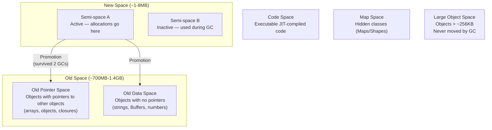

# Lesson 01 — V8 Heap Structure

## Concept

V8 divides the heap into spaces optimized for different object lifetimes. Most objects die young (temporary variables, request data), so V8 uses a fast "nursery" (New Space) for them. Objects that survive multiple GC cycles are promoted to Old Space, where collection is less frequent but more expensive.

---

## Heap Spaces



---

## Memory Layout Exploration

```typescript
// heap-exploration.ts

// process.memoryUsage() returns bytes
function printMemory(label: string) {
  const mem = process.memoryUsage();
  console.log(`\n${label}:`);
  console.log(`  RSS:            ${(mem.rss / 1024 / 1024).toFixed(1)}MB  ← Total process memory`);
  console.log(`  Heap Total:     ${(mem.heapTotal / 1024 / 1024).toFixed(1)}MB  ← V8 heap allocated`);
  console.log(`  Heap Used:      ${(mem.heapUsed / 1024 / 1024).toFixed(1)}MB  ← V8 heap in use`);
  console.log(`  External:       ${(mem.external / 1024 / 1024).toFixed(1)}MB  ← C++ objects (Buffers)`);
  console.log(`  Array Buffers:  ${(mem.arrayBuffers / 1024 / 1024).toFixed(1)}MB  ← ArrayBuffer/SharedArrayBuffer`);
}

printMemory("Initial");

// Allocate JS objects (go to V8 heap)
const jsObjects = Array.from({ length: 100_000 }, (_, i) => ({
  id: i,
  name: `User ${i}`,
  data: { nested: true },
}));
printMemory("After 100K JS objects");

// Allocate Buffers (go to External memory, NOT V8 heap)
const buffers = Array.from({ length: 1_000 }, () => Buffer.alloc(1024 * 100)); // 100KB each
printMemory("After 100MB of Buffers");

// Allocate strings (go to V8 heap, Old Data Space)
const strings = Array.from({ length: 100_000 }, (_, i) => `String number ${i} with some padding data`);
printMemory("After 100K strings");

// Cleanup
jsObjects.length = 0;
buffers.length = 0;
strings.length = 0;

if (global.gc) {
  global.gc();
  printMemory("After GC");
}
```

---

## V8 Heap Statistics API

```typescript
// v8-heap-stats.ts
import v8 from "node:v8";

// Detailed heap space breakdown
function printHeapSpaces() {
  const spaces = v8.getHeapSpaceStatistics();
  
  console.log("V8 Heap Spaces:");
  console.log("-".repeat(70));
  console.log(
    "Space".padEnd(25),
    "Size".padStart(10),
    "Used".padStart(10),
    "Available".padStart(10),
    "Phys".padStart(10)
  );
  console.log("-".repeat(70));
  
  for (const space of spaces) {
    console.log(
      space.space_name.padEnd(25),
      `${(space.space_size / 1024 / 1024).toFixed(1)}MB`.padStart(10),
      `${(space.space_used_size / 1024 / 1024).toFixed(1)}MB`.padStart(10),
      `${(space.space_available_size / 1024 / 1024).toFixed(1)}MB`.padStart(10),
      `${(space.physical_space_size / 1024 / 1024).toFixed(1)}MB`.padStart(10),
    );
  }
}

// Overall heap stats
function printHeapStats() {
  const stats = v8.getHeapStatistics();
  
  console.log("\nV8 Heap Statistics:");
  console.log(`  Total heap size:       ${(stats.total_heap_size / 1024 / 1024).toFixed(1)}MB`);
  console.log(`  Used heap size:        ${(stats.used_heap_size / 1024 / 1024).toFixed(1)}MB`);
  console.log(`  Heap size limit:       ${(stats.heap_size_limit / 1024 / 1024).toFixed(0)}MB`);
  console.log(`  Malloced memory:       ${(stats.malloced_memory / 1024 / 1024).toFixed(1)}MB`);
  console.log(`  External memory:       ${(stats.external_memory / 1024 / 1024).toFixed(1)}MB`);
  console.log(`  Number of contexts:    ${stats.number_of_native_contexts}`);
  console.log(`  Number of detached:    ${stats.number_of_detached_contexts}`);
}

printHeapSpaces();
printHeapStats();

// Watch heap growth over time
let iteration = 0;
const leaked: any[] = [];

const interval = setInterval(() => {
  iteration++;
  
  // Simulate a slow leak
  for (let i = 0; i < 1000; i++) {
    leaked.push({ data: new Array(100).fill(iteration) });
  }
  
  const mem = process.memoryUsage();
  console.log(
    `[${iteration}] Heap: ${(mem.heapUsed / 1024 / 1024).toFixed(1)}MB, ` +
    `Objects: ${leaked.length}`
  );
  
  if (iteration >= 10) {
    clearInterval(interval);
    printHeapSpaces();
  }
}, 500);
```

---

## Memory Limits

```typescript
// memory-limits.ts

// Default V8 heap limit
import v8 from "node:v8";
const stats = v8.getHeapStatistics();
console.log(`Default heap limit: ${(stats.heap_size_limit / 1024 / 1024).toFixed(0)}MB`);

// Override with: node --max-old-space-size=4096 script.ts → 4GB
// Override with: node --max-semi-space-size=64 script.ts  → 64MB new space

// Buffer memory is NOT limited by --max-old-space-size
// Buffers use external memory (mmap/malloc)
// Limited only by system RAM + swap

// RSS vs Heap:
// RSS (Resident Set Size) = Total process memory
//   includes: V8 heap + native code + thread stacks + C++ allocations + Buffers
// Heap = Just V8 managed memory
//   does NOT include: Buffers, native addons, libuv internals

// To limit total process memory, use cgroups (containers):
// docker run --memory=512m node app.ts
```

---

## Interview Questions

### Q1: "What are the different memory spaces in V8?"

**Answer**: V8 divides the heap into spaces:
- **New Space** (1-8MB): Two semi-spaces for young objects. Fast allocation via bump pointer. Collected by Scavenger (stop-the-world, copying GC).
- **Old Pointer Space**: Long-lived objects with references to other objects. Collected by Mark-Sweep-Compact.
- **Old Data Space**: Long-lived objects without references (strings, boxed numbers). Same GC as pointer space.
- **Code Space**: JIT-compiled machine code. Has special executable memory permissions.
- **Map Space**: Hidden classes (object shapes/Maps).
- **Large Object Space**: Objects > ~256KB. Never moved, only freed.

### Q2: "What's the difference between RSS, heap total, and heap used?"

**Answer**: 
- **RSS** (Resident Set Size): Total physical memory used by the process. Includes V8 heap + code segments + thread stacks + native allocations + Buffers.
- **Heap Total**: How much memory V8 has allocated from the OS for its managed heap.
- **Heap Used**: How much of the heap total is actually occupied by live objects.
- **External**: C++ objects tied to JavaScript objects (e.g., Buffer data).

RSS > Heap Total > Heap Used, always. A growing RSS with stable heap usually means a native memory leak (Buffer, addon, fd).

### Q3: "How do you increase the memory limit?"

**Answer**: `--max-old-space-size=N` (in MB) sets the old generation limit. Default is ~1.5GB on 64-bit. Set it to 70-80% of available container memory to leave room for RSS overhead (native code, stacks, buffers). For example, in a 2GB container: `--max-old-space-size=1536`. Note: this only limits V8 heap — Buffers use external memory that isn't subject to this limit.
