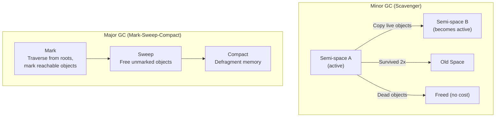
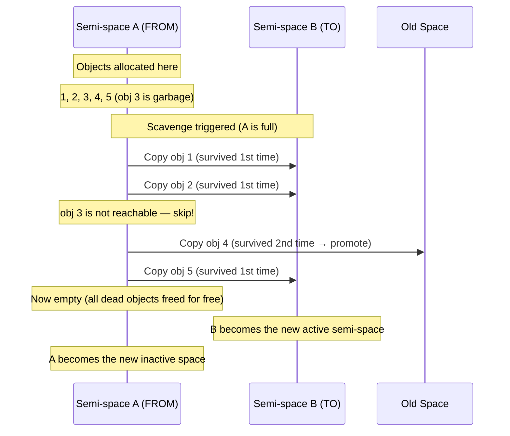
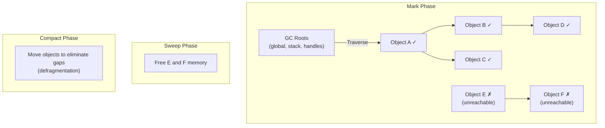
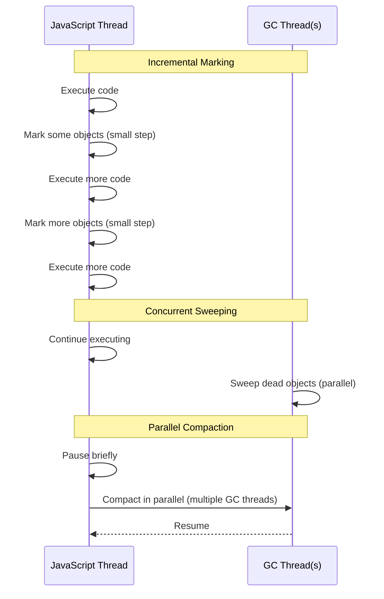

# Lesson 02 — Garbage Collection

## Concept

V8 uses generational garbage collection: different algorithms for objects of different ages. Young objects (most objects) are collected quickly by the Scavenger. Old objects that survive multiple young GCs are promoted to old space and collected by the Major GC (Mark-Sweep-Compact).

---

## GC Algorithm Overview



---

## Scavenger (Minor GC)



```typescript
// scavenger-demo.ts
// Run with: node --trace-gc --experimental-strip-types scavenger-demo.ts

function demonstrateScavenger() {
  console.log("Allocating short-lived objects...\n");
  
  for (let i = 0; i < 100; i++) {
    // These objects die immediately — collected by Scavenger
    const temp = Array.from({ length: 10_000 }, (_, j) => ({
      id: j,
      data: `item-${j}`,
    }));
    
    // Only use the length (so V8 doesn't optimize away the allocation)
    if (temp.length < 0) console.log("never");
  }
  
  console.log("\nDone. Check --trace-gc output for Scavenge events.");
  console.log("Scavenges should be very fast (<5ms).");
}

demonstrateScavenger();

// You'll see output like:
// [12345:0x...] 4 ms: Scavenge 2.1 (4.5) -> 1.8 (5.5) MB, 0.3 / 0.0 ms
//                                  ^heap_used (heap_total)     ^pause time
```

---

## Mark-Sweep-Compact (Major GC)



```typescript
// major-gc-demo.ts
// Run with: node --trace-gc --expose-gc --experimental-strip-types major-gc-demo.ts

const longLived: any[] = [];

// Phase 1: Build up old space
console.log("Phase 1: Promoting objects to old space...");
for (let i = 0; i < 50; i++) {
  const batch = Array.from({ length: 10_000 }, (_, j) => ({
    id: j,
    data: new Array(10).fill(`batch-${i}-item-${j}`),
  }));
  longLived.push(batch);
}

printMem("After promotion");

// Phase 2: Delete some, keep others (fragment old space)
console.log("\nPhase 2: Creating fragmentation...");
for (let i = 0; i < longLived.length; i += 2) {
  longLived[i] = null; // Every other batch becomes garbage
}

printMem("Before Major GC");

// Phase 3: Force Major GC
if (global.gc) {
  console.log("\nPhase 3: Forcing Major GC...");
  global.gc(); // Full Mark-Sweep-Compact
  printMem("After Major GC");
}

function printMem(label: string) {
  const mem = process.memoryUsage();
  console.log(`  ${label}: Heap ${(mem.heapUsed / 1024 / 1024).toFixed(1)}MB`);
}

// Major GC output looks like:
// [12345:0x...] 45 ms: Mark-Compact 50.2 (60.1) -> 25.3 (55.0) MB, 12.3 / 0.0 ms
//                                                                    ^pause time (longer!)
```

---

## Incremental and Concurrent GC

V8 avoids long pauses by splitting GC work:



```typescript
// gc-flags.ts
// V8 GC tuning flags:

// --trace-gc                    Show every GC event
// --trace-gc-verbose            Detailed GC info
// --expose-gc                   Enable global.gc()
// --max-old-space-size=N        Old space limit (MB)
// --max-semi-space-size=N       New space semi-space size (MB)
// --gc-interval=N               Force GC every N allocations

// Observe GC behavior
import { performance, PerformanceObserver } from "node:perf_hooks";

// GC performance entries (Node 16+)
const obs = new PerformanceObserver((list) => {
  for (const entry of list.getEntries()) {
    const gc = entry as any;
    const kind = ["", "Scavenge", "Mark-Sweep-Compact", "Incremental marking"][gc.detail?.kind ?? 0] ?? "Unknown";
    console.log(`GC: ${kind}, duration: ${entry.duration.toFixed(2)}ms`);
  }
});

obs.observe({ entryTypes: ["gc"] });

// Generate GC activity
for (let i = 0; i < 100; i++) {
  const temp = new Array(100_000).fill({ data: `iteration-${i}` });
  if (temp.length < 0) console.log("x");
}

setTimeout(() => {
  obs.disconnect();
  console.log("Done observing GC");
}, 2000);
```

---

## GC and Event Loop Interaction

```typescript
// gc-event-loop-impact.ts
import { monitorEventLoopDelay } from "node:perf_hooks";

const histogram = monitorEventLoopDelay({ resolution: 10 });
histogram.enable();

// Measure event loop delay during GC-heavy workload
async function gcHeavyWorkload() {
  const kept: any[] = [];
  
  for (let i = 0; i < 200; i++) {
    // Allocate objects that survive to old space
    kept.push(new Array(50_000).fill({ id: i, time: Date.now() }));
    
    // Remove some to create GC work
    if (i > 50 && i % 3 === 0) {
      kept.splice(Math.floor(Math.random() * kept.length), 1);
    }
    
    // Yield to event loop
    await new Promise((r) => setImmediate(r));
  }
  
  return kept.length;
}

console.log("Running GC-heavy workload...");
const count = await gcHeavyWorkload();

histogram.disable();

console.log(`\nKept ${count} arrays`);
console.log("Event loop delay during GC workload:");
console.log(`  Min:    ${(histogram.min / 1e6).toFixed(2)}ms`);
console.log(`  Mean:   ${(histogram.mean / 1e6).toFixed(2)}ms`);
console.log(`  p50:    ${(histogram.percentile(50) / 1e6).toFixed(2)}ms`);
console.log(`  p99:    ${(histogram.percentile(99) / 1e6).toFixed(2)}ms`);
console.log(`  Max:    ${(histogram.max / 1e6).toFixed(2)}ms  ← Likely a Major GC pause`);
```

---

## Interview Questions

### Q1: "Explain V8's garbage collection strategy."

**Answer**: V8 uses generational GC based on the hypothesis that most objects die young:

1. **Scavenger** (Minor GC): Collects New Space using semi-space copying. Two equally-sized spaces — objects are allocated in the active space. When it fills, live objects are copied to the other space (dead objects are simply left behind — free!). Objects that survive two scavenges are promoted to Old Space. Very fast (~1-5ms).

2. **Mark-Sweep-Compact** (Major GC): Collects Old Space. Three phases: **Mark** (traverse from roots, mark reachable objects), **Sweep** (free unmarked objects), **Compact** (defragment by moving objects together). Slower (~10-100ms) but runs less frequently.

3. **Optimizations**: Incremental marking (split marking across event loop ticks), concurrent sweeping (background threads), parallel compaction (multiple GC threads). This reduces pause times from 100ms+ to <10ms in most cases.

### Q2: "What are GC roots in V8?"

**Answer**: GC roots are the starting points for reachability tracing. They include: the global object (`globalThis`), local variables on the call stack, active handles in libuv (timers, sockets), persistent handles from native addons, and the compilation cache. Any object reachable from a root is "live" and won't be collected. An object that's unreachable from all roots is garbage.
