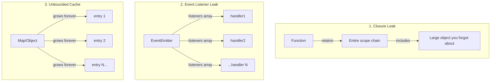

# Lesson 03 — Memory Leaks

## Concept

A memory leak in Node.js is when objects that are no longer needed remain reachable from GC roots. The heap grows over time until the process OOMs. Most leaks fall into five categories: closures retaining scope, event listeners not removed, unbounded caches, global state accumulation, and uncleared timers.

---

## The Five Leak Patterns



---

## Pattern 1: Closure Retaining Scope

```typescript
// leak-closure.ts

function createLeakyHandler() {
  const largeData = Buffer.alloc(10 * 1024 * 1024); // 10MB
  
  // This closure captures `largeData` in its scope chain
  // Even though the handler never uses it!
  // V8 captures the ENTIRE scope, not just used variables
  return function handler(req: string) {
    return `Handled: ${req}`;
    // largeData is retained as long as this function exists
  };
}

// Every call creates a new 10MB retention
const handlers: Function[] = [];
for (let i = 0; i < 20; i++) {
  handlers.push(createLeakyHandler());
}

console.log(`Created ${handlers.length} handlers`);
console.log(`Heap: ${(process.memoryUsage().heapUsed / 1024 / 1024).toFixed(0)}MB`);
// ~200MB+ retained!

// FIX: Nullify large variables before creating the closure
function createFixedHandler() {
  let largeData: Buffer | null = Buffer.alloc(10 * 1024 * 1024);
  // Process largeData here...
  const result = largeData.length; // Use it
  largeData = null; // Release before creating closure
  
  return function handler(req: string) {
    return `Handled: ${req} (processed ${result} bytes)`;
  };
}
```

---

## Pattern 2: Event Listener Leak

```typescript
// leak-event-listeners.ts
import { EventEmitter } from "node:events";

const emitter = new EventEmitter();

// LEAK: Adding listeners in a loop without removing them
function handleRequest(requestId: number) {
  // Every request adds a listener that's never removed!
  emitter.on("status", (status: string) => {
    // This listener captures requestId in closure
    // And it stays attached to emitter FOREVER
    if (status === "shutdown") {
      console.log(`Request ${requestId} notified of shutdown`);
    }
  });
}

// Simulate 1000 requests
for (let i = 0; i < 1000; i++) {
  handleRequest(i);
}

console.log(`Listener count: ${emitter.listenerCount("status")}`); // 1000!
// Node.js warns at 11: "MaxListenersExceededWarning"

// FIX: Use once() or remove listeners
function handleRequestFixed(requestId: number) {
  const handler = (status: string) => {
    if (status === "shutdown") {
      console.log(`Request ${requestId} notified`);
      emitter.off("status", handler); // Remove yourself
    }
  };
  emitter.on("status", handler);
}

// Or better: use AbortController
function handleRequestAbortable(requestId: number, signal: AbortSignal) {
  const handler = () => console.log(`Request ${requestId}`);
  
  emitter.on("status", handler);
  
  // Automatically remove when aborted
  signal.addEventListener("abort", () => {
    emitter.off("status", handler);
  });
}
```

---

## Pattern 3: Unbounded Cache

```typescript
// leak-cache.ts

// LEAK: Cache grows without limit
const cache = new Map<string, any>();

function getUser(userId: string) {
  if (cache.has(userId)) {
    return cache.get(userId);
  }
  
  const user = { id: userId, name: `User ${userId}`, data: new Array(100).fill(0) };
  cache.set(userId, user); // Never evicted!
  return user;
}

// Simulate requests with unique user IDs
for (let i = 0; i < 100_000; i++) {
  getUser(`user-${i}`);
}

console.log(`Cache size: ${cache.size}`);
console.log(`Heap: ${(process.memoryUsage().heapUsed / 1024 / 1024).toFixed(0)}MB`);

// FIX 1: LRU Cache with max size
class LRUCache<K, V> {
  private map = new Map<K, V>();
  private maxSize: number;

  constructor(maxSize: number) {
    this.maxSize = maxSize;
  }

  get(key: K): V | undefined {
    const value = this.map.get(key);
    if (value !== undefined) {
      // Move to end (most recently used)
      this.map.delete(key);
      this.map.set(key, value);
    }
    return value;
  }

  set(key: K, value: V): void {
    if (this.map.has(key)) {
      this.map.delete(key);
    } else if (this.map.size >= this.maxSize) {
      // Delete oldest (first key)
      const oldest = this.map.keys().next().value;
      if (oldest !== undefined) this.map.delete(oldest);
    }
    this.map.set(key, value);
  }

  get size() { return this.map.size; }
}

// FIX 2: WeakRef + FinalizationRegistry
const weakCache = new Map<string, WeakRef<any>>();
const registry = new FinalizationRegistry((key: string) => {
  weakCache.delete(key);
});

function getUserWeak(userId: string) {
  const ref = weakCache.get(userId);
  const cached = ref?.deref();
  if (cached) return cached;
  
  const user = { id: userId, name: `User ${userId}` };
  weakCache.set(userId, new WeakRef(user));
  registry.register(user, userId);
  return user;
}
```

---

## Pattern 4: Global State Accumulation

```typescript
// leak-global-state.ts

// LEAK: Accumulating data in module-level variables

// Request log that grows forever
const requestLog: Array<{ url: string; time: number; headers: Record<string, string> }> = [];

function logRequest(url: string, headers: Record<string, string>) {
  requestLog.push({ url, time: Date.now(), headers }); // Never cleared!
}

// Error history that grows forever
const errors: Error[] = [];

function trackError(err: Error) {
  errors.push(err); // Error objects retain stack traces + closures
}

// FIX: Use a ring buffer
class RingBuffer<T> {
  private buffer: (T | undefined)[];
  private head = 0;
  private _size = 0;

  constructor(private capacity: number) {
    this.buffer = new Array(capacity);
  }

  push(item: T): void {
    this.buffer[this.head] = item;
    this.head = (this.head + 1) % this.capacity;
    if (this._size < this.capacity) this._size++;
  }

  toArray(): T[] {
    const result: T[] = [];
    const start = this._size < this.capacity ? 0 : this.head;
    for (let i = 0; i < this._size; i++) {
      const idx = (start + i) % this.capacity;
      result.push(this.buffer[idx] as T);
    }
    return result;
  }

  get size() { return this._size; }
}

// Keep only last 1000 requests
const recentRequests = new RingBuffer<{ url: string; time: number }>(1000);
```

---

## Pattern 5: Timer Leaks

```typescript
// leak-timers.ts

// LEAK: setInterval that's never cleared
class LeakyService {
  private data: any[] = [];

  start() {
    // This interval keeps the service (and its data) alive forever
    setInterval(() => {
      this.data.push(new Array(10_000).fill(Date.now()));
      console.log(`Data entries: ${this.data.length}`);
    }, 1000);
    // No reference to the interval — can't clear it!
  }
}

// FIX: Always store interval references and clear on cleanup
class ProperService {
  private data: any[] = [];
  private interval: ReturnType<typeof setInterval> | null = null;

  start() {
    this.interval = setInterval(() => {
      this.data.push(new Array(10_000).fill(Date.now()));
      
      // Keep only last 100 entries
      if (this.data.length > 100) {
        this.data = this.data.slice(-100);
      }
    }, 1000);
  }

  stop() {
    if (this.interval) {
      clearInterval(this.interval);
      this.interval = null;
    }
    this.data = [];
  }
}

// Using AbortController for automatic cleanup
class AbortableService {
  async start(signal: AbortSignal) {
    while (!signal.aborted) {
      await new Promise((resolve) => setTimeout(resolve, 1000));
      if (signal.aborted) break;
      // Do work...
    }
  }
}
```

---

## Detecting Leaks in Production

```typescript
// leak-detector.ts

function createLeakDetector(options: {
  checkIntervalMs: number;
  thresholdMB: number;
  samples: number;
}) {
  const heapSamples: number[] = [];
  
  const interval = setInterval(() => {
    const heapMB = process.memoryUsage().heapUsed / 1024 / 1024;
    heapSamples.push(heapMB);
    
    if (heapSamples.length > options.samples) {
      heapSamples.shift();
    }
    
    if (heapSamples.length >= options.samples) {
      // Check if memory is monotonically increasing
      const firstHalf = heapSamples.slice(0, Math.floor(options.samples / 2));
      const secondHalf = heapSamples.slice(Math.floor(options.samples / 2));
      
      const avgFirst = firstHalf.reduce((a, b) => a + b) / firstHalf.length;
      const avgSecond = secondHalf.reduce((a, b) => a + b) / secondHalf.length;
      
      const growthMB = avgSecond - avgFirst;
      
      if (growthMB > options.thresholdMB) {
        console.warn(
          `⚠️ Possible memory leak detected! ` +
          `Growth: ${growthMB.toFixed(1)}MB over ${options.samples} samples. ` +
          `Current heap: ${heapMB.toFixed(1)}MB`
        );
      }
    }
  }, options.checkIntervalMs);
  
  interval.unref(); // Don't keep process alive
  
  return {
    stop: () => clearInterval(interval),
  };
}

// Usage in a server:
const detector = createLeakDetector({
  checkIntervalMs: 30_000,  // Check every 30 seconds
  thresholdMB: 50,          // Alert if growth > 50MB
  samples: 10,              // Over 10 samples (5 minutes)
});
```

---

## Interview Questions

### Q1: "What are the most common causes of memory leaks in Node.js?"

**Answer**: Five main patterns:
1. **Closures**: Functions capturing large objects in their scope chain, even if unused
2. **Event listeners**: Adding listeners in request handlers without removing them
3. **Unbounded caches**: Maps/objects used for caching without eviction or size limits
4. **Global state**: Module-level arrays/objects that accumulate data over the process lifetime
5. **Timers**: `setInterval` callbacks that retain references and are never cleared

### Q2: "How would you debug a memory leak in production?"

**Answer**: 
1. Monitor heap usage over time (`process.memoryUsage()`) — a monotonically increasing heap signals a leak
2. Take heap snapshots at two different times using the V8 inspector (`v8.writeHeapSnapshot()`)
3. Compare snapshots in Chrome DevTools — sort by "Alloc. Size" delta to find what grew
4. Look at retainer paths — they show WHY objects are alive (what's holding the reference)
5. Common quick wins: check for growing Maps/arrays, uncleaned event listeners (look for MaxListenersExceededWarning), and intervals without cleanup
