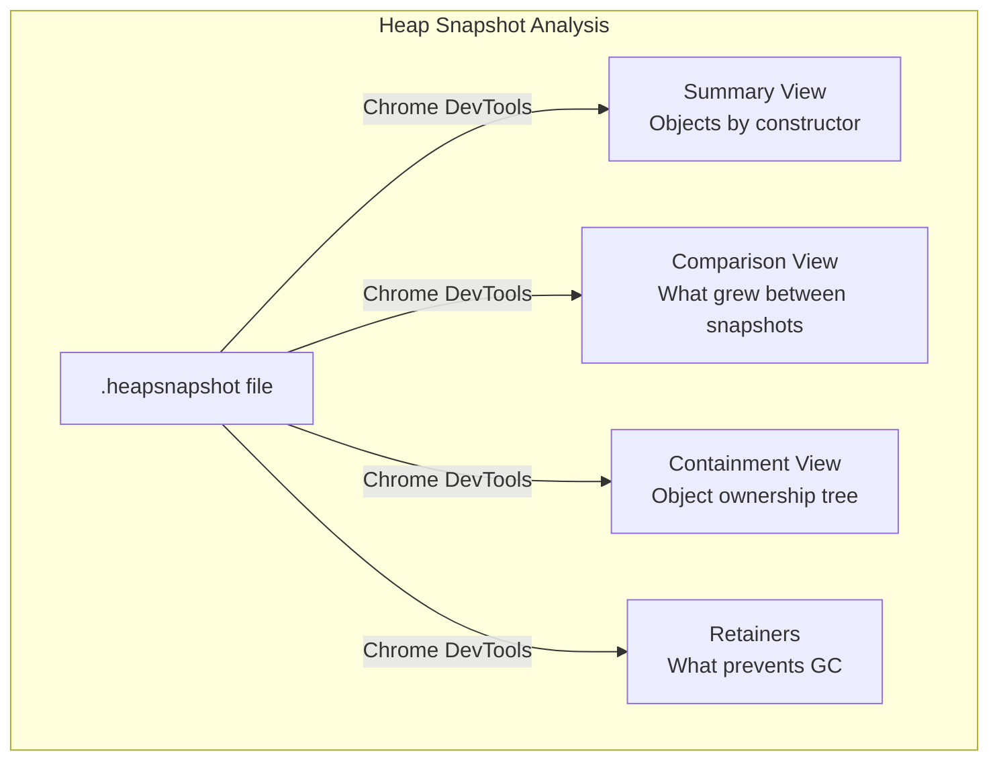

# Lesson 04 — Heap Snapshots & Profiling

## Concept

Heap snapshots capture every live object in V8's heap. By comparing snapshots taken at different times, you can identify exactly which objects are growing, how much memory they use, and what's retaining them.

---

## Taking Heap Snapshots

```typescript
// heap-snapshot.ts
import v8 from "node:v8";
import { writeFileSync } from "node:fs";

// Method 1: v8.writeHeapSnapshot()
function takeSnapshot(label: string): string {
  const filename = v8.writeHeapSnapshot();
  console.log(`Snapshot "${label}" written to: ${filename}`);
  return filename;
  // Open this file in Chrome DevTools → Memory tab
}

// Method 2: Programmatic snapshot to custom path
function takeSnapshotToPath(filePath: string): void {
  const snapshotStream = v8.writeHeapSnapshot(filePath);
  console.log(`Snapshot written to: ${snapshotStream}`);
}

// Workflow: baseline → leak → compare
console.log("Step 1: Baseline snapshot");
takeSnapshot("baseline");

// Simulate work that might leak
const cache = new Map<string, object>();
for (let i = 0; i < 10_000; i++) {
  cache.set(`key-${i}`, {
    data: new Array(100).fill(`value-${i}`),
    timestamp: Date.now(),
  });
}

console.log("\nStep 2: After-work snapshot");
takeSnapshot("after-work");

console.log(
  "\nOpen both snapshots in Chrome DevTools (Memory tab)." +
  "\nUse 'Comparison' view to see what grew."
);
```

---

## Remote Heap Snapshot via Inspector

```typescript
// remote-snapshot.ts
// Start your app with: node --inspect app.ts
// Then connect Chrome DevTools to take snapshots remotely

import { createServer } from "node:http";
import v8 from "node:v8";

const leakyCache = new Map<string, Buffer>();
let requestCount = 0;

const server = createServer((req, res) => {
  requestCount++;
  
  if (req.url === "/snapshot") {
    const path = v8.writeHeapSnapshot();
    res.end(`Snapshot written: ${path}\n`);
    return;
  }
  
  if (req.url === "/stats") {
    const mem = process.memoryUsage();
    res.writeHead(200, { "Content-Type": "application/json" });
    res.end(JSON.stringify({
      requests: requestCount,
      cacheSize: leakyCache.size,
      heapMB: (mem.heapUsed / 1024 / 1024).toFixed(1),
      rssMB: (mem.rss / 1024 / 1024).toFixed(1),
    }, null, 2));
    return;
  }
  
  // Simulate a leak: cache request data permanently
  leakyCache.set(`req-${requestCount}`, Buffer.from(JSON.stringify({
    url: req.url,
    headers: req.headers,
    time: Date.now(),
  })));
  
  res.end("OK\n");
});

server.listen(3000, () => {
  console.log("Server on :3000 (started with --inspect for remote debugging)");
  console.log("  GET /stats    — Memory stats");
  console.log("  GET /snapshot — Take heap snapshot");
  console.log("  GET /anything — Creates cache entry (leak)");
});
```

---

## Allocation Tracking

```typescript
// allocation-tracking.ts
// Track where allocations happen to find hot allocation paths

import v8 from "node:v8";

// V8 heap code statistics
function analyzeHeapCode() {
  const stats = v8.getHeapCodeStatistics();
  console.log("Code Statistics:");
  console.log(`  Code + metadata:    ${(stats.code_and_metadata_size / 1024).toFixed(0)}KB`);
  console.log(`  Bytecode + metadata: ${(stats.bytecode_and_metadata_size / 1024).toFixed(0)}KB`);
  console.log(`  External scripts:   ${(stats.external_script_source_size / 1024).toFixed(0)}KB`);
  console.log(`  CPU profiler:       ${(stats.cpu_profiler_metadata_size / 1024).toFixed(0)}KB`);
}

analyzeHeapCode();

// Track object allocations over time
class AllocationTracker {
  private samples: Array<{
    time: number;
    heapUsed: number;
    external: number;
    arrayBuffers: number;
  }> = [];
  
  private interval: ReturnType<typeof setInterval> | null = null;

  start(intervalMs = 1000) {
    this.interval = setInterval(() => {
      const mem = process.memoryUsage();
      this.samples.push({
        time: Date.now(),
        heapUsed: mem.heapUsed,
        external: mem.external,
        arrayBuffers: mem.arrayBuffers,
      });
    }, intervalMs);
    this.interval.unref();
  }

  stop() {
    if (this.interval) clearInterval(this.interval);
  }

  report(): string {
    if (this.samples.length < 2) return "Not enough samples";

    const first = this.samples[0];
    const last = this.samples[this.samples.length - 1];
    const durationSec = (last.time - first.time) / 1000;

    const heapGrowth = last.heapUsed - first.heapUsed;
    const growthRate = heapGrowth / durationSec;

    let report = `Allocation Report (${durationSec.toFixed(0)}s):\n`;
    report += `  Heap growth:  ${(heapGrowth / 1024 / 1024).toFixed(2)}MB\n`;
    report += `  Growth rate:  ${(growthRate / 1024).toFixed(1)}KB/s\n`;
    report += `  External:     ${((last.external - first.external) / 1024 / 1024).toFixed(2)}MB\n`;

    if (growthRate > 1024 * 100) {
      report += `  ⚠️ High growth rate — possible memory leak!\n`;
    }

    return report;
  }
}

const tracker = new AllocationTracker();
tracker.start(500);

// Simulate work
const growing: any[] = [];
for (let i = 0; i < 50; i++) {
  growing.push(new Array(10_000).fill(i));
  await new Promise((r) => setTimeout(r, 100));
}

tracker.stop();
console.log(tracker.report());
```

---

## Reading Heap Snapshots Programmatically



### How to analyze in Chrome DevTools:

1. Open `chrome://inspect` or DevTools → Memory tab
2. Load the `.heapsnapshot` file
3. **Summary view**: Sort by "Retained Size" to find biggest memory consumers
4. **Comparison view**: Load two snapshots, see exactly what objects were added
5. **Retainers panel**: Click any object to see its retainer chain (why it's alive)
6. Look for: Growing arrays, Maps, closures with large retained size

---

## Automated Leak Detection in CI

```typescript
// leak-test.ts
// Run in your CI to catch leaks before production

async function leakTest() {
  // Import the module under test
  // const { createServer } = await import("./my-server.ts");
  
  if (global.gc) global.gc();
  const baseline = process.memoryUsage().heapUsed;
  
  // Simulate N requests
  const iterations = 10_000;
  for (let i = 0; i < iterations; i++) {
    // Simulate request processing
    const data = { id: i, name: `User ${i}` };
    const result = JSON.stringify(data);
    if (result.length < 0) throw new Error("impossible");
  }
  
  if (global.gc) global.gc();
  // Wait for finalizers
  await new Promise((r) => setTimeout(r, 100));
  if (global.gc) global.gc();
  
  const afterHeap = process.memoryUsage().heapUsed;
  const leakedBytes = afterHeap - baseline;
  const leakedMB = leakedBytes / 1024 / 1024;
  
  console.log(`Baseline:     ${(baseline / 1024 / 1024).toFixed(1)}MB`);
  console.log(`After ${iterations} ops: ${(afterHeap / 1024 / 1024).toFixed(1)}MB`);
  console.log(`Growth:       ${leakedMB.toFixed(2)}MB`);
  console.log(`Per operation: ${(leakedBytes / iterations).toFixed(0)} bytes`);
  
  // Fail if growth exceeds threshold
  const thresholdMB = 10;
  if (leakedMB > thresholdMB) {
    console.error(`❌ LEAK DETECTED: ${leakedMB.toFixed(1)}MB growth exceeds ${thresholdMB}MB threshold`);
    process.exit(1);
  } else {
    console.log("✅ No significant leak detected");
  }
}

leakTest();
// Run with: node --expose-gc --experimental-strip-types leak-test.ts
```

---

## Interview Questions

### Q1: "How do you take a heap snapshot in production without downtime?"

**Answer**: Call `v8.writeHeapSnapshot()` which writes to a file. It causes a brief pause (proportional to heap size — ~1s per GB) but doesn't stop the server. For remote access, start with `--inspect` and connect Chrome DevTools, or use the inspector protocol programmatically. You can also expose an HTTP endpoint that triggers a snapshot. Best practice: take two snapshots 5 minutes apart during the leak, then compare them in DevTools.

### Q2: "What do you look for in a heap snapshot comparison?"

**Answer**: In the Comparison view, sort by "# New" or "Size Delta". Look for:
1. **Constructor names with large delta**: Objects being created but not freed
2. **Array objects growing**: Usually an unbounded cache or accumulator
3. **Closure contexts**: Functions retaining scope chains with large objects
4. **Detached DOM nodes**: (Browser context) Nodes removed from DOM but referenced in JS
5. Click on any growing object and check the **Retainers panel** to trace back to the root reference that prevents GC.
