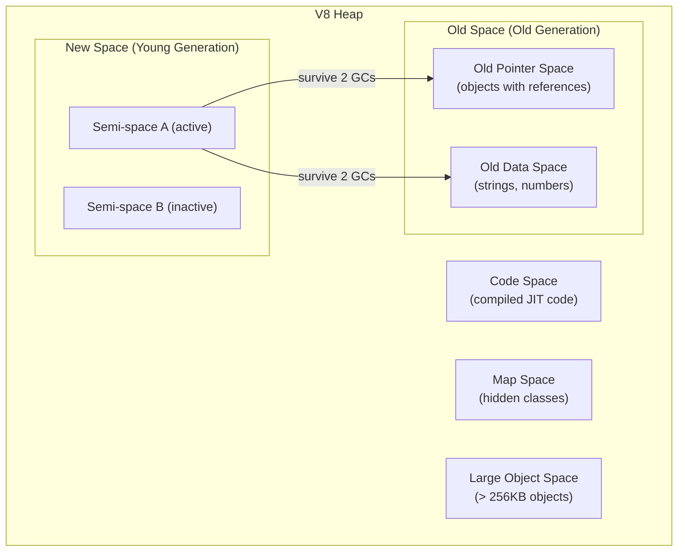

# Module 07 — Memory Management

## Overview

V8's garbage collector is why you don't call `free()` in JavaScript — but it's also why your production server slowly leaks memory until it OOMs at 3 AM. Understanding V8's heap structure, GC algorithms, and memory leak patterns is essential for building reliable Node.js services.

---

## V8 Heap Architecture

---

## Lessons

| # | Lesson | What You'll Learn |
|---|--------|-------------------|
| 01 | [V8 Heap Structure](01-v8-heap.md) | New space, old space, GC generations, memory limits |
| 02 | [Garbage Collection](02-garbage-collection.md) | Scavenger, Mark-Sweep-Compact, incremental GC |
| 03 | [Memory Leaks](03-memory-leaks.md) | Common leak patterns, detection, prevention |
| 04 | [Heap Snapshots & Profiling](04-heap-profiling.md) | V8 inspector, heap snapshots, allocation tracking |

---

## Key Takeaways

- V8 uses generational GC: fast Scavenger for new objects, slower Mark-Sweep-Compact for old
- Default heap limit is ~1.5GB on 64-bit (override with `--max-old-space-size`)
- Most memory leaks are: closures retaining scope, event listeners not removed, unbounded caches, global state growth
- `process.memoryUsage()` shows RSS, heap total, heap used, external, and array buffers
- Heap snapshots are the definitive tool for finding leaks — compare two snapshots to see what grew
