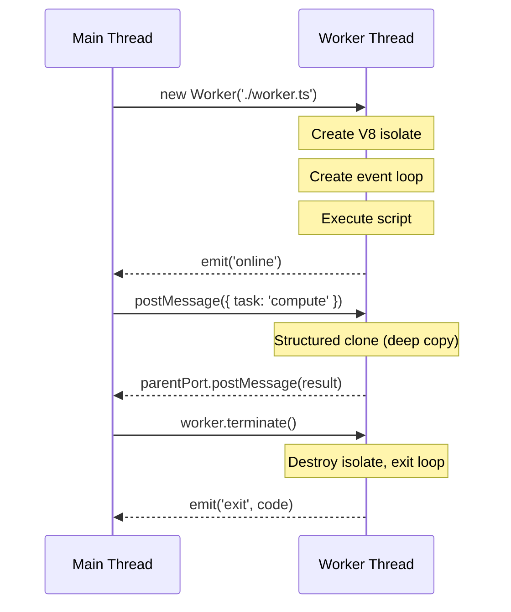

# Lesson 01 — Worker Fundamentals

## Concept

Each Worker thread gets its own V8 isolate, event loop, and heap. Communication happens via `MessagePort` channels using the structured clone algorithm (deep copy). Workers can also receive transferable objects that move ownership without copying.

---

## Worker Lifecycle



---

## Basic Worker Communication

```typescript
// main.ts
import { Worker, isMainThread, parentPort, workerData } from "node:worker_threads";

if (isMainThread) {
  // --- Main Thread ---
  console.log(`Main thread PID: ${process.pid}`);
  
  const worker = new Worker(new URL(import.meta.url), {
    workerData: { taskId: 1, iterations: 1_000_000 },
  });
  
  worker.on("online", () => {
    console.log("Worker is online");
  });
  
  worker.on("message", (result: { sum: number; time: number }) => {
    console.log(`Result: sum=${result.sum}, time=${result.time}ms`);
  });
  
  worker.on("error", (err: Error) => {
    console.error("Worker error:", err.message);
  });
  
  worker.on("exit", (code: number) => {
    console.log(`Worker exited with code ${code}`);
  });
  
  // Send additional work
  worker.postMessage({ command: "compute", data: [1, 2, 3, 4, 5] });
  
} else {
  // --- Worker Thread ---
  const data = workerData as { taskId: number; iterations: number };
  console.log(`Worker started, taskId: ${data.taskId}`);
  
  // Do CPU-intensive work
  const start = performance.now();
  let sum = 0;
  for (let i = 0; i < data.iterations; i++) {
    sum += Math.sqrt(i);
  }
  const elapsed = performance.now() - start;
  
  // Send result back
  parentPort!.postMessage({ sum, time: elapsed });
  
  // Handle additional messages
  parentPort!.on("message", (msg: { command: string; data: number[] }) => {
    if (msg.command === "compute") {
      const result = msg.data.reduce((a, b) => a + b, 0);
      parentPort!.postMessage({ sum: result, time: 0 });
    }
  });
}
```

---

## Transferable Objects

```typescript
// transferable.ts
import { Worker, isMainThread, parentPort } from "node:worker_threads";

if (isMainThread) {
  const worker = new Worker(new URL(import.meta.url));
  
  // Create a large ArrayBuffer
  const buffer = new ArrayBuffer(100 * 1024 * 1024); // 100MB
  const view = new Uint8Array(buffer);
  view.fill(42);
  
  console.log(`Before transfer: buffer.byteLength = ${buffer.byteLength}`);
  
  // TRANSFER: moves ownership, zero-copy, O(1)
  worker.postMessage({ buffer }, [buffer]); // Second arg = transfer list
  
  console.log(`After transfer: buffer.byteLength = ${buffer.byteLength}`);
  // 0! The buffer is now owned by the worker
  
  worker.on("message", (msg: { processed: number; byteLength: number }) => {
    console.log(`Worker processed ${msg.processed} bytes`);
    worker.terminate();
  });
  
} else {
  parentPort!.on("message", (msg: { buffer: ArrayBuffer }) => {
    const view = new Uint8Array(msg.buffer);
    console.log(`Worker received buffer: ${view.byteLength} bytes, first byte: ${view[0]}`);
    
    // Process...
    let sum = 0;
    for (let i = 0; i < view.length; i++) sum += view[i];
    
    parentPort!.postMessage({
      processed: view.byteLength,
      byteLength: msg.buffer.byteLength,
    });
  });
}
```

---

## MessageChannel for Direct Worker-to-Worker

```typescript
// message-channel.ts
import { Worker, isMainThread, parentPort, MessageChannel } from "node:worker_threads";

if (isMainThread) {
  const workerA = new Worker(new URL(import.meta.url));
  const workerB = new Worker(new URL(import.meta.url));
  
  // Create a channel for direct communication
  const { port1, port2 } = new MessageChannel();
  
  // Give each worker one end of the channel
  workerA.postMessage({ type: "channel", port: port1 }, [port1]);
  workerB.postMessage({ type: "channel", port: port2 }, [port2]);
  
  // Workers can now talk directly without going through main
  workerA.postMessage({ type: "start" });
  
  setTimeout(() => {
    workerA.terminate();
    workerB.terminate();
  }, 2000);
  
} else {
  let directPort: any = null;
  
  parentPort!.on("message", (msg: any) => {
    if (msg.type === "channel") {
      directPort = msg.port;
      directPort.on("message", (data: string) => {
        console.log(`${isMainThread ? "Main" : "Worker"} received direct: ${data}`);
        directPort.postMessage(`Reply to: ${data}`);
      });
    }
    
    if (msg.type === "start" && directPort) {
      directPort.postMessage("Hello from Worker A!");
    }
  });
}
```

---

## When NOT to Use Workers

```typescript
// wrong-use-workers.ts
import { Worker, isMainThread, parentPort } from "node:worker_threads";

// ❌ WRONG: Using workers for I/O operations
// I/O is already non-blocking in Node.js!
if (isMainThread) {
  // Don't do this for file reads — they already use the libuv thread pool
  const worker = new Worker(new URL(import.meta.url));
  worker.on("message", console.log);
} else {
  // This is SLOWER than doing it on the main thread
  // because of worker creation overhead + message serialization
  const { readFileSync } = await import("node:fs");
  const data = readFileSync("/etc/hostname", "utf8");
  parentPort!.postMessage(data);
}

// ❌ WRONG: Using workers for simple computations
// Worker overhead: ~30ms to create, ~1ms per message clone
// If your computation takes <10ms, workers make it SLOWER

// ✅ RIGHT: Use workers for:
// - CPU work taking >50ms (hashing, compression, image processing)
// - Parsing large JSON/XML (blocks event loop)
// - Machine learning inference
// - Video/audio encoding
// - Complex math / simulations
```

---

## Interview Questions

### Q1: "How do worker threads differ from child processes?"

**Answer**: 
- **Worker threads** share the same process (same PID), can share memory via `SharedArrayBuffer`, and communicate via fast `MessagePort`. Startup cost ~30ms. Lower memory overhead (~5-10MB per worker).
- **Child processes** are separate OS processes (different PID), cannot share memory, and communicate via IPC (pipes/sockets). Startup cost ~100ms. Higher memory overhead (~30MB per process). More isolation — a crash in a child doesn't kill the parent.

Use workers for CPU parallelism within a process. Use child processes for running separate programs or when you need crash isolation.

### Q2: "What is structured clone and why does it matter?"

**Answer**: Structured clone is the algorithm used by `postMessage()` to copy data between threads. It deep-copies objects, including nested structures, Maps, Sets, Dates, RegExps, ArrayBuffers, and more. However, it canNOT clone functions, Errors with custom properties, DOM nodes, or symbols. The cost is proportional to data size — transferring 100MB via structured clone takes significant CPU time. For large data, use `Transferable` objects (zero-copy, O(1)) or `SharedArrayBuffer` (shared memory, no copy needed).
